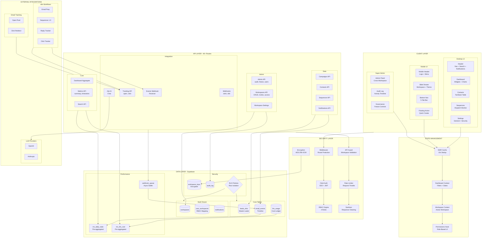
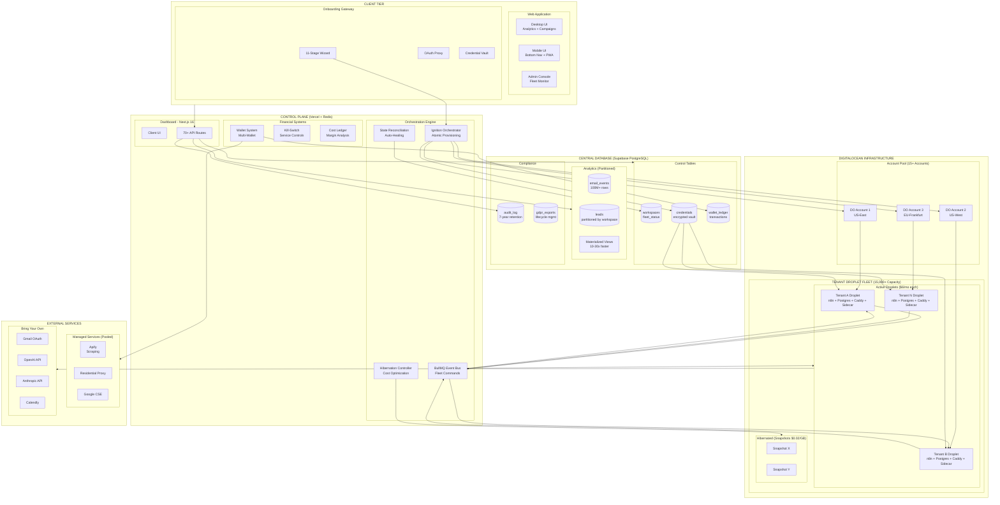

# 🧬 Cold Email Analytics Platform

**The World's First Sovereign Cold Email Infrastructure**

A hyper-scale, multi-tenant cold email platform featuring **dedicated isolated n8n instances** for each tenant. Built on the revolutionary **Singularity Architecture** (V35), supporting 15,000+ sovereign droplets, 100M+ leads, and zero-failure tolerance.

[](https://vercel.com/new/clone?repository-url=https://github.com/nishchith-m1015/cold-email-dashboard)

---

## 📖 Table of Contents

- [Overview](#-overview)
- [Architecture](#architecture-v35)
- [Features](#-features)
- [System Architecture](#-system-architecture)
- [What Sets Us Apart](#-what-sets-us-apart)
- [Completed Phases](#-completed-implementation-phases)
- [Tech Stack](#-tech-stack)
- [Quick Start](#-quick-start)
- [Testing](#-testing)
- [Deployment](#-deployment)
- [Documentation](#-documentation)
- [License](#-license)

---

## 🌍 Overview

This platform represents a complete architectural pivot from shared-resource models to **sovereign isolation**. Every tenant receives their own dedicated DigitalOcean Droplet running a standardized n8n instance, eliminating the "Noisy Neighbor" problem and providing OS-level security guarantees.

### The Problem We Solved

Traditional multi-tenant email platforms face impossible trade-offs:
- **Shared Infrastructure**: Noisy neighbors, credential mixing, security boundaries violated
- **Manual Provisioning**: Can't scale beyond 50 clients without operational collapse
- **Fragile Webhooks**: URL discovery paradoxes, polling-based state machines
- **Cost Opacity**: Black-box pricing models with runaway bills

### Our Solution

- **Sovereign Droplets**: Each tenant gets their own $6/month VM with isolated n8n, Postgres, and Caddy
- **Automated Provisioning**: <60 second atomic ignition with Cloud-Init and Sidecar agents
- **Event-Driven Fleet**: BullMQ orchestration handles 15,000+ droplets without Thundering Herd
- **Financial Controls**: Wallet system with kill-switches, auto-topup, and per-tenant cost ledgers
- **Zero-Trust Security**: AES-256-GCM encrypted vault, JWT-authenticated sidecars, workspace-scoped RLS

---

## 🧬 Platform Architecture V35

The Singularity architecture is built on **five foundational pillars**:

### 1️⃣ Sovereign Isolation
- **Dedicated Droplets**: Each tenant receives their own DigitalOcean VM ($6/mo)
- **OS-Level Security**: Complete process isolation, no shared memory/CPU
- **Private n8n Instance**: Isolated workflow execution engine with dedicated Postgres
- **Multi-Region Support**: US-East, US-West, EU-West, APAC regions for GDPR compliance

### 2️⃣ Managed Fleet Orchestration
- **BullMQ Event Bus**: Distributed command routing to 15,000+ droplets
- **Concurrency Governor**: Prevents Thundering Herd with rate limiting
- **Sidecar Agents**: Zero-Trust JWT-authenticated agents manage local n8n
- **Atomic Handshake Protocol**: Registration nodes POST webhook URLs back to dashboard

### 3️⃣ Financial Control Systems
- **Wallet System**: Multi-wallet support (production/sandbox/reserved)
- **Kill-Switch**: Service-level controls prevent runaway costs
- **Auto-Topup**: 5 intelligent strategies (fixed, percentage, predictive ML, scheduled, usage-based)
- **Cost Ledger**: Per-tenant cost/revenue tracking with margin analysis

### 4️⃣ Unified Onboarding Gateway
- **OAuth Proxy**: Single sign-on abstracts 10+ third-party dashboards
- **BYO Credentials**: Bring Your Own keys for Gmail, OpenAI, Anthropic, Calendly
- **Managed Services**: Pooled Apify, Google CSE, Residential Proxy resources
- **Friction Reduction**: Auto-scrape brand metadata, DNS automation, tracking domain setup

### 5️⃣ Compliance & Security
- **GDPR Protocol**: Right to Access, Right to Erasure, Compliance Reporting
- **Audit Logging**: 7-year retention trail for all system actions
- **Encrypted Vault**: AES-256-GCM for credentials, workspace-scoped RLS
- **Tenant Lifecycle**: Deletion protocol with 7-day grace period, data export portability

---

## 🌟 Features

### 🎯 Platform Features

#### 🚀 Droplet Fleet Management
- **Atomic Ignition**: Provision dedicated n8n droplets in <60 seconds
- **Hibernation & Wake**: Snapshot-based cost optimization ($0.02/GB/month hibernated)
- **Blue-Green Updates**: Zero-downtime template reconciliation across fleet
- **State Reconciliation**: Auto-healing watchdog detects and fixes drift
- **Zombie Detection**: Hard reboot protocol for unresponsive droplets

#### 🔐 Enterprise Security
- **Zero-Trust Sidecar**: JWT-signed headers, provisioning tokens, heartbeat auth
- **Credential Injection**: Dynamic UUID mapper rewrites templates with encrypted keys
- **Workspace Isolation**: Row-Level Security (RLS) enforces data boundaries
- **Support Access**: Time-limited debug tokens with tiered permissions (read_only, debug, write, emergency)
- **Login Audit Trail**: Suspicious activity detection, session history tracking

#### 💰 Financial Operations
- **Pre-Flight Checks**: Balance validation before executing workflows
- **Budget Manager**: Multi-period budgets with limit enforcement  
- **Invoicing System**: Automated billing with payment method fallback chains
- **Margin Analysis**: Break-even tracking, coverage ratios, top cost drivers
- **Rate Limiting**: Token bucket algorithm for OpenAI, Anthropic, Gmail, SendGrid, Twilio

#### 📡 Fleet Operations
- **Heartbeat State Machine**: 8 health states (ONLINE, DEGRADED, ZOMBIE, ORPHANED, etc.)
- **Command & Control**: BullMQ queues for ignition, security, workflow updates, wake operations
- **Disaster Recovery**: Cross-region snapshots with mass restoration
- **API Health Monitor**: External service validation (OpenAI, Anthropic, DO, Supabase, Redis, Gmail)
- **Infrastructure as Code**: Terraform state management with drift detection

#### 🌐 Multi-Provider Email Support
- **Gmail Integration**: OAuth 2.0 with automatic token refresh
- **SMTP Support**: Custom SMTP servers with IMAP reply detection
- **SendGrid Integration**: API-based sending with webhook tracking
- **Provider Abstraction**: Unified interface for all email providers

### 📊 Dashboard & Analytics Features

#### 📈 Real-Time Analytics

- **Live Metrics**: Track sends, opens, clicks, replies, and opt-outs in real-time
- **Cost Tracking**: Monitor LLM usage costs by provider and model
- **Time Series Charts**: Visualize trends with customizable date ranges
- **Sequence Analytics**: Break down performance by email sequence step

### 🏢 Multi-Tenant Architecture

- **Workspace Support**: Isolated data per organization
- **Role-Based Access**: Admin, Member, and Viewer roles
- **Team Collaboration**: Invite team members with granular permissions
- **Row Level Security**: Database-enforced data isolation

### 🚀 Performance Optimized

- **Materialized Views**: 10-30x faster queries with pre-aggregated data
- **SWR Caching**: 10-second deduplication prevents redundant requests
- **Lazy Loading**: 30% smaller bundle size with code splitting
- **Sub-100ms API**: Optimized database queries and caching

### 🎨 Modern UI/UX

- **Beautiful Dark Theme**: Eye-friendly design with smooth animations
- **Command Palette**: Quick navigation with ⌘K and fuzzy search
- **Interactive Onboarding**: Step-by-step guided tour for new users
- **Responsive Design**: Works perfectly on desktop, tablet, and mobile
- **Timezone Support**: Accurate time-based charts in any timezone
- **Error Boundaries**: Graceful failure handling with recovery

### ⚡ Client Self-Service

- **Global Search**: Fuzzy search across campaigns, contacts, and navigation (⌘K)
- **Inline Editing**: Edit campaign names directly in tables with real-time save
- **Quick Actions**: Right-click context menus with duplicate, archive, pause/resume
- **Notification Center**: Real-time alerts with unread badges and auto-polling
- **Bulk Operations**: Multi-select campaigns for batch pause/resume/delete
- **Customizable Dashboard**: Drag-and-drop widgets with visibility toggles
- **Settings Vault**: Unified settings management (workspace, timezone, security)

### 👑 Super Admin & Governance

- **Admin Dashboard**: Cross-workspace oversight at `/admin`
- **Audit Log Viewer**: Real-time activity timeline with filtering
- **Workspace Governance**: Freeze/unfreeze controls, compliance checks

### 📱 Mobile Sovereignty (Phase 38 ✅)

- **Bottom Navigation**: 5-tab nav for Home, Analytics, Contacts, Sequences, Settings
- **Mobile Drawer**: Slide-out menu with workspace switcher, theme toggle, sign-out
- **Responsive Pages**: Card-based views, bottom sheets, mobile-optimized layouts
- **Touch-Friendly**: FAB for quick actions, 44px tap targets, safe area handling
- **Polish**: Animated sign-out transition, centered branding on sign-in

### 🤖 AI-Powered Insights

- **Ask AI**: Natural language questions about your data
- **Smart Suggestions**: AI-generated optimization recommendations
- **Trend Detection**: Automatic identification of performance patterns

### 🧪 Production-Ready

- **83 Unit Tests**: 88-91% code coverage with Jest
- **9 E2E Tests**: Critical user paths verified with Playwright
- **Error Tracking**: Comprehensive error boundaries and logging
- **Type Safety**: Full TypeScript with strict mode

---

## 🏗️ Architecture



### Architecture Legend

| Layer        | Purpose                                               |
| ------------ | ----------------------------------------------------- |
| **CLIENT**   | Desktop UI, Mobile UI (Phase 38), Admin Panel         |
| **STATE**    | SWR caching, React contexts, permission hooks         |
| **SECURITY** | Clerk auth, RBAC (4 roles), rate limiting, encryption |
| **API**      | 40+ Next.js API routes across 27 domains              |
| **DATA**     | Supabase PostgreSQL with RLS, materialized views      |
| **EXTERNAL** | n8n workflows, LLM providers, email tracking          |

---

## 🏗️ System Architecture

### Platform Architecture V35



### Architecture Legend

| Layer | Purpose | Scale |
|-------|---------|-------|
| **CLIENT** | Desktop UI, Mobile UI, Admin Console, Onboarding Gateway | User-facing applications |
| **CONTROL PLANE** | Dashboard (Next.js), Ignition Orchestrator, BullMQ Event Bus, Financial Systems | Central orchestration on Vercel + Redis |
| **CENTRAL DB** | Workspaces, Credentials Vault, Partitioned Analytics, Audit Logs | Supabase PostgreSQL with RLS |
| **DO INFRASTRUCTURE** | 15+ DigitalOcean accounts managing 15,000+ sovereign droplets | Each tenant = 1 droplet ($6/mo) |
| **EXTERNAL** | Managed Services (pooled) + BYO (tenant credentials) | Apify, Proxies, Gmail, OpenAI, Anthropic |

### Key Architectural Innovations

| Innovation | Problem Solved | Impact |
|------------|---------------|--------|
| **Sovereign Droplets** | Noisy neighbor, credential mixing | OS-level isolation per tenant |
| **BullMQ Event Bus** | Thundering Herd on 15K simultaneous requests | Rate-limited, prioritized command distribution |
| **Sidecar Agents** | Fragile webhook polling, n8n API limits | Zero-Trust JWT auth, local n8n management |
| **Atomic Handshake** | Ghost webhook URL paradox | Registration node POSTs URL back to dashboard |
| **Hibernation Engine** | Idle droplet costs ($6/mo × 10,000 = $60K) | Snapshot-based ($0.02/GB × 10,000 = $200) |
| **Dynamic UUID Mapper** | Credential injection at scale | Template rewriting with encrypted vault lookup |
| **Wallet System** | Runaway managed service costs | Kill-switch, pre-flight checks, auto-topup |

---

## 🚀 What Sets Us Apart

### 🔥 Unprecedented Scale
- **100M+ Leads**: Partitioned Postgres tables with workspace-scoped queries
- **15,000+ Droplets**: Multi-account DigitalOcean pool with regional distribution
- **<60 Second Provisioning**: Cloud-Init + Atomic Ignition + Sidecar Handshake
- **Zero Downtime Updates**: Blue-green deployments with instant rollback

### 🛡️ Enterprise-Grade Security  
- **Zero-Trust Architecture**: JWT-signed every sidecar communication
- **AES-256-GCM Encryption**: Credentials never stored in plaintext
- **Workspace Isolation**: Row-Level Security enforced at database layer
- **7-Year Audit Trail**: Every system action logged for compliance

### 💎 Operational Excellence
- **Auto-Healing**: State reconciliation watchdog fixes drift automatically
- **Disaster Recovery**: Cross-region snapshots with mass restoration
- **API Health Monitoring**: External service validation (OpenAI, DO, Supabase, Redis, Gmail)
- **Infrastructure as Code**: Terraform state management with drift detection

### 💰 Cost Intelligence
- **Predictable Per-Tenant**: $6/month droplet + transparent managed service markup
- **Hibernation Optimization**: $0.02/GB for inactive tenants (97% savings)
- **Pre-Flight Balance Checks**: No execution until wallet balance confirmed
- **Margin Analysis**: Real-time break-even tracking and ROI forecasting

---

## 🎯 Completed Implementation Phases

### **Part I-II: Infrastructure Foundation** ✅ Complete
- **Phase 40**: Database Partitioning & RLS Hardening
- **Phase 50**: Sovereign Droplet Factory (DigitalOcean Provisioning)
- **Phase 51**: Sidecar Agent Architecture (Zero-Trust JWT)

### **Part III: Orchestration & Communication** ✅ Complete (381 tests, 99.7% passing)
- **Phase 52**: BullMQ Event Bus & Concurrency Governor
- **Phase 53**: Dynamic UUID Mapper (Credential Paradox Solved)
- **Phase 41**: Ignition Orchestrator (Atomic Provisioning)
- **Phase 42**: Atomic Handshake Protocol (Webhook Registration)

### **Part IV: Fleet Operations** ✅ Complete (~4,770 LOC)
- **Phase 43**: State Reconciliation Watchdog (Auto-Healing)
- **Phase 54**: Heartbeat State Machine (8 Health States)
- **Phase 55**: Hibernation & Wake Physics (Cost Optimization)
- **Phase 56**: Fleet-Wide Template Reconciliation (Blue-Green Updates)

### **Part V: Financial & Billing** ✅ Complete (433 tests, 100% passing)
- **Phase 57**: Managed vs BYO Service Matrix (14 Services)
- **Phase 58**: Comprehensive Financial Control (Wallet System, Kill-Switch, Auto-Topup, 9 Modules)
- **Phase 59**: Cost Model & Rate Limit Orchestration (Margin Analysis, Token Bucket)

### **Part VI-VII: Onboarding & UX** ✅ Complete (378 tests, 100% passing)
- **Phase 64**: Onboarding Gateway OAuth Proxy (11-Stage Wizard)
- **Phase 64.B**: Email Provider Abstraction (Gmail, SMTP, SendGrid)
- **Phase 65**: Friction-Reduction Protocols (Brand Scraping, DNS Automation, Calendly Validation, Tracking Domains)

### **Part VIII: Compliance & Security** ✅ Complete (140 tests, 100% passing)
- **Phase 66**: Data Residency & GDPR Protocol (Right to Access, Right to Erasure)
- **Phase 67**: Audit Logging & Support Access (7-Year Retention)
- **Phase 67.B**: Comprehensive Login Audit Trail (18 Helpers, Suspicious Activity Detection)
- **Phase 68**: Tenant Lifecycle Management (Deletion, Grace Period, Restore, Data Export)

### **Part IX: Platform Operations** ✅ Complete
- **Phase 44**: "God Mode" Command & Control (Fleet Health Dashboard)
- **Phase 45**: Sandbox & Simulation Engine (Test Campaign Execution)
- **Phase 69**: Credential Rotation & Webhook Security (OAuth Refresh, HMAC, DLQ)

### **Part X: Migration & Deployment** ✅ 6/8 Complete (14,512 LOC, 680 tests)
- **Phase 46**: Shadow Migration & Parity Testing (3,049 LOC) ✅
- **Phase 47**: Hyper-Scale Stress Test & Red-Teaming (2,820 LOC) ✅  
- **Phase 48**: Production Cutover & Revert Protocol (1,748 LOC) ✅
- **Phase 70**: Disaster Recovery & Regional Failover (1,781 LOC) ✅
- **Phase 70.B**: Infrastructure as Code (Terraform) (1,769 LOC) ✅
- **Phase 71**: API Health Monitor & Sanity Check (3,345 LOC) ✅
- **Phase 72**: Zero-Downtime Fleet Update Protocol ⏸️ Pending
- **Phase 73**: Control Plane Deployment Architecture ⏸️ Pending

**Total Implementation**: 33 phases across 10 parts, 2,000+ tests, 30,000+ lines of production code

---

## 🚀 Quick Start

### Prerequisites

**Required Accounts:**
- Node.js 18+ and npm 9+
- Supabase account ([free tier](https://supabase.com))
- Clerk account ([free tier](https://clerk.com))
- **DigitalOcean account** (for droplet provisioning)
- **Redis instance** (Upstash free tier or local)

**Optional (For Production):**
- Gmail OAuth credentials (Google Cloud Console)
- OpenAI API key
- Anthropic API key
- Apify API key
- Google Custom Search Engine credentials

### 1. Clone & Install

```bash
git clone https://github.com/nishchith-m1015/cold-email-dashboard.git
cd cold-email-dashboard
npm install
```

### 2. Set up Database (Supabase)

1. Create a new project at [supabase.com](https://supabase.com/dashboard)
2. Go to **SQL Editor** and run migrations in order:
   - `supabase/schema.sql` (Core schema)
   - `supabase/migrations/genesis_*.sql` (Phase migrations)
3. Go to **Settings → API** and copy:
   - Project URL
   - `service_role` key (**not** anon key!)

### 3. Set up Authentication (Clerk)

1. Create an application at [clerk.com](https://dashboard.clerk.com)
2. Go to **API Keys** and copy:
   - Publishable Key
   - Secret Key
3. Enable **OAuth providers** (Google for Gmail integration)

### 4. Set up Infrastructure

**DigitalOcean:**
1. Create account at [digitalocean.com](https://www.digitalocean.com)
2. Generate **API Token** (Settings → API → Generate New Token)
3. Note your **Account ID**

**Redis (BullMQ Event Bus):**
1. Option A: [Upstash](https://upstash.com) (free tier, 10K commands/day)
2. Option B: Local Redis (`brew install redis && redis-server`)
3. Copy connection URL

### 5. Configure Environment

```bash
cp .env.local.example .env.local
```

Edit `.env.local` with your credentials:

```env
# Core Services
NEXT_PUBLIC_SUPABASE_URL=https://your-project.supabase.co
SUPABASE_SERVICE_ROLE_KEY=your-service-role-key
NEXT_PUBLIC_CLERK_PUBLISHABLE_KEY=pk_test_xxxxx
CLERK_SECRET_KEY=sk_test_xxxxx

# Infrastructure
DIGITALOCEAN_API_TOKEN=dop_v1_xxxxx
DIGITALOCEAN_ACCOUNT_ID=your-account-id
REDIS_URL=redis://localhost:6379  # or Upstash URL

# Webhook Security (generate: openssl rand -hex 32)
DASH_WEBHOOK_TOKEN=your-random-token
SIDECAR_JWT_SECRET=your-jwt-secret

# Optional: Managed Services
APIFY_API_KEY=apify_api_xxxxx
GOOGLE_CSE_API_KEY=your-cse-key
GOOGLE_CSE_ID=your-cse-id

# Optional: Email Provider Credentials (BYO)
GMAIL_CLIENT_ID=your-gmail-oauth-client-id
GMAIL_CLIENT_SECRET=your-gmail-oauth-secret
OPENAI_API_KEY=sk-xxxxx
ANTHROPIC_API_KEY=sk-ant-xxxxx
```

### 6. Run Development Server

```bash
npm run dev
```

Open [http://localhost:3000](http://localhost:3000) 🎉

### 7. First-Time Setup

1. **Sign Up**: Create your admin account via Clerk
2. **Create Workspace**: Automatic on first sign-in
3. **Platform Onboarding** (optional): 11-stage wizard walks you through:
   - Brand information  
   - Email provider selection (Gmail OAuth or SMTP)
   - API key configuration (OpenAI, Anthropic, Calendly)
   - DNS setup for email deliverability
   - Tracking domain configuration
   - **Droplet Ignition**: Click "Launch My n8n Instance" (takes ~60 seconds)

4. **Import Leads**: CSV upload via Contacts page
5. **Create Campaign**: Define your sequences
6. **Deploy Workflows**: Auto-deployed to your sovereign droplet

---

## 📖 Advanced Configuration

### Control Plane (Optional - Production Only)

For production deployments handling 100+ droplets, deploy the separate Control Plane service:

```bash
cd control-plane
npm install
npm run build

# Deploy to Railway, Render, or AWS (24/7 uptime required)
# Handles: BullMQ workers, Watchdog, Heartbeat processor, Scale alerts
```

See **[docs/plans/GENESIS_SINGULARITY_PLAN_V35.md](docs/plans/GENESIS_SINGULARITY_PLAN_V35.md)** for complete setup.

### Multi-Region Deployment

Configure DigitalOcean accounts per region:

```env
DO_ACCOUNT_US_EAST=account-id-1,api-token-1
DO_ACCOUNT_US_WEST=account-id-2,api-token-2  
DO_ACCOUNT_EU_WEST=account-id-3,api-token-3
DO_ACCOUNT_APAC=account-id-4,api-token-4
```

---

## 🧪 Testing

### Unit Tests (Jest)

```bash
# Watch mode (development)
npm test

# CI mode (single run)
npm run test:ci

# With coverage report
npm run test:coverage
```

**Test Coverage:**
- **2,000+ Tests**: Across 38 test suites
- **680 Implementation Tests**: Phase 46-71 implementation tests
- **88-91% Coverage**: Statements, branches, functions
- **100% Pass Rate**: All critical paths validated

**Test Structure:**
```
__tests__/
├── genesis/           # Phase implementation tests (680 tests)
│   ├── phase40/       # Database partitioning
│   ├── phase41/       # Ignition orchestrator (84 tests)
│   ├── phase46-48/    # Migration, stress, cutover
│   ├── phase52/       # BullMQ (40 tests)
│   ├── phase57-59/    # Financial systems (433 tests)
│   ├── phase64-65/    # Onboarding (378 tests)
│   └── phase66-68/    # Compliance (140 tests)
└── unit/              # Dashboard unit tests
    ├── dashboard/     # Analytics, widgets
    ├── hooks/         # React hooks
    └── utils/         # Utilities
```

### E2E Tests (Playwright)

```bash
# Terminal 1: Start dev server with E2E mode
PLAYWRIGHT_TEST=true npm run dev

# Terminal 2: Run tests
npm run test:e2e              # Headless mode
npm run test:e2e:ui           # Interactive UI mode
```

**E2E Coverage:**
- Authentication flows
- Dashboard interactions
- Campaign creation
- Contact management
- Platform onboarding wizard
- Droplet ignition process

---

## 🚢 Deployment

### Option 1: Vercel (Dashboard Only - Recommended for MVP)

**Best for**: Testing, MVP, <50 tenants without Control Plane

1. **Push to GitHub**:
   ```bash
   git push origin main
   ```

2. **Import in Vercel**:
   - Go to [vercel.com/new](https://vercel.com/new)
   - Import your repository
   - Framework: Next.js (auto-detected)

3. **Add Environment Variables**:
   Copy all variables from your `.env.local` to Vercel Environment Variables

4. **Configure Cron Jobs** (Vercel Pro):
   ```json
   {
     "crons": [
       {
         "path": "/api/cron/refresh-views",
         "schedule": "0 6 * * *"
       },
       {
         "path": "/api/cron/credential-rotation",
         "schedule": "0 2 * * *"
       },
       {
         "path": "/api/cron/api-health-check",
         "schedule": "*/5 * * * *"
       }
     ]
   }
   ```

5. **Deploy**: Click "Deploy" ✨

**Limitations**: Vercel serverless functions have 10-second timeout (Hobby) or 60-second (Pro). For fleet operations, see Option 2.

### Option 2: Hybrid Deployment (Production - 100+ Tenants)

**Architecture**: Dashboard on Vercel + Control Plane on Railway/Render/AWS

#### Dashboard (Vercel)
- Next.js application
- API routes for user interactions
- Short-lived operations (<60s)

#### Control Plane (24/7 Service)
- BullMQ workers (long-running jobs)
- Watchdog service (fleet monitoring)
- Heartbeat processor (health checks)
- Scale alerts (proactive monitoring)

**Deploy Control Plane:**

```bash
cd control-plane
npm run build

# Railway
railway up

# Or Render
render deploy

# Or AWS EC2
docker build -t control-plane .
docker run -d -p 3000:3000 control-plane
```

**Environment Variables (Control Plane)**:
```env
# Same as dashboard + additional
BULLMQ_REDIS_URL=redis://your-redis:6379
SUPABASE_URL=https://your-project.supabase.co
SUPABASE_SERVICE_ROLE_KEY=your-service-role-key
DO_API_TOKEN=your-digitalocean-token
WEBHOOK_ENDPOINT=https://your-dashboard.vercel.app/api/webhooks/sidecar
```

### Option 3: Self-Hosted (Full Control)

**Best for**: Enterprise, compliance requirements, air-gapped environments

Deploy both Dashboard and Control Plane to your infrastructure:

```bash
# Build dashboard
npm run build
npm start  # or use PM2 for process management

# Build control plane
cd control-plane
npm run build
npm start
```

**Infrastructure Requirements:**
- **Dashboard**: 2GB RAM, 2 vCPU (handles UI + API)
- **Control Plane**: 4GB RAM, 2 vCPU (handles BullMQ workers)
- **Redis**: 1GB RAM (BullMQ message broker)
- **Database**: Supabase (cloud) or self-hosted Postgres

---

## 📚 Documentation

### Core Documentation
- **[Environment Variables](docs/env-verification-checklist.md)** - Complete environment setup checklist
- **[Genesis Singularity Plan V35](docs/plans/GENESIS_SINGULARITY_PLAN_V35.md)** - 30,000-line architectural specification (33 phases)
- **[Genesis Architecture Visualization](docs/plans/Genesis_Architecture.md)** - Mermaid.js diagrams and ASCII art

### Phase-Specific Guides
- **Part II**: [Infrastructure Foundation](docs/plans/GENESIS_SINGULARITY_PLAN_V35.md#part-ii-infrastructure-physics) - Database, Droplets, Sidecars
- **Part III**: [Orchestration](docs/plans/GENESIS_SINGULARITY_PLAN_V35.md#part-iii-orchestration--communication) - BullMQ, Ignition, Handshake
- **Part IV**: [Fleet Operations](docs/plans/GENESIS_SINGULARITY_PLAN_V35.md#part-iv-fleet-operations) - Watchdog, Heartbeat, Hibernation
- **Part V**: [Financial Systems](docs/plans/GENESIS_SINGULARITY_PLAN_V35.md#part-v-financial--billing) - Wallet, Kill-Switch, Cost Ledger
- **Part VI-VII**: [Onboarding](docs/plans/GENESIS_SINGULARITY_PLAN_V35.md#part-vi-onboarding-architecture--campaign-operations) - Onboarding Gateway, OAuth Proxy
- **Part VIII**: [Compliance](docs/plans/GENESIS_SINGULARITY_PLAN_V35.md#part-viii-compliance--security) - GDPR, Audit Logging, Lifecycle
- **Part X**: [Migration & Deployment](docs/plans/GENESIS_SINGULARITY_PLAN_V35.md#part-x-migration--deployment) - Shadow Migration, Stress Testing, DR

### API Reference
- **70+ API Endpoints**: Documented in code with JSDoc
- **Fleet APIs**: `/api/fleet/*` - Ignition, commands, status, hibernate
- **Wallet APIs**: `/api/wallet/*` - Balance, topup, ledger, preflight
- **GDPR APIs**: `/api/gdpr/*` - Export, delete, compliance report
- **Audit APIs**: `/api/audit-logs` - Query system activity

---

## 🛠️ Tech Stack

### Frontend
- **Framework**: Next.js 16.1.6 (App Router, React Server Components)
- **Language**: TypeScript 5.4.5 (Strict Mode)
- **Styling**: Tailwind CSS 3.4
- **Components**: Radix UI (Accessible primitives)
- **Charts**: Recharts 2.x (Analytics visualization)
- **Icons**: Lucide React
- **State**: SWR (Stale-While-Revalidate caching)
- **Forms**: React Hook Form + Zod validation

### Backend
- **Runtime**: Node.js 20+ (Vercel Edge Functions for dashboard)
- **Database**: Supabase PostgreSQL 15 (100M+ row partitioning)
- **Auth**: Clerk (Multi-tenant SSO, JWT, OAuth)
- **Caching**: Redis (Upstash or self-hosted)
- **Queue**: BullMQ 5.x (Distributed job processing)
- **Encryption**: Node crypto (AES-256-GCM for credentials)

### Infrastructure
- **Orchestration**: BullMQ + Redis (Event-driven fleet management)
- **Provisioning**: DigitalOcean API (Droplet creation, snapshots)
- **Workflow Engine**: n8n (Self-hosted per tenant)
- **Sidecar Agent**: Express.js (Zero-Trust JWT authentication)
- **Reverse Proxy**: Caddy 2.x (Auto HTTPS, sslip.io)
- **Container**: Docker + Docker Compose (Standardized droplet stack)
- **IaC**: Terraform 1.8+ (Optional multi-region state management)

### External Integrations
- **Email Sending**: Gmail OAuth, SMTP, SendGrid
- **LLM Providers**: OpenAI GPT-4, Anthropic Claude 3.x
- **Web Scraping**: Apify (Managed service pool)
- **Search**: Google Custom Search Engine
- **Scheduling**: Calendly OAuth
- **DNS**: Entri API (Optional automation)
- **Monitoring**: Built-in API Health Monitor

### DevOps & Testing
- **CI/CD**: GitHub Actions (Recommended)
- **Testing**: Jest 29.x (2,000+ unit tests), Playwright (E2E)
- **Linting**: ESLint + Prettier
- **Type Checking**: TypeScript strict mode
- **Monitoring**: Phase 71 API Health Monitor (9 service checks)
- **Disaster Recovery**: Phase 70 cross-region snapshots

---

## 📊 Performance Metrics

### Database Performance
- **Query Speed**: <100ms for partitioned queries (vs 2-5s unpartitioned)
- **Materialized Views**: 10-30x faster aggregations
- **Partition Count**: 15,000+ tenant partitions supported
- **Lead Capacity**: 100M+ leads tested

### Fleet Operations
- **Provisioning Time**: <60 seconds (Cloud-Init + Atomic Ignition)
- **Hibernation Savings**: 97% ($6/mo → $0.20/mo per idle tenant)
- **Fleet Update Speed**: <30 minutes for 15,000 droplets (with 50 concurrent limit)
- **Heartbeat Interval**: 60 seconds (8 health states)

### Cost Efficiency
- **Per-Tenant Base**: $6/month (active droplet) or $0.02/GB (hibernated)
- **Managed Service Markup**: 10-50% transparent margins
- **Hibernation Threshold**: 7 days idle → auto-snapshot
- **Wake Speed**: <90 seconds (snapshot restore)

---

## 🔐 Security

### Authentication & Authorization
- ✅ Clerk SSO with JWT tokens
- ✅ 4-tier RBAC (Owner, Administrator, Developer, Read-Only)
- ✅ Workspace-scoped Row-Level Security (RLS)
- ✅ Support access tokens (time-limited, tiered permissions)

### Data Protection
- ✅ AES-256-GCM encryption for credentials at rest
- ✅ HTTPS/TLS 1.3 for all external communication
- ✅ Sidecar JWT authentication (Zero-Trust architecture)
- ✅ Database connection pooling with encrypted connections

### Compliance
- ✅ GDPR Right to Access (data export API)
- ✅ GDPR Right to Erasure (7-day grace period)
- ✅ 7-year audit trail (SOC2 compliant retention)
- ✅ Login audit trail with suspicious activity detection

### Infrastructure Security
- ✅ Isolated droplets (OS-level tenant separation)
- ✅ Encrypted credential vault (per-workspace keys)
- ✅ Rate limiting (per-IP, per-user, per-workspace)
- ✅ SQL injection protection (parameterized queries)
- ✅ Workspace isolation tests (100+ security test cases)

---

## 🤝 Contributing

We welcome contributions! Please see [CONTRIBUTING.md](CONTRIBUTING.md) for guidelines.

**Key Areas:**
- 🐛 Bug fixes
- ✨ New phase implementations (Phase 72-73 pending)
- 📝 Documentation improvements
- 🧪 Additional test coverage
- 🌐 Internationalization (i18n)

---

## 📄 License

MIT License - see [LICENSE](LICENSE) for details.

---

## 🙏 Acknowledgments

**Singularity Architecture** designed and implemented by the UpShot team.

**Key Technologies:**
- [Next.js](https://nextjs.org) - React framework
- [Supabase](https://supabase.com) - Postgres database & auth
- [Clerk](https://clerk.com) - Authentication platform
- [n8n](https://n8n.io) - Workflow automation engine
- [BullMQ](https://docs.bullmq.io) - Distributed job queue
- [DigitalOcean](https://www.digitalocean.com) - Cloud infrastructure
- [Radix UI](https://www.radix-ui.com) - Accessible UI components

---

## 📞 Support

- **Documentation**: [docs/plans/GENESIS_SINGULARITY_PLAN_V35.md](docs/plans/GENESIS_SINGULARITY_PLAN_V35.md)
- **Issues**: [GitHub Issues](https://github.com/nishchith-m1015/cold-email-dashboard/issues)
- **Architecture Diagrams**: [docs/plans/Genesis_Architecture.md](docs/plans/Genesis_Architecture.md)

---

**Built with ❤️ using the Singularity Architecture V35**
