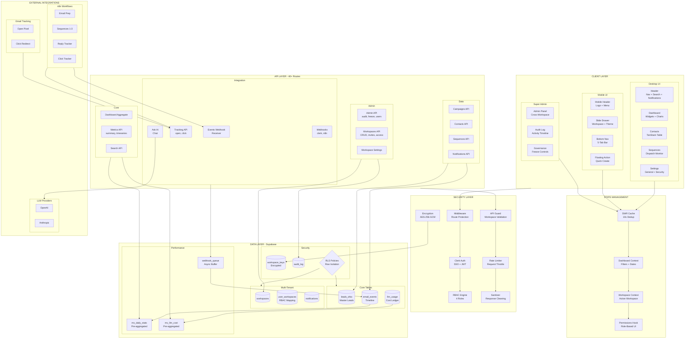
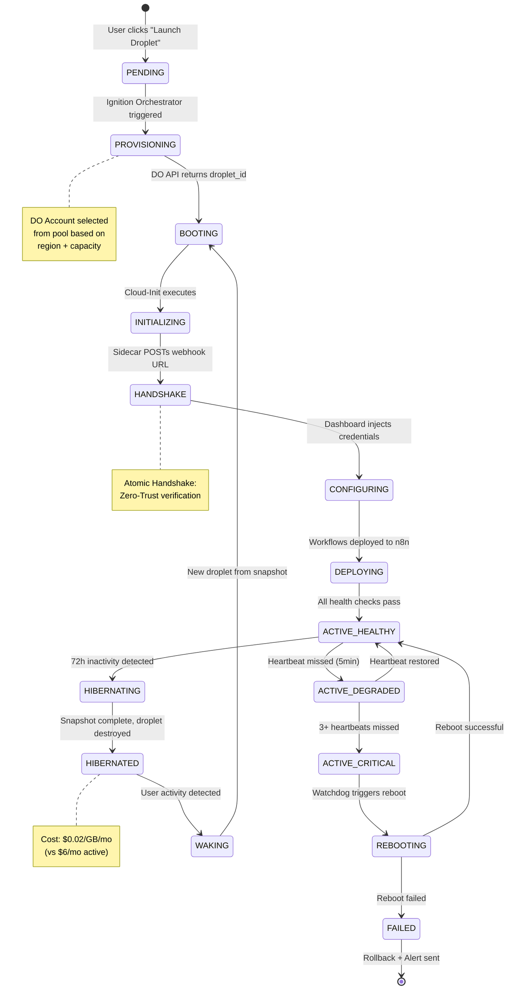
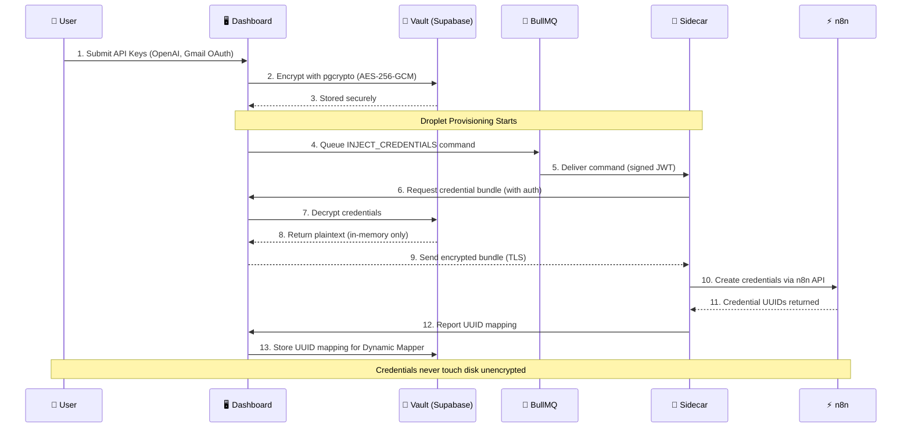
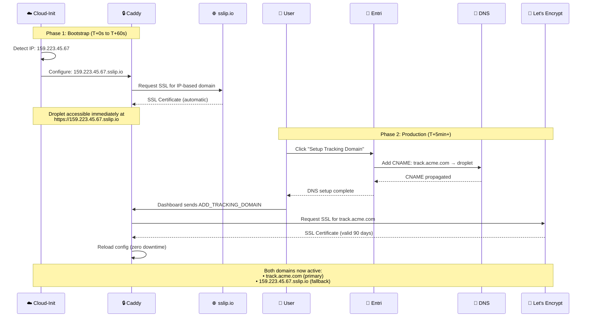
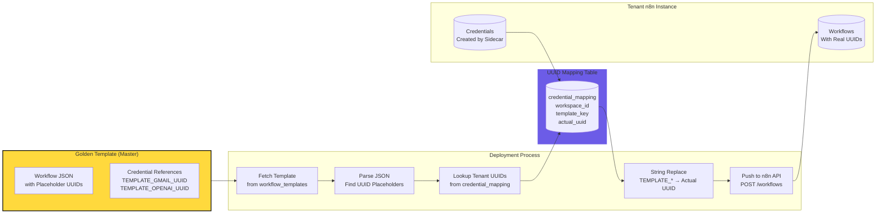

# 🏛️ GENESIS SINGULARITY V30 - MASTER ARCHITECTURE VISUALIZATION

> **Document Type**: Architecture Visualization  
> **Version**: V30 (Sovereign Singularity)  
> **Purpose**: Complete visual representation of the Genesis platform architecture  
> **Target**: 100M+ leads, 15,000+ isolated tenant partitions  

---

## 📋 DOCUMENT STRUCTURE

| Section | Content | Format |
|---------|---------|--------|
| **PART I** | Architecture Evolution (Before → After) | Mermaid.js |
| **PART II** | V30 Complete System Architecture | Mermaid.js |
| **PART III** | Component Deep Dives | Mermaid.js |
| **PART IV** | ASCII Diagrams | ASCII Art |

---

# ═══════════════════════════════════════════════════════════════════════════════
# PART I: ARCHITECTURE EVOLUTION
# ═══════════════════════════════════════════════════════════════════════════════

## 1.1 LEGACY ARCHITECTURE (Pre-Phase 40)

This is the original "Ohio" architecture - a single-tenant system with shared infrastructure.



### Legacy Architecture Limitations

| Problem | Impact | V30 Solution |
|---------|--------|--------------|
| **Single n8n Instance** | All tenants share one n8n | Dedicated droplet per tenant |
| **Shared Database** | Noisy neighbor, scaling limits | Partitioned data + isolated n8n DB |
| **No Hibernation** | Paying for idle resources | Snapshot-based hibernation |
| **Manual Provisioning** | Can't scale beyond 50 clients | Automated Cloud-Init ignition |
| **Credential Mixing** | All API keys in one place | Encrypted vault per workspace |

---

## 1.2 V30 GENESIS SINGULARITY ARCHITECTURE (The Evolution)

The V30 architecture introduces **Sovereign Isolation** - each tenant gets their own dedicated droplet with isolated n8n, database, and credentials.

```mermaid
graph TB
    subgraph GENESIS["🏛️ GENESIS CONTROL PLANE (Vercel)"]
        subgraph Dashboard["Dashboard (Next.js 14)"]
            UI[Client UI<br/>Desktop + Mobile]
            ADMIN_UI[Admin Console<br/>Fleet Management]
            ONBOARD[Onboarding Wizard<br/>OAuth + Keys]
        end

        subgraph API_LAYER["API Layer (60+ Routes)"]
            API_CORE[Core APIs<br/>Dashboard, Metrics]
            API_FLEET[Fleet APIs<br/>Ignition, Commands]
            API_WALLET[Wallet APIs<br/>Balance, Ledger]
            API_WEBHOOK[Webhook Receiver<br/>Events from n8n]
        end

        subgraph ORCHESTRATION["Orchestration Engine"]
            IGNITION[Ignition Orchestrator<br/>Droplet Provisioning]
            BULLMQ[BullMQ Event Bus<br/>Redis-backed Commands]
            WATCHDOG[Fleet Watchdog<br/>Heartbeat Monitor]
            HIBERNATE[Hibernation Controller<br/>Snapshot Manager]
        end
    end

    subgraph CENTRAL_DB["🗄️ CENTRAL DATABASE (Supabase)"]
        subgraph Control["Control Tables"]
            WS_T[(workspaces<br/>Tenant Registry)]
            FLEET_T[(fleet_status<br/>Droplet Health)]
            LEDGER_T[(wallet_ledger<br/>Usage Tracking)]
        end

        subgraph Vault["Credential Vault"]
            CREDS[(credentials<br/>Encrypted Keys)]
            DO_POOL[(do_accounts<br/>API Token Pool)]
            TEMPLATES[(workflow_templates<br/>Golden Configs)]
        end

        subgraph Analytics["Analytics (Partitioned)"]
            EVENTS_P[(email_events<br/>workspace_id Partitioned)]
            LEADS_P[(leads<br/>workspace_id Partitioned)]
            MV_P[Materialized Views<br/>Per-Workspace]
        end
    end

    subgraph DO_POOL_LAYER["☁️ DIGITALOCEAN ACCOUNT POOL"]
        DO1[DO Account 1<br/>US-East, 50 slots]
        DO2[DO Account 2<br/>US-West, 50 slots]
        DO3[DO Account 3<br/>EU-Frankfurt, 50 slots]
        DON[DO Account N<br/>Scalable Pool]
    end

    subgraph TENANT_FLEET["🚀 TENANT DROPLET FLEET (15,000+)"]
        subgraph Droplet1["Tenant A Droplet ($6/mo)"]
            N8N_1[n8n Container<br/>Workflows]
            PG_1[Postgres<br/>Local DB]
            CADDY_1[Caddy<br/>SSL + Proxy]
            SIDECAR_1[Sidecar Agent<br/>Control Link]
        end

        subgraph Droplet2["Tenant B Droplet ($6/mo)"]
            N8N_2[n8n Container]
            PG_2[Postgres]
            CADDY_2[Caddy]
            SIDECAR_2[Sidecar Agent]
        end

        subgraph DropletN["Tenant N Droplet"]
            N8N_N[n8n Container]
            PG_N[Postgres]
            CADDY_N[Caddy]
            SIDECAR_N[Sidecar Agent]
        end

        subgraph Hibernated["💤 Hibernated (Snapshots)"]
            SNAP1[Tenant X<br/>$0.02/GB/mo]
            SNAP2[Tenant Y<br/>$0.02/GB/mo]
            SNAPN[...]
        end
    end

    subgraph EXTERNAL_V30["🔗 EXTERNAL SERVICES"]
        subgraph Managed["Genesis Managed (Pooled)"]
            APIFY[Apify<br/>Scraping Pool]
            PROXY[Residential Proxy<br/>IP Pool]
            CSE[Google CSE<br/>Search Pool]
        end

        subgraph BYO["Bring Your Own (Per-Tenant)"]
            GMAIL[Gmail OAuth<br/>Per-User]
            OPENAI_T[OpenAI<br/>User's API Key]
            CLAUDE_T[Claude<br/>User's API Key]
            CALENDLY[Calendly<br/>Per-User]
        end

        subgraph DNS["DNS Services"]
            ENTRI[Entri<br/>Auto CNAME]
            SSLIP[sslip.io<br/>Bootstrap SSL]
            CUSTOM[Custom Domains<br/>track.client.com]
        end
    end

    %% Control Plane Flows
    UI --> API_CORE
    ADMIN_UI --> API_FLEET
    ONBOARD --> API_WALLET
    API_WEBHOOK --> BULLMQ
    
    %% Orchestration
    IGNITION --> DO_POOL_LAYER
    BULLMQ --> TENANT_FLEET
    WATCHDOG --> FLEET_T
    HIBERNATE --> Hibernated

    %% Database Connections
    API_CORE --> Analytics
    API_FLEET --> Control
    API_WALLET --> LEDGER_T
    IGNITION --> DO_POOL
    IGNITION --> TEMPLATES

    %% DO Pool to Droplets
    DO1 --> Droplet1
    DO2 --> Droplet2
    DON --> DropletN

    %% Sidecar Communications (Bidirectional)
    SIDECAR_1 <--> BULLMQ
    SIDECAR_2 <--> BULLMQ
    SIDECAR_N <--> BULLMQ
    SIDECAR_1 --> API_WEBHOOK
    SIDECAR_2 --> API_WEBHOOK

    %% External Service Flows
    Managed --> API_WALLET
    N8N_1 --> BYO
    N8N_2 --> BYO
    CADDY_1 --> DNS
    CADDY_2 --> DNS

    %% Credential Injection
    CREDS --> SIDECAR_1
    CREDS --> SIDECAR_2
    CREDS --> SIDECAR_N

    style GENESIS fill:#1a1a2e,stroke:#00d4ff,stroke-width:3px
    style TENANT_FLEET fill:#0d1b2a,stroke:#00ff88,stroke-width:3px
    style DO_POOL_LAYER fill:#1b263b,stroke:#ffd60a,stroke-width:2px
    style CENTRAL_DB fill:#2d2d44,stroke:#7b68ee,stroke-width:2px
```



---

## 1.3 SIDE-BY-SIDE COMPARISON

```mermaid
graph LR
    subgraph LEGACY["❌ LEGACY (Pre-V30)"]
        L_N8N[Single n8n<br/>Shared by ALL]
        L_DB[(Single Database<br/>RLS Only)]
        L_CREDS[Shared Credentials<br/>Mixed Keys]
        L_COST[$200+/mo Fixed<br/>Regardless of Usage]
    end

    subgraph V30["✅ V30 SINGULARITY"]
        V_N8N[Dedicated n8n<br/>Per Tenant]
        V_DB[(Isolated Postgres<br/>Per Droplet)]
        V_CREDS[Encrypted Vault<br/>Per Workspace]
        V_COST[$6/mo Per Tenant<br/>Hibernate = $0.02/GB]
    end

    L_N8N -->|"Evolution"| V_N8N
    L_DB -->|"Evolution"| V_DB
    L_CREDS -->|"Evolution"| V_CREDS
    L_COST -->|"Evolution"| V_COST

    style LEGACY fill:#4a0000,stroke:#ff0000,stroke-width:2px
    style V30 fill:#003300,stroke:#00ff00,stroke-width:2px
```



---

# ═══════════════════════════════════════════════════════════════════════════════
# PART II: V30 COMPLETE SYSTEM ARCHITECTURE
# ═══════════════════════════════════════════════════════════════════════════════

## 2.1 THE PINNACLE ARCHITECTURE (Full System)

This is the **complete, final architecture** combining all V30 components with the existing dashboard.

```mermaid
graph TB
    %% ═══════════════════════════════════════════════════════════════════════
    %% TIER 1: CLIENT APPLICATIONS
    %% ═══════════════════════════════════════════════════════════════════════
    
    subgraph CLIENTS["👥 CLIENT TIER"]
        subgraph WebApp["Web Application"]
            DESKTOP[Desktop UI<br/>Full Dashboard]
            MOBILE[Mobile UI<br/>Bottom Nav + Drawer]
            PWA[PWA Mode<br/>Offline Capable]
        end
        
        subgraph AdminPortal["Admin Portal"]
            SUPER_ADMIN[Super Admin<br/>Fleet Overview]
            WORKSPACE_ADMIN[Workspace Admin<br/>Team Management]
            FLEET_MONITOR[Fleet Monitor<br/>Real-time Health]
        end
        
        subgraph Onboarding["Onboarding Flow"]
            SIGNUP[Sign Up<br/>Clerk Auth]
            OAUTH_FLOW[OAuth Flow<br/>Gmail + Calendly]
            KEY_INPUT[API Key Input<br/>OpenAI, Claude, etc.]
            DROPLET_CONFIG[Droplet Config<br/>Region + Size]
        end
    end

    %% ═══════════════════════════════════════════════════════════════════════
    %% TIER 2: STATE & CACHING
    %% ═══════════════════════════════════════════════════════════════════════
    
    subgraph STATE_TIER["⚡ STATE TIER"]
        subgraph ClientState["Client State"]
            SWR_CACHE[SWR Cache<br/>10s Deduplication]
            DASHBOARD_CTX[Dashboard Context<br/>Filters + Dates]
            WORKSPACE_CTX[Workspace Context<br/>Active Tenant]
            PERMS_HOOK[Permissions Hook<br/>RBAC Enforcement]
        end
        
        subgraph ServerCache["Server Cache"]
            REDIS[Redis<br/>BullMQ + Sessions]
            WALLET_CACHE[Wallet Cache<br/>Balance Lookup]
            RATE_CACHE[Rate Limit Cache<br/>Sliding Window]
        end
    end

    %% ═══════════════════════════════════════════════════════════════════════
    %% TIER 3: SECURITY FORTRESS
    %% ═══════════════════════════════════════════════════════════════════════
    
    subgraph SECURITY_TIER["🛡️ SECURITY TIER"]
        subgraph AuthN["Authentication"]
            CLERK_AUTH[Clerk Auth<br/>SSO + MFA]
            JWT_VERIFY[JWT Verification<br/>Signed Tokens]
            SESSION_MGR[Session Manager<br/>Secure Cookies]
        end
        
        subgraph AuthZ["Authorization"]
            RBAC_ENGINE[RBAC Engine<br/>4 Roles]
            WORKSPACE_GUARD[Workspace Guard<br/>Tenant Isolation]
            FEATURE_FLAGS[Feature Flags<br/>Plan-based Access]
        end
        
        subgraph Protection["Protection"]
            RATE_LIMITER[Rate Limiter<br/>Sliding Window]
            INPUT_SANITIZE[Input Sanitizer<br/>XSS Prevention]
            RESPONSE_CLEAN[Response Cleaner<br/>Data Scrubbing]
            ENCRYPTION[AES-256-GCM<br/>At-Rest Encryption]
        end
        
        subgraph ZeroTrust["Zero-Trust (Sidecar)"]
            SIGNED_JWT[Signed JWT Headers<br/>Workspace Verification]
            PROVISIONING_TOKEN[Provisioning Token<br/>One-Time Use]
            HEARTBEAT_AUTH[Heartbeat Auth<br/>Continuous Validation]
        end
    end

    %% ═══════════════════════════════════════════════════════════════════════
    %% TIER 4: API GATEWAY
    %% ═══════════════════════════════════════════════════════════════════════
    
    subgraph API_TIER["🚪 API TIER (70+ Routes)"]
        subgraph CoreAPIs["Core APIs"]
            API_DASHBOARD[/api/dashboard<br/>Aggregated Metrics]
            API_METRICS[/api/metrics/*<br/>Time Series]
            API_SEARCH[/api/search<br/>Global Search]
            API_ANALYTICS[/api/analytics<br/>Charts Data]
        end
        
        subgraph DataAPIs["Data APIs"]
            API_CAMPAIGNS[/api/campaigns/*<br/>CRUD + Bulk]
            API_CONTACTS[/api/contacts/*<br/>Lead Management]
            API_SEQUENCES[/api/sequences/*<br/>Email Steps]
            API_NOTIFICATIONS[/api/notifications/*<br/>Alerts]
        end
        
        subgraph FleetAPIs["Fleet APIs (V30 NEW)"]
            API_IGNITION[/api/fleet/ignition<br/>Droplet Provision]
            API_COMMANDS[/api/fleet/commands<br/>BullMQ Dispatch]
            API_STATUS[/api/fleet/status<br/>Health Query]
            API_HIBERNATE[/api/fleet/hibernate<br/>Snapshot Control]
        end
        
        subgraph WalletAPIs["Wallet APIs (V30 NEW)"]
            API_BALANCE[/api/wallet/balance<br/>Current Balance]
            API_TOPUP[/api/wallet/topup<br/>Stripe Checkout]
            API_LEDGER[/api/wallet/ledger<br/>Transaction History]
            API_PREFLIGHT[/api/wallet/preflight<br/>Cost Check]
        end
        
        subgraph WebhookAPIs["Webhook APIs"]
            API_EVENTS[/api/events<br/>n8n Event Receiver]
            API_TRACKING[/api/track/*<br/>Open + Click]
            API_CLERK_WH[/api/webhooks/clerk<br/>User Sync]
            API_SIDECAR_WH[/api/webhooks/sidecar<br/>Heartbeat + Handshake]
        end
        
        subgraph AdminAPIs["Admin APIs"]
            API_ADMIN[/api/admin/*<br/>Super Admin]
            API_WORKSPACES[/api/workspaces/*<br/>Tenant CRUD]
            API_AUDIT[/api/audit/*<br/>Activity Logs]
            API_GOVERNANCE[/api/governance/*<br/>Freeze Controls]
        end
    end

    %% ═══════════════════════════════════════════════════════════════════════
    %% TIER 5: ORCHESTRATION ENGINE (V30 NEW)
    %% ═══════════════════════════════════════════════════════════════════════
    
    subgraph ORCHESTRATION_TIER["🎛️ ORCHESTRATION TIER (V30)"]
        subgraph Provisioning["Provisioning Engine"]
            IGNITION_ORCH[Ignition Orchestrator<br/>DO API Calls]
            CLOUD_INIT[Cloud-Init Generator<br/>Script Templating]
            ACCOUNT_SELECTOR[Account Selector<br/>Load Balancing]
            ROLLBACK_ENGINE[Rollback Engine<br/>Failure Recovery]
        end
        
        subgraph CommandControl["Command & Control"]
            BULLMQ_BUS[BullMQ Event Bus<br/>Redis Queue]
            COMMAND_ROUTER[Command Router<br/>Tenant Dispatch]
            CONCURRENCY_GOV[Concurrency Governor<br/>Rate Control]
        end
        
        subgraph FleetManagement["Fleet Management"]
            WATCHDOG[Fleet Watchdog<br/>Heartbeat Monitor]
            HIBERNATE_CTRL[Hibernation Controller<br/>Snapshot Lifecycle]
            UPDATE_MANAGER[Update Manager<br/>Blue-Green Deploy]
            PRE_WARMER[Pre-Warmer<br/>High-Priority Wake]
        end
    end

    %% ═══════════════════════════════════════════════════════════════════════
    %% TIER 6: CENTRAL DATABASE
    %% ═══════════════════════════════════════════════════════════════════════
    
    subgraph DATABASE_TIER["🗄️ DATABASE TIER (Supabase)"]
        subgraph ControlPlane["Control Plane Tables"]
            TB_WORKSPACES[(workspaces<br/>Tenant Registry)]
            TB_USERS[(user_workspaces<br/>RBAC Mapping)]
            TB_FLEET[(fleet_status<br/>Droplet Health)]
            TB_DO_ACCOUNTS[(do_accounts<br/>API Token Pool)]
        end
        
        subgraph DataPlane["Data Plane Tables"]
            TB_LEADS[(leads<br/>Partitioned by workspace_id)]
            TB_EVENTS[(email_events<br/>Partitioned by workspace_id)]
            TB_LLM[(llm_usage<br/>Cost Tracking)]
            TB_NOTIFICATIONS[(notifications<br/>User Alerts)]
        end
        
        subgraph FinancialPlane["Financial Tables (V30)"]
            TB_WALLET[(wallet_balance<br/>Prepaid Balance)]
            TB_LEDGER[(wallet_ledger<br/>Transaction Log)]
            TB_SUBSCRIPTIONS[(subscriptions<br/>Stripe Sync)]
        end
        
        subgraph SecurityPlane["Security Tables"]
            TB_CREDENTIALS[(credentials<br/>Encrypted Vault)]
            TB_AUDIT[(audit_log<br/>Activity Timeline)]
            TB_TEMPLATES[(workflow_templates<br/>Golden Configs)]
        end
        
        subgraph Performance["Performance Layer"]
            MV_DAILY[mv_daily_stats<br/>Pre-aggregated]
            MV_LLM[mv_llm_cost<br/>Cost Summary]
            MV_FUNNEL[mv_funnel_metrics<br/>Conversion Rates]
            IDX_WORKSPACE[workspace_id Indexes<br/>Fast Lookups]
        end
        
        subgraph Security["Security Layer"]
            RLS_POLICIES{RLS Policies<br/>Row Isolation}
            PG_CRYPTO[pgcrypto<br/>Encryption Functions]
            TRIGGERS[Audit Triggers<br/>Change Tracking]
        end
    end

    %% ═══════════════════════════════════════════════════════════════════════
    %% TIER 7: DIGITALOCEAN INFRASTRUCTURE
    %% ═══════════════════════════════════════════════════════════════════════
    
    subgraph DO_TIER["☁️ DIGITALOCEAN TIER"]
        subgraph AccountPool["Account Pool (15+ Accounts)"]
            DO_ACC_1[Account 1<br/>US-East, 50 slots]
            DO_ACC_2[Account 2<br/>US-West, 50 slots]
            DO_ACC_3[Account 3<br/>EU-Frankfurt, 50 slots]
            DO_ACC_4[Account 4<br/>SG-Singapore, 50 slots]
            DO_ACC_N[Account N<br/>Scalable]
        end
        
        subgraph Regions["Regional Distribution"]
            REGION_NYC[NYC1/NYC3<br/>US East Coast]
            REGION_SFO[SFO2/SFO3<br/>US West Coast]
            REGION_FRA[FRA1<br/>EU Germany]
            REGION_SGP[SGP1<br/>Asia Pacific]
            REGION_LON[LON1<br/>UK/GDPR]
        end
    end

    %% ═══════════════════════════════════════════════════════════════════════
    %% TIER 8: TENANT DROPLET FLEET
    %% ═══════════════════════════════════════════════════════════════════════
    
    subgraph FLEET_TIER["🚀 TENANT FLEET (15,000+ Droplets)"]
        subgraph ActiveDroplets["Active Droplets"]
            subgraph Droplet_A["Tenant A ($6/mo)"]
                D_A_N8N[n8n Container<br/>Workflows Running]
                D_A_PG[Postgres 16<br/>Local Database]
                D_A_CADDY[Caddy 2<br/>SSL + Reverse Proxy]
                D_A_SIDECAR[Sidecar Agent<br/>Control Link]
            end
            
            subgraph Droplet_B["Tenant B ($6/mo)"]
                D_B_N8N[n8n Container]
                D_B_PG[Postgres 16]
                D_B_CADDY[Caddy 2]
                D_B_SIDECAR[Sidecar Agent]
            end
            
            subgraph Droplet_N["Tenant N ($6-$48/mo)"]
                D_N_N8N[n8n Container]
                D_N_PG[Postgres 16]
                D_N_CADDY[Caddy 2]
                D_N_SIDECAR[Sidecar Agent]
            end
        end
        
        subgraph HibernatedDroplets["Hibernated (Snapshots)"]
            SNAPSHOT_X[Tenant X Snapshot<br/>$0.02/GB/mo]
            SNAPSHOT_Y[Tenant Y Snapshot<br/>$0.02/GB/mo]
            SNAPSHOT_Z[Tenant Z Snapshot<br/>$0.02/GB/mo]
        end
        
        subgraph PreWarmed["Pre-Warmed Pool (VIP)"]
            HOT_SPARE_1[Hot Spare 1<br/>Instant Failover]
            HOT_SPARE_2[Hot Spare 2<br/>Instant Failover]
        end
    end

    %% ═══════════════════════════════════════════════════════════════════════
    %% TIER 9: EXTERNAL INTEGRATIONS
    %% ═══════════════════════════════════════════════════════════════════════
    
    subgraph EXTERNAL_TIER["🔗 EXTERNAL TIER"]
        subgraph ManagedServices["Genesis Managed (Pooled)"]
            EXT_APIFY[Apify<br/>Scraping Pool]
            EXT_PROXY[Residential Proxy<br/>IP Rotation]
            EXT_CSE[Google CSE<br/>Search API Pool]
            EXT_RELEVANCE[Relevance AI<br/>Enrichment]
        end
        
        subgraph BYOServices["Bring Your Own (Per-Tenant)"]
            EXT_GMAIL[Gmail OAuth<br/>User's Account]
            EXT_OPENAI[OpenAI<br/>User's API Key]
            EXT_CLAUDE[Claude<br/>User's API Key]
            EXT_CALENDLY[Calendly OAuth<br/>User's Account]
        end
        
        subgraph DNSServices["DNS & SSL"]
            EXT_ENTRI[Entri<br/>One-Click CNAME]
            EXT_SSLIP[sslip.io<br/>Bootstrap SSL]
            EXT_LETSENCRYPT[Let's Encrypt<br/>Custom Domain SSL]
        end
        
        subgraph Payments["Payment Processing"]
            EXT_STRIPE[Stripe<br/>Subscriptions + Wallet]
        end
    end

    %% ═══════════════════════════════════════════════════════════════════════
    %% CONNECTION FLOWS
    %% ═══════════════════════════════════════════════════════════════════════
    
    %% Client to State
    CLIENTS --> STATE_TIER
    SWR_CACHE --> DASHBOARD_CTX
    DASHBOARD_CTX --> WORKSPACE_CTX
    WORKSPACE_CTX --> PERMS_HOOK
    
    %% State to Security
    STATE_TIER --> SECURITY_TIER
    CLERK_AUTH --> JWT_VERIFY
    JWT_VERIFY --> RBAC_ENGINE
    RBAC_ENGINE --> WORKSPACE_GUARD
    
    %% Security to API
    SECURITY_TIER --> API_TIER
    WORKSPACE_GUARD --> CoreAPIs
    WORKSPACE_GUARD --> DataAPIs
    WORKSPACE_GUARD --> FleetAPIs
    WORKSPACE_GUARD --> WalletAPIs
    
    %% API to Orchestration
    FleetAPIs --> ORCHESTRATION_TIER
    IGNITION_ORCH --> ACCOUNT_SELECTOR
    ACCOUNT_SELECTOR --> DO_TIER
    BULLMQ_BUS --> COMMAND_ROUTER
    
    %% API to Database
    CoreAPIs --> Performance
    DataAPIs --> DataPlane
    FleetAPIs --> ControlPlane
    WalletAPIs --> FinancialPlane
    AdminAPIs --> SecurityPlane
    
    %% Orchestration to Fleet
    IGNITION_ORCH --> ActiveDroplets
    HIBERNATE_CTRL --> HibernatedDroplets
    PRE_WARMER --> PreWarmed
    BULLMQ_BUS --> D_A_SIDECAR
    BULLMQ_BUS --> D_B_SIDECAR
    BULLMQ_BUS --> D_N_SIDECAR
    
    %% DO to Fleet
    AccountPool --> ActiveDroplets
    Regions --> ActiveDroplets
    
    %% Sidecar to Dashboard
    D_A_SIDECAR --> WebhookAPIs
    D_B_SIDECAR --> WebhookAPIs
    D_N_SIDECAR --> WebhookAPIs
    
    %% n8n to External
    D_A_N8N --> ManagedServices
    D_A_N8N --> BYOServices
    D_B_N8N --> ManagedServices
    D_B_N8N --> BYOServices
    
    %% Caddy to DNS
    D_A_CADDY --> DNSServices
    D_B_CADDY --> DNSServices
    D_N_CADDY --> DNSServices
    
    %% Credentials Flow
    TB_CREDENTIALS --> D_A_SIDECAR
    TB_CREDENTIALS --> D_B_SIDECAR
    TB_CREDENTIALS --> D_N_SIDECAR
    
    %% Payments
    Payments --> FinancialPlane
    
    %% RLS
    RLS_POLICIES --> DataPlane
    RLS_POLICIES --> ControlPlane
    PG_CRYPTO --> TB_CREDENTIALS
    PG_CRYPTO --> TB_DO_ACCOUNTS

    %% Styling
    style CLIENTS fill:#1a1a2e,stroke:#00d4ff,stroke-width:2px
    style SECURITY_TIER fill:#2d1b1b,stroke:#ff6b6b,stroke-width:2px
    style API_TIER fill:#1b2d1b,stroke:#4ecdc4,stroke-width:2px
    style ORCHESTRATION_TIER fill:#2d2d1b,stroke:#ffd93d,stroke-width:2px
    style DATABASE_TIER fill:#1b1b2d,stroke:#6c5ce7,stroke-width:2px
    style DO_TIER fill:#1b2d2d,stroke:#00b894,stroke-width:2px
    style FLEET_TIER fill:#0d1b2a,stroke:#00ff88,stroke-width:3px
    style EXTERNAL_TIER fill:#2d1b2d,stroke:#fd79a8,stroke-width:2px
```

---

## 2.2 DATA FLOW ARCHITECTURE

This diagram shows how data flows through the entire system.

```mermaid
flowchart TB
    subgraph INPUT["📥 DATA INGESTION"]
        USER_ACTION[User Action<br/>Dashboard Click]
        N8N_EVENT[n8n Event<br/>Email Sent/Opened]
        WEBHOOK_EXT[External Webhook<br/>Stripe, Clerk]
    end

    subgraph PROCESSING["⚙️ PROCESSING LAYER"]
        subgraph Validation["Validation"]
            AUTH_CHECK{Auth Check<br/>Clerk JWT}
            RBAC_CHECK{RBAC Check<br/>Role Verify}
            WORKSPACE_CHECK{Workspace Check<br/>Tenant Verify}
        end
        
        subgraph Business["Business Logic"]
            RATE_LIMIT[Rate Limiter<br/>Sliding Window]
            WALLET_CHECK[Wallet Preflight<br/>Balance Check]
            IDEMPOTENCY[Idempotency<br/>Duplicate Prevention]
        end
    end

    subgraph ROUTING["🔀 ROUTING LAYER"]
        API_ROUTER{API Router<br/>Route Selection}
        BULLMQ_ROUTER{BullMQ Router<br/>Command Dispatch}
    end

    subgraph STORAGE["💾 STORAGE LAYER"]
        subgraph WriteOps["Write Operations"]
            EVENT_WRITE[Event Write<br/>email_events]
            LEDGER_WRITE[Ledger Write<br/>wallet_ledger]
            AUDIT_WRITE[Audit Write<br/>audit_log]
        end
        
        subgraph ReadOps["Read Operations"]
            MV_READ[Materialized View<br/>Fast Aggregates]
            CACHE_READ[Redis Cache<br/>Hot Data]
        end
    end

    subgraph DISPATCH["📤 DISPATCH LAYER"]
        SIDECAR_CMD[Sidecar Command<br/>via BullMQ]
        WEBHOOK_OUT[Webhook Out<br/>to n8n]
        UI_UPDATE[UI Update<br/>SWR Revalidate]
    end

    %% Flow
    USER_ACTION --> AUTH_CHECK
    N8N_EVENT --> WORKSPACE_CHECK
    WEBHOOK_EXT --> AUTH_CHECK
    
    AUTH_CHECK -->|Pass| RBAC_CHECK
    AUTH_CHECK -->|Fail| REJECT[403 Forbidden]
    
    RBAC_CHECK -->|Pass| WORKSPACE_CHECK
    RBAC_CHECK -->|Fail| REJECT
    
    WORKSPACE_CHECK -->|Pass| RATE_LIMIT
    WORKSPACE_CHECK -->|Fail| REJECT
    
    RATE_LIMIT -->|Pass| WALLET_CHECK
    RATE_LIMIT -->|Exceeded| THROTTLE[429 Too Many]
    
    WALLET_CHECK -->|Sufficient| IDEMPOTENCY
    WALLET_CHECK -->|Insufficient| HALT[402 Payment Required]
    
    IDEMPOTENCY -->|New| API_ROUTER
    IDEMPOTENCY -->|Duplicate| DEDUPE[Return Cached]
    
    API_ROUTER -->|Data Op| WriteOps
    API_ROUTER -->|Query Op| ReadOps
    API_ROUTER -->|Fleet Op| BULLMQ_ROUTER
    
    WriteOps --> MV_READ
    WriteOps --> AUDIT_WRITE
    
    BULLMQ_ROUTER --> SIDECAR_CMD
    
    ReadOps --> UI_UPDATE
    SIDECAR_CMD --> WEBHOOK_OUT

    style INPUT fill:#1a1a2e,stroke:#00d4ff
    style PROCESSING fill:#2d1b1b,stroke:#ff6b6b
    style ROUTING fill:#1b2d1b,stroke:#4ecdc4
    style STORAGE fill:#1b1b2d,stroke:#6c5ce7
    style DISPATCH fill:#2d2d1b,stroke:#ffd93d
```



---

## 2.3 DROPLET LIFECYCLE FLOW



---

## 2.4 CREDENTIAL INJECTION FLOW



---

## 2.5 DUAL-MODE DNS FLOW



---

# ═══════════════════════════════════════════════════════════════════════════════
# PART III: COMPONENT DEEP DIVES
# ═══════════════════════════════════════════════════════════════════════════════

## 3.1 MULTI-ACCOUNT DIGITALOCEAN POOL

```mermaid
graph TB
    subgraph DASHBOARD["Dashboard Ignition Request"]
        REQ[Provision Request<br/>workspace_id, region, size]
    end

    subgraph SELECTOR["Account Selector Algorithm"]
        QUERY[Query do_accounts<br/>WHERE region = :region<br/>AND status = 'active'<br/>AND current < max]
        SORT[Sort by current_droplets<br/>ASC (least loaded first)]
        SELECT[Select Top Account]
    end

    subgraph POOL["DigitalOcean Account Pool"]
        subgraph Active["Active Accounts"]
            ACC1[Account 1<br/>us-east<br/>45/50 droplets]
            ACC2[Account 2<br/>us-east<br/>30/50 droplets]
            ACC3[Account 3<br/>eu-frankfurt<br/>20/50 droplets]
        end
        
        subgraph Standby["Standby (Full)"]
            ACC_FULL[Account X<br/>50/50 droplets<br/>STANDBY]
        end
    end

    subgraph CREATE["Droplet Creation"]
        DECRYPT[Decrypt API Token<br/>pgcrypto]
        API_CALL[DO API Call<br/>dropletsCreate]
        INCREMENT[Increment Counter<br/>current_droplets + 1]
        TAG[Apply Tags<br/>genesis:workspace_id]
    end

    subgraph RESULT["Result"]
        SUCCESS[Return droplet_id<br/>+ droplet_ip]
        FAILOVER[Failover to<br/>Next Account]
    end

    REQ --> QUERY
    QUERY --> SORT
    SORT --> SELECT
    SELECT --> ACC2
    
    ACC2 --> DECRYPT
    DECRYPT --> API_CALL
    API_CALL -->|Success| INCREMENT
    INCREMENT --> TAG
    TAG --> SUCCESS
    
    API_CALL -->|Failure| FAILOVER
    FAILOVER --> ACC1

    style POOL fill:#1b263b,stroke:#ffd60a,stroke-width:2px
    style SELECTOR fill:#1a1a2e,stroke:#00d4ff,stroke-width:2px
```

---

## 3.2 BULLMQ EVENT BUS ARCHITECTURE

```mermaid
graph LR
    subgraph PRODUCERS["Command Producers"]
        FLEET_API[Fleet API<br/>User Actions]
        WATCHDOG[Watchdog<br/>Auto-Healing]
        SCHEDULER[Scheduler<br/>Cron Jobs]
    end

    subgraph REDIS["Redis Cluster"]
        subgraph Queues["Command Queues"]
            Q_DEPLOY[deploy-workflow<br/>Priority: HIGH]
            Q_CREDS[inject-credentials<br/>Priority: HIGH]
            Q_UPDATE[update-n8n<br/>Priority: MEDIUM]
            Q_REBOOT[hard-reboot<br/>Priority: CRITICAL]
            Q_HIBERNATE[hibernate-droplet<br/>Priority: LOW]
        end
        
        subgraph State["State Storage"]
            JOBS[Job Status<br/>Pending/Active/Done]
            RETRIES[Retry Counter<br/>Max 3 Attempts]
        end
    end

    subgraph GOVERNOR["Concurrency Governor"]
        LIMITER[Rate Limiter<br/>50 concurrent/account]
        BACKOFF[Exponential Backoff<br/>1s → 2s → 4s]
    end

    subgraph CONSUMERS["Sidecar Consumers (15,000+)"]
        SIDE_A[Sidecar A<br/>Listening on workspace_id]
        SIDE_B[Sidecar B<br/>Listening on workspace_id]
        SIDE_N[Sidecar N<br/>Listening on workspace_id]
    end

    PRODUCERS --> Queues
    Queues --> GOVERNOR
    GOVERNOR --> CONSUMERS
    JOBS --> CONSUMERS
    CONSUMERS --> JOBS

    style REDIS fill:#dc143c,stroke:#ff6b6b,stroke-width:2px
    style GOVERNOR fill:#ffd93d,stroke:#000,stroke-width:2px
```



---

## 3.3 WALLET & FINANCIAL KILL-SWITCH

```mermaid
flowchart TB
    subgraph TRIGGER["Workflow Execution Trigger"]
        N8N_START[n8n Workflow Starts<br/>e.g., Apify Scrape]
    end

    subgraph PREFLIGHT["Pre-Flight Check (n8n Node)"]
        CALC[Calculate Estimated Cost<br/>1 Apify = $0.02]
        API_CHECK[Call Dashboard API<br/>GET /api/wallet/preflight]
    end

    subgraph DASHBOARD["Dashboard Wallet API"]
        REDIS_CHECK[Check Redis Cache<br/>wallet:{workspace_id}]
        DB_CHECK[Query Supabase<br/>wallet_balance]
        DECISION{Balance >= Cost?}
    end

    subgraph EXECUTION["Workflow Execution"]
        PROCEED[✅ Proceed<br/>Execute Apify Node]
        DEDUCT[Deduct from Wallet<br/>Atomic DECRBY]
        LOG[Log to Ledger<br/>wallet_ledger]
    end

    subgraph HALT["Kill Switch"]
        STOP[❌ HALT Workflow<br/>Insufficient Funds]
        ALERT[Send Notification<br/>to User]
        AUDIT[Log Kill Event<br/>audit_log]
    end

    TRIGGER --> CALC
    CALC --> API_CHECK
    API_CHECK --> REDIS_CHECK
    REDIS_CHECK -->|Hit| DECISION
    REDIS_CHECK -->|Miss| DB_CHECK
    DB_CHECK --> DECISION
    
    DECISION -->|Yes| PROCEED
    DECISION -->|No| STOP
    
    PROCEED --> DEDUCT
    DEDUCT --> LOG
    
    STOP --> ALERT
    ALERT --> AUDIT

    style HALT fill:#4a0000,stroke:#ff0000,stroke-width:2px
    style EXECUTION fill:#003300,stroke:#00ff00,stroke-width:2px
```

---

## 3.4 HIBERNATION & WAKE CYCLE

```mermaid
flowchart TB
    subgraph DETECT["Inactivity Detection"]
        MONITOR[Monitor last_activity<br/>in fleet_status]
        CHECK{72h Since<br/>Last Activity?}
    end

    subgraph HIBERNATE["Hibernation Process"]
        NOTIFY[Notify User<br/>Hibernation Warning]
        SNAPSHOT[Create DO Snapshot<br/>~$0.02/GB/mo]
        DESTROY[Destroy Droplet<br/>Stop $6/mo billing]
        UPDATE_DB[Update fleet_status<br/>state = HIBERNATED]
    end

    subgraph STORAGE["Snapshot Storage"]
        SNAP_STORE[(DO Snapshot<br/>5-10GB typical)]
        META[Metadata Stored<br/>snapshot_id, size]
    end

    subgraph WAKE["Wake Process"]
        USER_ACTION[User Activity<br/>Dashboard Access]
        RESTORE[Create Droplet<br/>FROM Snapshot]
        BOOT[Cloud-Init<br/>Minimal (no re-download)]
        HANDSHAKE[Sidecar Handshake<br/>Re-establish Link]
        ACTIVE[State: ACTIVE_HEALTHY<br/>< 15s total]
    end

    MONITOR --> CHECK
    CHECK -->|No| MONITOR
    CHECK -->|Yes| NOTIFY
    NOTIFY -->|24h Grace| SNAPSHOT
    SNAPSHOT --> SNAP_STORE
    SNAPSHOT --> DESTROY
    DESTROY --> UPDATE_DB
    
    USER_ACTION --> RESTORE
    RESTORE --> SNAP_STORE
    RESTORE --> BOOT
    BOOT --> HANDSHAKE
    HANDSHAKE --> ACTIVE

    style HIBERNATE fill:#1a1a2e,stroke:#00d4ff,stroke-width:2px
    style WAKE fill:#0d1b2a,stroke:#00ff88,stroke-width:2px
    style STORAGE fill:#2d2d44,stroke:#7b68ee,stroke-width:2px
```

---

## 3.5 GOLDEN TEMPLATE & DYNAMIC UUID MAPPER



---

# ═══════════════════════════════════════════════════════════════════════════════
# PART IV: ASCII DIAGRAMS
# ═══════════════════════════════════════════════════════════════════════════════

## 4.1 SYSTEM LAYER OVERVIEW

```
╔══════════════════════════════════════════════════════════════════════════════════╗
║                           GENESIS SINGULARITY V30                                ║
║                        COMPLETE SYSTEM ARCHITECTURE                              ║
╠══════════════════════════════════════════════════════════════════════════════════╣
║                                                                                  ║
║  ┌────────────────────────────────────────────────────────────────────────────┐  ║
║  │                         LAYER 1: CLIENT TIER                               │  ║
║  │  ┌──────────────┐  ┌──────────────┐  ┌──────────────┐  ┌──────────────┐   │  ║
║  │  │   Desktop    │  │    Mobile    │  │  Admin       │  │  Onboarding  │   │  ║
║  │  │   Dashboard  │  │    PWA       │  │  Console     │  │  Wizard      │   │  ║
║  │  └──────────────┘  └──────────────┘  └──────────────┘  └──────────────┘   │  ║
║  └────────────────────────────────────────────────────────────────────────────┘  ║
║                                      │                                           ║
║                                      ▼                                           ║
║  ┌────────────────────────────────────────────────────────────────────────────┐  ║
║  │                         LAYER 2: STATE TIER                                │  ║
║  │  ┌──────────────┐  ┌──────────────┐  ┌──────────────┐  ┌──────────────┐   │  ║
║  │  │  SWR Cache   │  │  Dashboard   │  │  Workspace   │  │  Permissions │   │  ║
║  │  │  (10s TTL)   │  │  Context     │  │  Context     │  │  Hook        │   │  ║
║  │  └──────────────┘  └──────────────┘  └──────────────┘  └──────────────┘   │  ║
║  └────────────────────────────────────────────────────────────────────────────┘  ║
║                                      │                                           ║
║                                      ▼                                           ║
║  ┌────────────────────────────────────────────────────────────────────────────┐  ║
║  │                       LAYER 3: SECURITY TIER                               │  ║
║  │  ┌────────────┐ ┌────────────┐ ┌────────────┐ ┌────────────┐ ┌──────────┐ │  ║
║  │  │   Clerk    │ │    RBAC    │ │   Rate     │ │  Sanitize  │ │ AES-256  │ │  ║
║  │  │   Auth     │ │   Engine   │ │  Limiter   │ │  + Clean   │ │   GCM    │ │  ║
║  │  └────────────┘ └────────────┘ └────────────┘ └────────────┘ └──────────┘ │  ║
║  └────────────────────────────────────────────────────────────────────────────┘  ║
║                                      │                                           ║
║                                      ▼                                           ║
║  ┌────────────────────────────────────────────────────────────────────────────┐  ║
║  │                         LAYER 4: API TIER                                  │  ║
║  │                          (70+ Routes)                                      │  ║
║  │  ┌──────────┐ ┌──────────┐ ┌──────────┐ ┌──────────┐ ┌──────────┐        │  ║
║  │  │  Core    │ │  Data    │ │  Fleet   │ │  Wallet  │ │  Admin   │        │  ║
║  │  │  APIs    │ │  APIs    │ │  APIs    │ │  APIs    │ │  APIs    │        │  ║
║  │  │ (metrics)│ │(contacts)│ │(ignition)│ │(balance) │ │ (audit)  │        │  ║
║  │  └──────────┘ └──────────┘ └──────────┘ └──────────┘ └──────────┘        │  ║
║  └────────────────────────────────────────────────────────────────────────────┘  ║
║                                      │                                           ║
║              ┌───────────────────────┴───────────────────────┐                   ║
║              ▼                                               ▼                   ║
║  ┌──────────────────────────────┐            ┌──────────────────────────────┐   ║
║  │   LAYER 5: ORCHESTRATION     │            │   LAYER 6: DATABASE          │   ║
║  │   (V30 NEW)                  │            │   (Supabase)                  │   ║
║  │  ┌────────────┐              │            │  ┌──────────────────────────┐ │   ║
║  │  │ Ignition   │              │            │  │  Control Plane Tables    │ │   ║
║  │  │ Orchestr.  │              │            │  │  • workspaces            │ │   ║
║  │  └────────────┘              │            │  │  • fleet_status          │ │   ║
║  │  ┌────────────┐              │            │  │  • do_accounts           │ │   ║
║  │  │  BullMQ    │              │            │  └──────────────────────────┘ │   ║
║  │  │ Event Bus  │              │            │  ┌──────────────────────────┐ │   ║
║  │  └────────────┘              │            │  │  Data Plane Tables       │ │   ║
║  │  ┌────────────┐              │            │  │  • leads (partitioned)   │ │   ║
║  │  │  Watchdog  │              │            │  │  • email_events          │ │   ║
║  │  │ + Hibernate│              │            │  │  • llm_usage             │ │   ║
║  │  └────────────┘              │            │  └──────────────────────────┘ │   ║
║  └──────────────────────────────┘            │  ┌──────────────────────────┐ │   ║
║              │                               │  │  Security Tables         │ │   ║
║              │                               │  │  • credentials (vault)   │ │   ║
║              │                               │  │  • audit_log             │ │   ║
║              │                               │  │  • RLS Policies          │ │   ║
║              │                               │  └──────────────────────────┘ │   ║
║              │                               └──────────────────────────────────┘   ║
║              │                                                                   ║
║              ▼                                                                   ║
║  ┌────────────────────────────────────────────────────────────────────────────┐  ║
║  │                    LAYER 7: DIGITALOCEAN INFRASTRUCTURE                    │  ║
║  │  ┌──────────────────────────────────────────────────────────────────────┐  │  ║
║  │  │                    ACCOUNT POOL (15+ Accounts)                       │  │  ║
║  │  │  ┌──────────┐ ┌──────────┐ ┌──────────┐ ┌──────────┐ ┌──────────┐   │  │  ║
║  │  │  │ Account1 │ │ Account2 │ │ Account3 │ │ Account4 │ │ AccountN │   │  │  ║
║  │  │  │ US-East  │ │ US-West  │ │ EU-Frank │ │ SG-Asia  │ │ Scalable │   │  │  ║
║  │  │  │ 50 slots │ │ 50 slots │ │ 50 slots │ │ 50 slots │ │ 50 slots │   │  │  ║
║  │  │  └──────────┘ └──────────┘ └──────────┘ └──────────┘ └──────────┘   │  │  ║
║  │  └──────────────────────────────────────────────────────────────────────┘  │  ║
║  └────────────────────────────────────────────────────────────────────────────┘  ║
║                                      │                                           ║
║                                      ▼                                           ║
║  ┌────────────────────────────────────────────────────────────────────────────┐  ║
║  │                    LAYER 8: TENANT DROPLET FLEET                           │  ║
║  │                         (15,000+ Droplets)                                 │  ║
║  │                                                                            │  ║
║  │  ┌─────────────────┐  ┌─────────────────┐  ┌─────────────────┐            │  ║
║  │  │  ACTIVE ($6/mo) │  │  ACTIVE ($6/mo) │  │  ACTIVE ($6/mo) │ ...        │  ║
║  │  │  ┌───────────┐  │  │  ┌───────────┐  │  │  ┌───────────┐  │            │  ║
║  │  │  │   n8n     │  │  │  │   n8n     │  │  │  │   n8n     │  │            │  ║
║  │  │  ├───────────┤  │  │  ├───────────┤  │  │  ├───────────┤  │            │  ║
║  │  │  │ Postgres  │  │  │  │ Postgres  │  │  │  │ Postgres  │  │            │  ║
║  │  │  ├───────────┤  │  │  ├───────────┤  │  │  ├───────────┤  │            │  ║
║  │  │  │  Caddy    │  │  │  │  Caddy    │  │  │  │  Caddy    │  │            │  ║
║  │  │  ├───────────┤  │  │  ├───────────┤  │  │  ├───────────┤  │            │  ║
║  │  │  │ Sidecar   │  │  │  │ Sidecar   │  │  │  │ Sidecar   │  │            │  ║
║  │  │  └───────────┘  │  │  └───────────┘  │  │  └───────────┘  │            │  ║
║  │  └─────────────────┘  └─────────────────┘  └─────────────────┘            │  ║
║  │                                                                            │  ║
║  │  ┌─────────────────┐  ┌─────────────────┐  ┌─────────────────┐            │  ║
║  │  │ HIBERNATED      │  │ HIBERNATED      │  │ HIBERNATED      │ ...        │  ║
║  │  │ ($0.02/GB/mo)   │  │ ($0.02/GB/mo)   │  │ ($0.02/GB/mo)   │            │  ║
║  │  │ [Snapshot Only] │  │ [Snapshot Only] │  │ [Snapshot Only] │            │  ║
║  │  └─────────────────┘  └─────────────────┘  └─────────────────┘            │  ║
║  └────────────────────────────────────────────────────────────────────────────┘  ║
║                                      │                                           ║
║                                      ▼                                           ║
║  ┌────────────────────────────────────────────────────────────────────────────┐  ║
║  │                       LAYER 9: EXTERNAL SERVICES                           │  ║
║  │  ┌─────────────────────────┐     ┌─────────────────────────┐              │  ║
║  │  │   GENESIS MANAGED       │     │   BRING YOUR OWN        │              │  ║
║  │  │   (Pooled/Resold)       │     │   (Per-Tenant Keys)     │              │  ║
║  │  │  • Apify (Scraping)     │     │  • Gmail (OAuth)        │              │  ║
║  │  │  • Google CSE           │     │  • OpenAI (API Key)     │              │  ║
║  │  │  • Residential Proxy    │     │  • Claude (API Key)     │              │  ║
║  │  │  • Relevance AI         │     │  • Calendly (OAuth)     │              │  ║
║  │  └─────────────────────────┘     └─────────────────────────┘              │  ║
║  └────────────────────────────────────────────────────────────────────────────┘  ║
║                                                                                  ║
╚══════════════════════════════════════════════════════════════════════════════════╝
```

---

## 4.2 DROPLET INTERNAL ARCHITECTURE

```
┌──────────────────────────────────────────────────────────────────────────────────┐
│                        TENANT DROPLET ($6/month)                                 │
│                        Ubuntu 22.04 LTS | 1 vCPU | 1GB RAM | 25GB SSD           │
├──────────────────────────────────────────────────────────────────────────────────┤
│                                                                                  │
│   ┌─────────────────────────────────── HOST OS ─────────────────────────────┐   │
│   │                                                                         │   │
│   │   ┌─────────────────────────── DOCKER ENGINE ────────────────────────┐  │   │
│   │   │                                                                   │  │   │
│   │   │   ┌───────────────┐   ┌───────────────┐   ┌───────────────┐      │  │   │
│   │   │   │    CADDY      │   │     n8n       │   │  POSTGRES 16  │      │  │   │
│   │   │   │   (Alpine)    │   │   (Node.js)   │   │   (Database)  │      │  │   │
│   │   │   ├───────────────┤   ├───────────────┤   ├───────────────┤      │  │   │
│   │   │   │ Port 80, 443  │   │   Port 5678   │   │   Port 5432   │      │  │   │
│   │   │   │ (External)    │   │  (Internal)   │   │  (Internal)   │      │  │   │
│   │   │   ├───────────────┤   ├───────────────┤   ├───────────────┤      │  │   │
│   │   │   │ SSL Termn.    │   │ Workflows     │   │ n8n Data      │      │  │   │
│   │   │   │ Reverse Proxy │   │ Credentials   │   │ Executions    │      │  │   │
│   │   │   │ Let's Encrypt │   │ Webhooks      │   │ Settings      │      │  │   │
│   │   │   │ sslip.io      │   │               │   │               │      │  │   │
│   │   │   │               │   │ RAM: ~400MB   │   │ RAM: ~150MB   │      │  │   │
│   │   │   │ RAM: ~20MB    │   │               │   │               │      │  │   │
│   │   │   └───────────────┘   └───────────────┘   └───────────────┘      │  │   │
│   │   │                              │                    │              │  │   │
│   │   │                              │ DB Connection      │              │  │   │
│   │   │                              └────────────────────┘              │  │   │
│   │   │                                                                   │  │   │
│   │   │   ┌───────────────────────────────────────────────────────────┐  │  │   │
│   │   │   │                      SIDECAR AGENT                        │  │  │   │
│   │   │   │                    genesis/sidecar:v1.0                   │  │  │   │
│   │   │   ├───────────────────────────────────────────────────────────┤  │  │   │
│   │   │   │                                                           │  │  │   │
│   │   │   │   Functions:                                              │  │  │   │
│   │   │   │   • Atomic Handshake (POST webhook URL to Dashboard)     │  │  │   │
│   │   │   │   • Heartbeat (every 60s to Dashboard)                   │  │  │   │
│   │   │   │   • Credential Injection (via n8n API)                   │  │  │   │
│   │   │   │   • Workflow Deployment (via n8n API)                    │  │  │   │
│   │   │   │   • Command Listener (BullMQ consumer)                   │  │  │   │
│   │   │   │   • Health Monitoring (Docker stats)                     │  │  │   │
│   │   │   │   • Blue-Green Container Swap (Docker socket access)     │  │  │   │
│   │   │   │   • Caddy Config Updates (Add tracking domains)          │  │  │   │
│   │   │   │                                                           │  │  │   │
│   │   │   │   RAM: ~50MB                                              │  │  │   │
│   │   │   │                                                           │  │  │   │
│   │   │   └───────────────────────────────────────────────────────────┘  │  │   │
│   │   │                                                                   │  │   │
│   │   └───────────────────────────────────────────────────────────────────┘  │   │
│   │                                                                         │   │
│   │   ┌─────────────────────────── VOLUMES ──────────────────────────────┐  │   │
│   │   │  • caddy_data     → /data (SSL certs)                           │  │   │
│   │   │  • caddy_config   → /config (Caddy settings)                    │  │   │
│   │   │  • n8n_data       → /home/node/.n8n (Workflows, Creds)         │  │   │
│   │   │  • db_storage     → /var/lib/postgresql/data (Postgres)        │  │   │
│   │   └─────────────────────────────────────────────────────────────────┘  │   │
│   │                                                                         │   │
│   │   ┌─────────────────────────── SWAP FILE ────────────────────────────┐  │   │
│   │   │  /swapfile  →  4GB (Prevents OOM crashes)                       │  │   │
│   │   │  When RAM (1GB) is exhausted, overflow to swap                  │  │   │
│   │   └─────────────────────────────────────────────────────────────────┘  │   │
│   │                                                                         │   │
│   └─────────────────────────────────────────────────────────────────────────┘   │
│                                                                                  │
│   ┌──────────────────────────────── FIREWALL (UFW) ─────────────────────────┐   │
│   │  ALLOW: 22/tcp (SSH), 80/tcp (HTTP), 443/tcp (HTTPS)                   │   │
│   │  DENY:  All other inbound traffic                                       │   │
│   │  Note:  Postgres 5432 NOT exposed (internal Docker network only)       │   │
│   └─────────────────────────────────────────────────────────────────────────┘   │
│                                                                                  │
├──────────────────────────────────────────────────────────────────────────────────┤
│                              NETWORK INTERFACES                                  │
│  ┌─────────────────────────────────────────────────────────────────────────┐    │
│  │  eth0 (Public): 159.223.45.67                                           │    │
│  │  ├── https://159.223.45.67.sslip.io (Bootstrap SSL)                    │    │
│  │  └── https://track.clientdomain.com (Production SSL)                   │    │
│  │                                                                         │    │
│  │  docker0 (Internal): 172.17.0.0/16                                     │    │
│  │  ├── caddy    → 172.17.0.2                                             │    │
│  │  ├── n8n      → 172.17.0.3                                             │    │
│  │  ├── postgres → 172.17.0.4                                             │    │
│  │  └── sidecar  → 172.17.0.5                                             │    │
│  └─────────────────────────────────────────────────────────────────────────┘    │
│                                                                                  │
└──────────────────────────────────────────────────────────────────────────────────┘
```

---

## 4.3 DATA FLOW: WEBHOOK EVENT TO DASHBOARD

```
┌─────────────────────────────────────────────────────────────────────────────────────┐
│                    DATA FLOW: n8n EVENT → DASHBOARD UPDATE                          │
└─────────────────────────────────────────────────────────────────────────────────────┘

                    TENANT DROPLET                        DASHBOARD (Vercel)
                    ──────────────                        ──────────────────

    ┌───────────────────────┐
    │       n8n             │
    │  ┌─────────────────┐  │
    │  │  Email Workflow │  │
    │  │  ┌───────────┐  │  │
    │  │  │ Send Email│──┼──┼────────────────────────────────────────────────────┐
    │  │  └───────────┘  │  │                                                    │
    │  │       │         │  │                                                    │
    │  │       ▼         │  │                                                    │
    │  │  ┌───────────┐  │  │                                                    │
    │  │  │  HTTP     │──┼──┼─────┐                                              │
    │  │  │  Request  │  │  │     │                                              │
    │  │  │  Node     │  │  │     │   POST /api/events                           │
    │  │  └───────────┘  │  │     │   {                                          │
    │  └─────────────────┘  │     │     "type": "email_sent",                    │
    └───────────────────────┘     │     "lead_id": "abc123",                     │
                                  │     "workspace_id": "ws_789",                │
                                  │     "timestamp": "2026-01-24T10:00:00Z"     │
                                  │   }                                          │
                                  │                                              │
                                  ▼                                              │
                    ┌─────────────────────────────────────────────────────────┐  │
                    │                    API LAYER                            │  │
                    │  ┌─────────────────────────────────────────────────┐   │  │
                    │  │  /api/events/route.ts                           │   │  │
                    │  │                                                  │   │  │
                    │  │  1. Verify webhook token (DASH_WEBHOOK_TOKEN)   │◄──┼──┘
                    │  │  2. Validate workspace_id exists                │   │
                    │  │  3. Check idempotency_key (prevent duplicates) │   │
                    │  │  4. Insert into webhook_queue (async buffer)   │   │
                    │  │  5. Return 202 Accepted                        │   │
                    │  │                                                  │   │
                    │  └────────────────────┬────────────────────────────┘   │
                    └───────────────────────┼─────────────────────────────────┘
                                            │
                                            ▼
                    ┌─────────────────────────────────────────────────────────┐
                    │                   DATABASE LAYER                        │
                    │  ┌─────────────────────────────────────────────────┐   │
                    │  │  webhook_queue (Async Processing)               │   │
                    │  │  ┌─────────────────────────────────────────┐   │   │
                    │  │  │ id │ workspace_id │ payload │ processed │   │   │
                    │  │  │ 1  │ ws_789       │ {...}   │ false     │   │   │
                    │  │  └─────────────────────────────────────────┘   │   │
                    │  └────────────────────┬────────────────────────────┘   │
                    │                       │                                 │
                    │                       │ (Background Job)               │
                    │                       ▼                                 │
                    │  ┌─────────────────────────────────────────────────┐   │
                    │  │  email_events (Partitioned by workspace_id)     │   │
                    │  │  ┌─────────────────────────────────────────┐   │   │
                    │  │  │ workspace_id │ lead_id │ event_type │...│   │   │
                    │  │  │ ws_789       │ abc123  │ email_sent │   │   │   │
                    │  │  └─────────────────────────────────────────┘   │   │
                    │  └────────────────────┬────────────────────────────┘   │
                    │                       │                                 │
                    │                       │ (Trigger: REFRESH MV)          │
                    │                       ▼                                 │
                    │  ┌─────────────────────────────────────────────────┐   │
                    │  │  mv_daily_stats (Materialized View)             │   │
                    │  │  Pre-aggregated metrics for fast queries        │   │
                    │  │  ┌─────────────────────────────────────────┐   │   │
                    │  │  │ workspace_id │ date │ sent │ opened │...│   │   │
                    │  │  │ ws_789       │ 1/24 │ 150  │ 45     │   │   │   │
                    │  │  └─────────────────────────────────────────┘   │   │
                    │  └─────────────────────────────────────────────────┘   │
                    └─────────────────────────────────────────────────────────┘
                                            │
                                            │ SWR revalidation
                                            ▼
                    ┌─────────────────────────────────────────────────────────┐
                    │                    CLIENT LAYER                         │
                    │  ┌─────────────────────────────────────────────────┐   │
                    │  │  Dashboard UI                                    │   │
                    │  │                                                  │   │
                    │  │  ┌─────────────────────────────────────────┐   │   │
                    │  │  │  Metric Card: Emails Sent               │   │   │
                    │  │  │  ┌───────────────────────────────────┐ │   │   │
                    │  │  │  │          150 → 151                │ │   │   │
                    │  │  │  │          ↑ Real-time update       │ │   │   │
                    │  │  │  └───────────────────────────────────┘ │   │   │
                    │  │  └─────────────────────────────────────────┘   │   │
                    │  │                                                  │   │
                    │  └─────────────────────────────────────────────────┘   │
                    └─────────────────────────────────────────────────────────┘
```

---

## 4.4 DROPLET PROVISIONING FLOW

```
┌─────────────────────────────────────────────────────────────────────────────────────┐
│                         DROPLET PROVISIONING SEQUENCE                               │
└─────────────────────────────────────────────────────────────────────────────────────┘

USER                    DASHBOARD                         DIGITALOCEAN
────                    ─────────                         ────────────

  │                          │                                  │
  │  1. Click "Launch"       │                                  │
  │ ─────────────────────────►                                  │
  │                          │                                  │
  │                          │  2. Select DO Account            │
  │                          │     (least loaded in region)     │
  │                          │                                  │
  │                          │  3. Decrypt API Token            │
  │                          │     (pgcrypto)                   │
  │                          │                                  │
  │                          │  4. Generate Cloud-Init Script   │
  │                          │     ┌────────────────────────┐   │
  │                          │     │ #!/bin/bash           │   │
  │                          │     │ # Create swap         │   │
  │                          │     │ # Install Docker      │   │
  │                          │     │ # Configure UFW       │   │
  │                          │     │ # Deploy stack        │   │
  │                          │     │ # Start containers    │   │
  │                          │     └────────────────────────┘   │
  │                          │                                  │
  │                          │  5. POST /v2/droplets            │
  │                          │ ─────────────────────────────────►
  │                          │                                  │
  │                          │                  6. Create Droplet
  │                          │                     (s-1vcpu-1gb)
  │                          │                                  │
  │                          │◄─────────────────────────────────│
  │                          │     { droplet_id, networks }    │
  │                          │                                  │
  │                          │  7. Update fleet_status          │
  │                          │     state = PROVISIONING         │
  │                          │     droplet_id = 123456          │
  │                          │                                  │
  │◄─────────────────────────│                                  │
  │   "Provisioning..."      │                                  │
  │                          │                                  │
  │                          │             ┌────────────────────┤
  │                          │             │  DROPLET BOOTS     │
  │                          │             │  Cloud-Init runs   │
  │                          │             │  ~45 seconds       │
  │                          │             └────────────────────┤
  │                          │                                  │
  │                          │                    SIDECAR       │
  │                          │                    ───────       │
  │                          │                         │        │
  │                          │  8. Atomic Handshake    │        │
  │                          │◄────────────────────────┤        │
  │                          │   POST /api/webhooks/sidecar     │
  │                          │   {                              │
  │                          │     workspace_id,                │
  │                          │     webhook_url: "159.x.sslip.io"│
  │                          │     provisioning_token           │
  │                          │   }                              │
  │                          │                                  │
  │                          │  9. Verify Token                 │
  │                          │     Update fleet_status          │
  │                          │     state = CONFIGURING          │
  │                          │                                  │
  │                          │  10. Send Credentials            │
  │                          │ ────────────────────────►        │
  │                          │   (encrypted bundle)    │        │
  │                          │                         │        │
  │                          │                  11. Inject into n8n
  │                          │                     via n8n API  │
  │                          │                         │        │
  │                          │  12. Send Workflows     │        │
  │                          │ ────────────────────────►        │
  │                          │   (Golden Template)     │        │
  │                          │                         │        │
  │                          │                  13. Deploy & Activate
  │                          │                     Dynamic UUID Mapper
  │                          │                         │        │
  │                          │◄────────────────────────┤        │
  │                          │   "Ready"               │        │
  │                          │                                  │
  │                          │  14. Update fleet_status         │
  │                          │      state = ACTIVE_HEALTHY      │
  │                          │                                  │
  │◄─────────────────────────│                                  │
  │   "Your droplet is       │                                  │
  │    ready! 🚀"            │                                  │
  │                          │                                  │
  │   Total time: ~60s       │                                  │
  │                          │                                  │

```

---

## 4.5 MULTI-ACCOUNT SELECTION ALGORITHM

```
┌─────────────────────────────────────────────────────────────────────────────────────┐
│                    MULTI-ACCOUNT SELECTION ALGORITHM                                │
└─────────────────────────────────────────────────────────────────────────────────────┘

                              PROVISIONING REQUEST
                              ───────────────────
                                      │
                                      ▼
                    ┌─────────────────────────────────────┐
                    │  Input Parameters:                  │
                    │  • workspace_id: "ws_789"           │
                    │  • region: "nyc3" (US East)         │
                    │  • size: "s-1vcpu-1gb" ($6/mo)      │
                    └─────────────────┬───────────────────┘
                                      │
                                      ▼
┌─────────────────────────────────────────────────────────────────────────────────────┐
│  STEP 1: Query Available Accounts                                                   │
│                                                                                     │
│  SELECT * FROM do_accounts                                                          │
│  WHERE region = 'us-east'                                                           │
│    AND status = 'active'                                                            │
│    AND current_droplets < max_droplets                                              │
│  ORDER BY current_droplets ASC;    ◄── Least loaded first                          │
│                                                                                     │
│  ┌───────────────────────────────────────────────────────────────────────────────┐ │
│  │ account_id │ region  │ current │ max │ status │                               │ │
│  │────────────┼─────────┼─────────┼─────┼────────┤                               │ │
│  │ acc_002    │ us-east │   30    │ 50  │ active │  ◄── SELECTED (least loaded) │ │
│  │ acc_001    │ us-east │   45    │ 50  │ active │                               │ │
│  │ acc_005    │ us-east │   50    │ 50  │ full   │  ◄── EXCLUDED (at capacity)  │ │
│  └───────────────────────────────────────────────────────────────────────────────┘ │
└─────────────────────────────────────────────────────────────────────────────────────┘
                                      │
                                      ▼
┌─────────────────────────────────────────────────────────────────────────────────────┐
│  STEP 2: Decrypt API Token                                                          │
│                                                                                     │
│  SELECT decrypt_do_token(api_token_encrypted)                                       │
│  FROM do_accounts                                                                   │
│  WHERE account_id = 'acc_002';                                                      │
│                                                                                     │
│  Uses: pgcrypto extension with INTERNAL_ENCRYPTION_KEY                             │
│  Result: "dop_v1_xxxxxxxxxxxxxxxxxxxxxxxxxxxxxxxx"                                 │
│                                                                                     │
└─────────────────────────────────────────────────────────────────────────────────────┘
                                      │
                                      ▼
┌─────────────────────────────────────────────────────────────────────────────────────┐
│  STEP 3: Create Droplet via DO API                                                  │
│                                                                                     │
│  const doClient = new DigitalOcean({ token: decryptedToken });                     │
│                                                                                     │
│  const droplet = await doClient.dropletsCreate({                                   │
│    name: "genesis-ws789-a1b2c3",                                                   │
│    region: "nyc3",                                                                 │
│    size: "s-1vcpu-1gb",                                                            │
│    image: "ubuntu-22-04-x64",                                                      │
│    user_data: cloudInitScript,                                                     │
│    tags: [                                                                         │
│      "genesis:workspace_id:ws_789",                                                │
│      "genesis:account:acc_002",                                                    │
│      "genesis:tier:starter"                                                        │
│    ]                                                                               │
│  });                                                                               │
│                                                                                     │
└─────────────────────────────────────────────────────────────────────────────────────┘
                                      │
                            ┌─────────┴─────────┐
                            ▼                   ▼
                     ┌─────────────┐     ┌─────────────┐
                     │  SUCCESS    │     │  FAILURE    │
                     │             │     │             │
                     │ droplet_id  │     │ Error:      │
                     │ returned    │     │ • Rate limit│
                     │             │     │ • API error │
                     └──────┬──────┘     │ • Capacity  │
                            │            └──────┬──────┘
                            │                   │
                            ▼                   ▼
┌─────────────────────────────────────┐  ┌─────────────────────────────────────┐
│  STEP 4a: Atomic Increment          │  │  STEP 4b: Failover to Next Account  │
│                                     │  │                                     │
│  SELECT increment_droplet_count(    │  │  Retry with next account in list:  │
│    'acc_002'                        │  │  acc_001 (45/50 capacity)          │
│  );                                 │  │                                     │
│                                     │  │  If all accounts full:             │
│  current_droplets: 30 → 31          │  │  → Return error to user            │
│                                     │  │  → Alert admin to add accounts     │
└─────────────────────────────────────┘  └─────────────────────────────────────┘
                            │
                            ▼
┌─────────────────────────────────────────────────────────────────────────────────────┐
│  STEP 5: Record in fleet_status                                                     │
│                                                                                     │
│  INSERT INTO fleet_status (                                                         │
│    workspace_id,                                                                    │
│    droplet_id,                                                                      │
│    do_account_id,                                                                   │
│    region,                                                                          │
│    state,                                                                           │
│    droplet_ip                                                                       │
│  ) VALUES (                                                                         │
│    'ws_789',                                                                        │
│    123456789,                                                                       │
│    'acc_002',                                                                       │
│    'nyc3',                                                                          │
│    'PROVISIONING',                                                                  │
│    '159.223.45.67'                                                                  │
│  );                                                                                 │
│                                                                                     │
└─────────────────────────────────────────────────────────────────────────────────────┘
```

---

## 4.6 FINANCIAL KILL-SWITCH FLOW

```
┌─────────────────────────────────────────────────────────────────────────────────────┐
│                         FINANCIAL KILL-SWITCH FLOW                                  │
│                    (Prevents runaway costs on managed services)                     │
└─────────────────────────────────────────────────────────────────────────────────────┘


        n8n WORKFLOW                           DASHBOARD                    
        ────────────                           ─────────                    

    ┌───────────────────┐
    │  Workflow Starts  │
    │  (e.g., Lead      │
    │   Scraping)       │
    └─────────┬─────────┘
              │
              ▼
    ┌───────────────────┐
    │  PRE-FLIGHT NODE  │
    │  (Custom n8n node)│
    │                   │
    │  Detects upcoming │
    │  managed service: │
    │  • Apify ($0.02)  │
    └─────────┬─────────┘
              │
              │  GET /api/wallet/preflight
              │  { workspace_id, amount: 0.02 }
              │
              ▼
              ────────────────────────────────────────────────►
                                                               │
                                                               ▼
                                          ┌─────────────────────────────────┐
                                          │  1. Check Redis Cache           │
                                          │     Key: wallet:ws_789          │
                                          │                                 │
                                          │     ┌─────────────────────┐    │
                                          │     │ balance: $5.00      │    │
                                          │     │ last_sync: 10s ago  │    │
                                          │     └─────────────────────┘    │
                                          │                                 │
                                          │  2. Compare: $5.00 >= $0.02?   │
                                          │                                 │
                                          │     YES ──► APPROVED           │
                                          │                                 │
                                          └──────────────┬──────────────────┘
              ◄────────────────────────────────────────────
              │  { approved: true, balance: 5.00 }
              │
              ▼
    ┌───────────────────┐
    │  ✅ PROCEED       │
    │                   │
    │  Execute Apify    │
    │  Node             │
    └─────────┬─────────┘
              │
              │  POST /api/wallet/deduct
              │  { workspace_id, amount: 0.02, service: "apify" }
              │
              ▼
              ────────────────────────────────────────────────►
                                                               │
                                          ┌─────────────────────────────────┐
                                          │  3. Atomic Deduction            │
                                          │                                 │
                                          │  Redis: DECRBY wallet:ws_789 2  │
                                          │  (2 cents = $0.02)              │
                                          │                                 │
                                          │  4. Log to Ledger (async)       │
                                          │                                 │
                                          │  INSERT INTO wallet_ledger      │
                                          │  (workspace_id, type, amount,   │
                                          │   service, timestamp)           │
                                          │                                 │
                                          └─────────────────────────────────┘


═══════════════════════════════════════════════════════════════════════════════════════
                              KILL-SWITCH SCENARIO
═══════════════════════════════════════════════════════════════════════════════════════


    ┌───────────────────┐
    │  PRE-FLIGHT NODE  │
    │                   │
    │  Detects upcoming │
    │  managed service: │
    │  • Apify ($0.02)  │
    └─────────┬─────────┘
              │
              │  GET /api/wallet/preflight
              │  { workspace_id, amount: 0.02 }
              │
              ▼
              ────────────────────────────────────────────────►
                                                               │
                                                               ▼
                                          ┌─────────────────────────────────┐
                                          │  1. Check Redis Cache           │
                                          │     Key: wallet:ws_789          │
                                          │                                 │
                                          │     ┌─────────────────────┐    │
                                          │     │ balance: $0.01      │◄── INSUFFICIENT
                                          │     │ last_sync: 5s ago   │    │
                                          │     └─────────────────────┘    │
                                          │                                 │
                                          │  2. Compare: $0.01 >= $0.02?   │
                                          │                                 │
                                          │     NO ──► DENIED              │
                                          │                                 │
                                          └──────────────┬──────────────────┘
              ◄────────────────────────────────────────────
              │  { approved: false, balance: 0.01 }
              │
              ▼
    ┌───────────────────────────────────────────────────────────────────┐
    │  ❌ KILL SWITCH ACTIVATED                                         │
    │                                                                   │
    │  ┌─────────────────────────────────────────────────────────────┐ │
    │  │  1. Workflow HALTED (do not execute Apify)                  │ │
    │  │  2. Error node triggers notification                        │ │
    │  │  3. User receives: "Insufficient wallet balance"           │ │
    │  │  4. Link to top-up: /settings/billing                       │ │
    │  └─────────────────────────────────────────────────────────────┘ │
    │                                                                   │
    │  COST SAVED: $0.02 (this run)                                    │
    │  PREVENTED: Potential runaway if workflow ran 1000x             │
    │                                                                   │
    └───────────────────────────────────────────────────────────────────┘
```

---

## 4.7 SIDECAR COMMAND PROCESSING

```
┌─────────────────────────────────────────────────────────────────────────────────────┐
│                         SIDECAR COMMAND PROCESSING                                  │
│                    (BullMQ Event Bus → Sidecar Agent)                              │
└─────────────────────────────────────────────────────────────────────────────────────┘


    DASHBOARD                        REDIS (BullMQ)                    SIDECAR
    ─────────                        ─────────────                    ───────

        │                                  │                              │
        │  Fleet API Request:              │                              │
        │  "Update n8n to v1.52"           │                              │
        │                                  │                              │
        ▼                                  │                              │
    ┌───────────────────┐                  │                              │
    │  Command Producer │                  │                              │
    │                   │                  │                              │
    │  Queue: update-n8n│                  │                              │
    │  Priority: MEDIUM │                  │                              │
    │  Target: ws_789   │                  │                              │
    └─────────┬─────────┘                  │                              │
              │                            │                              │
              │  LPUSH queue:update-n8n    │                              │
              │  {                         │                              │
              │    id: "job_123",          │                              │
              │    workspace_id: "ws_789", │                              │
              │    command: "UPDATE_N8N",  │                              │
              │    payload: {              │                              │
              │      version: "1.52"       │                              │
              │    },                       │                              │
              │    jwt: "eyJhbG..."        │  ◄── Signed JWT for auth    │
              │  }                         │                              │
              │                            │                              │
              └─────────────────────────────►                              │
                                           │                              │
                                           │  Job queued                  │
                                           │                              │
                                           │     BRPOP queue:update-n8n   │
                                           │◄─────────────────────────────┤
                                           │                              │
                                           │  Job delivered               │
                                           │─────────────────────────────►│
                                           │                              │
                                           │                              ▼
                                           │              ┌───────────────────────────┐
                                           │              │  1. Verify JWT Signature  │
                                           │              │     (Zero-Trust)          │
                                           │              │                           │
                                           │              │  2. Check workspace_id    │
                                           │              │     matches this droplet  │
                                           │              │                           │
                                           │              │  3. Execute Command:      │
                                           │              │     ┌─────────────────┐   │
                                           │              │     │ docker pull     │   │
                                           │              │     │ n8nio/n8n:1.52 │   │
                                           │              │     │                 │   │
                                           │              │     │ docker stop n8n │   │
                                           │              │     │                 │   │
                                           │              │     │ docker run      │   │
                                           │              │     │ n8nio/n8n:1.52 │   │
                                           │              │     └─────────────────┘   │
                                           │              │                           │
                                           │              │  4. Health Check          │
                                           │              │     curl localhost:5678   │
                                           │              │                           │
                                           │              └─────────────┬─────────────┘
                                           │                            │
                                           │  Job result                │
                                           │◄───────────────────────────┤
                                           │  {                         │
                                           │    status: "completed",    │
                                           │    duration: 45s,          │
                                           │    new_version: "1.52"     │
                                           │  }                         │
                                           │                            │
        ┌──────────────────────────────────┤                            │
        │  Job completion webhook          │                            │
        │◄─────────────────────────────────┤                            │
        │                                  │                            │
        ▼                                  │                            │
    ┌───────────────────┐                  │                            │
    │  Update DB        │                  │                            │
    │                   │                  │                            │
    │  fleet_status     │                  │                            │
    │  n8n_version:1.52│                  │                            │
    │  last_update: now │                  │                            │
    └───────────────────┘                  │                            │


═══════════════════════════════════════════════════════════════════════════════════════
                              SUPPORTED COMMANDS
═══════════════════════════════════════════════════════════════════════════════════════

┌────────────────────┬────────────────────────────────────────────────────────────────┐
│ Command            │ Description                                                    │
├────────────────────┼────────────────────────────────────────────────────────────────┤
│ INJECT_CREDENTIALS │ Decrypt and inject API keys into n8n credential store         │
│ DEPLOY_WORKFLOW    │ Push workflow JSON to n8n, activate with UUID mapping         │
│ UPDATE_N8N         │ Blue-green container swap to new n8n version                  │
│ ADD_TRACKING_DOMAIN│ Update Caddy config for custom tracking domain                │
│ HARD_REBOOT        │ Force restart all containers (recovery from critical state)   │
│ PREPARE_HIBERNATE  │ Graceful shutdown before snapshot                             │
│ HEALTH_CHECK       │ Return detailed health status (RAM, disk, container states)   │
│ ROTATE_SECRETS     │ Replace n8n encryption key (security rotation)                │
└────────────────────┴────────────────────────────────────────────────────────────────┘
```

---

## 4.8 COMPLETE SYSTEM INTERACTION SUMMARY

```
╔══════════════════════════════════════════════════════════════════════════════════════╗
║                    GENESIS SINGULARITY V30 - INTERACTION MAP                         ║
╠══════════════════════════════════════════════════════════════════════════════════════╣
║                                                                                      ║
║                                    ┌─────────────┐                                   ║
║                                    │    USER     │                                   ║
║                                    └──────┬──────┘                                   ║
║                                           │                                          ║
║                                           ▼                                          ║
║  ┌──────────────────────────────────────────────────────────────────────────────┐   ║
║  │                            DASHBOARD (Vercel)                                 │   ║
║  │                                                                               │   ║
║  │   ┌─────────┐  ┌─────────┐  ┌─────────┐  ┌─────────┐  ┌─────────┐           │   ║
║  │   │   UI    │  │  Auth   │  │  APIs   │  │ Orch.   │  │ Wallet  │           │   ║
║  │   └────┬────┘  └────┬────┘  └────┬────┘  └────┬────┘  └────┬────┘           │   ║
║  │        │            │            │            │            │                  │   ║
║  └────────┼────────────┼────────────┼────────────┼────────────┼──────────────────┘   ║
║           │            │            │            │            │                      ║
║           │            │            │            │            │                      ║
║           ▼            ▼            ▼            ▼            ▼                      ║
║  ┌──────────────────────────────────────────────────────────────────────────────┐   ║
║  │                           SUPABASE (Database)                                 │   ║
║  │                                                                               │   ║
║  │   ┌──────────────┐  ┌──────────────┐  ┌──────────────┐  ┌──────────────┐    │   ║
║  │   │  workspaces  │  │ fleet_status │  │  credentials │  │wallet_ledger │    │   ║
║  │   │  (tenants)   │  │  (droplets)  │  │   (vault)    │  │  (billing)   │    │   ║
║  │   └──────────────┘  └──────────────┘  └──────────────┘  └──────────────┘    │   ║
║  │                                                                               │   ║
║  │   ┌──────────────┐  ┌──────────────┐  ┌──────────────┐  ┌──────────────┐    │   ║
║  │   │    leads     │  │ email_events │  │  do_accounts │  │  audit_log   │    │   ║
║  │   │ (contacts)   │  │  (timeline)  │  │ (DO tokens)  │  │  (history)   │    │   ║
║  │   └──────────────┘  └──────────────┘  └──────────────┘  └──────────────┘    │   ║
║  │                                                                               │   ║
║  └──────────────────────────────────────────────────────────────────────────────┘   ║
║                                           │                                          ║
║                          ┌────────────────┼────────────────┐                        ║
║                          │                │                │                        ║
║                          ▼                ▼                ▼                        ║
║  ┌──────────────────────────────────────────────────────────────────────────────┐   ║
║  │                    DIGITALOCEAN ACCOUNT POOL                                  │   ║
║  │                                                                               │   ║
║  │   ┌────────────┐  ┌────────────┐  ┌────────────┐  ┌────────────┐            │   ║
║  │   │  Account 1 │  │  Account 2 │  │  Account 3 │  │  Account N │            │   ║
║  │   │  US-East   │  │  US-West   │  │  EU-Frank  │  │  Scalable  │            │   ║
║  │   └─────┬──────┘  └─────┬──────┘  └─────┬──────┘  └─────┬──────┘            │   ║
║  │         │               │               │               │                     │   ║
║  └─────────┼───────────────┼───────────────┼───────────────┼─────────────────────┘   ║
║            │               │               │               │                        ║
║            └───────────────┴───────┬───────┴───────────────┘                        ║
║                                    │                                                 ║
║                                    ▼                                                 ║
║  ┌──────────────────────────────────────────────────────────────────────────────┐   ║
║  │                        TENANT DROPLET FLEET                                   │   ║
║  │                                                                               │   ║
║  │   ┌────────────────────────────────────────────────────────────────────────┐ │   ║
║  │   │  DROPLET (per tenant)                                                  │ │   ║
║  │   │                                                                        │ │   ║
║  │   │   ┌────────┐  ┌────────┐  ┌────────┐  ┌────────┐                      │ │   ║
║  │   │   │  n8n   │  │Postgres│  │ Caddy  │  │Sidecar │                      │ │   ║
║  │   │   │        │  │        │  │        │  │        │                      │ │   ║
║  │   │   │Workflow│  │  n8n   │  │  SSL   │  │Control │                      │ │   ║
║  │   │   │ Engine │◄─┤  Data  │  │ Proxy  │  │ Agent  │                      │ │   ║
║  │   │   │        │  │        │  │        │  │        │                      │ │   ║
║  │   │   └────────┘  └────────┘  └───┬────┘  └───┬────┘                      │ │   ║
║  │   │                               │           │                            │ │   ║
║  │   │                               │           │                            │ │   ║
║  │   │                               ▼           │                            │ │   ║
║  │   │                       ┌───────────────┐   │                            │ │   ║
║  │   │                       │ DUAL DOMAINS  │   │ Heartbeat +               │ │   ║
║  │   │                       │               │   │ Webhooks                   │ │   ║
║  │   │                       │ • sslip.io    │   │     │                      │ │   ║
║  │   │                       │   (bootstrap) │   │     │                      │ │   ║
║  │   │                       │               │   │     │                      │ │   ║
║  │   │                       │ • custom.com  │   │     │                      │ │   ║
║  │   │                       │   (production)│   │     │                      │ │   ║
║  │   │                       └───────────────┘   │     │                      │ │   ║
║  │   │                                           │     │                      │ │   ║
║  │   └───────────────────────────────────────────┼─────┼──────────────────────┘ │   ║
║  │                                               │     │                        │   ║
║  │   × 15,000+ Droplets                          │     │                        │   ║
║  │                                               │     │                        │   ║
║  └───────────────────────────────────────────────┼─────┼────────────────────────┘   ║
║                                                  │     │                            ║
║                          ┌───────────────────────┘     │                            ║
║                          │                             │                            ║
║                          ▼                             ▼                            ║
║  ┌──────────────────────────────┐      ┌──────────────────────────────┐            ║
║  │      EXTERNAL SERVICES       │      │         DASHBOARD            │            ║
║  │                              │      │      (Event Receiver)        │            ║
║  │  ┌────────┐  ┌────────┐     │      │                              │            ║
║  │  │ Gmail  │  │ OpenAI │     │      │  Receives:                   │            ║
║  │  │ (Send) │  │ (AI)   │     │      │  • Heartbeats (health)       │            ║
║  │  └────────┘  └────────┘     │      │  • Event webhooks (metrics)  │            ║
║  │  ┌────────┐  ┌────────┐     │      │  • Handshake (registration)  │            ║
║  │  │ Apify  │  │ Claude │     │      │                              │            ║
║  │  │(Scrape)│  │  (AI)  │     │      │  Sends:                      │            ║
║  │  └────────┘  └────────┘     │      │  • Commands (via BullMQ)     │            ║
║  │                              │      │  • Credentials (encrypted)   │            ║
║  └──────────────────────────────┘      │  • Workflow updates          │            ║
║                                        │                              │            ║
║                                        └──────────────────────────────┘            ║
║                                                                                      ║
╚══════════════════════════════════════════════════════════════════════════════════════╝
```

---

## 4.9 KEY METRICS & TARGETS

```
┌──────────────────────────────────────────────────────────────────────────────────────┐
│                           GENESIS V30 PERFORMANCE TARGETS                            │
├──────────────────────────────────────────────────────────────────────────────────────┤
│                                                                                      │
│   SCALE TARGETS:                                                                     │
│   ┌────────────────────────────────────────────────────────────────────────────────┐│
│   │  Total Tenants:              15,000+                                           ││
│   │  Total Leads:                100,000,000+                                      ││
│   │  Active Droplets:            ~5,000 (concurrent)                               ││
│   │  Hibernated Droplets:        ~10,000 (snapshots)                               ││
│   │  DO Accounts Required:       15+ (at 50 droplets each)                         ││
│   └────────────────────────────────────────────────────────────────────────────────┘│
│                                                                                      │
│   TIMING TARGETS:                                                                    │
│   ┌────────────────────────────────────────────────────────────────────────────────┐│
│   │  Droplet Provisioning:       < 60 seconds (Cloud-Init to ACTIVE)               ││
│   │  Wake from Hibernation:      < 15 seconds (Snapshot to ACTIVE)                 ││
│   │  VIP Pre-Warm:               < 5 seconds (Hot Spare activation)                ││
│   │  Heartbeat Interval:         60 seconds                                        ││
│   │  Degraded Detection:         5 minutes (missed heartbeats)                     ││
│   │  Critical Detection:         15 minutes (3+ missed)                            ││
│   │  Auto-Reboot Trigger:        After CRITICAL state                              ││
│   │  Hibernation Trigger:        72 hours inactivity                               ││
│   └────────────────────────────────────────────────────────────────────────────────┘│
│                                                                                      │
│   COST MODEL:                                                                        │
│   ┌────────────────────────────────────────────────────────────────────────────────┐│
│   │  Active Droplet:             $6/month (s-1vcpu-1gb)                            ││
│   │  Hibernated Snapshot:        ~$0.10-0.20/month (5-10GB at $0.02/GB)            ││
│   │  Genesis Subscription:       $99-399/month (includes managed services)         ││
│   │  Wallet Top-Up:              Pre-paid balance for Apify, CSE, Proxy            ││
│   │  Gross Margin Target:        70-85% per tenant                                 ││
│   └────────────────────────────────────────────────────────────────────────────────┘│
│                                                                                      │
│   RELIABILITY TARGETS:                                                               │
│   ┌────────────────────────────────────────────────────────────────────────────────┐│
│   │  Uptime SLA:                 99.5% (per tenant)                                ││
│   │  Data Isolation:             100% (Zero cross-tenant access)                   ││
│   │  Rollback Success:           99.9% (Atomic Rollback Protocol)                  ││
│   │  Snapshot Retention:         30 days (before garbage collection)               ││
│   │  Encryption:                 AES-256-GCM (at rest), TLS 1.3 (in transit)       ││
│   └────────────────────────────────────────────────────────────────────────────────┘│
│                                                                                      │
└──────────────────────────────────────────────────────────────────────────────────────┘
```

---

## DOCUMENT SUMMARY

| Part | Content | Purpose |
|------|---------|---------|
| **PART I** | Legacy vs V30 Mermaid Diagrams | Show the evolution from single-tenant to sovereign isolation |
| **PART II** | Complete Pinnacle Architecture | The full 9-tier system with all connections |
| **PART III** | Component Deep Dives | Detailed Mermaid for specific subsystems |
| **PART IV** | ASCII Diagrams | Layer views, data flows, and interaction maps |

---

**END OF DOCUMENT**

---

*Genesis Singularity V30 Architecture Visualization*  
*Generated: January 24, 2026*  
*Document Version: 1.0*
