# THE SOVEREIGN CODEX
## Complete Developer Onboarding Guide — Cold Email Analytics Platform

> **Version:** 1.0.0 | **Last Updated:** 2026-02-18  
> **Audience:** New developers with zero prior context  
> **Methodology:** [RALPH Loop](../ralph-loop/prompt.md) — Review → Analyze → List → Plan → Handle  
> **Codebase Size:** ~130,000 LOC | 18,952 TypeScript files | 139 API routes | 130+ React components

---

## How to Read This Document

This codex is organized from **high-level concepts → low-level implementation details**. If you are brand new, read it sequentially. If you need to reference a specific system, use the table of contents to jump directly.

**Ralph Loop Applied:** Each section follows the RALPH methodology:
- **R**eview — What exists and why
- **A**nalyze — How it works internally
- **L**ist — Key files, functions, and dependencies
- **P**lan — How changes should be approached
- **H**andle — Common pitfalls and gotchas

---

## Table of Contents

### Part I — Foundation
- [1. What Is This Platform?](#1-what-is-this-platform)
- [2. The 30-Second Elevator Pitch](#2-the-30-second-elevator-pitch)
- [3. Architecture Overview — The Five Pillars](#3-architecture-overview--the-five-pillars)
- [4. Tech Stack Deep Dive](#4-tech-stack-deep-dive)

### Part II — The Data Layer
- [6. Database Schema & Tables](#6-database-schema--tables)
- [7. Row-Level Security (RLS)](#7-row-level-security-rls)
- [8. Migrations & Schema Evolution](#8-migrations--schema-evolution)
- [9. Materialized Views & Performance](#9-materialized-views--performance)

### Part III — The API Layer
- [10. API Route Architecture](#10-api-route-architecture)
- [11. Core API Endpoints — Dashboard & Metrics](#11-core-api-endpoints--dashboard--metrics)
- [12. Data Ingestion APIs — Events & Costs](#12-data-ingestion-apis--events--costs)
- [13. Campaign & Sequence APIs](#13-campaign--sequence-apis)
- [14. Workspace & Team APIs](#14-workspace--team-apis)
- [15. Admin & Governance APIs](#15-admin--governance-apis)
- [16. Onboarding APIs](#16-onboarding-apis)
- [17. Webhook & Integration APIs](#17-webhook--integration-apis)
- [18. Cron Jobs & Scheduled Tasks](#18-cron-jobs--scheduled-tasks)

### Part IV — The Frontend
- [19. Application Shell & Layout](#19-application-shell--layout)
- [20. Page Routing (App Router)](#20-page-routing-app-router)
- [21. Dashboard Components — Charts & Widgets](#21-dashboard-components--charts--widgets)
- [22. Campaign Management Components](#22-campaign-management-components)
- [23. Contacts & CRM Components](#23-contacts--crm-components)
- [24. Sequence Components](#24-sequence-components)
- [25. Admin Panel Components](#25-admin-panel-components)
- [26. Settings Components](#26-settings-components)
- [27. Mobile Components](#27-mobile-components)
- [28. Sandbox & Testing Components](#28-sandbox--testing-components)
- [29. UI Component Library](#29-ui-component-library)
- [30. State Management — Contexts & SWR](#30-state-management--contexts--swr)

### Part V — Custom Hooks
- [31. Data Fetching Hooks](#31-data-fetching-hooks)
- [32. UI State Hooks](#32-ui-state-hooks)
- [33. Infrastructure Hooks](#33-infrastructure-hooks)

### Part VI — The Genesis Engine (Sovereign Infrastructure)
- [34. Genesis System Overview](#34-genesis-system-overview)
- [35. Sovereign Droplet Factory (Phase 50)](#35-sovereign-droplet-factory-phase-50)
- [36. Sidecar Agent Architecture (Phase 51)](#36-sidecar-agent-architecture-phase-51)
- [37. BullMQ Event Bus & Concurrency (Phase 52)](#37-bullmq-event-bus--concurrency-phase-52)
- [38. Dynamic UUID Mapper (Phase 53)](#38-dynamic-uuid-mapper-phase-53)
- [39. Ignition Orchestrator (Phase 41)](#39-ignition-orchestrator-phase-41)
- [40. Atomic Handshake Protocol (Phase 42)](#40-atomic-handshake-protocol-phase-42)
- [41. Fleet Operations — Watchdog, Heartbeat, Hibernation (Phases 43-56)](#41-fleet-operations--watchdog-heartbeat-hibernation-phases-43-56)
- [42. Financial Control Systems (Phases 57-59)](#42-financial-control-systems-phases-57-59)
- [43. Onboarding Gateway & OAuth Proxy (Phases 64-65)](#43-onboarding-gateway--oauth-proxy-phases-64-65)
- [44. Compliance & Security — GDPR, Audit, Lifecycle (Phases 66-68)](#44-compliance--security--gdpr-audit-lifecycle-phases-66-68)
- [45. Platform Operations — God Mode, Sandbox, Credentials (Phases 44-45, 69)](#45-platform-operations--god-mode-sandbox-credentials-phases-44-45-69)
- [46. Migration & Deployment Phases (Phases 46-48, 70-73)](#46-migration--deployment-phases-phases-46-48-70-73)

### Part VII — Infrastructure
- [47. Control Plane Service](#47-control-plane-service)
- [48. Sidecar Agent (On-Droplet)](#48-sidecar-agent-on-droplet)
- [49. Terraform & Infrastructure as Code](#49-terraform--infrastructure-as-code)
- [50. Templates — Cloud-Init & Docker Compose](#50-templates--cloud-init--docker-compose)

### Part VIII — n8n Workflow System
- [51. n8n Integration Architecture](#51-n8n-integration-architecture)
- [52. Email Sequence Workflows](#52-email-sequence-workflows)
- [53. Research & Preparation Workflows](#53-research--preparation-workflows)
- [54. Reply & Opt-Out Tracking Workflows](#54-reply--opt-out-tracking-workflows)

### Part IX — Authentication & Security
- [55. Clerk Authentication Integration](#55-clerk-authentication-integration)
- [56. RBAC — Role-Based Access Control](#56-rbac--role-based-access-control)
- [57. Middleware & Route Protection](#57-middleware--route-protection)
- [58. Encryption & Credential Vault](#58-encryption--credential-vault)
- [59. Rate Limiting & Response Sanitization](#59-rate-limiting--response-sanitization)

### Part X — Testing & Quality
- [60. Jest Unit Testing](#60-jest-unit-testing)
- [61. Playwright E2E Testing](#61-playwright-e2e-testing)
- [62. Genesis Phase Testing](#62-genesis-phase-testing)
- [63. Testing Patterns & Best Practices](#63-testing-patterns--best-practices)

### Part XI — Deployment & Operations
- [64. Environment Variables Reference](#64-environment-variables-reference)
- [65. Vercel Deployment](#65-vercel-deployment)
- [66. Control Plane Deployment](#66-control-plane-deployment)
- [67. Cron Job Configuration](#67-cron-job-configuration)
- [68. Disaster Recovery](#68-disaster-recovery)
- [69. API Health Monitoring](#69-api-health-monitoring)

### Part XII — Developer Guide
- [70. Coding Standards & Conventions](#70-coding-standards--conventions)
- [71. Git Workflow & Branch Strategy](#71-git-workflow--branch-strategy)
- [72. Adding a New Feature — Step by Step](#72-adding-a-new-feature--step-by-step)
- [73. Adding a New API Route](#73-adding-a-new-api-route)
- [74. Adding a New Component](#74-adding-a-new-component)
- [75. Adding a New Genesis Phase](#75-adding-a-new-genesis-phase)
- [76. Common Pitfalls & Troubleshooting](#76-common-pitfalls--troubleshooting)
- [77. Glossary of Terms](#77-glossary-of-terms)

---

# THE MASTER ARCHITECTURE DIAGRAM

> **Study this diagram.** Every service, every subsystem, every integration, every queue, every auth layer, every cron job — arranged in three tiers top to bottom. Every section that follows in this document zooms into a specific region of this map.

```mermaid
graph TB

    %% ══════════════════════════════════════════════════════════
    %%  TIER 1 — CLIENT LAYER
    %% ══════════════════════════════════════════════════════════

    subgraph TIER1["🖥️  TIER 1  —  CLIENT LAYER  (Browser)"]

        subgraph T1_AUTH["Auth Pages  (Clerk SSO)"]
            SIGNIN["Sign-In Page\nClerk-hosted SSO"]
            SIGNUP["Sign-Up Page\nClerk-hosted SSO"]
            JOIN["Join Workspace\nInvitation link flow"]
        end

        subgraph T1_PAGES["Dashboard Pages"]
            PG_OV["Overview Dashboard\n8 draggable widgets\nMetricCards · Charts · CampaignTable · AskAI"]
            PG_AN["Analytics Page\nLLM cost breakdown\nProvider donut charts · Daily spend"]
            PG_CO["Contacts CRM\n976 LOC client component\n@tanstack/react-table · Search · Filter"]
            PG_SQ["Sequences\nInbox-style master-detail\nEmail step tracking"]
            PG_OB["Onboarding Wizard\n11-step flow\nBrand → Creds → DNS → Launch"]
            PG_SB["Sandbox Panel\nTest runner · SSE execution monitor\nConfig editor"]
            PG_ST["Settings\nGeneral · Security · Config Vault\nMembers · 2FA · Sessions"]
            PG_AD["Admin Panel\nSuper-admin only\nAPI Health · Audit · DR · Fleet · Scale"]
        end

        subgraph T1_MOB["Mobile Adaptation"]
            MOB_NAV["Bottom Tab Bar"]
            MOB_DRW["Slide-Out Drawer"]
            MOB_SHT["Bottom Sheet Modals"]
            MOB_FAB["Floating Action Button"]
            MOB_COL["Collapsible Widgets"]
        end

        subgraph T1_RT["Client Runtime Infrastructure"]
            SWR["SWR Cache Layer\n10 s dedup window\nStale-while-revalidate"]
            WS_CTX["WorkspaceContext\nTenant isolation · Role gating"]
            DND["@dnd-kit Engine\nWidget drag-and-drop\n8 px activation distance"]
            CMD["⌘K Command Palette\ncmdk library · Fuzzy search"]
            THEME["Theme Engine\nCSS custom properties\nDark / Light / System"]
            TZ_CTX["TimezoneContext\ndate-fns formatting"]
            CURR_CTX["CurrencyContext\nIntl.NumberFormat"]
        end

    end

    %% ══════════════════════════════════════════════════════════
    %%  TIER 2 — PLATFORM LAYER
    %% ══════════════════════════════════════════════════════════

    subgraph TIER2["⚙️  TIER 2  —  PLATFORM LAYER  (Vercel · Railway · Cloud)"]

        subgraph T2_API["Next.js 16 App Router  —  139 API Routes  (Vercel Edge + Serverless)"]

            subgraph T2_DASH["Dashboard & Metrics APIs"]
                A_AGG["/api/dashboard/aggregate\n830 LOC · THE main endpoint\nSummary + TimeSeries + Campaigns\n+ Step Breakdown + LLM Costs in one call"]
                A_SUM["/api/metrics/summary\nPeriod-over-period comparison\nOpen · Click · Reply · Bounce rates"]
                A_TS["/api/metrics/timeseries\nDaily data points for charts"]
                A_BY_C["/api/metrics/by-campaign\nPer-campaign breakdown"]
                A_COST_B["/api/metrics/cost-breakdown\nLLM cost by provider + model"]
                A_STEP["/api/metrics/step-breakdown\nEmail 1 / 2 / 3 performance"]
                A_SRCH["/api/search\n⌘K fuzzy search backend"]
            end

            subgraph T2_INGEST["Data Ingestion APIs"]
                A_EV["/api/events\nPOST: log email events\nGET: read events back\nAuth: x-webhook-token"]
                A_COST_EV["/api/cost-events\nPOST: batch LLM cost records\nAuth: x-webhook-token"]
                A_LLM["/api/llm-usage\nLegacy cost endpoint"]
            end

            subgraph T2_CAMP["Campaign & Sequence APIs"]
                A_CAMP["/api/campaigns\nCRUD · toggle active/paused\nprovision n8n workflows"]
                A_SEQ["/api/sequences\nList + detail views"]
                A_PROV["/api/campaigns/provision\nDeploy workflows to tenant droplet"]
            end

            subgraph T2_WS["Workspace & Team APIs"]
                A_WS["/api/workspaces\nCRUD · Settings · Config"]
                A_MEM["/api/workspaces/*/members\nAdd · Remove · Update roles"]
                A_INV["/api/workspaces/*/invites\nSend · Accept · Revoke"]
                A_JOIN["/api/workspaces/join\nAccept invitation token"]
            end

            subgraph T2_OB["Onboarding APIs  (~15 routes)"]
                A_OB_PROG["/api/onboarding/progress\nStep completion state"]
                A_OB_BRAND["/api/onboarding/brand\n+ /brand/auto-scrape\nWeb-scrape metadata auto-fill"]
                A_OB_CREDS["/api/onboarding/credentials\n+ /validate-credential\nAES-256-GCM encrypted storage"]
                A_OB_DNS["/api/onboarding/dns/*\nGenerate · Verify · Entri automation"]
                A_OB_TRACK["/api/onboarding/tracking/*\nCustom tracking domain setup"]
                A_OB_INFRA["/api/onboarding/infrastructure\nTriggers Ignition Orchestrator"]
            end

            subgraph T2_ADMIN["Admin & Governance APIs  (~15 routes)"]
                A_ALL_WS["/api/admin/all-workspaces\nCross-tenant overview"]
                A_FREEZE["/api/admin/freeze-workspace\nFreeze with reason + audit"]
                A_AUDIT_R["/api/admin/audit-log\nSystem-wide event log"]
                A_HEALTH_R["/api/admin/api-health\n10 external service checks"]
                A_DR_R["/api/admin/disaster-recovery\nSnapshot status · failover"]
                A_FLEET_R["/api/admin/fleet-updates\nRollout control · rollback"]
                A_SCALE_R["/api/admin/scale-health\nFleet health distribution"]
                A_CP_H["/api/admin/control-plane-health"]
                A_REF["/api/admin/refresh-views\nMaterialized view refresh"]
            end

            subgraph T2_UTIL["Compliance & Utility APIs"]
                A_GDPR["/api/gdpr/*\nExport · Delete (7-day grace)\nCompliance report"]
                A_ASK["/api/ask + /api/ask-key\nAI Q&A — OpenAI + Claude\nRAG via LlamaIndex"]
                A_BILL["/api/billing/*\nUsage meters + invoice history"]
                A_NOTIF["/api/notifications\nCRUD · Read · Dismiss"]
                A_TRACK_R["/api/track/open + click\nPixel tracking + redirect logging"]
                A_SANDBOX_R["/api/sandbox/*\nTest execution + SSE stream"]
            end

            subgraph T2_WH["Webhook & Integration APIs"]
                A_WH_CLERK["/api/webhooks/clerk\nuser.created sync\nSvix signature verification"]
                A_WH_AUDIT["/api/webhooks/clerk/audit\nLogin audit trail · 18 event types"]
                A_WH_N8N["/api/webhooks/n8n\nWorkflow event callbacks"]
                A_WH_CRUD["/api/webhooks CRUD\nSvix-managed delivery"]
            end

            subgraph T2_CRON["Vercel Cron Jobs  —  11 Scheduled Routes"]
                CR_VIEWS["midnight\nRefresh materialized views"]
                CR_CREDS["2 AM\nRotate OAuth credentials"]
                CR_DR["2 AM\nTrigger DR snapshots"]
                CR_GDPR["4 AM\nProcess GDPR export queue"]
                CR_DLQ["5 AM\nProcess webhook DLQ"]
                CR_SYNC["6 AM\nSync campaigns to n8n"]
                CR_H1["7 AM\nAPI health check — critical"]
                CR_H2["8 AM\nAPI health check — secondary"]
                CR_DRGC["9 AM\nDR garbage collect"]
                CR_DRH["10 AM\nDR health verify"]
            end

        end

        subgraph T2_GEN["Genesis Engine  —  lib/genesis/  —  120 files  ·  ~40 K LOC"]

            subgraph GEN_CORE["Core Provisioning  (Phases 41–42)"]
                G_IGN["Ignition Orchestrator\n829 LOC · <60 s full boot\n8 sub-phases · partial-failure rollback"]
                G_DRP["Droplet Factory\n638 LOC · DigitalOcean API\nPENDING → CONFIGURING → ACTIVE_HEALTHY"]
                G_HSK["Atomic Handshake Protocol\n431 LOC · mutual auth on boot\nProvisioning token → sidecar JWT"]
                G_VLT["Credential Vault\n435 LOC · AES-256-GCM\nPer-workspace keys · rotation"]
                G_TOK["Token Manager\n256-bit entropy · SHA-256 storage\nConstant-time comparison"]
            end

            subgraph GEN_FLEET["Fleet Management  (Phases 43–44 · 54–56)"]
                G_Q["Queue Manager\nBullMQ queue registration\nJob factory · retry strategies"]
                G_GOV["Concurrency Governor\nRedis token-bucket\nThundering-herd prevention"]
                G_SC["Sidecar Client\nRS256 JWT-signed commands\n15 command types"]
                G_UUID["UUID Mapper\nn8n credential placeholder resolution\nCross-version compatibility"]
                G_DLQ["Dead Letter Queue\nDLQ consumer + inspector\nReplay · purge · admin panel"]
                G_WD["Reconciliation Watchdog\nDesired vs actual fleet state\nAuto-heals divergence"]
            end

            subgraph GEN_FIN["Financial Controls  (Phases 57–59)"]
                G_WAL["Multi-Wallet System\nProduction · Sandbox · Reserved\nACID transaction isolation"]
                G_KIL["Kill-Switch\nBalance-triggered service disable\nPrevents runaway cost spikes"]
                G_TOP["Auto-Topup Engine\n5 strategies: Fixed · Percentage\nPredictive ML · Scheduled · Usage"]
                G_LED["Cost Ledger\nBYO vs Managed classification\nRevenue · cost · margin per call"]
                G_SRVM["Service Matrix\nPer-provider rate table\n(provider, model, op) → cost"]
            end

            subgraph GEN_OB["Onboarding Gateway  (Phases 60–65)"]
                G_OBS["Onboarding State Machine\n11-step progression\nStep persistence across sessions"]
                G_DNS["DNS Automation Engine\nSPF · DKIM · DMARC generation\nEntri automated record setup"]
                G_EMP["Email Provider Abstraction\nGmail OAuth / SMTP / SendGrid\nUnified send interface"]
                G_BRD["Brand Auto-Scraper\nWebsite metadata extraction\nAuto-fills onboarding fields"]
                G_OAP["OAuth Proxy\nGmail OAuth · third-party SSO\nCredential handoff abstraction"]
            end

            subgraph GEN_COMP["Compliance & Security  (Phases 66–68)"]
                G_GDPR["GDPR Service\nRight to access · Right to erasure\n7-day grace before hard delete"]
                G_AUD["Audit Logger\nAppend-only system-wide log\nActor · resource · action · IP"]
                G_TLC["Tenant Lifecycle\n16 resource cascade deletion\nFreeze → grace → purge → anonymize"]
                G_LOGIN["Login Audit Trail\n18 helper functions\nSuspicious activity detection"]
            end

            subgraph GEN_OPS["Platform Operations  (Phases 44–45 · 69–73)"]
                G_DR["Disaster Recovery\nHourly DO snapshots\nRPO 1 h · RTO 15 min · 4 regions"]
                G_UPD["Fleet Update Protocol\nRolling · Canary · Blue-Green\nEmergency rollback <30 s"]
                G_SBX["Sandbox Engine\nPII-sanitized mock execution\nMock n8n · rate limited"]
                G_MIG["Shadow Migration Engine\nDual-write → Backfill\nParity check → Cutover → Cleanup"]
                G_CRED_ROT["Credential Rotation Service\nOAuth refresh scheduler\nWebhook secret rotation · HMAC"]
            end

        end

        subgraph T2_PLAT["Platform Services"]

            subgraph T2_CP["Control Plane  (Railway — 24/7 Node.js)"]
                CP_E["Entry Point\ncontrol-plane/src/index.ts\n153 LOC"]
                CP_B["BullMQ Workers\nJob dequeue · Fleet command execution"]
                CP_W["Watchdog Service\nUnresponsive droplet detection\nAuto-recovery triggers"]
                CP_H["Heartbeat Processor\nDroplet liveness pings\nHealthy → Degraded → Offline"]
                CP_S["Scale Alerter\nCPU · Memory · Queue depth\nThreshold-based alerts"]
            end

            subgraph T2_DB["Persistent Data Stores"]
                SUPA[("Supabase PostgreSQL\nworkspaces · user_workspaces\nemail_events (7 indexes)\nllm_usage · daily_stats (trigger)\nworkspace_invites · genesis_*\nRLS: workspace_id isolation\n45 migrations · materialized views")]
                REDIS[("Redis / Upstash\nBullMQ job queues\nRate-limit counters · Session cache\nConcurrency governor tokens\nSWR invalidation bus")]
            end

        end

        subgraph T2_EXT["External Service Integrations"]
            E_CLERK["Clerk\nSSO · JWT · OAuth\n4-tier RBAC · Svix webhooks"]
            E_DO["DigitalOcean\nDroplet API · Snapshots · Firewalls\nnyc3 · sfo3 · ams3 · sgp1"]
            E_OAPI["OpenAI\nGPT-4 / GPT-4o\nEmail drafting · AI insights"]
            E_ANTH["Anthropic\nClaude 3.x · Fallback LLM"]
            E_GOOG["Google APIs\nGmail OAuth · Custom Search · Sheets"]
            E_APIF["Apify\nLinkedIn scraping · Web automation"]
            E_SVIX["Svix\nWebhook delivery · Retry + DLQ"]
            E_SNDG["SendGrid\nSMTP relay · Transactional email"]
            E_ENTI["Entri\nAutomated DNS record setup"]
            E_STRP["Stripe\nSubscriptions · Invoicing · Payments"]
            E_CALY["Calendly\nScheduling link validation"]
        end

    end

    %% ══════════════════════════════════════════════════════════
    %%  TIER 3 — SOVEREIGN TENANT FLEET
    %% ══════════════════════════════════════════════════════════

    subgraph TIER3["🖧  TIER 3  —  SOVEREIGN TENANT FLEET  (up to 15,000 DigitalOcean Droplets  ·  $6 /mo each  ·  fully isolated)"]

        subgraph T3_ARCH["Droplet Stack  —  identical on every active tenant droplet"]
            D_CDY["Caddy Reverse Proxy\nAuto HTTPS · sslip.io wildcard TLS\nHTTP/2 · Let's Encrypt"]
            D_SC["Sidecar Agent\nExpress.js · 774 LOC\nZero-trust RS256 JWT auth\n15 command types"]
            D_N8N["n8n Workflow Engine\nDocker container\n6 core workflow templates\nEmail automation runtime"]
            D_PG[("Local PostgreSQL 16\nn8n execution history\nWorkflow state · Logs")]
        end

        subgraph T3_FLEET["Fleet Topology  (example scale-out)"]
            DR_A["Droplet — Tenant A\n1 vCPU · 1 GB · $6/mo\nnyc3 region"]
            DR_B["Droplet — Tenant B\n1 vCPU · 1 GB · $6/mo\nsfo3 region"]
            DR_N["Droplet — Tenant N  (×15,000)\n1–8 vCPU · 1–16 GB\nnyc3 · sfo3 · ams3 · sgp1"]
        end

        subgraph T3_WF["n8n Workflow Templates  (deployed to every active droplet via UUID Mapper)"]
            WF_RES["Research Report\nGoogle CSE + Apify\n→ AI-written company summary"]
            WF_PREP["Email Preparation\nBrand context + research\n→ personalised draft via OpenAI"]
            WF_E1["Email 1  —  First Touch\nGmail OAuth / SMTP send"]
            WF_E2["Email 2  —  Follow-Up\n3-day delay · conditional send"]
            WF_E3["Email 3  —  Final Touch\nBreak-up email"]
            WF_REPLY["Reply Tracker\nIMAP polling every 15 min\n→ POST /api/events (reply)"]
            WF_OPT["Opt-Out Handler\nUnsubscribe link click\n→ POST /api/events (opt-out)"]
        end

        subgraph T3_COST["Fleet Cost Optimisation"]
            T3_HIB["Hibernated Snapshots\nIdle droplets powered off\nDO snapshot preserved\nWake delay: 30–60 s by plan tier"]
            T3_HOT["Pre-Warmed Pool\nHot spares for VIP tenants\nZero cold-start penalty"]
            T3_REG["Regional Distribution\nnyc3 (US-East) · sfo3 (US-West)\nams3 (EU) · sgp1 (APAC)"]
        end

    end

    %% ══════════════════════════════════════════════════════════
    %%  CRITICAL DATA FLOWS
    %% ══════════════════════════════════════════════════════════

    SWR           -->|"HTTPS · workspace_id on every call"| T2_API
    CLERK_UI      -->|"SSO · OAuth"| E_CLERK
    E_CLERK       -->|"JWT validated by Next.js middleware\non every API route"| T2_API

    A_AGG         -->|"SELECT daily_stats\nRLS enforced per workspace"| SUPA
    A_EV          -->|"INSERT email_events\n→ DB trigger → daily_stats"| SUPA
    A_COST_EV     -->|"INSERT llm_usage batch"| SUPA

    G_IGN         -->|"POST /v2/droplets\nCloud-Init user-data"| E_DO
    G_DRP         -->|"Create · Resize · Snapshot · Delete"| E_DO
    G_Q           -->|"Enqueue provisioning\n+ fleet jobs"| REDIS
    CP_B          -->|"Dequeue · process\nfleet workers"| REDIS
    G_SC          -->|"RS256 JWT-signed\ncommand dispatch"| D_SC

    D_CDY         -->|"Reverse proxy"| D_SC
    D_SC          -->|"Start · Stop · Restart\nDeploy workflow"| D_N8N
    D_N8N         -->|"POST /api/events\n(open · click · reply · bounce)"| A_EV
    D_N8N         -->|"POST /api/cost-events\n(LLM usage per workflow run)"| A_COST_EV
    D_SC          -->|"Heartbeat pings\nevery 30 s"| CP_H

    G_WAL         -->|"Balance checks\ntransaction ledger"| SUPA
    G_KIL         -->|"Service-level disable\nflag per workspace"| SUPA
    G_AUD         -->|"Append-only audit rows"| SUPA

    WF_RES --> WF_PREP --> WF_E1 --> WF_E2 --> WF_E3
    WF_REPLY -.->|"Event callback"| A_EV
    WF_OPT  -.->|"Opt-out callback"| A_EV
```

### How to Read This Diagram

**Three tiers, top to bottom:**

1. **Tier 1 — Browser**: Every page the user sees, the SWR cache layer (10-second dedup window), workspace context, and mobile adaptation. All data fetching goes through SWR to the API tier.

2. **Tier 2 — Platform**: The Next.js app on Vercel (139 API routes), the Genesis Engine (`lib/genesis/` — 120 files, ~40K LOC of infrastructure automation), the 24/7 Control Plane on Railway, and all cloud services (Supabase, Redis, Clerk, DigitalOcean, OpenAI, Stripe, etc.).

3. **Tier 3 — Fleet**: Up to 15,000 sovereign DigitalOcean Droplets. Each runs an identical Docker stack (Caddy → Sidecar Agent → n8n → local PostgreSQL). Every droplet is a self-contained email automation engine for one tenant.

**The five data flows to memorise:**

| Flow | Path |
|------|------|
| User reads dashboard | Browser → SWR → `/api/dashboard/aggregate` → `SELECT daily_stats` → Supabase |
| Email event logged | n8n on Droplet → `POST /api/events` → `INSERT email_events` → DB trigger → `daily_stats` updated |
| New tenant provisioned | Onboarding API → Genesis Ignition → DigitalOcean API → Cloud-Init → Docker → Sidecar boots → Atomic Handshake → `ACTIVE_HEALTHY` |
| Fleet command issued | Dashboard → Genesis Queue Manager → Redis/BullMQ → Control Plane Worker → Sidecar Client → Sidecar Agent on Droplet |
| Cost tracked | n8n → `POST /api/cost-events` → `INSERT llm_usage` → Cost Ledger allocates BYO vs Managed margin |

---

<!-- CHUNK_MARKER: PART_I_START -->

## 1. What Is This Platform?

### Review

The **Cold Email Analytics Platform** (internally called "UpShot") is a hyper-scale, multi-tenant cold email infrastructure. It is **not** a simple CRUD app — it is a **Distributed Control Plane** for an automated cold email outreach agency.

At its core, the platform:

1. **Orchestrates cold email campaigns** — Research a lead, write a personalized email, send it, track engagement, and follow up automatically across a 3-email sequence.
2. **Provides real-time analytics** — Track sends, opens, clicks, replies, opt-outs, bounces, and LLM costs per campaign with sub-100ms query performance.
3. **Manages sovereign infrastructure** — Each tenant (client) gets their own dedicated virtual machine (DigitalOcean Droplet) running an isolated n8n workflow engine.
4. **Handles multi-tenancy** — Workspace isolation, role-based access, team collaboration, and per-tenant billing/cost tracking.
5. **Ensures compliance** — GDPR right-to-access, right-to-erasure, 7-year audit trails, and encrypted credential vaults.

### Analyze — Why "Sovereign"?

Traditional email platforms share infrastructure across tenants. This creates:
- **Noisy Neighbor Problem**: One bad tenant's spam ruins deliverability for everyone.
- **Credential Mixing**: API keys and email accounts are pooled — a security nightmare.
- **Scaling Bottleneck**: You can't provision beyond ~50 clients without operational collapse.

The "Sovereign" architecture solves this by giving every tenant complete OS-level isolation. Each tenant runs their own:
- n8n workflow engine (automation)
- PostgreSQL database (local data)
- Caddy reverse proxy (auto HTTPS)
- Sidecar Agent (secure management interface)

All packed into a single `$6/month` DigitalOcean Droplet.

### List — Key Terminology

| Term | Definition |
|------|-----------|
| **Workspace** | An isolated tenant environment. All data is scoped to a workspace via `workspace_id`. |
| **Droplet** | A DigitalOcean virtual machine. Each workspace gets one. |
| **Sidecar** | A small Express.js server running on each droplet that communicates with the dashboard. |
| **n8n** | An open-source workflow automation tool. It handles the email sending logic. |
| **Genesis** | The internal code name for the infrastructure automation system (Phases 40-73). |
| **Control Plane** | A 24/7 Node.js service that manages fleet operations (BullMQ workers, watchdog, heartbeat). |
| **Dashboard** | The Next.js web application that users interact with. Deployed on Vercel. |
| **RLS** | Row-Level Security. PostgreSQL feature that enforces data isolation at the database level. |
| **BullMQ** | A Redis-based job queue used for distributing commands to the fleet of droplets. |
| **Ignition** | The process of provisioning a new droplet for a tenant (<60 seconds). |

---

## 2. The 30-Second Elevator Pitch

> A client signs up → completes an 11-step onboarding wizard → provides their email credentials and API keys → clicks "Launch My n8n Instance" → in under 60 seconds, a dedicated virtual machine spins up with their own email automation engine → they upload leads via CSV → the system researches each lead using AI, writes personalized cold emails, sends them on a schedule, tracks opens/clicks/replies, handles opt-outs, and shows everything in a beautiful real-time analytics dashboard. Each client is completely isolated. We can scale to 15,000+ clients. The entire system is automated.

### The Data Flow

```
┌─────────────────────────────────────────────────────────────────────┐
│  1. LEAD IMPORT                                                     │
│     Client uploads CSV → Contacts table → Workspace-scoped         │
└───────────────┬─────────────────────────────────────────────────────┘
                │
                ▼
┌─────────────────────────────────────────────────────────────────────┐
│  2. RESEARCH (n8n on Tenant's Droplet)                              │
│     For each lead:                                                   │
│     • Google Custom Search → company info                           │
│     • Apify → LinkedIn scraping (optional)                          │
│     • OpenAI/Claude → summarize research into talking points        │
│     Cost logged → POST /api/cost-events                             │
└───────────────┬─────────────────────────────────────────────────────┘
                │
                ▼
┌─────────────────────────────────────────────────────────────────────┐
│  3. EMAIL GENERATION (n8n)                                          │
│     OpenAI/Claude writes personalized email using:                  │
│     • Research summary                                               │
│     • Brand context (from onboarding)                               │
│     • Email sequence step (1, 2, or 3)                              │
│     Cost logged → POST /api/cost-events                             │
└───────────────┬─────────────────────────────────────────────────────┘
                │
                ▼
┌─────────────────────────────────────────────────────────────────────┐
│  4. EMAIL SENDING (n8n)                                             │
│     Email sent via Gmail OAuth / SMTP / SendGrid                    │
│     Event logged → POST /api/events { type: "sent" }               │
│     Open/click tracking pixels injected                             │
└───────────────┬─────────────────────────────────────────────────────┘
                │
                ▼
┌─────────────────────────────────────────────────────────────────────┐
│  5. TRACKING                                                        │
│     Opens → Pixel fires → POST /api/events { type: "opened" }      │
│     Clicks → Redirect fires → POST /api/events { type: "clicked" } │
│     Replies → IMAP check → POST /api/events { type: "replied" }    │
│     Opt-outs → Link click → POST /api/events { type: "opt_out" }   │
└───────────────┬─────────────────────────────────────────────────────┘
                │
                ▼
┌─────────────────────────────────────────────────────────────────────┐
│  6. ANALYTICS (Dashboard)                                           │
│     email_events table → Aggregated into daily_stats                │
│     Materialized views for 10-30x faster queries                    │
│     Dashboard shows real-time metrics, charts, cost breakdowns      │
└─────────────────────────────────────────────────────────────────────┘
```

---

## 3. Architecture Overview — The Five Pillars

### Review

The platform is built on the **Singularity Architecture V35**, which has five foundational pillars. Understanding these pillars is critical to understanding every design decision in the codebase.

### Pillar 1: Sovereign Isolation

**Principle:** Every tenant gets their own dedicated infrastructure. No shared compute, no shared memory, no shared credentials.

**Implementation:**
- Each tenant = 1 DigitalOcean Droplet (`$6/month`, 1 vCPU, 1GB RAM)
- Droplet runs Docker containers: n8n, PostgreSQL, Caddy, Sidecar Agent
- Credentials are encrypted with AES-256-GCM and stored in a per-workspace vault
- Database isolation via Row-Level Security (RLS) with `workspace_id` on every table
- Multi-region support: US-East, US-West, EU-West, APAC for GDPR compliance

**Key Files:**
- `lib/genesis/droplet-factory.ts` — Creates/destroys droplets via DigitalOcean API
- `lib/genesis/credential-vault.ts` — AES-256-GCM encryption for tenant credentials
- `templates/cloud-init.yaml.template` — Cloud-Init script that bootstraps a new droplet
- `templates/docker-compose.yaml.template` — Docker stack deployed to each droplet

### Pillar 2: Managed Fleet Orchestration

**Principle:** Communicate with 15,000+ droplets without causing a "Thundering Herd" (all droplets hitting the API simultaneously).

**Implementation:**
- **BullMQ Event Bus**: Redis-backed job queue distributes commands to droplets
- **Concurrency Governor**: Rate limits prevent more than N simultaneous operations
- **Sidecar Agents**: Zero-Trust JWT-authenticated agents on each droplet receive commands
- **Atomic Handshake**: When a droplet boots, its n8n Registration Node POSTs a webhook URL back to the dashboard, solving the "Ghost Webhook URL Paradox"

**Key Files:**
- `lib/genesis/queue-manager.ts` — BullMQ queue setup and job routing
- `lib/genesis/concurrency-governor.ts` — Rate limiting for fleet operations
- `lib/genesis/sidecar-client.ts` — Dashboard → Sidecar communication
- `lib/genesis/handshake-service.ts` — Webhook URL registration handshake

### Pillar 3: Financial Control Systems

**Principle:** Never let a tenant's managed service usage (OpenAI, Apify, etc.) exceed their wallet balance. Provide complete cost transparency.

**Implementation:**
- **Wallet System**: Multi-wallet (production/sandbox/reserved) with transaction isolation
- **Kill-Switch**: Service-level controls can disable specific services if costs spike
- **Auto-Topup**: 5 strategies (fixed, percentage, predictive ML, scheduled, usage-based)
- **Pre-Flight Checks**: Every workflow checks wallet balance before executing
- **Cost Ledger**: Per-tenant cost/revenue tracking with margin analysis

**Key Files:**
- `lib/genesis/phase58/` — Wallet, Kill-Switch, Auto-Topup, Budget, Analytics, Invoicing
- `lib/genesis/phase57/` — Managed vs. BYO service categorization
- `lib/genesis/phase59/` — Cost models, rate limiting, margin analysis

### Pillar 4: Unified Onboarding Gateway

**Principle:** Consolidate 10+ separate dashboards (n8n, DigitalOcean, Gmail, OpenAI, etc.) into a single 11-step onboarding wizard.

**Implementation:**
- **OAuth Proxy**: Single sign-on abstracts third-party dashboard logins
- **BYO Credentials**: Tenants bring their own Gmail, OpenAI, Anthropic, Calendly keys
- **Managed Services**: Platform provides pooled Apify, Google CSE, Residential Proxy
- **Friction Reduction**: Auto-scrape brand metadata from website, DNS automation, tracking domain setup

**Key Files:**
- `lib/genesis/phase64/` — Onboarding state machine, OAuth proxy
- `lib/genesis/phase64b/` — Email provider abstraction (Gmail/SMTP/SendGrid)
- `lib/genesis/phase65/` — Brand scraping, DNS, Calendly validation, tracking domains
- `app/onboarding/` — Frontend onboarding wizard pages

### Pillar 5: Compliance & Security

**Principle:** Enterprise-grade compliance with 7-year audit trails, GDPR protocols, and Zero-Trust security.

**Implementation:**
- **GDPR Protocol**: Right to Access (data export API), Right to Erasure (7-day grace period)
- **Audit Logging**: Every system action logged with actor, timestamp, and metadata
- **Login Audit Trail**: 18 helper functions for tracking suspicious activity
- **Tenant Lifecycle**: Deletion protocol with grace period, data export portability
- **Encrypted Vault**: AES-256-GCM for credentials, workspace-scoped

**Key Files:**
- `lib/genesis/phase66/` or `lib/genesis/gdpr-service.ts` — GDPR export/delete
- `lib/genesis/login-audit.ts` — Login history, suspicious activity detection
- `lib/genesis/audit-logger.ts` — System-wide audit event logging
- `lib/genesis/tenant-lifecycle.ts` — Tenant deletion, grace period, restore

### The Three-Tier Runtime Architecture

```
┌──────────────────────────────────────────────────────────────────────┐
│                        TIER 1: CLIENT LAYER                          │
│                                                                      │
│  ┌─────────┐  ┌──────────┐  ┌─────────┐  ┌───────────┐            │
│  │ Desktop │  │  Mobile  │  │  Admin  │  │ Onboarding│            │
│  │   UI    │  │   UI     │  │ Console │  │  Wizard   │            │
│  └────┬────┘  └────┬─────┘  └────┬────┘  └─────┬─────┘            │
│       │             │             │              │                   │
│       └─────────────┴──────┬──────┴──────────────┘                   │
│                            │                                         │
│                     SWR Cache Layer                                   │
│                    (10s deduplication)                                │
└────────────────────────────┼─────────────────────────────────────────┘
                             │ HTTPS
┌────────────────────────────┼─────────────────────────────────────────┐
│                        TIER 2: CONTROL PLANE                         │
│                                                                      │
│  ┌────────────────────────────────────────────────────────┐          │
│  │         DASHBOARD (Vercel — Next.js 16)                │          │
│  │                                                        │          │
│  │  ┌──────────┐ ┌──────────┐ ┌──────────┐ ┌──────────┐ │          │
│  │  │ 139 API  │ │ Server   │ │ Clerk    │ │ Supabase │ │          │
│  │  │ Routes   │ │ Components│ │ Auth     │ │ Client   │ │          │
│  │  └──────────┘ └──────────┘ └──────────┘ └──────────┘ │          │
│  └───────────────────────┬────────────────────────────────┘          │
│                          │                                           │
│  ┌───────────────────────┼──────────────────────────────────┐       │
│  │     CONTROL PLANE SERVICE (Railway/AWS — 24/7 Node.js)   │       │
│  │                       │                                   │       │
│  │  ┌──────────┐  ┌──────┴─────┐  ┌──────────┐  ┌────────┐│       │
│  │  │ BullMQ   │  │ Watchdog   │  │ Heartbeat│  │ Scale  ││       │
│  │  │ Workers  │  │ Service    │  │ Processor│  │ Alerts ││       │
│  │  └──────────┘  └────────────┘  └──────────┘  └────────┘│       │
│  └──────────────────────────────────────────────────────────┘       │
│                                                                      │
│  ┌──────────────────────┐  ┌──────────────────────┐                 │
│  │ Supabase PostgreSQL  │  │ Redis (Upstash)      │                 │
│  │ Central Database     │  │ BullMQ Message Broker │                 │
│  └──────────────────────┘  └──────────────────────┘                 │
└──────────────────────────────────────────────────────────────────────┘
                             │ BullMQ Commands + JWT
┌────────────────────────────┼─────────────────────────────────────────┐
│                        TIER 3: TENANT FLEET                          │
│                                                                      │
│  ┌─────────────────┐  ┌─────────────────┐  ┌─────────────────┐     │
│  │ Droplet A       │  │ Droplet B       │  │ Droplet N       │     │
│  │ ┌─────────────┐ │  │ ┌─────────────┐ │  │ ┌─────────────┐ │     │
│  │ │ Sidecar     │ │  │ │ Sidecar     │ │  │ │ Sidecar     │ │     │
│  │ │ (Express.js)│ │  │ │ (Express.js)│ │  │ │ (Express.js)│ │     │
│  │ ├─────────────┤ │  │ ├─────────────┤ │  │ ├─────────────┤ │     │
│  │ │ n8n         │ │  │ │ n8n         │ │  │ │ n8n         │ │     │
│  │ │ (Workflows) │ │  │ │ (Workflows) │ │  │ │ (Workflows) │ │     │
│  │ ├─────────────┤ │  │ ├─────────────┤ │  │ ├─────────────┤ │     │
│  │ │ PostgreSQL  │ │  │ │ PostgreSQL  │ │  │ │ PostgreSQL  │ │     │
│  │ │ (Local DB)  │ │  │ │ (Local DB)  │ │  │ │ (Local DB)  │ │     │
│  │ ├─────────────┤ │  │ ├─────────────┤ │  │ ├─────────────┤ │     │
│  │ │ Caddy       │ │  │ │ Caddy       │ │  │ │ Caddy       │ │     │
│  │ │ (HTTPS)     │ │  │ │ (HTTPS)     │ │  │ │ (HTTPS)     │ │     │
│  │ └─────────────┘ │  │ └─────────────┘ │  │ └─────────────┘ │     │
│  └─────────────────┘  └─────────────────┘  └─────────────────┘     │
│                                                                      │
│  15,000+ Sovereign Droplets × $6/month each                         │
│  Multi-Region: US-East, US-West, EU-West, APAC                     │
└──────────────────────────────────────────────────────────────────────┘
```

### Plan — How to Think About Changes

When you are about to make a change, ask yourself:
1. **Which tier does this affect?** UI changes → Tier 1. API changes → Tier 2. Fleet changes → Tier 3.
2. **Does it cross tier boundaries?** If yes, you need to understand the communication protocol (HTTPS for Tier 1↔2, BullMQ+JWT for Tier 2↔3).
3. **Does it affect multiple workspaces?** If yes, ensure RLS policies are respected.
4. **Does it touch the Genesis system?** If yes, read the relevant Phase documentation first.

### Handle — Common Architecture Mistakes

- **Never query raw `email_events` for dashboard metrics.** Always use `daily_stats` or materialized views. Raw table can have millions of rows.
- **Never call a Sidecar directly from the dashboard frontend.** Always go through the BullMQ event bus via the Control Plane.
- **Never store credentials in plaintext.** Always use the encryption module (`lib/encryption.ts`).
- **Never bypass RLS.** If you need cross-workspace data, you must be in a Super Admin context and use the service role key.

---

### Pillar Interaction Map

The five pillars don't operate independently — they form a mesh of interdependencies. This diagram shows how every pillar connects to every other pillar:


### Understanding the Decision Tree

When working on any feature, trace through this decision flowchart to understand which systems you will touch:


### The Complete User Journey — From Sign-Up to First Campaign

This sequence diagram traces the entire path a new user takes from initial sign-up through to their first email being sent. Every system involved is shown:


### The Email Lifecycle — Birth to Death of a Single Email

Every email sent through the platform goes through a precise lifecycle. Understanding this lifecycle is critical because it touches nearly every system:


### Cost Tracking Flow — Every Dollar Accounted

The financial control system tracks every cent spent on every tenant's behalf. This is how costs flow through the system:

```mermaid
flowchart LR
    subgraph ORIGIN["Cost Origin (n8n Workflow)"]
        RESEARCH["Research Workflow<br/>Google CSE: $0.005/query<br/>OpenAI: $0.002-0.01/call"]
        DRAFT["Email Prep Workflow<br/>OpenAI: $0.003-0.02/email<br/>Claude: $0.004-0.03/email"]
        SCRAPE["LinkedIn Scrape<br/>Apify: $0.01-0.05/profile"]
    end

    subgraph LOGGING["Cost Event Logging"]
        COST_API["POST /api/cost-events<br/>Batch array of costs"]
        LLM_TABLE[("llm_usage table<br/>provider, model,<br/>tokens_in, tokens_out,<br/>cost_usd, campaign,<br/>contact, purpose")]
    end

    subgraph AGGREGATION["Aggregation Layer"]
        ANALYTICS_API["GET /api/metrics/cost-breakdown"]
        BY_PROVIDER["Cost by Provider<br/>OpenAI: $X<br/>Anthropic: $Y<br/>Apify: $Z"]
        BY_MODEL["Cost by Model<br/>gpt-4: $A<br/>claude-3-sonnet: $B<br/>o3-mini: $C"]
        DAILY_CHART["Daily Spending<br/>Time series bar chart"]
        CPL["Cost Per Lead<br/>total_cost / total_leads"]
        CPM["Cost Per Mille<br/>cost × 1000 / sends"]
    end

    subgraph CONTROLS["Financial Controls"]
        WALLET_CHECK["Pre-Flight Wallet Check<br/>Balance ≥ estimated cost?"]
        KILL_SW["Kill-Switch<br/>Disable service if<br/>cost exceeds threshold"]
        AUTO_TOP["Auto-Topup<br/>Replenish wallet<br/>when balance < minimum"]
    end

    RESEARCH --> COST_API
    DRAFT --> COST_API
    SCRAPE --> COST_API
    COST_API --> LLM_TABLE
    LLM_TABLE --> ANALYTICS_API
    ANALYTICS_API --> BY_PROVIDER
    ANALYTICS_API --> BY_MODEL
    ANALYTICS_API --> DAILY_CHART
    ANALYTICS_API --> CPL
    ANALYTICS_API --> CPM
    WALLET_CHECK -->|"Insufficient"| KILL_SW
    WALLET_CHECK -->|"Low balance"| AUTO_TOP
    WALLET_CHECK -->|"Sufficient"| RESEARCH
```



### Multi-Region Deployment Topology

The platform supports four regions for GDPR compliance and latency optimization. Each region maintains an independent fleet:

```
╔══════════════════════════════════════════════════════════════════════════════════════════╗
║                           GLOBAL DEPLOYMENT TOPOLOGY                                     ║
╠══════════════════════════════════════════════════════════════════════════════════════════╣
║                                                                                          ║
║  ┌─────────────────────────────┐    ┌─────────────────────────────┐                     ║
║  │      VERCEL EDGE CDN        │    │    RAILWAY (Control Plane)  │                     ║
║  │  Next.js App — Global Edge  │    │  24/7 Node.js — US Region   │                     ║
║  │  139 API Routes             │◄──►│  BullMQ Workers             │                     ║
║  │  Auto-scaling               │    │  Watchdog, Heartbeat        │                     ║
║  └──────────┬──────────────────┘    └──────────┬──────────────────┘                     ║
║             │                                   │                                        ║
║             ▼                                   ▼                                        ║
║  ┌──────────────────────┐        ┌──────────────────────┐                               ║
║  │ SUPABASE (US Region) │◄──────►│  UPSTASH REDIS       │                               ║
║  │ PostgreSQL + RLS     │        │  (Global Replication) │                               ║
║  │ Central Truth        │        │  BullMQ Queues        │                               ║
║  └──────────────────────┘        └──────────────────────┘                               ║
║                                                                                          ║
║  ═══════════════════════ TENANT FLEET (DigitalOcean) ═══════════════════════             ║
║                                                                                          ║
║  ┌─────────────────────────┐  ┌─────────────────────────┐                               ║
║  │    US-EAST (NYC1/NYC3)  │  │    US-WEST (SFO3)       │                               ║
║  │  ┌───┐ ┌───┐ ┌───┐     │  │  ┌───┐ ┌───┐ ┌───┐     │                               ║
║  │  │ D │ │ D │ │ D │ ... │  │  │ D │ │ D │ │ D │ ... │                               ║
║  │  └───┘ └───┘ └───┘     │  │  └───┘ └───┘ └───┘     │                               ║
║  │  ~5,000 droplets        │  │  ~3,000 droplets        │                               ║
║  │  $30K/mo                │  │  $18K/mo                │                               ║
║  └─────────────────────────┘  └─────────────────────────┘                               ║
║                                                                                          ║
║  ┌─────────────────────────┐  ┌─────────────────────────┐                               ║
║  │    EU-WEST (AMS3/LON1)  │  │    APAC (SGP1/BLR1)    │                               ║
║  │  ┌───┐ ┌───┐ ┌───┐     │  │  ┌───┐ ┌───┐ ┌───┐     │                               ║
║  │  │ D │ │ D │ │ D │ ... │  │  │ D │ │ D │ │ D │ ... │                               ║
║  │  └───┘ └───┘ └───┘     │  │  └───┘ └───┘ └───┘     │                               ║
║  │  ~4,000 droplets        │  │  ~3,000 droplets        │                               ║
║  │  $24K/mo · GDPR zone   │  │  $18K/mo                │                               ║
║  │  Data stays in EU       │  │                         │                               ║
║  └─────────────────────────┘  └─────────────────────────┘                               ║
║                                                                                          ║
║  Total: 15,000 droplets × $6/mo = $90K/mo infrastructure at max scale                  ║
╚══════════════════════════════════════════════════════════════════════════════════════════╝
```

### Communication Protocol Reference

Different parts of the system communicate using different protocols. This reference table shows every communication channel:

```
┌─────────────────────────┬──────────────────────────┬─────────────────────────────────────────┐
│ FROM                    │ TO                       │ PROTOCOL                                │
├─────────────────────────┼──────────────────────────┼─────────────────────────────────────────┤
│ Browser                 │ Next.js API              │ HTTPS + SWR fetch + Clerk JWT           │
│ Next.js API             │ Supabase                 │ Supabase JS SDK + service_role key      │
│ Next.js API             │ Genesis Engine           │ Direct TypeScript import (same process) │
│ Genesis Engine          │ DigitalOcean             │ HTTPS REST API + Bearer Token           │
│ Genesis Engine          │ Redis/BullMQ             │ IORedis connection + BullMQ protocol    │
│ Control Plane           │ Redis/BullMQ             │ IORedis connection + BullMQ protocol    │
│ Control Plane           │ Supabase                 │ Supabase JS SDK + service_role key      │
│ Dashboard (Sidecar CLI) │ Sidecar Agent            │ HTTPS + JWT-signed request body         │
│ Sidecar Agent           │ n8n                      │ HTTP localhost:5678 (Docker network)    │
│ Sidecar Agent           │ Local PostgreSQL          │ pg connection string (Docker network)   │
│ n8n Workflow            │ Next.js API              │ HTTPS POST + x-webhook-token header     │
│ n8n Workflow            │ OpenAI                   │ HTTPS + Bearer API key                  │
│ n8n Workflow            │ Gmail                    │ OAuth2 + Gmail API / SMTP               │
│ n8n Workflow            │ Apify                    │ HTTPS + API token                       │
│ Clerk                   │ Next.js Webhook          │ HTTPS POST + Svix signature             │
│ Vercel Cron             │ Cron API Routes          │ HTTPS GET/POST + CRON_SECRET            │
│ Dashboard               │ Clerk                    │ Clerk JS SDK + publishable key          │
└─────────────────────────┴──────────────────────────┴─────────────────────────────────────────┘
```

### RBAC Permission Matrix

The platform implements four-tier Role-Based Access Control. Here is what each role can and cannot do:

```
┌──────────────────────────┬────────┬────────┬────────┬────────┐
│ CAPABILITY               │ VIEWER │ MEMBER │ ADMIN  │ OWNER  │
├──────────────────────────┼────────┼────────┼────────┼────────┤
│ View dashboard           │   ✅   │   ✅   │   ✅   │   ✅   │
│ View analytics           │   ✅   │   ✅   │   ✅   │   ✅   │
│ View contacts            │   ✅   │   ✅   │   ✅   │   ✅   │
│ View sequences           │   ✅   │   ✅   │   ✅   │   ✅   │
│ Upload contacts          │   ❌   │   ✅   │   ✅   │   ✅   │
│ Create campaigns         │   ❌   │   ✅   │   ✅   │   ✅   │
│ Pause/resume campaigns   │   ❌   │   ✅   │   ✅   │   ✅   │
│ Run sandbox tests        │   ❌   │   ✅   │   ✅   │   ✅   │
│ Edit workspace settings  │   ❌   │   ❌   │   ✅   │   ✅   │
│ Manage team members      │   ❌   │   ❌   │   ✅   │   ✅   │
│ Send invitations         │   ❌   │   ❌   │   ✅   │   ✅   │
│ View API health          │   ❌   │   ❌   │   ✅   │   ✅   │
│ View audit logs          │   ❌   │   ❌   │   ✅   │   ✅   │
│ Access Admin panel       │   ❌   │   ❌   │   ✅   │   ✅   │
│ Freeze workspaces        │   ❌   │   ❌   │   ❌   │   ✅   │
│ Delete workspace         │   ❌   │   ❌   │   ❌   │   ✅   │
│ Transfer ownership       │   ❌   │   ❌   │   ❌   │   ✅   │
│ Manage billing           │   ❌   │   ❌   │   ❌   │   ✅   │
│ View cross-workspace     │   ❌   │   ❌   │   ❌   │   ✅*  │
└──────────────────────────┴────────┴────────┴────────┴────────┘
* Owner with super_admin flag can view all workspaces
```

**How RBAC is enforced in the codebase:**
- **Database level**: RLS policies on every table use `workspace_id` isolation — prevents cross-tenant data access regardless of role
- **API level**: Every API route calls `getWorkspaceForUser()` which returns the user's role — routes then check `if (role !== 'admin' && role !== 'owner') return 403`
- **Frontend level**: The `<PermissionGate>` component wraps UI elements that should only be visible to certain roles — it reads the role from `WorkspaceContext` and conditionally renders children

### Codebase Size & Complexity Map

Understanding the sheer scale of this codebase helps contextualize why certain architectural decisions were made:

```
╔════════════════════════════════════════════════════════════════════════╗
║                    CODEBASE COMPLEXITY HEATMAP                        ║
╠════════════════════════════════════════════════════════════════════════╣
║                                                                       ║
║  Directory              Files    ~LOC     Complexity    Domain         ║
║  ─────────────────────  ───────  ───────  ────────────  ──────────    ║
║  lib/genesis/           120      40,000   🔴 CRITICAL   Infra Auto   ║
║  components/            130+     27,000   🟡 HIGH       UI Layer     ║
║  app/api/               139      18,000   🟡 HIGH       API Layer    ║
║  hooks/                 24       5,000    🟢 MEDIUM     State Mgmt   ║
║  lib/ (non-genesis)     ~30      8,000    🟡 HIGH       Utilities    ║
║  control-plane/         ~10      3,000    🟡 HIGH       Fleet Ops    ║
║  sidecar/               1        774      🟢 MEDIUM     On-Droplet   ║
║  supabase/              46       2,500    🟢 MEDIUM     Data Layer   ║
║  __tests__/             ~50      8,000    🟢 MEDIUM     Testing      ║
║  e2e/                   ~15      3,000    🟢 MEDIUM     E2E Tests    ║
║  terraform/             ~5       500      🟢 LOW        IaC          ║
║  templates/             ~5       300      🟢 LOW        Bootstrap    ║
║  ─────────────────────  ───────  ───────  ────────────  ──────────    ║
║  TOTAL                  18,952   ~130K    🔴 LARGE      Full-Stack   ║
║                                                                       ║
║  🔴 CRITICAL = Changes here can break fleet operations                ║
║  🟡 HIGH     = Changes need careful testing                           ║
║  🟢 MEDIUM   = Standard development practices apply                  ║
║  🟢 LOW      = Rarely changed, template-based                        ║
╚════════════════════════════════════════════════════════════════════════╝
```

<!-- CHUNK_MARKER: PART_I_END -->

<!-- CHUNK_MARKER: PART_II_START -->

## 4. Tech Stack Deep Dive

### Frontend Stack

| Technology | Version | Purpose |
|------------|---------|---------|
| **Next.js** | 16.1.6 | Full-stack React framework (App Router, Server Components, API routes) |
| **React** | 18.3.1 | UI library |
| **TypeScript** | 5.4.5 | Type safety (strict mode enabled) |
| **Tailwind CSS** | 3.4.1 | Utility-first CSS framework |
| **Radix UI** | Various | Accessible, unstyled UI primitive components (dialog, dropdown, tabs, tooltip, etc.) |
| **Recharts** | 3.7.0 | Chart library for analytics visualization (line, bar, area, donut charts) |
| **Framer Motion** | 12.23.24 | Animation library for transitions, hover effects, page transitions |
| **Lucide React** | 0.555.0 | Icon library (all icons used throughout the UI) |
| **SWR** | 2.2.5 | Stale-While-Revalidate data fetching/caching (10-second dedup window) |
| **@dnd-kit** | 6.3.1 | Drag-and-drop library for dashboard widget reordering |
| **@tanstack/react-table** | 8.21.3 | Headless table library for Contacts CRM grid |
| **cmdk** | 1.1.1 | Command palette component (⌘K search) |
| **date-fns** | 3.6.0 | Date utility library |
| **react-day-picker** | 9.11.2 | Date range picker component |
| **class-variance-authority** | 0.7.1 | Component variant utility (for `button`, `badge`, etc.) |
| **clsx** + **tailwind-merge** | Various | Conditional className merging |
| **Zod** | 3.25.76 | Runtime schema validation |
| **DOMPurify** | 3.3.1 | HTML sanitization for user-generated content |

### Backend Stack

| Technology | Version | Purpose |
|------------|---------|---------|
| **Next.js API Routes** | 16.1.6 | Serverless API endpoints (139 routes) |
| **Supabase** | 2.85.0 | PostgreSQL database-as-a-service with RLS, real-time subscriptions |
| **Clerk** | 6.37.1 | Authentication (SSO, JWT, OAuth, session management) |
| **BullMQ** | 5.67.1 | Redis-based distributed job queue for fleet orchestration |
| **IORedis** | 5.9.2 | Redis client for BullMQ and caching |
| **Svix** | 1.82.0 | Webhook delivery management |
| **Axios** | 1.13.3 | HTTP client for external service calls |
| **node-fetch** | 3.3.2 | Fetch API for server-side HTTP requests |
| **googleapis** | 166.0.0 | Google APIs SDK (Gmail OAuth, Sheets) |
| **uuid** | 13.0.0 | UUID generation for identifiers |

### AI/LLM Stack

| Technology | Version | Purpose |
|------------|---------|---------|
| **OpenAI SDK** | 6.15.0 | GPT-4 integration for AI-powered insights and email generation |
| **Anthropic SDK** | 0.71.2 | Claude 3.x integration as fallback/alternative LLM |
| **LlamaIndex** | 0.12.1 | RAG (Retrieval-Augmented Generation) for knowledge base queries |

### Infrastructure Stack

| Technology | Purpose |
|------------|---------|
| **DigitalOcean API** | Programmatic droplet creation, snapshots, lifecycle management |
| **Docker + Docker Compose** | Containerized stack on each droplet (n8n, Postgres, Caddy, Sidecar) |
| **Caddy 2.x** | Automatic HTTPS reverse proxy using sslip.io wildcard certs |
| **Cloud-Init** | First-boot automation script for droplet provisioning |
| **Terraform 1.8+** | Infrastructure-as-Code for multi-region state management |
| **Express.js** | Sidecar Agent HTTP server (runs on each droplet) |

### Testing Stack

| Technology | Version | Purpose |
|------------|---------|---------|
| **Jest** | 30.2.0 | Unit test runner (2,000+ tests) |
| **React Testing Library** | 16.3.0 | Component testing utilities |
| **Playwright** | 1.49.0 | End-to-end browser testing |
| **ts-jest** | 29.4.6 | TypeScript preprocessor for Jest |

### Key Directory → Technology Mapping

```
cold-email-dashboard-starter/
├── app/                    → Next.js 16 App Router (pages + API routes)
├── components/             → React + Radix UI + Tailwind CSS
├── hooks/                  → React custom hooks + SWR
├── lib/                    → Supabase client, utilities, Genesis engine
├── lib/genesis/            → BullMQ, DigitalOcean API, encryption, fleet mgmt
├── control-plane/          → Express.js + BullMQ workers (24/7 service)
├── sidecar/                → Express.js + Docker + n8n management (on-droplet)
├── supabase/               → SQL schema + 45 migration files
├── terraform/              → Terraform HCL for multi-region provisioning
├── templates/              → Cloud-Init YAML + Docker Compose templates
├── __tests__/              → Jest unit tests
├── e2e/                    → Playwright E2E tests
└── docs/                   → Architecture docs, plans, API reference
```

<!-- CHUNK_MARKER: PART_II_END -->

<!-- CHUNK_MARKER: PART_III_START -->

## 6. Database Schema & Tables

### Review

The central database is **Supabase PostgreSQL**. The schema is defined in `supabase/schema.sql` with 45 migration files in `supabase/migrations/`. Every table uses `workspace_id` for tenant isolation.

### Core Tables

#### `workspaces`
The root entity. Every piece of data belongs to a workspace.

| Column | Type | Description |
|--------|------|-------------|
| `id` | TEXT (PK) | Workspace identifier (default: `'default'`) |
| `name` | TEXT | Display name |
| `slug` | TEXT (UNIQUE) | URL-friendly identifier |
| `plan` | TEXT | Subscription tier: `free`, `starter`, `pro`, `enterprise` |
| `settings` | JSONB | Flexible settings (timezone, date format, currency, auto-refresh, etc.) |
| `created_at` | TIMESTAMPTZ | Creation timestamp |
| `updated_at` | TIMESTAMPTZ | Last update timestamp |

**Key constraint:** `plan` is CHECK-constrained to exactly 4 values.

#### `user_workspaces`
Maps Clerk users to workspaces with role-based access.

| Column | Type | Description |
|--------|------|-------------|
| `id` | UUID (PK) | Auto-generated |
| `user_id` | TEXT | Clerk user ID (e.g., `user_2abc123...`) |
| `workspace_id` | TEXT (FK → workspaces) | Which workspace |
| `role` | TEXT | One of: `owner`, `admin`, `member`, `viewer` |
| `created_at` | TIMESTAMPTZ | When user joined workspace |

**Unique constraint:** `(user_id, workspace_id)` — a user can only have one role per workspace.

#### `contacts`
The lead/contact database for each workspace.

| Column | Type | Description |
|--------|------|-------------|
| `id` | UUID (PK) | Auto-generated |
| `workspace_id` | TEXT | Tenant isolation |
| `email` | TEXT | Contact email address |
| `created_at` | TIMESTAMPTZ | Import timestamp |
| `updated_at` | TIMESTAMPTZ | Last update |

**Unique constraint:** `(workspace_id, email)` — no duplicate emails within a workspace.

> **Important Note:** There is also a `leads_ohio` table which is the **original** master lead record from before the Genesis architecture. It contains richer fields like `full_name`, `company_name`, `industry`, `status`, `email_1_body`, `email_2_body`, etc. The `contacts` table is the normalized version used by the new architecture. Both may exist depending on workspace state.

#### `email_events`
The timeline. Every email interaction (sent, delivered, opened, clicked, replied, opted out, bounced) is recorded here.

| Column | Type | Description |
|--------|------|-------------|
| `id` | UUID (PK) | Auto-generated |
| `workspace_id` | TEXT | Tenant isolation |
| `contact_id` | UUID (FK → contacts, nullable) | Link to contact record |
| `contact_email` | TEXT | Email address (denormalized for fast queries) |
| `campaign_name` | TEXT | Which campaign (e.g., "Ohio", "California") |
| `email_number` | INTEGER | Sequence step (1, 2, or 3) |
| `event_type` | TEXT | One of: `sent`, `delivered`, `bounced`, `replied`, `opt_out`, `opened`, `clicked` |
| `provider` | TEXT | Email provider (gmail, smtp, sendgrid) |
| `provider_message_id` | TEXT | External message ID for deduplication |
| `event_ts` | TIMESTAMPTZ | When the event occurred |
| `subject` | TEXT | Email subject line |
| `body` | TEXT | Email body content |
| `metadata` | JSONB | Flexible metadata (tracking IDs, headers, etc.) |
| `created_at` | TIMESTAMPTZ | Record creation time |

**Indexes (7 total):** `workspace_id`, `contact_email`, `campaign_name`, `event_type`, `created_at`, `email_number`, `event_ts`

**Unique constraint:** `(workspace_id, provider_message_id)` — prevents duplicate event processing.

#### `llm_usage`
Financial ledger for AI/LLM API costs. Every OpenAI/Anthropic call is logged here.

| Column | Type | Description |
|--------|------|-------------|
| `id` | UUID (PK) | Auto-generated |
| `workspace_id` | TEXT | Tenant isolation |
| `provider` | TEXT | `openai`, `anthropic`, `relevance`, etc. |
| `model` | TEXT | `gpt-4`, `claude-3-sonnet`, `o3-mini`, etc. |
| `tokens_in` | INTEGER | Input tokens consumed |
| `tokens_out` | INTEGER | Output tokens generated |
| `cost_usd` | DECIMAL(10,6) | Exact cost in USD |
| `campaign_name` | TEXT | Which campaign |
| `contact_email` | TEXT | Which contact triggered the cost |
| `purpose` | TEXT | What the call was for (e.g., `company_summarization`, `email_generation`) |
| `workflow_id` | TEXT | n8n workflow identifier |
| `run_id` | TEXT | n8n execution identifier |
| `metadata` | JSONB | Additional tracking data |
| `created_at` | TIMESTAMPTZ | When logged |

#### `daily_stats`
Pre-aggregated daily metrics per campaign. Updated automatically by a trigger on `email_events`.

| Column | Type | Description |
|--------|------|-------------|
| `id` | UUID (PK) | Auto-generated |
| `workspace_id` | TEXT | Tenant isolation |
| `day` | DATE | The calendar day |
| `campaign_name` | TEXT | Campaign identifier |
| `sends` | INTEGER | Count of sent events |
| `replies` | INTEGER | Count of reply events |
| `opt_outs` | INTEGER | Count of opt-out events |
| `bounces` | INTEGER | Count of bounce events |
| `opens` | INTEGER | Count of open events |
| `clicks` | INTEGER | Count of click events |

**Unique constraint:** `(workspace_id, day, campaign_name)` — one row per workspace per day per campaign.

**Auto-updated by:** The `trigger_update_daily_stats` trigger, which fires on every `INSERT` to `email_events`.

### How the Trigger Works


This means: if a `daily_stats` row already exists for that workspace+day+campaign, it increments the count. Otherwise, it creates a new row. This is an **upsert** pattern that keeps aggregations in sync automatically.

---

## 7. Row-Level Security (RLS)

### Review

RLS is PostgreSQL's mechanism for ensuring that a database query only returns rows that the current user is authorized to see. This is the **primary data isolation mechanism** in the platform.

### How It Works

1. Every table with tenant data has `ENABLE ROW LEVEL SECURITY` applied:

2. Policies check the current `workspace_id` from a session variable:

3. Before executing a query, the API sets the session variable:

### Analyze — The `OR IS NULL` Clause

The policy has `OR current_setting('app.workspace_id', true) IS NULL`. This means:
- If `app.workspace_id` IS set → only return rows matching that workspace
- If `app.workspace_id` is NOT set (NULL) → return ALL rows (admin mode)

The `service_role` key bypasses RLS entirely. This is used for:
- Admin operations (cross-workspace queries)
- Migration scripts
- Cron jobs

### Handle — RLS Gotchas

- **Always set `workspace_id` before queries.** If you forget, you'll either get zero results or accidentally expose cross-workspace data.
- **The `service_role` key is powerful.** It bypasses ALL RLS. Never expose it in frontend code.
- **New tables need RLS policies.** If you add a new table, you MUST add `ENABLE ROW LEVEL SECURITY` and create a policy.

---

## 8. Migrations & Schema Evolution

### Review

All schema changes are tracked as migration files in `supabase/migrations/`. There are currently **45 migration files** spanning from December 2025 to February 2026.

### Naming Convention

```
YYYYMMDD[HHMMSS]_description.sql
```

Examples:
```
20251205_add_event_ts_index.sql
20260126_001_create_genesis_schema.sql
20260212181306_phase71_api_health.sql
```

### Migration Categories

| Category | Files | Description |
|----------|-------|-------------|
| **Core Schema** | `schema.sql` | Base tables (workspaces, contacts, email_events, llm_usage, daily_stats) |
| **Feature Additions** | `2025120X_*` | Workspace invites, performance indexes, materialized views, contacts status |
| **Genesis Infrastructure** | `20260126_*` | Partition tables, droplet infrastructure, sidecar infrastructure |
| **Genesis Phases** | `20260127_*` to `20260216_*` | Part III orchestration, Part VI onboarding, Part VIII compliance, etc. |

### How to Run Migrations

For initial setup, run in this order:
1. `supabase/schema.sql` — Creates base tables
2. Each file in `supabase/migrations/` sorted by filename (chronological order)

For new migrations:

### Plan — Creating a New Migration

1. Create file: `supabase/migrations/YYYYMMDD_description.sql`
2. Always use `IF NOT EXISTS` for table/index creation
3. Always use `IF EXISTS` for drops
4. Add `ENABLE ROW LEVEL SECURITY` if the table holds tenant data
5. Add a CREATE POLICY for workspace isolation
6. Add indexes for commonly queried columns

---

## 9. Materialized Views & Performance

### Review

The dashboard needs to display metrics (total sends, reply rate, cost per reply, etc.) in sub-100ms. Querying millions of raw `email_events` rows would take 2-5 seconds. **Materialized views** solve this by pre-computing aggregations.

### Key Materialized Views

#### `mv_daily_stats`
Pre-aggregated daily email metrics. Used by all dashboard charts and metric cards.

**Refreshed by:** `/api/admin/refresh-views` cron job (runs daily at midnight via Vercel cron)

#### How Dashboard Queries Work

```
User clicks Dashboard
    → Frontend calls GET /api/dashboard/aggregate
        → API queries daily_stats table (NOT email_events)
            → Returns pre-aggregated counts in <50ms
```

Without materialized views:
```
Query: SELECT COUNT(*) FROM email_events WHERE event_type = 'sent' AND ...
Time: 2,000-5,000ms on millions of rows
```

With `daily_stats` trigger + views:
```
Query: SELECT SUM(sends) FROM daily_stats WHERE ...
Time: 10-50ms (pre-aggregated)
```

### Performance Indexes

The schema applies 7 indexes on `email_events` alone:
- `idx_email_events_workspace` — Workspace isolation queries
- `idx_email_events_contact_email` — Contact-level lookups
- `idx_email_events_campaign` — Campaign filtering
- `idx_email_events_type` — Event type filtering  
- `idx_email_events_created` — Date range queries
- `idx_email_events_email_number` — Sequence step breakdown
- `idx_email_events_event_ts` — Timestamp-based queries (added for performance fix)

### Handle — Performance Gotchas

- **Never use `SELECT *` on `email_events` without a `LIMIT`.** This table can have millions of rows.
- **Always include `workspace_id` in WHERE clauses.** This activates the index and RLS policy.
- **The `daily_stats` table is auto-updated by a trigger.** You don't need to manually update it when inserting events.
- **Materialized views need periodic refresh.** The cron at `/api/admin/refresh-views` handles this. If metrics look stale, check if the cron ran.

---

### Entity Relationship Diagram — Complete Database Schema

This diagram shows every table, their columns, relationships, and how data flows between them:


### Data Flow Through the Database

Understanding how data enters, transforms, and exits the database is critical. This diagram traces every write path:

```mermaid
flowchart TD
    subgraph WRITE_PATHS["Write Paths Into the Database"]
        direction TB
        
        subgraph EVENTS_PATH["Email Event Ingestion"]
            N8N_SEND["n8n sends Email 1"]
            N8N_POST["POST /api/events<br/>{contact_email, campaign,<br/>step: 1, event_type: 'sent'}"]
            UPSERT_CONTACT["UPSERT contacts<br/>(create if not exists)"]
            INSERT_EVENT["INSERT email_events"]
            TRIGGER["DB Trigger fires:<br/>trigger_update_daily_stats"]
            UPSERT_DAILY["UPSERT daily_stats<br/>Increment sends count<br/>for workspace+day+campaign"]
        end
        
        subgraph COST_PATH["Cost Event Ingestion"]
            N8N_LLM["n8n calls OpenAI"]
            COST_POST["POST /api/cost-events<br/>[{provider, model,<br/>tokens_in, tokens_out,<br/>cost_usd, ...}]"]
            INSERT_COST["INSERT llm_usage<br/>(batch insert)"]
        end
        
        subgraph USER_PATH["User & Workspace Creation"]
            CLERK_WH["Clerk webhook<br/>user.created event"]
            WH_HANDLER["POST /api/webhooks/clerk"]
            INSERT_UW["INSERT user_workspaces<br/>(role: owner)"]
            INSERT_WS["INSERT workspaces<br/>(if new)"]
        end
        
        subgraph INVITE_PATH["Team Invitation"]
            ADMIN_INVITE["Admin clicks 'Invite'"]
            INV_POST["POST /api/workspaces/*/invites"]
            INSERT_INV["INSERT workspace_invites<br/>(status: pending)"]
            ACCEPT["POST /api/workspaces/join"]
            UPDATE_INV["UPDATE workspace_invites<br/>status → accepted"]
            INSERT_MEMBER["INSERT user_workspaces<br/>(role from invite)"]
        end
    end
    
    N8N_SEND --> N8N_POST
    N8N_POST --> UPSERT_CONTACT
    UPSERT_CONTACT --> INSERT_EVENT
    INSERT_EVENT --> TRIGGER
    TRIGGER --> UPSERT_DAILY
    
    N8N_LLM --> COST_POST
    COST_POST --> INSERT_COST
    
    CLERK_WH --> WH_HANDLER
    WH_HANDLER --> INSERT_UW
    WH_HANDLER --> INSERT_WS
    
    ADMIN_INVITE --> INV_POST
    INV_POST --> INSERT_INV
    INSERT_INV -.->|"User clicks invite link"| ACCEPT
    ACCEPT --> UPDATE_INV
    ACCEPT --> INSERT_MEMBER

    subgraph READ_PATHS["Read Paths From the Database"]
        direction TB
        
        DASH_READ["Dashboard reads<br/>daily_stats (NOT email_events)<br/>for 10-50ms response"]
        ANALYTICS_READ["Analytics reads<br/>llm_usage for cost<br/>breakdown charts"]
        CONTACTS_READ["Contacts page reads<br/>contacts + email_events<br/>for contact detail view"]
        ADMIN_READ["Admin reads<br/>all tables with<br/>service_role (bypasses RLS)"]
        CRON_READ["Cron reads<br/>email_events to refresh<br/>materialized views"]
    end
```



### RLS Policy Visualization

Row-Level Security is the invisible wall between tenants. This diagram shows exactly how it works at query time:

```
╔══════════════════════════════════════════════════════════════════════════════╗
║                ROW-LEVEL SECURITY (RLS) — QUERY FLOW                       ║
╠══════════════════════════════════════════════════════════════════════════════╣
║                                                                             ║
║  1. API Route receives request                                              ║
║     │                                                                       ║
║     ▼                                                                       ║
║  2. Clerk JWT extracted → userId determined                                 ║
║     │                                                                       ║
║     ▼                                                                       ║
║  3. getWorkspaceForUser(userId) → looks up user_workspaces                 ║
║     │                                                                       ║
║     ├─── User has workspace? ──► workspace_id = "ws_abc123"                ║
║     │                                                                       ║
║     └─── No workspace? ──► Return 403 Forbidden                           ║
║                                                                             ║
║  4. Set session variable:                                                   ║
║     SET app.workspace_id = 'ws_abc123'                                     ║
║     │                                                                       ║
║     ▼                                                                       ║
║  5. Execute query:                                                          ║
║     SELECT * FROM email_events WHERE campaign_name = 'Ohio'                ║
║     │                                                                       ║
║     ▼                                                                       ║
║  6. RLS POLICY INTERCEPTS:                                                  ║
║     ┌──────────────────────────────────────────────────────┐               ║
║     │ Policy: email_events_workspace_isolation              │               ║
║     │                                                       │               ║
║     │ USING (                                               │               ║
║     │   workspace_id = current_setting('app.workspace_id') │               ║
║     │   OR current_setting('app.workspace_id') IS NULL     │               ║
║     │ )                                                     │               ║
║     └──────────────────────────────────────────────────────┘               ║
║     │                                                                       ║
║     ▼                                                                       ║
║  7. PostgreSQL AUTOMATICALLY appends to query:                              ║
║     SELECT * FROM email_events                                              ║
║     WHERE campaign_name = 'Ohio'                                            ║
║       AND workspace_id = 'ws_abc123'    ← RLS adds this!                  ║
║     │                                                                       ║
║     ▼                                                                       ║
║  8. Only rows belonging to 'ws_abc123' are returned                        ║
║     Even though the developer didn't write workspace_id in their query     ║
║                                                                             ║
╠══════════════════════════════════════════════════════════════════════════════╣
║                                                                             ║
║  EXCEPTION: service_role key BYPASSES all RLS                              ║
║  Used by: Admin APIs, Cron Jobs, Migration Scripts                         ║
║  DANGER: Never expose service_role in frontend code!                       ║
║                                                                             ║
╚══════════════════════════════════════════════════════════════════════════════╝
```

### Migration File Timeline

The 45 migration files form a chronological story of how the database evolved. Understanding this timeline helps you know which features were added when:


### Query Performance Comparison

This table shows why the architecture uses pre-aggregated tables instead of querying raw events:

```
┌──────────────────────────────────────┬────────────────────────┬─────────────────────────┐
│ QUERY                                │ RAW email_events       │ daily_stats / MV        │
├──────────────────────────────────────┼────────────────────────┼─────────────────────────┤
│ Total sends this month               │ 2,500ms (full scan)    │ 15ms (SUM on ~30 rows) │
│ Reply rate by campaign               │ 4,000ms (GROUP BY)     │ 25ms (pre-computed)    │
│ Daily sends for chart (30 days)      │ 3,000ms (date GROUP)   │ 10ms (30 rows)         │
│ Cost per lead                        │ 1,500ms (JOIN)         │ 20ms (simple math)     │
│ Step breakdown (Email 1/2/3)         │ 2,000ms (GROUP BY)     │ 12ms (3 rows)          │
│ Period-over-period comparison        │ 5,000ms (2× full scan) │ 30ms (2× SUM)          │
├──────────────────────────────────────┼────────────────────────┼─────────────────────────┤
│ Total dashboard load (all queries)   │ 15-20 seconds ❌       │ 50-100ms ✅            │
└──────────────────────────────────────┴────────────────────────┴─────────────────────────┘

Why the massive difference?
- email_events can have MILLIONS of rows (every send, open, click, reply = 1 row)
- daily_stats has ~30 rows per campaign per month (1 per day)
- The trigger_update_daily_stats trigger does the aggregation at WRITE time
- Dashboard queries only read the pre-aggregated data at READ time
- This is the classic CQRS pattern: optimize writes and reads separately
```

<!-- CHUNK_MARKER: PART_III_END -->

<!-- CHUNK_MARKER: PART_IV_START -->

## 10. API Route Architecture

### Review

The platform has **139 API route files** in `app/api/`. Every route file exports HTTP method handlers (`GET`, `POST`, `PATCH`, `DELETE`). Next.js App Router maps the file path to the URL:

```
app/api/events/route.ts         → GET|POST /api/events
app/api/campaigns/[id]/route.ts → PATCH|DELETE /api/campaigns/:id
app/api/admin/audit-log/route.ts → GET /api/admin/audit-log
```

### API Category Map

| Category | Path | Route Count | Purpose |
|----------|------|-------------|---------|
| **Admin** | `/api/admin/*` | ~15 | Super admin operations, API health, fleet management |
| **Analytics** | `/api/dashboard/*`, `/api/metrics/*` | ~5 | Dashboard aggregation, metrics, search |
| **Billing** | `/api/billing/*` | ~3 | Usage tracking, billing history |
| **Campaigns** | `/api/campaigns/*` | ~5 | CRUD, provisioning, toggle |
| **Contacts** | `/api/contacts/*` | ~2 | Contact management |
| **Cron** | `/api/cron/*` | ~11 | Scheduled tasks (health checks, cleanup, rotation) |
| **Events/Cost** | `/api/events`, `/api/cost-events` | ~3 | Data ingestion from n8n |
| **GDPR** | `/api/gdpr/*` | ~3 | Compliance (export, delete, report) |
| **Knowledge** | `/api/knowledge/*` | ~2 | RAG-powered AI queries |
| **N8n** | `/api/n8n/*` | ~3 | n8n integration (execution events) |
| **Notifications** | `/api/notifications` | 1 | CRUD for user notifications |
| **OAuth** | `/api/oauth/*` | ~2 | OAuth proxy for third-party services |
| **Onboarding** | `/api/onboarding/*` | ~15 | Multi-step wizard (brand, credentials, DNS, tracking) |
| **Sandbox** | `/api/sandbox/*` | ~5 | Test campaign execution, history |
| **Search** | `/api/search` | 1 | Global fuzzy search |
| **Sequences** | `/api/sequences/*` | ~3 | Email sequence management |
| **Sync** | `/api/sync/*` | ~2 | Campaign sync triggers |
| **Templates** | `/api/templates` | 1 | n8n workflow template listing |
| **Webhooks** | `/api/webhooks/*` | ~5 | Clerk sync, n8n events, webhook management |
| **Workspaces** | `/api/workspaces/*` | ~10 | Workspace CRUD, members, invites, settings |
| **Utility** | `/api/ask`, `/api/ask-key`, etc. | ~5 | AI chat, API key management |

### Analyze — Common API Patterns

Every API route in this codebase follows these patterns:

#### Pattern 1: Auth Guard

#### Pattern 2: Workspace Guard

#### Pattern 3: Webhook Token Auth (for ingestion APIs)

#### Pattern 4: Error Handling

---

## 11. Core API Endpoints — Dashboard & Metrics

### `GET /api/dashboard/aggregate`
**File:** `app/api/dashboard/aggregate/route.ts` (~830 lines — the largest API route)

**Purpose:** The main dashboard data endpoint. Returns all metrics, charts, and breakdowns for the overview page.

**Query Params:**
- `start` — Start date (YYYY-MM-DD)
- `end` — End date (YYYY-MM-DD)
- `campaign` — Filter by campaign name (optional)
- `workspace_id` — Filter by workspace (optional)

**Returns:** Aggregated metrics including sends, replies, opt-outs, bounces, opens, clicks, costs, time series data, campaign breakdowns, and step breakdowns.

**Why it's 830 lines:** It computes multiple sub-queries in a single request to minimize round-trips: summary metrics, time series for charts, campaign breakdown, step breakdown, cost breakdown, and period-over-period comparisons.

### `GET /api/metrics/summary`
**Purpose:** Aggregate metrics with period-over-period comparisons.

**Response shape:**

### `GET /api/metrics/timeseries`
**Purpose:** Daily data points for chart rendering.

**Params:** `metric` (sends|replies|opt_outs|reply_rate), `start`, `end`, `campaign`

**Response:** Array of `{ day, value }` points.

### `GET /api/metrics/by-campaign`
**Purpose:** Campaign-level breakdown table.

### `GET /api/metrics/cost-breakdown`
**Purpose:** LLM cost breakdown by provider and model.

### `GET /api/metrics/step-breakdown`
**Purpose:** Email sequence step breakdown (Email 1 vs Email 2 vs Email 3 sends).

### `GET /api/search`
**File:** `app/api/search/route.ts`

**Purpose:** Powers the ⌘K command palette. Fuzzy searches across campaigns, contacts, and navigation items.

**Params:** `q` — search query string

---

## 12. Data Ingestion APIs — Events & Costs

These APIs are called BY n8n workflows (not by the frontend). They accept data from the email automation engine and store it in the database.

### `POST /api/events`
**File:** `app/api/events/route.ts`

**Purpose:** Log email events (sent, replied, opted out, etc.)

**Auth:** `x-webhook-token` header

**Request Body:**

**What happens internally:**
1. Validates the webhook token
2. Upserts a `contacts` record for the email
3. Inserts into `email_events`
4. The database trigger automatically updates `daily_stats`

### `POST /api/cost-events`
**File:** `app/api/cost-events/route.ts`

**Purpose:** Log LLM/API costs from n8n workflows. Accepts a batch array.

**Auth:** `x-webhook-token` header

**Request Body (array):**

### `POST /api/llm-usage`
**File:** `app/api/llm-usage/route.ts`

**Purpose:** Legacy endpoint for logging LLM costs (prefer `/api/cost-events` for new work).

### `GET /api/events`
**Purpose:** Read back recent events (for debugging/admin views).

### `GET /api/llm-usage`
**Purpose:** Read back LLM usage records.

---

## 13. Campaign & Sequence APIs

### `GET /api/campaigns`
**Purpose:** List all campaigns for the current workspace.

**Response:** `{ campaigns: [{ name: "Ohio" }, { name: "California" }] }`

### `PATCH /api/campaigns/[id]`
**Purpose:** Update campaign details (name, status, etc.).

### `DELETE /api/campaigns/[id]`
**Purpose:** Delete a campaign and optionally its associated data.

### `POST /api/campaigns/[id]/toggle`
**Purpose:** Pause or resume a campaign. This sends a command to the tenant's n8n instance to activate/deactivate workflows.

### `POST /api/campaigns/provision`
**Purpose:** Provision a new campaign — creates n8n workflows on the tenant's droplet.

### `GET /api/campaigns/[id]/provision-status`
**Purpose:** Check the provisioning status of a campaign (pending, deploying, ready, failed).

### `GET /api/sequences`
**File:** `app/api/sequences/route.ts`

**Purpose:** List all email sequences with their steps and stats.

### `GET /api/sequences/[id]`
**Purpose:** Get detailed sequence information including step-by-step metrics.

---

## 14. Workspace & Team APIs

### `GET /api/workspaces`
**Purpose:** List all workspaces the current user belongs to.

**Response includes:** Workspace name, slug, plan, user's role, member count.

### `POST /api/workspaces`
**Purpose:** Create a new workspace. The creating user becomes the `owner`.

### `PATCH /api/workspaces/[workspaceId]`
**Purpose:** Update workspace details (name, plan, settings).

### `GET /api/workspaces/[workspaceId]/members`
**Purpose:** List all members of a workspace with their roles.

### `POST /api/workspaces/[workspaceId]/members`
**Purpose:** Add a member to a workspace with a specified role.

### `PATCH /api/workspaces/[workspaceId]/members`
**Purpose:** Update a member's role (e.g., promote member → admin).

### `DELETE /api/workspaces/[workspaceId]/members`
**Purpose:** Remove a member from a workspace.

### `GET /api/workspaces/[workspaceId]/invites`
**Purpose:** List pending invitations.

### `POST /api/workspaces/[workspaceId]/invites`
**Purpose:** Send an invite to a new team member.

### `DELETE /api/workspaces/[workspaceId]/invites`
**Purpose:** Cancel a pending invitation.

### `POST /api/workspaces/join`
**Purpose:** Accept a workspace invitation (joins the user to the workspace).

### `GET /api/workspaces/[workspaceId]/access`
**Purpose:** Check if current user has access to a specific workspace.

### `GET /api/workspaces/settings`
**Purpose:** Get workspace settings (timezone, date format, currency, auto-refresh, etc.)

### `PATCH /api/workspaces/settings`
**Purpose:** Update workspace settings.

### `GET /api/workspaces/config`
**Purpose:** Get workspace configuration (n8n URL, sandbox mode, etc.)

### `PATCH /api/workspaces/config`
**Purpose:** Update workspace configuration.

---

### API Route Security Layers Diagram

Every API request passes through multiple security layers before reaching business logic. This diagram shows the complete request lifecycle:


### API Route File Organization

The 139 API routes follow Next.js App Router conventions. Here's how the file system maps to URLs:

```
app/api/
│
├── events/route.ts                          → GET|POST /api/events
├── cost-events/route.ts                     → POST /api/cost-events
├── health/route.ts                          → GET /api/health
├── search/route.ts                          → GET /api/search
├── ask/route.ts                             → POST /api/ask
├── ask-key/route.ts                         → GET|POST|DELETE /api/ask-key
├── ask-models/route.ts                      → GET /api/ask-models
├── notifications/route.ts                   → GET|PATCH|DELETE /api/notifications
├── templates/route.ts                       → GET /api/templates
├── user/route.ts                            → GET /api/user
│
├── dashboard/
│   └── aggregate/route.ts                   → GET /api/dashboard/aggregate  (830 LOC!)
│
├── metrics/
│   ├── summary/route.ts                     → GET /api/metrics/summary
│   ├── timeseries/route.ts                  → GET /api/metrics/timeseries
│   ├── by-campaign/route.ts                 → GET /api/metrics/by-campaign
│   ├── cost-breakdown/route.ts              → GET /api/metrics/cost-breakdown
│   └── step-breakdown/route.ts              → GET /api/metrics/step-breakdown
│
├── campaigns/
│   ├── route.ts                             → GET /api/campaigns
│   ├── provision/route.ts                   → POST /api/campaigns/provision
│   └── [id]/
│       ├── route.ts                         → PATCH|DELETE /api/campaigns/:id
│       ├── toggle/route.ts                  → POST /api/campaigns/:id/toggle
│       └── provision-status/route.ts        → GET /api/campaigns/:id/provision-status
│
├── contacts/route.ts                        → GET|POST /api/contacts
│
├── sequences/
│   ├── route.ts                             → GET /api/sequences
│   └── [id]/route.ts                        → GET /api/sequences/:id
│
├── workspaces/
│   ├── route.ts                             → GET|POST /api/workspaces
│   ├── join/route.ts                        → POST /api/workspaces/join
│   ├── settings/route.ts                    → GET|PATCH /api/workspaces/settings
│   ├── config/route.ts                      → GET|PATCH /api/workspaces/config
│   └── [workspaceId]/
│       ├── route.ts                         → PATCH /api/workspaces/:id
│       ├── access/route.ts                  → GET /api/workspaces/:id/access
│       ├── members/route.ts                 → GET|POST|PATCH|DELETE
│       └── invites/route.ts                 → GET|POST|DELETE
│
├── admin/
│   ├── all-workspaces/route.ts              → GET
│   ├── freeze-workspace/route.ts            → POST
│   ├── audit-log/route.ts                   → GET
│   ├── llm-usage/route.ts                   → GET
│   ├── refresh-views/route.ts               → POST
│   ├── control-plane-health/route.ts        → GET
│   ├── disaster-recovery/route.ts           → GET
│   ├── fleet-updates/route.ts               → GET
│   ├── migration/route.ts                   → GET
│   ├── scale-health/route.ts                → GET
│   ├── webhook-dlq/route.ts                 → GET
│   ├── unified-audit/route.ts               → GET
│   └── api-health/
│       ├── route.ts                         → GET
│       └── diagnostics/[serviceId]/route.ts → GET
│
├── onboarding/
│   ├── progress/route.ts                    → GET|POST
│   ├── brand/
│   │   ├── route.ts                         → GET|POST
│   │   └── auto-scrape/route.ts             → POST
│   ├── credentials/route.ts                 → GET|POST
│   ├── validate-credential/route.ts         → POST
│   ├── validate-calendly/route.ts           → POST
│   ├── dns/
│   │   ├── generate/route.ts                → POST
│   │   ├── verify/route.ts                  → POST
│   │   └── entri/
│   │       ├── session/route.ts             → GET|POST
│   │       └── verify/route.ts              → POST
│   ├── tracking/
│   │   ├── setup/route.ts                   → POST
│   │   └── verify/route.ts                  → POST
│   ├── infrastructure/route.ts              → GET|POST
│   ├── apify/route.ts                       → GET|POST
│   └── relevance-tool-download/route.ts     → GET
│
├── webhooks/
│   ├── route.ts                             → GET|POST
│   ├── clerk/
│   │   ├── route.ts                         → POST
│   │   └── audit/route.ts                   → POST
│   ├── n8n/route.ts                         → POST
│   └── [webhookId]/route.ts                 → GET|PATCH|DELETE
│
├── cron/
│   ├── rotate-credentials/route.ts          → GET|POST
│   ├── disaster-recovery-snapshots/route.ts → GET|POST
│   ├── clean-webhook-request-ids/route.ts   → GET|POST
│   ├── process-exports/route.ts             → GET|POST
│   ├── process-webhook-dlq/route.ts         → GET|POST
│   ├── sync-campaigns/route.ts              → GET|POST
│   ├── api-health-critical/route.ts         → GET|POST
│   ├── api-health-secondary/route.ts        → GET|POST
│   ├── disaster-recovery-garbage/route.ts   → GET|POST
│   └── disaster-recovery-health/route.ts    → GET|POST
│
├── gdpr/
│   ├── export/route.ts                      → POST
│   ├── delete/route.ts                      → DELETE
│   └── compliance-report/route.ts           → GET
│
├── billing/
│   ├── usage/route.ts                       → GET
│   └── history/route.ts                     → GET
│
├── sandbox/
│   ├── test-campaign/route.ts               → POST
│   ├── history/route.ts                     → GET
│   ├── execution/[executionId]/route.ts     → GET
│   └── execution-stream/[executionId]/route.ts → GET (SSE)
│
├── track/
│   ├── open/route.ts                        → POST
│   └── click/[trackingId]/route.ts          → GET
│
├── n8n/
│   └── execution-event/route.ts             → POST
│
├── knowledge/
│   └── query/route.ts                       → POST
│
├── oauth/
│   └── (OAuth proxy routes)
│
├── sync/
│   └── trigger/route.ts                     → POST
│
└── audit-logs/route.ts                      → GET
```

### Dashboard Aggregate API — The Heart of the Dashboard

The `/api/dashboard/aggregate` endpoint at 830 lines is the single most complex API route. It computes everything the dashboard needs in one request to minimize round-trips. Here is what it executes internally:

```mermaid
flowchart LR
    subgraph INPUT["Query Parameters"]
        START["start: '2026-01-01'"]
        END_D["end: '2026-01-31'"]
        CAMPAIGN["campaign: 'Ohio' (optional)"]
        WS["workspace_id (from auth)"]
    end

    subgraph PARALLEL_QUERIES["6 Parallel Sub-Queries"]
        Q1["Query 1: Summary Metrics<br/>──────────────────<br/>SUM(sends), SUM(replies),<br/>SUM(opt_outs), SUM(bounces),<br/>SUM(opens), SUM(clicks)<br/>FROM daily_stats<br/>WHERE day BETWEEN start AND end"]
        
        Q2["Query 2: Period Comparison<br/>──────────────────<br/>Same metrics but for<br/>PREVIOUS period<br/>(same duration, before start)<br/>→ compute % change"]
        
        Q3["Query 3: Time Series<br/>──────────────────<br/>SELECT day, sends, replies,<br/>opt_outs, opens, clicks<br/>FROM daily_stats<br/>ORDER BY day ASC<br/>→ chart data points"]
        
        Q4["Query 4: Campaign Breakdown<br/>──────────────────<br/>GROUP BY campaign_name<br/>→ per-campaign subtotals"]
        
        Q5["Query 5: Step Breakdown<br/>──────────────────<br/>SELECT email_number,<br/>COUNT(*) as count<br/>FROM email_events<br/>GROUP BY email_number<br/>→ Email 1/2/3 stats"]
        
        Q6["Query 6: Cost Summary<br/>──────────────────<br/>SUM(cost_usd),<br/>GROUP BY provider, model<br/>FROM llm_usage<br/>→ cost breakdown"]
    end

    subgraph OUTPUT["Combined Response"]
        RESP["{<br/>  summary: { sends, replies, ... },<br/>  changes: { sends_pct, replies_pct, ... },<br/>  timeseries: [{ day, sends, ... }],<br/>  campaigns: [{ name, sends, ... }],<br/>  steps: [{ step: 1, count: 500 }, ...],<br/>  costs: { total, by_provider, by_model }<br/>}"]
    end

    INPUT --> PARALLEL_QUERIES
    Q1 --> RESP
    Q2 --> RESP
    Q3 --> RESP
    Q4 --> RESP
    Q5 --> RESP
    Q6 --> RESP
```



### The n8n → Dashboard Callback Flow

When n8n executes workflows on a tenant's droplet, it needs to report results back to the dashboard. This is the complete callback flow showing every touchpoint:


### Cron Job Execution Timeline

The 11 cron jobs run throughout the day in a carefully staggered schedule to avoid resource contention:

```
 Hour │ Cron Job                          │ Duration │ Resource Impact
══════╪═══════════════════════════════════╪══════════╪══════════════════
  00  │ refresh-views                     │ ~30s     │ 🟡 DB: REFRESH MV
  01  │ (idle)                            │          │
  02  │ rotate-credentials                │ ~15s     │ 🟢 Light API calls
      │ disaster-recovery-snapshots       │ ~60s     │ 🟡 DO API: snapshots
  03  │ clean-webhook-request-ids         │ ~5s      │ 🟢 DB: DELETE old rows
  04  │ process-exports                   │ ~45s     │ 🟡 DB: heavy read + S3 write
  05  │ process-webhook-dlq               │ ~20s     │ 🟢 Retry failed webhooks
  06  │ sync-campaigns                    │ ~30s     │ 🟡 Multi-workspace sync
  07  │ api-health-critical               │ ~10s     │ 🟢 Ping DB, Auth, Redis
  08  │ api-health-secondary              │ ~20s     │ 🟢 Ping OpenAI, DO, etc.
  09  │ disaster-recovery-garbage         │ ~10s     │ 🟢 DB: DELETE expired
  10  │ disaster-recovery-health          │ ~15s     │ 🟢 Verify backup integrity
  11  │ (idle until next day)             │          │
      │                                    │          │
 Legend: 🟢 Light (< 10s, low resource)
         🟡 Medium (10-60s, moderate resource)
         🔴 Heavy (> 60s, high resource) — none currently
```

<!-- CHUNK_MARKER: PART_IV_END -->

<!-- CHUNK_MARKER: PART_V_START -->

## 15. Admin & Governance APIs

These require **admin** or **owner** role. They power the Super Admin panel at `/admin`.

### `GET /api/admin/all-workspaces`
**Purpose:** List ALL workspaces across the platform (super admin only).

### `POST /api/admin/freeze-workspace`
**Purpose:** Freeze a workspace (disables all operations with a reason).

### `GET /api/admin/audit-log`
**Purpose:** Query system-wide audit events with filtering by event type, date range, and actor.

### `GET /api/admin/llm-usage`
**Purpose:** Cross-workspace LLM cost overview.

### `GET /api/admin/api-health/*`
**Purpose:** API health monitoring endpoints for external service validation.

**Sub-routes:**
- `GET /api/admin/api-health` — Summary of all service health statuses
- `GET /api/admin/api-health/diagnostics/[serviceId]` — Deep diagnostics for a specific service (OpenAI, Anthropic, DigitalOcean, Supabase, Redis, Gmail, SendGrid, Apify, Google CSE, Clerk)

### `POST /api/admin/refresh-views`
**Purpose:** Manually trigger materialized view refresh. Also called by the Vercel cron job daily.

**Auth:** `Authorization: Bearer <MATERIALIZED_VIEWS_REFRESH_TOKEN>` or cron secret.

### `GET /api/admin/control-plane-health`
**Purpose:** Check the health of the Control Plane service (are BullMQ workers running?).

### `GET /api/admin/disaster-recovery`
**Purpose:** View disaster recovery snapshot status and cross-region replication state.

### `GET /api/admin/fleet-updates`
**Purpose:** View fleet-wide update status (which droplets have pending updates, rollout progress).

### `GET /api/admin/migration`
**Purpose:** View migration status and progress for shadow migration.

### `GET /api/admin/scale-health`
**Purpose:** System-wide scale metrics (droplet count, CPU/memory, queue depth, database size).

### `GET /api/admin/webhook-dlq`
**Purpose:** View dead-letter queue entries for failed webhooks.

### `GET /api/admin/unified-audit`
**Purpose:** Unified audit log combining Clerk, system, and governance audit events.

---

## 16. Onboarding APIs

These power the 11-step onboarding wizard at `/onboarding`. They handle credential validation, DNS setup, and infrastructure provisioning.

### `GET /api/onboarding/progress`
**Purpose:** Get the current onboarding progress (which steps are complete).

### `POST /api/onboarding/progress`
**Purpose:** Update onboarding step completion status.

### `GET /api/onboarding/brand`
**Purpose:** Get saved brand information.

### `POST /api/onboarding/brand`
**Purpose:** Save brand information (company name, website, industry, value prop).

### `POST /api/onboarding/brand/auto-scrape`
**Purpose:** Automatically scrape brand metadata from a website URL. Uses web scraping to extract company name, industry, description, and value proposition.

### `GET /api/onboarding/credentials`
**Purpose:** Get saved credential configurations (masked).

### `POST /api/onboarding/credentials`
**Purpose:** Save API credentials (OpenAI, Anthropic, Calendly keys). Credentials are encrypted with AES-256-GCM before storage.

### `POST /api/onboarding/validate-credential`
**Purpose:** Validate an API credential by making a test API call to the provider.

### `POST /api/onboarding/validate-calendly`
**Purpose:** Validate a Calendly personal access token by fetching the user's scheduling link.

### `POST /api/onboarding/dns/generate`
**Purpose:** Generate DNS records needed for email deliverability (SPF, DKIM, DMARC).

### `POST /api/onboarding/dns/verify`
**Purpose:** Verify that DNS records have been properly configured by querying DNS.

### `POST /api/onboarding/dns/entri/session`
**Purpose:** Create an Entri DNS session for automated DNS record setup (if Entri API is configured).

### `GET /api/onboarding/dns/entri/session`
**Purpose:** Get an existing Entri session status.

### `POST /api/onboarding/dns/entri/verify`
**Purpose:** Verify DNS records configured via Entri.

### `POST /api/onboarding/tracking/setup`
**Purpose:** Configure a custom tracking domain for open/click tracking.

### `POST /api/onboarding/tracking/verify`
**Purpose:** Verify that the tracking domain is properly configured.

### `GET /api/onboarding/infrastructure`
**Purpose:** Get infrastructure provisioning status (is the droplet running?).

### `POST /api/onboarding/infrastructure`
**Purpose:** Trigger droplet provisioning (the "Launch My n8n Instance" button). This kicks off the Ignition Orchestrator.

### `GET /api/onboarding/apify`
**Purpose:** Get Apify configuration status.

### `POST /api/onboarding/apify`
**Purpose:** Configure Apify integration.

### `GET /api/onboarding/relevance-tool-download`
**Purpose:** Download the Relevance AI LinkedIn scraper tool configuration.

---

## 17. Webhook & Integration APIs

### `POST /api/webhooks/clerk`
**File:** `app/api/webhooks/clerk/route.ts`

**Purpose:** Handles Clerk webhook events. When a user signs up, this endpoint:
1. Receives the `user.created` event from Clerk
2. Creates a corresponding entry in the `user_workspaces` table
3. Assigns the user to the default workspace (or creates one)

**Auth:** Svix webhook signature verification.

### `POST /api/webhooks/clerk/audit`
**Purpose:** Processes Clerk audit events (login success, login failure, password change, MFA events) into the login audit trail.

### `POST /api/webhooks/n8n`
**File:** `app/api/webhooks/n8n/route.ts`

**Purpose:** Receives webhook events from n8n workflows. This is how n8n communicates completed email sends, research results, and other workflow outputs back to the dashboard.

**Auth:** `x-webhook-secret` header matching `N8N_WEBHOOK_SECRET`.

### `GET /api/webhooks`
**Purpose:** List configured webhook endpoints.

### `POST /api/webhooks`
**Purpose:** Create a new webhook endpoint (for Svix-managed delivery).

### `GET /api/webhooks/[webhookId]`
**Purpose:** Get details of a specific webhook.

### `PATCH /api/webhooks/[webhookId]`
**Purpose:** Update webhook configuration (URL, events, active status).

### `DELETE /api/webhooks/[webhookId]`
**Purpose:** Delete a webhook endpoint.

### `POST /api/n8n/execution-event`
**Purpose:** Log n8n workflow execution events (started, completed, failed) for monitoring.

### `GET /api/templates`
**Purpose:** List available n8n workflow templates (from `base-cold-email/` and `cold-email-system/`).

---

## 18. Cron Jobs & Scheduled Tasks

Cron jobs are configured in `vercel.json` and run as Vercel Cron triggers that call specific API routes.

### Cron Schedule

| Schedule | Route | Purpose |
|----------|-------|---------|
| Daily midnight | `/api/admin/refresh-views` | Refresh materialized views |
| Daily 2:00 AM | `/api/cron/rotate-credentials` | Rotate OAuth tokens (Gmail refresh tokens) |
| Daily 2:00 AM | `/api/cron/disaster-recovery-snapshots` | Create disaster recovery snapshots |
| Daily 3:00 AM | `/api/cron/clean-webhook-request-ids` | Clean up processed webhook dedup records |
| Daily 4:00 AM | `/api/cron/process-exports` | Process pending GDPR data exports |
| Daily 5:00 AM | `/api/cron/process-webhook-dlq` | Retry failed webhooks from dead-letter queue |
| Daily 6:00 AM | `/api/cron/sync-campaigns` | Sync campaign metadata across workspaces |
| Daily 7:00 AM | `/api/cron/api-health-critical` | Health check critical services (DB, Auth, Redis) |
| Daily 8:00 AM | `/api/cron/api-health-secondary` | Health check secondary services (OpenAI, Anthropic, DO) |
| Daily 9:00 AM | `/api/cron/disaster-recovery-garbage` | Clean up old/expired backups |
| Daily 10:00 AM | `/api/cron/disaster-recovery-health` | Verify backup integrity |

### Cron Implementation Pattern

Each cron route supports both `POST` (for Vercel Cron triggers) and `GET` (for manual testing):


### Handle — Cron Gotchas

- **Vercel Cron has a timeout.** Hobby plan = 10 seconds, Pro plan = 60 seconds. Long-running operations should be queued via BullMQ.
- **Cron jobs bypass normal auth.** They use `CRON_SECRET` or `MATERIALIZED_VIEWS_REFRESH_TOKEN` env vars.
- **Check `vercel.json` for the schedule.** The cron configuration is declarative and lives in the project root.

---

## Additional Utility APIs

### `POST /api/ask`
**Purpose:** Ask AI natural-language questions about your data. Uses OpenAI/Claude with context from your database.

### `GET /api/ask-key` / `POST /api/ask-key` / `DELETE /api/ask-key`
**Purpose:** Manage user's personal AI API key for the "Ask AI" feature.

### `GET /api/ask-models`
**Purpose:** List available AI models the user can choose from.

### `POST /api/knowledge/query`
**Purpose:** RAG-powered knowledge base query using LlamaIndex.

### `GET /api/billing/usage`
**Purpose:** Get billing usage summary for the current workspace.

### `GET /api/billing/history`
**Purpose:** Get billing history (invoices, payments).

### `GET /api/notifications`
**Purpose:** Get user notifications (unread count, notification list).

### `PATCH /api/notifications`
**Purpose:** Mark notifications as read.

### `DELETE /api/notifications`
**Purpose:** Delete/dismiss notifications.

### `POST /api/sync/trigger`
**Purpose:** Manually trigger a campaign data sync from n8n to the dashboard.

### `GET /api/audit-logs`
**Purpose:** Get audit log entries for the current workspace.

### `GET /api/audit/login-history`
**Purpose:** Get login history for the current user (18 event types tracked).

### `GET /api/audit/active-sessions`
**Purpose:** Get currently active sessions for the user (for security settings).

### `POST /api/gdpr/export`
**Purpose:** Request a GDPR data export for a contact or workspace.

### `DELETE /api/gdpr/delete`
**Purpose:** Request GDPR data deletion (right to erasure) with 7-day grace period.

### `GET /api/gdpr/compliance-report`
**Purpose:** Generate a GDPR compliance report for the workspace.

### `GET /api/health`
**Purpose:** Basic health check endpoint (returns `{ status: 'ok' }`).

### `POST /api/sandbox/test-campaign`
**Purpose:** Execute a test campaign in sandbox mode (no real emails sent).

### `GET /api/sandbox/history`
**Purpose:** View sandbox test execution history.

### `GET /api/sandbox/execution/[executionId]`
**Purpose:** Get details of a specific sandbox execution.

### `GET /api/sandbox/execution-stream/[executionId]`
**Purpose:** Server-Sent Events (SSE) stream for real-time sandbox execution progress.

### `POST /api/track/open`
**Purpose:** Open tracking pixel endpoint. When an email is opened, the pixel fires a request here.

### `GET /api/track/click/[trackingId]`
**Purpose:** Click tracking redirect. Logs the click event, then redirects to the original URL.

### `GET /api/user`
**Purpose:** Get current user profile and workspace membership.

### `GET /api/sheets`
**Purpose:** Direct Google Sheets integration (legacy — for pre-Supabase data source).

<!-- CHUNK_MARKER: PART_V_END -->

<!-- CHUNK_MARKER: PART_VI_START -->

---

# Part IV — The Frontend Kingdom

> *"The interface is the artifact." — RALPH's Second Principle*

---

## 19. Component Architecture Overview

### Review

The frontend is a **Next.js App Router** application using **React Server Components** and **Client Components** in a layered architecture. There are 130+ components organized into 12 directories under `components/`.

### Analyze — Component Directory Map

```
components/
├── pages/           # Page-level client components (4 files)
│   ├── dashboard-page-client.tsx     # Main dashboard (425 LOC)
│   ├── analytics-page-client.tsx     # Analytics deep-dive (353 LOC)
│   ├── join-page-client.tsx          # Workspace join/create flow
│   └── not-found-client.tsx          # 404 page
│
├── layout/          # App shell & navigation (6 files)
│   ├── layout-wrapper.tsx            # Auth vs Dashboard routing
│   ├── client-shell.tsx              # Full dashboard shell (257 LOC)
│   ├── header.tsx                    # Top header bar
│   ├── top-navbar.tsx                # Secondary navigation
│   ├── sidebar.tsx                   # Vertical sidebar (372 LOC)
│   └── command-palette.tsx           # ⌘K command palette (169 LOC)
│
├── dashboard/       # Dashboard widgets & charts (31 files)
│   ├── metric-card.tsx               # KPI metric display
│   ├── time-series-chart.tsx         # Recharts time series
│   ├── daily-sends-chart.tsx         # Bar chart of daily sends
│   ├── daily-cost-chart.tsx          # Cost trend chart
│   ├── donut-chart.tsx               # Category breakdown donut
│   ├── step-breakdown.tsx            # Email sequence step stats
│   ├── campaign-table.tsx            # Desktop campaign list
│   ├── campaign-card-stack.tsx       # Mobile campaign cards
│   ├── campaign-management-table.tsx # Campaign CRUD (desktop)
│   ├── campaign-management-card-stack.tsx # Campaign CRUD (mobile)
│   ├── ask-ai.tsx                    # AI Q&A widget (757 LOC!)
│   ├── dashboard-widget.tsx          # DnD sortable wrapper
│   ├── dashboard-settings-panel.tsx  # Widget visibility settings
│   ├── date-range-picker.tsx         # Date range selection
│   ├── date-range-picker-mobile.tsx  # Mobile date bottom sheet
│   ├── share-dialog.tsx              # Team sharing & invites (387 LOC)
│   ├── compact-controls.tsx          # Toolbar icon controls
│   ├── workspace-switcher.tsx        # Multi-workspace dropdown
│   ├── timezone-selector.tsx         # Timezone picker
│   ├── provider-selector.tsx         # LLM provider filter
│   ├── sender-breakdown.tsx          # Per-sender analytics
│   ├── efficiency-metrics.tsx        # CPL/CPM metrics
│   ├── campaign-pulse.tsx            # Live campaign status
│   ├── campaign-selector.tsx         # Campaign filter dropdown
│   ├── campaign-toggle.tsx           # Campaign active/pause toggle
│   ├── lazy-charts.tsx               # Lazy-loaded chart components
│   ├── mobile-collapsible-widget.tsx # Collapsible widget for mobile
│   └── safe-components.tsx           # Error-boundary wrapped components
│
├── admin/           # Super Admin panel (9 files)
│   ├── super-admin-panel.tsx         # Workspace list + kill switch
│   ├── api-health-tab.tsx            # Service health monitoring
│   ├── api-health-services-table.tsx # Health service details
│   ├── audit-log-viewer.tsx          # System audit log viewer
│   ├── alert-history-tab.tsx         # Alert history viewer
│   ├── disaster-recovery-tab.tsx     # DR snapshot management
│   ├── fleet-updates-tab.tsx         # Fleet rollout status
│   ├── migration-control-tab.tsx     # Migration progress
│   └── scale-health-tab.tsx          # Scale metrics dashboard
│
├── campaigns/       # Campaign management (4 files)
│   ├── campaign-wizard.tsx           # Multi-step campaign creation
│   ├── new-campaign-modal.tsx        # New campaign dialog
│   ├── provisioning-progress.tsx     # Droplet provisioning UI
│   └── template-gallery.tsx          # Workflow template browser
│
├── sequences/       # Email sequence management (3 files)
│   ├── sequence-list.tsx             # Sequence overview
│   ├── sequence-detail.tsx           # Single sequence view
│   └── sequence-deck-card.tsx        # Sequence summary card
│
├── settings/        # Settings panels (8 files)
│   ├── general-settings-tab.tsx      # Workspace settings
│   ├── security-settings-tab.tsx     # Security & 2FA
│   ├── config-vault-tab.tsx          # Encrypted config storage
│   ├── workspace-members-table.tsx   # Member management
│   ├── role-selector.tsx             # Role assignment dropdown
│   ├── active-sessions-modal.tsx     # Active session list
│   ├── two-factor-modal.tsx          # 2FA setup modal
│   └── backup-codes-display.tsx      # Backup code viewer
│
├── sandbox/         # Testing environment (5 files)
│   ├── sandbox-panel.tsx             # Sandbox container
│   ├── test-runner.tsx               # Test execution trigger
│   ├── execution-monitor.tsx         # Real-time SSE monitor
│   ├── configuration-section.tsx     # Sandbox config editor
│   └── config-status-bar.tsx         # Config sync indicator
│
├── onboarding/      # Onboarding wizard (1 file)
│   └── onboarding-tour.tsx           # Step-by-step tour
│
├── workspace/       # Workspace access control (1 file)
│   └── access-denied.tsx             # Permission denied page
│
├── mobile/          # Mobile-specific components (7 files)
│   ├── bottom-nav.tsx                # Bottom tab bar
│   ├── mobile-header.tsx             # Mobile top bar
│   ├── mobile-drawer.tsx             # Slide-out drawer
│   ├── bottom-sheet.tsx              # Bottom sheet modal
│   ├── floating-action-button.tsx    # FAB button
│   └── collapsible-section.tsx       # Accordion section
│
├── providers/       # React context providers (2 files)
│   ├── clerk-theme-provider.tsx      # Clerk UI theming
│   └── user-sync-provider.tsx        # User/workspace sync
│
├── genesis/         # Genesis Engine UI components
│   └── (phase-specific UI components)
│
└── ui/              # Shared UI primitives (34 files)
    ├── button.tsx, card.tsx, input.tsx, etc. (Radix-based)
    ├── error-boundary.tsx            # React error boundary
    ├── permission-gate.tsx           # Role-based visibility
    ├── role-badge.tsx                # Role indicator badge
    ├── system-health-bar.tsx         # Global health indicator
    ├── command-palette.tsx           # cmdk integration
    ├── loading-states.tsx            # Skeleton variants
    └── toast.tsx + toaster.tsx       # Toast notifications
```

### Handle — Component Naming Convention

```
Rule 1: Use PascalCase for component names → MetricCard, AskAI
Rule 2: Use kebab-case for filenames     → metric-card.tsx, ask-ai.tsx
Rule 3: Page components end in "Client"  → DashboardPageClient
Rule 4: Mark client with 'use client'    → First line of file
Rule 5: Export named, not default        → export function MetricCard()
```

---

## 20. The App Shell & Navigation

### Review

When a user loads the app, this is the component tree that wraps every page:

```
<RootLayout>                          ← app/layout.tsx (Server)
  <ClerkProvider>                     ← Auth context
    <ThemeProvider>                   ← Theme + body classes
      <LayoutWrapper>                ← components/layout/layout-wrapper.tsx
        ├─ [Auth pages] → minimal background, no shell
        └─ [Dashboard pages] →
            <UserSyncProvider>       ← Syncs Clerk user → Supabase
              <ClientShell>          ← components/layout/client-shell.tsx
                <WorkspaceProvider>  ← Workspace context
                  <TimezoneProvider> ← Timezone context
                    <CurrencyProvider> ← Currency context
                      <SidebarProvider>  ← Sidebar state
                        <SWRProvider>    ← SWR config
                          <ErrorBoundary>
                            <Sidebar />     ← Left nav
                            <main>
                              <Header />    ← Top bar
                              {children}    ← Page content
                            </main>
                            <CommandPalette /> ← ⌘K
                            <OnboardingTour /> ← First-run
                            <MobileBottomNav/> ← Mobile nav
                            <FAB />            ← Mobile FAB
                          </ErrorBoundary>
                        </SWRProvider>
                      </SidebarProvider>
                    </CurrencyProvider>
                  </TimezoneProvider>
                </WorkspaceProvider>
              </ClientShell>
            </UserSyncProvider>
      </LayoutWrapper>
    </ThemeProvider>
  </ClerkProvider>
</RootLayout>
```

### Analyze — LayoutWrapper Logic

`LayoutWrapper` checks the current route:
- **Auth pages** (`/sign-in`, `/sign-up`): Renders a minimal background with gradient + dot pattern. No sidebar, no header.
- **All other pages**: Wraps in `UserSyncProvider` → `ClientShell` for the full dashboard experience.

### Analyze — ClientShell & WorkspaceGate

`ClientShell` provides:
1. **WorkspaceGate** — Checks if user has a workspace. If not, redirects to `/join`.
2. **Sidebar** — Left navigation (collapsible, 3 modes: compact/expanded/auto).
3. **Header** — Shows workspace name, user avatar, share button.
4. **CommandPalette** — `⌘K` fuzzy search for navigation and quick actions.
5. **OnboardingTour** — First-run guided tour (only shows once).
6. **Mobile components** — Bottom nav, drawer, FAB for mobile screens.
7. **ShareDialog** — Team collaboration invite dialog.

### Analyze — Sidebar Navigation

The sidebar has these nav items:

| Icon | Label | Route | Access |
|------|-------|-------|--------|
| LayoutDashboard | Overview | `/` | All |
| BarChart3 | Analytics | `/analytics` | All |
| Users | Contacts | `/contacts` | All |
| Mail | Sequences | `/sequences` | All |
| Rocket | Onboarding | `/onboarding` | All |
| SquareTerminal | Sandbox | `/sandbox` | All |
| Settings | Settings | `/settings` | All |
| Shield | Admin | `/admin` | admin/owner only |

**Key behavior:** The sidebar preserves URL search params (start, end, campaign, workspace) when navigating between pages. This means selecting a date range on the dashboard persists when you switch to Analytics.

### Handle — Sidebar Modes

The sidebar supports 3 modes (persisted in localStorage):
- **`compact`**: Icons only (48px wide)
- **`expanded`**: Icons + labels (224px wide)
- **`auto`**: Compact by default, expands on hover

---

## 21. The Dashboard Page (Overview)

### Review

The main dashboard (`/`) is the most complex page. It's 425 lines of client-side React that orchestrates 8 draggable widgets.

### Analyze — Widget System

The dashboard uses **@dnd-kit** for drag-and-drop reorderable widgets:

```
┌──────────────────────────────────────────────────────┐
│  ① Metrics Row (5 KPI cards in responsive grid)      │
│  ┌────┐ ┌────┐ ┌────┐ ┌────┐ ┌────┐                │
│  │Send│ │Clck│ │Rply│ │OptO│ │Cost│                 │
│  │1234│ │12% │ │8%  │ │2%  │ │$45 │                 │
│  └────┘ └────┘ └────┘ └────┘ └────┘                │
├──────────────────────────────────────────────────────┤
│  ② Step Breakdown + Daily Sends (side by side)       │
│  ┌──────────────┐ ┌──────────────┐                   │
│  │Email 1: 500  │ │  ▅▃▇▅▆▃▅▇   │                   │
│  │Email 2: 350  │ │  Daily Sends │                   │
│  │Email 3: 200  │ │  Bar Chart   │                   │
│  └──────────────┘ └──────────────┘                   │
├──────────────────────────────────────────────────────┤
│  ③ Sends & Opt-Out Trends (collapsible)              │
│  ┌──────────────┐ ┌──────────────┐                   │
│  │ ╱╲─╱╲─╱╲    │ │ ─╲─╱╲──     │                   │
│  │ Sends Area   │ │ Opt-Out Line │                   │
│  └──────────────┘ └──────────────┘                   │
├──────────────────────────────────────────────────────┤
│  ④ Click & Reply Trends (collapsible)                │
│  ┌──────────────┐ ┌──────────────┐                   │
│  │ Click Rate % │ │ Reply Rate % │                   │
│  └──────────────┘ └──────────────┘                   │
├──────────────────────────────────────────────────────┤
│  ⑤ Campaign Stats Table / Card Stack                 │
├──────────────────────────────────────────────────────┤
│  ⑥ Campaign Management Table                         │
├──────────────────────────────────────────────────────┤
│  ⑦ Ask AI Widget                                     │
└──────────────────────────────────────────────────────┘
```

### List — Widget IDs

| Widget ID | Component | Description |
|-----------|-----------|-------------|
| `metrics` | MetricCard ×5 | Top-level KPI grid |
| `step-breakdown` | StepBreakdown + DailySendsChart | Sequence step stats |
| `sends-optout` | TimeSeriesChart ×2 | Send volume + opt-out trends |
| `click-reply` | TimeSeriesChart ×2 | Click rate + reply rate trends |
| `campaign-stats` | CampaignTable/CardStack | Per-campaign stats (read-only) |
| `campaign-management` | CampaignManagementTable/CardStack | Campaign CRUD operations |
| `ask-ai` | AskAI | AI-powered data Q&A |

### Plan — Dashboard Data Flow

```
URL Params (start, end, campaign)
        │
        ▼
  useDashboardData()  ← Central data hook
        │
        ├── GET /api/summary       → summary metrics
        ├── GET /api/sends-series  → time series data
        ├── GET /api/steps         → sequence breakdown
        ├── GET /api/campaigns     → campaign list
        ├── GET /api/campaign-stats → per-campaign metrics
        ├── GET /api/reply-rate    → reply rate series
        ├── GET /api/click-rate    → click rate series
        └── GET /api/opt-out-rate  → opt-out series
        │
        ▼
  Dashboard renders widgets with data
```

### Handle — Key Interactions

1. **Date Range Selection**: Changes URL params → triggers SWR refetch → all widgets update.
2. **Campaign Filter**: Selecting a campaign adds `?campaign=X` → filters all data.
3. **Widget Drag**: Uses @dnd-kit sensors with 8px activation distance (prevents accidental drags).
4. **Widget Visibility**: Dashboard Settings panel toggles widget visibility (persisted to localStorage).
5. **Mobile Adaptation**: Tables become card stacks, trend charts become collapsible widgets.

---

## 22. The Analytics Page

### Review

The analytics page (`/analytics`) is a deep-dive into LLM costs, provider breakdowns, and efficiency metrics.

### Analyze — Analytics Layout

```
┌──────────────────────────────────────────────┐
│  Header: "Analytics" + Date Picker           │
├──────────────────────────────────────────────┤
│  ① Metric Cards (3 cards)                    │
│  ┌──────────┐ ┌──────────┐ ┌──────────┐     │
│  │Total Cost│ │CPL / CPM │ │Projection│     │
│  │  $124.50 │ │  $0.08   │ │ $312/mo  │     │
│  └──────────┘ └──────────┘ └──────────┘     │
├──────────────────────────────────────────────┤
│  ② Provider Selector (tabs)                  │
│  [All] [OpenAI] [Anthropic] [OpenRouter]     │
├──────────────────────────────────────────────┤
│  ③ Cost Breakdown Charts                     │
│  ┌──────────────┐ ┌──────────────┐           │
│  │ By Provider  │ │  By Model    │           │
│  │ (Donut)      │ │  (Donut)     │           │
│  └──────────────┘ └──────────────┘           │
├──────────────────────────────────────────────┤
│  ④ Daily Spending Chart (Bar)                │
│  ┌──────────────────────────────────┐        │
│  │  ▅ ▃ ▇ ▅ ▆ ▃ ▅ ▇ ▅ ▆ ▃ ▅     │        │
│  │  Daily spending over time        │        │
│  └──────────────────────────────────┘        │
├──────────────────────────────────────────────┤
│  ⑤ Sender Breakdown Table                    │
│  (Per-sender stats: sends, replies, cost)    │
└──────────────────────────────────────────────┘
```

### Analyze — Key Features

- **Provider Filtering**: Select a specific LLM provider to see only that provider's costs
- **Efficiency Toggle**: Switch between CPL (Cost Per Lead) and CPM (Cost Per Mille) views
- **Monthly Projection**: Extrapolates current spending to a 30-day estimate
- **Donut Charts**: Recharts-based donut charts for provider and model breakdowns
- **Sender Breakdown**: Shows per-sender email stats and costs

### Handle — Provider Selector

The `ProviderSelector` component filters analytics by LLM provider:
- **All** — Aggregate across all providers
- **OpenAI** — GPT-4, GPT-4o costs
- **Anthropic** — Claude costs
- **OpenRouter** — Multi-model routing costs

Each provider's costs, model breakdown, and efficiency metrics update reactively.

---

### Complete Component Dependency Graph

This diagram shows how components depend on each other. Understanding this graph prevents circular dependencies and helps you know the blast radius of any change:


### State Management Architecture

The app uses a layered state management approach. No single state library — instead, multiple patterns are composed:

```
╔══════════════════════════════════════════════════════════════════════════╗
║                     STATE MANAGEMENT LAYERS                             ║
╠══════════════════════════════════════════════════════════════════════════╣
║                                                                         ║
║  LAYER 1: URL State (Source of Truth for Dashboard)                    ║
║  ──────────────────────────────────────────────────                     ║
║  • start, end → Date range (URL query params)                         ║
║  • campaign → Campaign filter (URL query param)                       ║
║  • workspace → Workspace ID (URL query param)                         ║
║  • Persists across page navigation (sidebar preserves params)         ║
║  • Shareable — copy URL = copy exact view state                       ║
║                                                                         ║
║  LAYER 2: SWR Cache (Server State)                                     ║
║  ─────────────────────────────────                                     ║
║  • stale-while-revalidate pattern                                     ║
║  • 10-second deduplication window                                     ║
║  • Auto-revalidation on focus and reconnect                           ║
║  • Cache key = API URL + query params                                 ║
║  • Shared across all components reading same endpoint                 ║
║  • Error retry with exponential backoff                               ║
║                                                                         ║
║  LAYER 3: React Context (Client State)                                 ║
║  ─────────────────────────────────────                                 ║
║  • WorkspaceContext → current workspace_id, user role, workspace name ║
║  • TimezoneContext → user's timezone for date formatting              ║
║  • CurrencyContext → currency formatting (USD, EUR, etc.)             ║
║  • SidebarContext → sidebar mode (compact/expanded/auto)              ║
║  • All contexts wrap the entire app via ClientShell                   ║
║                                                                         ║
║  LAYER 4: Local State (Component State)                                ║
║  ──────────────────────────────────────                                ║
║  • useState for toggles, modals, form inputs                          ║
║  • useRef for DOM refs, interval IDs                                  ║
║  • No Redux, no Zustand, no MobX — intentional simplicity            ║
║                                                                         ║
║  LAYER 5: localStorage (Persisted Client State)                        ║
║  ──────────────────────────────────────────────                        ║
║  • Sidebar mode preference                                             ║
║  • Dashboard widget order (drag-and-drop)                              ║
║  • Dashboard widget visibility toggles                                 ║
║  • Theme preference (dark/light)                                       ║
║  • Onboarding tour completion flag                                     ║
║                                                                         ║
╚══════════════════════════════════════════════════════════════════════════╝
```

### Dashboard Data Flow — From URL to Pixels

This is the complete data flow for the Overview Dashboard, from the URL params through to rendered pixels:


### Responsive Design Adaptation Strategy

The platform uses three responsive strategies depending on the component type:

```mermaid
flowchart TD
    SCREEN["Screen Size Detection<br/>Tailwind breakpoints:<br/>sm:640px, md:768px,<br/>lg:1024px, xl:1280px"]
    
    SCREEN --> STRATEGY1["Strategy 1: CSS-Only<br/>Same component,<br/>different styles"]
    SCREEN --> STRATEGY2["Strategy 2: Conditional Render<br/>Different component<br/>per breakpoint"]
    SCREEN --> STRATEGY3["Strategy 3: Dedicated Mobile<br/>Completely separate<br/>mobile component"]
    
    STRATEGY1 --> EX1["Examples:<br/>• MetricCard grid<br/>  (2-col → 3-col → 5-col)<br/>• Sidebar<br/>  (hidden → compact → expanded)<br/>• Charts<br/>  (stacked → side-by-side)"]
    
    STRATEGY2 --> EX2["Examples:<br/>• CampaignTable (desktop)<br/>  vs CampaignCardStack (mobile)<br/>• DateRangePicker (desktop)<br/>  vs DateRangePickerMobile<br/>• DashboardWidget (desktop)<br/>  vs MobileCollapsibleWidget"]
    
    STRATEGY3 --> EX3["Examples:<br/>• BottomNav (mobile only)<br/>• MobileDrawer (mobile only)<br/>• BottomSheet (mobile only)<br/>• FloatingActionButton<br/>• MobileHeader"]
    
    EX1 --> BREAKPOINTS["Breakpoint Behavior Map"]
    EX2 --> BREAKPOINTS
    EX3 --> BREAKPOINTS
```



```
┌──────────────────────────────────────────────────────────────────────────────┐
│                    RESPONSIVE BREAKPOINT BEHAVIOR MAP                        │
├─────────────────┬──────────────┬──────────────┬──────────────┬──────────────┤
│ COMPONENT       │ < 640px (xs) │ 640-768 (sm) │ 768-1024 (md)│ > 1024 (lg) │
├─────────────────┼──────────────┼──────────────┼──────────────┼──────────────┤
│ Sidebar         │ Hidden       │ Hidden       │ Compact      │ Expanded     │
│ Metric Cards    │ 2 columns    │ 2 columns    │ 3 columns    │ 5 columns    │
│ Charts          │ Collapsible  │ Stacked      │ Side-by-side │ Side-by-side │
│ Campaign View   │ Card stack   │ Card stack   │ Table        │ Table        │
│ Contacts        │ Simple list  │ Simple list  │ Full table   │ Full table   │
│ Sequences       │ Full-screen  │ Full-screen  │ Master-detail│ Master-detail│
│ Navigation      │ Bottom tabs  │ Bottom tabs  │ Sidebar      │ Sidebar      │
│ Date Picker     │ Bottom sheet │ Bottom sheet │ Popover      │ Popover      │
│ Command Palette │ Full-screen  │ Full-screen  │ Modal        │ Modal        │
│ FAB             │ Visible      │ Visible      │ Hidden       │ Hidden       │
│ Header          │ Mobile ver.  │ Mobile ver.  │ Full header  │ Full header  │
│ Share Dialog    │ Bottom sheet │ Full-screen  │ Modal        │ Modal        │
└─────────────────┴──────────────┴──────────────┴──────────────┴──────────────┘
```

### The Onboarding Wizard — Step-by-Step Flow

The 11-step onboarding wizard at `/onboarding` is the most critical conversion funnel. Each step validates before allowing progression:

```mermaid
flowchart TD
    START["User lands on /onboarding"] --> S1
    
    S1["Step 1: Company Information<br/>──────────────────<br/>Company name, website URL,<br/>industry, description,<br/>value proposition<br/>──────────────────<br/>API: POST /api/onboarding/brand"]
    
    S1 --> S2["Step 2: Brand Auto-Scrape<br/>──────────────────<br/>Automatic website metadata<br/>extraction via web scraper<br/>──────────────────<br/>API: POST /api/onboarding/brand/auto-scrape"]
    
    S2 --> S3["Step 3: Email Provider<br/>──────────────────<br/>Select Gmail OAuth, SMTP,<br/>or SendGrid<br/>Enter credentials"]
    
    S3 --> S4["Step 4: OpenAI API Key<br/>──────────────────<br/>Enter OpenAI API key<br/>Validate via test call<br/>──────────────────<br/>API: POST /api/onboarding/validate-credential"]
    
    S4 --> S5["Step 5: Anthropic API Key<br/>──────────────────<br/>Optional fallback LLM<br/>Enter Claude API key"]
    
    S5 --> S6["Step 6: Calendly Integration<br/>──────────────────<br/>Personal access token<br/>Scheduling link extraction<br/>──────────────────<br/>API: POST /api/onboarding/validate-calendly"]
    
    S6 --> S7["Step 7: DNS Configuration<br/>──────────────────<br/>Generate SPF, DKIM, DMARC records<br/>User configures at registrar<br/>──────────────────<br/>API: POST /api/onboarding/dns/generate<br/>API: POST /api/onboarding/dns/verify"]
    
    S7 --> S8["Step 8: Entri DNS Automation<br/>──────────────────<br/>Optional automated DNS setup<br/>via Entri API integration<br/>──────────────────<br/>API: POST /api/onboarding/dns/entri/session"]
    
    S8 --> S9["Step 9: Tracking Domain<br/>──────────────────<br/>Custom domain for open/click tracking<br/>CNAME record configuration<br/>──────────────────<br/>API: POST /api/onboarding/tracking/setup<br/>API: POST /api/onboarding/tracking/verify"]
    
    S9 --> S10["Step 10: Apify Configuration<br/>──────────────────<br/>LinkedIn scraping setup<br/>Relevance AI tool download<br/>──────────────────<br/>API: GET/POST /api/onboarding/apify"]
    
    S10 --> S11["Step 11: Launch Infrastructure 🚀<br/>──────────────────<br/>'Launch My n8n Instance' button<br/>Triggers Ignition Orchestrator<br/>Provisions $6/mo Droplet<br/>──────────────────<br/>API: POST /api/onboarding/infrastructure"]
    
    S11 --> COMPLETE["Redirect to / (Dashboard)<br/>Onboarding tour begins"]
    
    style S11 fill:#2d5016,stroke:#4ade80,stroke-width:3px
    style COMPLETE fill:#1a4731,stroke:#4ade80
```



<!-- CHUNK_MARKER: PART_VI_END -->

<!-- CHUNK_MARKER: PART_VII_START -->

## 23. The Contacts Page

### Review

The contacts page (`/contacts`) is a 976-line client component that provides a full CRM-like contact management experience with search, filtering, status tracking, and contact detail views.

### Analyze — Contact Data Model


### Analyze — Features

| Feature | Description |
|---------|-------------|
| **Search** | Real-time text search across name, email, company |
| **Status Filter** | Filter by contact status (not_sent, contacted, replied, opt_out) |
| **Date Range** | Filter contacts by `created_at` date range |
| **Pagination** | Server-side pagination with 50 contacts per page |
| **Contact Detail** | Side panel showing all fields + event timeline |
| **Event Timeline** | Chronological list of email events (sent, opened, clicked, replied, opted out) |
| **Mobile** | Master-detail navigation with back button |

### Handle — Table Library

Uses **@tanstack/react-table** for the contact table:
- Column definitions via `createColumnHelper<Contact>()`
- `getCoreRowModel` for basic table rendering
- Responsive: full table on desktop, simplified card view on mobile

---

## 24. The Sequences Page

### Review

The sequences page (`/sequences`) provides an email sequence inbox-style view, showing all contacts progressing through an email sequence.

### Analyze — Layout Pattern

```
Desktop Layout:
┌──────────────────┬──────────────────────────────┐
│  Sequence List   │   Sequence Detail            │
│  (sidebar)       │   (main content area)        │
│                  │                              │
│  ■ John Smith    │   Name: John Smith           │
│  ■ Jane Doe  ←──│   Email: john@company.com    │
│  ■ Bob Wilson    │   Status: Email 2 Sent       │
│  ■ Alice Chen    │   Events:                    │
│  ...             │   • Email 1 sent (Jan 5)     │
│                  │   • Email 1 opened (Jan 6)   │
│                  │   • Email 2 sent (Jan 8)     │
└──────────────────┴──────────────────────────────┘

Mobile Layout:
┌──────────────────┐
│  ← Sequence List │  ← Back button appears
│                  │
│  [Full Detail]   │  ← Detail takes full screen
│                  │
└──────────────────┘
```

### Analyze — Data Fetching Pattern


The list is lightweight (name, email, status). The detail fetches the full contact record + event timeline only when selected. This avoids loading heavy data for 1000+ contacts at once.

### Handle — Limit Options

Users can choose how many sequences to show: 50, 100, 500, 1000, or "all".

---

## 25. The Settings Page

### Review

The settings page (`/settings`) has 3 tabs for workspace configuration.

### Analyze — Settings Tabs

| Tab | Component | Purpose |
|-----|-----------|---------|
| **General** | `GeneralSettingsTab` | Workspace name, slug, timezone, date format, currency |
| **Members** | `WorkspaceMembersTable` | Member list, role management, invite/remove |
| **Security** | `SecuritySettingsTab` | API keys, 2FA setup, active sessions |

### Analyze — General Settings

Configurable workspace-level settings:
- **Workspace Name** — Display name (editable by admin/owner)
- **Workspace Slug** — URL identifier (read-only once created)
- **Timezone** — Applied to all date displays (selectable from 400+ timezones)
- **Date Format** — US (MM/DD/YYYY) or EU (DD/MM/YYYY)
- **Currency** — Used for cost display formatting (USD, EUR, GBP, etc.)

Settings are saved via `useWorkspaceSettings()` hook → `PATCH /api/settings`.

### Analyze — Security Settings

- **API Keys** — View/manage API keys for programmatic workspace access
- **2FA (Two-Factor Authentication)** — Enable TOTP-based 2FA via Clerk
- **Active Sessions** — View all active login sessions, revoke sessions
- **Login History** — Audit trail of login events

### Handle — Permission Gates

Settings tabs use the `usePermission()` hook to check if the current user can modify settings:

If a user doesn't have permission, form fields are disabled but still visible.

---

## 26. The Admin Page (Super Admin Panel)

### Review

The admin page (`/admin`) is restricted to Super Admins (user IDs listed in `NEXT_PUBLIC_SUPER_ADMIN_IDS` env var). It provides platform-level administration.

### Analyze — Access Control


### Analyze — Admin Tabs

| Tab | Component | Purpose |
|-----|-----------|---------|
| **Workspaces** | `SuperAdminPanel` | View all workspaces, freeze/unfreeze (Kill Switch) |
| **Audit Log** | `AuditLogViewer` | System-wide audit events |
| **Scale Health** | `ScaleHealthTab` | Droplet count, CPU/memory, queue depth |
| **Alert History** | `AlertHistoryTab` | Past alert events and resolutions |
| **API Health** | `APIHealthTab` | Service status for all external APIs |
| **Migration** | `MigrationControlTab` | Shadow migration progress |
| **Disaster Recovery** | `DisasterRecoveryTab` | Backup snapshots, cross-region status |
| **Fleet Updates** | `FleetUpdatesTab` | Fleet-wide update rollout progress |

### Handle — Kill Switch (Freeze/Unfreeze)

The `SuperAdminPanel` includes a **Kill Switch** for each workspace:
1. Click "Freeze" → enters a reason → calls `POST /api/admin/freeze-workspace`
2. Workspace status changes to `frozen` → all operations blocked
3. Click "Unfreeze" → restores workspace to `active`

This is the "break glass" mechanism for dealing with abuse, billing issues, or security incidents.

---

## 27. The Sandbox Page

### Review

The sandbox page (`/sandbox`) is a testing environment that lets you run test campaigns without sending real emails.

### Analyze — Sandbox Components

```
SandboxPanel (container)
├── TestRunner               ← Trigger test campaigns
│   ├── Campaign selector    ← Choose which campaign to test
│   ├── Contact count input  ← How many contacts to simulate
│   └── "Run Test" button    ← Kicks off sandbox execution
├── ConfigurationSection     ← Sandbox-specific settings
│   ├── Max emails per run   ← Limit for safety
│   ├── Office hours toggle  ← Respect sending windows?
│   └── Reply delay config   ← Simulated reply timing
├── ExecutionMonitor         ← Real-time SSE progress
│   ├── Progress bar         ← Current execution progress  
│   ├── Event stream         ← Live log of actions taken
│   └── Status indicator     ← Running / Complete / Failed
└── Test History             ← Past test runs with results
```

### Handle — Real-Time Execution via SSE

The `ExecutionMonitor` uses **Server-Sent Events (SSE)** for real-time progress:

---

## 28. The Onboarding Page

### Review

The onboarding page (`/onboarding`) is a comprehensive 11-step wizard that guides new workspace setup. It uses the Genesis Engine's onboarding components.

### Analyze — Onboarding Steps

| Step | Purpose |
|------|---------|
| 1. Brand Info | Company name, website, industry, value prop |
| 2. Auto-Scrape | AI scrapes website for company metadata |
| 3. API Credentials | Enter OpenAI, Anthropic, Calendly keys |
| 4. DNS Setup | Configure SPF, DKIM, DMARC records |
| 5. DNS Verification | Verify DNS records are propagated |
| 6. Tracking Domain | Set up custom tracking domain |
| 7. Tracking Verify | Verify tracking domain configuration |
| 8. Apify Setup | Configure LinkedIn scraping integration |
| 9. Relevance AI | Download LinkedIn scraper tool |
| 10. Infrastructure | Provision DigitalOcean droplet + n8n |
| 11. Complete | Summary and "Start Sending" button |

### Handle — Onboarding Gotchas

- **Credentials are encrypted** — API keys are encrypted with AES-256-GCM before storage in the database. The encryption key is `CREDENTIAL_ENCRYPTION_KEY` env var.
- **DNS verification can take time** — DNS propagation can take up to 48 hours. The UI shows a "Check Again" button.
- **Infrastructure provisioning triggers the Ignition Orchestrator** — This is the Genesis Engine's droplet creation flow (Phase 22+).

---

## 29. UI Primitives Library

### Review

The `components/ui/` directory contains 34 reusable UI primitives built on **Radix UI** and styled with **Tailwind CSS**.

### List — UI Components

| Component | File | Built On | Purpose |
|-----------|------|----------|---------|
| `Button` | button.tsx | native | Primary action button with variants |
| `Card` | card.tsx | native | Content container with header/content/footer |
| `Input` | input.tsx | native | Text input with consistent styling |
| `Textarea` | textarea.tsx | native | Multi-line text input |
| `Select` | select.tsx | Radix | Dropdown select menu |
| `Dialog` | dialog.tsx | Radix | Modal dialog overlay |
| `DropdownMenu` | dropdown-menu.tsx | Radix | Context dropdown menu |
| `ContextMenu` | context-menu.tsx | Radix | Right-click context menu |
| `Tooltip` | tooltip.tsx | Radix | Hover tooltip |
| `Badge` | badge.tsx | native | Status/label badge (7 variants) |
| `Avatar` | avatar.tsx | Radix | User avatar with fallback |
| `Checkbox` | checkbox.tsx | Radix | Toggle checkbox |
| `Switch` | switch.tsx | Radix | Toggle switch |
| `Slider` | slider.tsx | Radix | Range slider |
| `Label` | label.tsx | Radix | Form label |
| `Skeleton` | skeleton.tsx | native | Loading skeleton placeholder |
| `Table` | table.tsx | native | Data table with header/body/row |
| `Toast` | toast.tsx | custom | Toast notification |
| `Toaster` | toaster.tsx | custom | Toast notification container |
| `Alert` | alert.tsx | native | Alert banner |
| `FormField` | form-field.tsx | native | Label + description + input wrapper |
| `EditableText` | editable-text.tsx | native | Click-to-edit text field |
| `ErrorBoundary` | error-boundary.tsx | React | Catches rendering errors gracefully |
| `ErrorFallbacks` | error-fallbacks.tsx | native | Error state UI variants |
| `LoadingStates` | loading-states.tsx | native | Skeleton loading variants |
| `PermissionGate` | permission-gate.tsx | custom | Role-based visibility wrapper |
| `RoleBadge` | role-badge.tsx | native | Role indicator (owner/admin/member/viewer) |
| `SystemHealthBar` | system-health-bar.tsx | native | Global system status indicator |
| `FloatingActionButton` | floating-action-button.tsx | native | Mobile FAB |
| `BulkActionToolbar` | bulk-action-toolbar.tsx | native | Batch operations toolbar |
| `CommandPalette` | command-palette.tsx | cmdk | ⌘K fuzzy search overlay |
| `SignOutTransition` | sign-out-transition.tsx | Clerk | Sign-out animation |
| `SyncLegend` | sync-legend.tsx | native | Data sync status legend |

### Handle — Design System Variables

All UI components use CSS custom properties (not Tailwind color names directly):

The platform uses CSS custom properties for all colors, spacing, and theming. The variables are defined in `globals.css` and cover backgrounds (`--background`, `--surface`, `--surface-elevated`), typography (`--text-primary`, `--text-secondary`), borders (`--border`), and accent colors (`--accent-primary`, `--accent-success`, `--accent-danger`, `--accent-warning`, `--accent-purple`).

This means **dark mode is built-in** — toggling the theme class on `<html>` swaps all variables at once.

---

## 30. Mobile-First Responsive Patterns

### Review

The entire app is mobile-responsive using a hybrid approach: shared components with responsive Tailwind classes + dedicated mobile components.

### Analyze — Responsive Breakpoints

```
Mobile:   < 768px   (md breakpoint)
Desktop:  ≥ 768px
Large:    ≥ 1024px  (lg breakpoint)
XLarge:   ≥ 1280px  (xl breakpoint)
```

### Analyze — Mobile-Specific Components

| Component | Purpose |
|-----------|---------|
| `MobileBottomNav` | iOS-style bottom tab bar (replaces sidebar on mobile) |
| `MobileHeader` | Simplified top bar with hamburger menu |
| `MobileDrawer` | Slide-out navigation drawer |
| `BottomSheet` | iOS-style bottom sheet modal (replaces Desktop dialogs) |
| `FloatingActionButton` | Persistent action button (bottom-right) |
| `CollapsibleSection` | Accordion-style sections for mobile views |
| `DateRangePickerMobile` | Bottom sheet date picker (replaces desktop popover) |
| `MobileCollapsibleWidget` | Collapsible dashboard widget for mobile |

### Handle — Responsive Patterns Used

The platform uses three core responsive patterns. Every developer must know which pattern to use for each situation:

```mermaid
flowchart LR
    subgraph PATTERN_A["Pattern A: Tailwind Responsive Classes"]
        RA_DESC["Use when the same component<br/>works at all sizes with<br/>only style differences"]
        RA_EX["grid grid-cols-2<br/>md:grid-cols-3<br/>lg:grid-cols-5"]
    end

    subgraph PATTERN_B["Pattern B: Conditional Rendering"]
        RB_DESC["Use when layout differs<br/>significantly but data<br/>and logic are shared"]
        RB_EX["useIsMobile() hook<br/>→ render TableView<br/>or CardStackView"]
    end

    subgraph PATTERN_C["Pattern C: Dedicated Mobile Components"]
        RC_DESC["Use when the interaction<br/>model is fundamentally<br/>different on mobile"]
        RC_EX["BottomNav replaces Sidebar<br/>BottomSheet replaces Dialog<br/>MobileHeader replaces Header"]
    end

    RA_DESC --> RA_EX
    RB_DESC --> RB_EX
    RC_DESC --> RC_EX
```



---

### Contacts Page Architecture

The Contacts page is the most complex page in the app at 976 LOC. It manages bulk CSV imports, inline editing, multi-column filtering, and batch operations:


### Sequences Page Architecture

The Sequences page provides a visual builder for multi-step cold email sequences:


### Settings Page Architecture

Settings uses a tab-based layout, each tab mapping to a distinct concern:

```
┌──────────────────────────────────────────────────────────────────────────────┐
│                          SETTINGS PAGE TABS                                  │
├─────────────────┬────────────────────────────────────────────────────────────┤
│ Tab             │ Content & Key Components                                   │
├─────────────────┼────────────────────────────────────────────────────────────┤
│ Profile         │ Display name, avatar, personal timezone                    │
│                 │ → API: PATCH /api/settings/profile                        │
├─────────────────┼────────────────────────────────────────────────────────────┤
│ Workspace       │ Workspace name, billing, member management                │
│                 │ → API: GET/PATCH /api/workspace                           │
│                 │ Restricted to: owner, admin                               │
├─────────────────┼────────────────────────────────────────────────────────────┤
│ Billing         │ Current plan, usage metrics, Stripe portal link           │
│                 │ → API: GET /api/billing/status                            │
│                 │ → API: POST /api/billing/portal                           │
│                 │ → Component: BillingSection.tsx                           │
│                 │ Restricted to: owner                                       │
├─────────────────┼────────────────────────────────────────────────────────────┤
│ Members         │ Team member list, role management, pending invites         │
│                 │ → API: GET /api/members                                   │
│                 │ → API: POST /api/invites                                  │
│                 │ → Component: MemberManagement.tsx                         │
│                 │ Restricted to: owner, admin                               │
├─────────────────┼────────────────────────────────────────────────────────────┤
│ DNS & Tracking  │ SPF/DKIM/DMARC status, tracking domain verification      │
│                 │ → API: GET /api/settings/dns                              │
│                 │ → API: POST /api/settings/dns/verify                      │
├─────────────────┼────────────────────────────────────────────────────────────┤
│ API Keys        │ Provider API keys (OpenAI, Anthropic, SendGrid, Apify)    │
│                 │ → API: GET/POST /api/settings/credentials                 │
│                 │ Stored encrypted in tenant_credentials table              │
├─────────────────┼────────────────────────────────────────────────────────────┤
│ Infrastructure  │ n8n instance status, droplet health, SSH key management   │
│                 │ → API: GET /api/fleet/status                              │
│                 │ → Component: InfrastructureOverview.tsx                    │
│                 │ Restricted to: owner                                       │
├─────────────────┼────────────────────────────────────────────────────────────┤
│ Sandbox         │ Config management for sandbox / staging environments       │
│                 │ → API: GET/POST /api/sandbox/config                       │
│                 │ → Component: SandboxConfig.tsx                            │
│                 │ Restricted to: owner, admin                               │
├─────────────────┼────────────────────────────────────────────────────────────┤
│ Danger Zone     │ Delete workspace, export data, revoke all sessions         │
│                 │ → Confirmation modals with typed workspace name            │
│                 │ Restricted to: owner ONLY                                  │
└─────────────────┴────────────────────────────────────────────────────────────┘
```

### Admin Page Architecture

The admin page is only accessible to platform-level administrators (the platform owner). It provides a global view across all workspaces:

```mermaid
flowchart TD
    ADMIN["admin-page-client.tsx<br/>Platform Admin Only"]
    
    subgraph ADMIN_TABS["Admin Sections"]
        FLEET["Fleet Overview<br/>──────────────<br/>All droplets across tenants<br/>CPU / RAM / Disk usage<br/>Health status per droplet<br/>Uptime monitoring"]
        
        TENANTS["Tenant Management<br/>──────────────<br/>All workspaces list<br/>Member counts<br/>Plan & billing status<br/>Usage metrics"]
        
        DREC["Disaster Recovery<br/>──────────────<br/>Backup status<br/>Last backup timestamp<br/>Recovery procedures<br/>Data export tools"]
        
        SYS_HEALTH["System Health<br/>──────────────<br/>API response times<br/>Database connection pool<br/>Redis health<br/>External service status"]
        
        MIGRATIONS["Migration Status<br/>──────────────<br/>Pending migrations list<br/>Last applied migration<br/>Rollback controls"]
    end
    
    ADMIN --> FLEET
    ADMIN --> TENANTS
    ADMIN --> DREC
    ADMIN --> SYS_HEALTH
    ADMIN --> MIGRATIONS
    
    subgraph ADMIN_APIS["Admin API Routes"]
        A1["GET /api/admin/fleet"]
        A2["GET /api/admin/tenants"]
        A3["GET /api/admin/disaster-recovery"]
        A4["GET /api/admin/health"]
        A5["GET /api/admin/migrations"]
    end
    
    FLEET --> A1
    TENANTS --> A2
    DREC --> A3
    SYS_HEALTH --> A4
    MIGRATIONS --> A5
```



### UI Primitives Dependency Matrix

All 34 UI primitive components and their inter-dependencies:

```
┌───────────────────────────────────────────────────────────────────────────┐
│                    UI PRIMITIVE DEPENDENCY MATRIX                         │
├─────────────────────┬──────────────────────────────────────────────────── ┤
│ Primitive           │ Depends On                                         │
├─────────────────────┼────────────────────────────────────────────────────┤
│ button.tsx          │ (none — leaf component)                            │
│ card.tsx            │ (none — leaf component)                            │
│ input.tsx           │ (none — leaf component)                            │
│ label.tsx           │ (none — leaf component)                            │
│ badge.tsx           │ (none — leaf component)                            │
│ separator.tsx       │ (none — leaf component)                            │
│ skeleton.tsx        │ (none — leaf component)                            │
│ textarea.tsx        │ (none — leaf component)                            │
│ switch.tsx          │ (none — leaf component)                            │
│ slider.tsx          │ (none — leaf component)                            │
│ avatar.tsx          │ (none — leaf component)                            │
│ scroll-area.tsx     │ (none — leaf component)                            │
│ progress.tsx        │ (none — leaf component)                            │
│ checkbox.tsx        │ (none — leaf component)                            │
│ radio-group.tsx     │ (none — leaf component)                            │
│ accordion.tsx       │ (none — leaf component)                            │
├─────────────────────┼────────────────────────────────────────────────────┤
│ tooltip.tsx         │ button                                             │
│ dialog.tsx          │ button                                             │
│ alert-dialog.tsx    │ button, dialog                                     │
│ popover.tsx         │ button                                             │
│ select.tsx          │ button, popover                                    │
│ dropdown-menu.tsx   │ button                                             │
│ command.tsx         │ input, dialog                                      │
│ tabs.tsx            │ card                                               │
│ table.tsx           │ checkbox                                           │
│ form.tsx            │ input, label, button                               │
├─────────────────────┼────────────────────────────────────────────────────┤
│ toast.tsx           │ (standalone — portal-based)                        │
│ toaster.tsx         │ toast                                              │
│ loading-states.tsx  │ skeleton, card                                     │
│ error-boundary.tsx  │ card, button                                       │
│ permission-gate.tsx │ WorkspaceContext (not a UI primitive)              │
│ empty-state.tsx     │ card, button                                       │
│ confirm-dialog.tsx  │ alert-dialog                                       │
│ data-table.tsx      │ table, input, button, select, dropdown-menu       │
└─────────────────────┴────────────────────────────────────────────────────┘
```

### Mobile Component Interaction Flow

This diagram shows how mobile-specific components interact during typical mobile user sessions:


<!-- CHUNK_MARKER: PART_VII_END -->

<!-- CHUNK_MARKER: PART_VIII_START -->

---

# Part V — Hooks, State, & Context

> *"Every component needs data. Hooks are how they get it." — RALPH's Third Principle*

---

## 31. Custom Hooks Inventory

### Review

The `hooks/` directory contains 24 custom hooks that provide data fetching, UI state, and business logic to components. All use **SWR** for data fetching.

### List — Complete Hook Reference

| Hook | File | Purpose |
|------|------|---------|
| `useDashboardData` | use-dashboard-data.ts | **THE BIG ONE** — Central dashboard data fetcher (409 LOC). Fetches summary, timeseries, cost breakdown, step breakdown, campaign stats — all in one aggregate API call. |
| `useDashboardLayout` | use-dashboard-layout.ts | Widget visibility and ordering (localStorage persisted) |
| `useMetrics` | use-metrics.ts | Raw metrics fetching (used by `useDashboardData`) |
| `useBilling` | use-billing.ts | Billing usage and history data |
| `useCampaigns` | use-campaigns.ts | Campaign list, CRUD operations |
| `useWorkspaces` | use-workspaces.ts | Workspace list and switching for multi-workspace users |
| `useDisasterRecovery` | use-disaster-recovery.ts | DR snapshot and replication status |
| `useApiHealth` | use-api-health.ts | External service health monitoring |
| `useControlPlaneHealth` | use-control-plane-health.ts | Control plane service status |
| `useFleetUpdates` | use-fleet-updates.ts | Fleet rollout progress and status |
| `useFormatCurrency` | use-format-currency.ts | Currency formatting with workspace locale |
| `useFormatDate` | use-format-date.ts | Date formatting with workspace timezone |
| `useInvites` | use-invites.ts | Workspace invite code management |
| `useMembers` | use-members.ts | Workspace member list and role management |
| `useMigrationStatus` | use-migration-status.ts | Shadow migration progress tracking |
| `useNotifications` | use-notifications.ts | Notification bell data and actions |
| `useSandbox` | use-sandbox.ts | Sandbox test history and execution |
| `useScaleHealth` | use-scale-health.ts | Infrastructure scale metrics |
| `useSelection` | use-selection.ts | Multi-select state for bulk operations |
| `useTheme` | use-theme.ts | Dark/light theme toggle |
| `useToast` | use-toast.ts | Toast notification triggering |
| `useWorkspaceConfig` | use-workspace-config.ts | Workspace configuration values |
| `useWorkspaceSettings` | use-workspace-settings.ts | Workspace settings CRUD |

### Handle — Hook Usage Pattern

Every data-fetching hook follows this pattern:

**Key pattern:** The SWR key is `null` when `workspaceId` is unavailable, which prevents the request from firing.

---

## 32. React Context Providers

### Review

The app uses 7 React Context providers that wrap the component tree.

### List — Context Providers

| Context | File | Purpose |
|---------|------|---------|
| `WorkspaceContext` | lib/workspace-context.tsx | Current workspace, workspace list, roles, permissions, switch workspace. **346 LOC — the most important context.** |
| `TimezoneContext` | lib/timezone-context.tsx | Current timezone for date display (synced from workspace settings) |
| `CurrencyContext` | lib/currency-context.tsx | Currency code and formatter for cost display |
| `SidebarContext` | lib/sidebar-context.tsx | Sidebar mode (compact/expanded/auto), hover state, width |
| `DateRangeContext` | lib/date-range-context.tsx | Shared date range state (legacy — now URL params used instead) |
| `DashboardContext` | lib/dashboard-context.tsx | Dashboard-level shared state (legacy) |
| `RAGContext` | lib/rag-context.ts | RAG (Retrieval-Augmented Generation) context for AI features |

### Analyze — WorkspaceContext Deep-Dive

The `WorkspaceContext` is the most critical context. Here's what it provides:


### Handle — Provider Nesting Order

Providers must be nested in this specific order (innermost depends on outer):

```
ClerkProvider                    ← Auth (no dependencies)
  └── ThemeProvider              ← Theme (no dependencies)
        └── WorkspaceProvider    ← Depends on Clerk user
              └── TimezoneProvider  ← Depends on workspace settings
                    └── CurrencyProvider  ← Depends on workspace settings
                          └── SidebarProvider  ← Independent UI state
                                └── SWRProvider  ← Configures SWR globally
```

---

## 33. SWR Configuration & Data Fetching

### Review

**SWR (stale-while-revalidate)** is the data fetching library used across the entire app. It's configured globally in `lib/swr-config.tsx`.

### Analyze — Global SWR Settings


### Handle — Why These Settings Matter

| Setting | Value | Reasoning |
|---------|-------|-----------|
| `revalidateOnFocus: false` | Disabled | Dashboard data doesn't change in seconds. Prevents unnecessary API calls. |
| `dedupingInterval: 10000` | 10 seconds | Multiple components fetch same data — dedup prevents duplicate requests. |
| `keepPreviousData: true` | Enabled | Shows old data while new data loads. Prevents layout thrashing. |
| `errorRetryCount: 2` | 2 retries | Enough for transient errors, not enough to DOS the server on persistent failures. |

### Analyze — The Aggregate API Pattern

Instead of making 8 separate API calls for the dashboard, the app uses a single aggregate endpoint:

```
BEFORE (8 requests):
  GET /api/summary
  GET /api/sends-series
  GET /api/reply-rate
  GET /api/click-rate
  GET /api/opt-out-rate
  GET /api/steps
  GET /api/campaigns
  GET /api/campaign-stats

AFTER (1 request):
  GET /api/aggregate?start=...&end=...&campaign=...
  → Returns ALL of the above in a single response
```

The `useDashboardData` hook then destructures the aggregate response into individual data streams. This reduces HTTP overhead and enables atomic updates.

### Handle — SWR Key Conventions

```
Convention: /api/{resource}?workspace_id={id}&{params}

Examples:
  /api/aggregate?workspace_id=abc&start=2024-01-01&end=2024-01-31
  /api/sequences?workspace_id=abc&limit=50
  /api/contacts?workspace_id=abc&page=1&search=john
  /api/admin/all-workspaces  (no workspace_id — cross-workspace)
```

---

### Complete Hook Inventory & Flow Diagram

Every custom hook in the system and how they interconnect:

```mermaid
graph TD
    subgraph PAGE_HOOKS["Page-Level Data Hooks"]
        UseDashData["useDashboardData<br/>409 LOC<br/>──────────<br/>Returns: summary, sends-series,<br/>reply-rate, click-rate, opt-out-rate,<br/>steps, campaigns, campaign-stats,<br/>isLoading, error, dateRange,<br/>selectedCampaign, mutate"]

        UseMetrics["useMetrics<br/>──────────<br/>Returns: totalSends, totalReplies,<br/>totalClicks, totalOptOuts,<br/>totalCost, isLoading"]

        UseCampaigns["useCampaigns<br/>──────────<br/>Returns: campaigns[],<br/>createCampaign(), updateCampaign(),<br/>deleteCampaign(), isLoading"]

        UseBilling["useBilling<br/>──────────<br/>Returns: plan, usage, limits,<br/>portalUrl, isTrialing, daysLeft"]
    end

    subgraph INFRA_HOOKS["Infrastructure Hooks"]
        UseAPIHealth["useApiHealth<br/>──────────<br/>Pings /api/health every 30s<br/>Returns: status, latency, lastCheck"]

        UseCPHealth["useControlPlaneHealth<br/>──────────<br/>Pings control-plane /health<br/>Returns: status, uptime, workers"]

        UseScaleHealth["useScaleHealth<br/>──────────<br/>Aggregates fleet-wide metrics<br/>Returns: totalDroplets, avgCPU,<br/>avgMemory, errorRate"]

        UseFleetUpdates["useFleetUpdates<br/>──────────<br/>Real-time fleet status stream<br/>Returns: updates[], activeOps"]

        UseMigration["useMigrationStatus<br/>──────────<br/>Returns: pending[], lastApplied,<br/>isRunning"]

        UseDisaster["useDisasterRecovery<br/>──────────<br/>Returns: lastBackup, backupSize,<br/>recoveryPoint, canRestore"]
    end

    subgraph UI_HOOKS["UI & Layout Hooks"]
        UseDashLayout["useDashboardLayout<br/>134 LOC<br/>──────────<br/>Manages widget order + visibility<br/>Reads/writes localStorage<br/>Returns: layout, setLayout,<br/>resetLayout, toggleWidget"]

        UseTheme["useTheme<br/>──────────<br/>Dark/light mode toggle<br/>Persists to localStorage<br/>Returns: theme, setTheme, toggle"]

        UseToast["useToast<br/>──────────<br/>Queue-based notification system<br/>Returns: toast(), dismiss(),<br/>toasts[]"]

        UseSelection["useSelection<br/>──────────<br/>Multi-select for tables<br/>Returns: selected[], selectAll,<br/>deselectAll, toggle, isSelected"]

        UseNotifications["useNotifications<br/>──────────<br/>Returns: notifications[],<br/>unreadCount, markRead"]
    end

    subgraph WORKSPACE_HOOKS["Workspace Hooks"]
        UseInvites["useInvites<br/>──────────<br/>Returns: pendingInvites[],<br/>acceptInvite(), declineInvite()"]

        UseMembers["useMembers<br/>──────────<br/>Returns: members[], removeMember(),<br/>updateRole(), inviteMember()"]

        UseSandbox["useSandbox<br/>──────────<br/>Returns: config, updateConfig(),<br/>isEnabled, simulate()"]
    end

    subgraph UTILITY_HOOKS["Formatting Hooks"]
        UseFormatCurrency["useFormatCurrency<br/>──────────<br/>Reads CurrencyContext<br/>Returns: format(amount)"]

        UseFormatDate["useFormatDate<br/>──────────<br/>Reads TimezoneContext<br/>Returns: format(date), relative()"]
    end

    UseDashData --> UseMetrics
    UseDashData --> UseCampaigns
    UseDashLayout --> UseDashData
    UseDashData --> UseFormatCurrency
    UseDashData --> UseFormatDate
    UseMembers --> UseInvites
    UseScaleHealth --> UseFleetUpdates
```

### Hook Lifecycle — What Happens When Dashboard Loads

The exact sequence of events when a user navigates to the Dashboard page:

```mermaid
sequenceDiagram
    participant Router as Next.js Router
    participant SSR as Server Component<br/>(app/page.tsx)
    participant CSR as Client Component<br/>(dashboard-page-client.tsx)
    participant Hooks as Custom Hooks
    participant SWR as SWR Cache
    participant API as API Routes
    participant Supa as Supabase

    Router->>SSR: Route match: /
    SSR->>CSR: Render client component<br/>(pass no server props)

    Note over CSR: Component mounts

    CSR->>Hooks: useDashboardData()
    Hooks->>Hooks: useSearchParams()<br/>Extract start, end, campaign

    Hooks->>SWR: useSWR('/api/aggregate?...')
    alt Cache HIT (< 10s old)
        SWR-->>Hooks: Return cached data immediately
        Note over SWR: Background revalidation starts
    else Cache MISS
        SWR-->>Hooks: Return { isLoading: true }
    end

    SWR->>API: GET /api/aggregate?start=...&end=...
    API->>API: Clerk auth() middleware<br/>Extract workspace_id from JWT
    API->>Supa: 6 parallel queries with RLS
    Supa-->>API: Results
    API-->>SWR: JSON response
    SWR-->>Hooks: Update data, isLoading=false
    Hooks-->>CSR: Re-render with data

    CSR->>Hooks: useDashboardLayout()
    Hooks->>Hooks: Read localStorage<br/>widget order + visibility
    Hooks-->>CSR: layout config

    CSR->>CSR: Render widgets in order<br/>Apply DnD wrappers<br/>Skeleton → Data transition
```

### Context Provider Nesting — Complete Tree

The exact nesting order of context providers matters for dependency resolution. This is the full provider tree from root to leaf:

```
app/layout.tsx (Server Component)
├── <html lang="en">
│   ├── <body>
│   │   └── <ClerkProvider>                  ← Clerk auth context
│   │       └── <LayoutWrapper>              ← Detects route type
│   │           ├── [Public routes]          ← sign-in, sign-up, join
│   │           │   └── No workspace context
│   │           └── [Protected routes]       ← dashboard, contacts, etc.
│   │               └── <ClientShell>        ← 257 LOC orchestrator
│   │                   └── <WorkspaceProvider>         ← workspace_id, role
│   │                       └── <TimezoneProvider>      ← user timezone
│   │                           └── <CurrencyProvider>  ← USD/EUR/etc.
│   │                               └── <SidebarProvider>   ← open/closed
│   │                                   └── <SWRConfig>     ← global SWR config
│   │                                       └── <ThemeProvider>  ← dark/light
│   │                                           └── <Toaster>    ← toast portal
│   │                                               ├── <Sidebar>
│   │                                               ├── <Header>
│   │                                               ├── <CommandPalette>
│   │                                               └── <main>
│   │                                                   └── {children}  ← page content
```

**Why the nesting order matters:**
- WorkspaceProvider must be OUTSIDE SWRConfig because SWR keys include workspace_id
- TimezoneProvider must be OUTSIDE page content so date formatting works everywhere
- SWRConfig wraps all data-fetching components but sits inside workspace context
- Toaster sits at the deepest level so any component can trigger toasts
- CommandPalette is a sibling of the page content — it overlays via portal

### Error Boundary Strategy

The app uses a multi-layer error boundary strategy to prevent cascading failures:

```mermaid
flowchart TD
    ROOT_EB["Root Error Boundary<br/>──────────────<br/>Catches: App-level crashes<br/>Fallback: Full-page error card<br/>Action: Reload button + error report"]
    
    ROOT_EB --> LAYOUT_EB["Layout Error Boundary<br/>──────────────<br/>Catches: Sidebar/header crashes<br/>Fallback: Basic header + nav links<br/>Action: Continue with degraded UI"]
    
    LAYOUT_EB --> PAGE_EB["Page Error Boundary<br/>──────────────<br/>Catches: Page-level crashes<br/>Fallback: Centered error card<br/>Action: Retry + navigate home"]
    
    PAGE_EB --> WIDGET_EB["Widget Error Boundary<br/>──────────────<br/>Catches: Individual widget crash<br/>Fallback: Error card in widget slot<br/>Action: Retry loading widget"]
    
    PAGE_EB --> SWR_ERR["SWR Error Handler<br/>──────────────<br/>Catches: API fetch failures<br/>Fallback: Error toast + retry<br/>Action: onErrorRetry with backoff"]
    
    WIDGET_EB --> GRACEFUL["Graceful Degradation<br/>──────────────<br/>If one chart fails, rest keep working<br/>If sidebar fails, page still renders<br/>If API fails, cached data shown"]
    
    SWR_ERR --> GRACEFUL
    
    style ROOT_EB fill:#4a1c1c,stroke:#ef4444
    style LAYOUT_EB fill:#3d2e0a,stroke:#eab308
    style PAGE_EB fill:#3d2e0a,stroke:#eab308
    style WIDGET_EB fill:#0a3d2e,stroke:#22c55e
    style SWR_ERR fill:#0a3d2e,stroke:#22c55e
    style GRACEFUL fill:#0a2d3d,stroke:#3b82f6
```

<!-- CHUNK_MARKER: PART_VIII_END -->

<!-- CHUNK_MARKER: PART_IX_START -->

---

# Part VI — The Genesis Engine

> *"No single button does more in this codebase than 'Launch My n8n Instance'. It orchestrates a 6-step pipeline across 3 cloud services in under 5 minutes."*

---

## 34. What Is The Genesis Engine?

### Review

The **Genesis Engine** is the internal infrastructure automation system that lives in `lib/genesis/`. It handles everything from provisioning bare-metal servers to managing 15,000+ DigitalOcean droplets across multiple regions.

It spans **70+ phases** (Phase 40 through Phase 73), with each phase adding a capability layer:

```
┌─────────────────────────────────────────────────────────┐
│                   GENESIS ENGINE                        │
│                   lib/genesis/                          │
│                                                         │
│  Phase 40: Database Partitioning                        │
│  Phase 41: Ignition Orchestrator + Credential Vault     │
│  Phase 42: Atomic Handshake Protocol                    │
│  Phase 43: Watchdog Service (Health Monitoring)         │
│  Phase 44: Scale Health & Metric Aggregation            │
│  Phase 45: Sandbox Testing Environment                  │
│  Phase 46: Shadow Migration (Dual-Write)                │
│  Phase 47: Chaos Engineering & Stress Testing           │
│  Phase 48: Deployment Controller & Instant Revert       │
│  Phase 50: Sovereign Droplet Factory                    │
│  Phase 51: Credential Injection via Sidecar             │
│  Phase 53: Workflow Deployment with UUID Mapping        │
│  Phase 54: Fleet Update Engine                          │
│  Phase 55: Ohio Firewall (Rate Limiting)                │
│  Phase 56: GDPR Compliance Engine                       │
│  Phase 57: Budget Alerting & Cost Governance            │
│  Phase 58: Login Audit Trail                            │
│  Phase 59: Dead-Letter Queue for Webhooks               │
│  Phase 60: Disaster Recovery (4 sub-phases)             │
│  Phase 61: RBAC Enrichment (3 sub-phases)               │
│  Phase 62: API Health Monitoring (2 sub-phases)         │
│  Phase 63: Workspace Configuration Vault                │
│  Phase 64: Genesis Onboarding Wizard                    │
│  Phase 65: Caddy Proxy & SSL Management                 │
│  Phase 69: Concurrency Governor                         │
│  Phase 70: Knowledge Base (RAG/LlamaIndex)              │
│  Phase 71: Preflight Checks & Validation                │
│  Phase 72: Campaign Notification System                 │
│  Phase 73: Control Plane Service                        │
│  ...and more                                            │
└─────────────────────────────────────────────────────────┘
```

### Handle — Genesis File Count

```
lib/genesis/  →  ~120 TypeScript files across 35+ subdirectories
                  ~40,000+ lines of code
                  THE single largest part of the codebase
```

---

## 35. The Ignition Orchestrator (Phase 41)

### Review

The Ignition Orchestrator is the **heart of Genesis**. When a user clicks "Launch My n8n Instance" during onboarding, this 829-line module coordinates the entire provisioning process.

### Analyze — The 6-Step Pipeline

```
Step 1: Create Database Partition
        │ Creates workspace-specific RLS policies
        │ Sets up workspace row in database
        ▼
Step 2: Provision DigitalOcean Droplet
        │ Selects best DO account (round-robin)
        │ Creates $6/month s-1vcpu-1gb droplet
        │ Installs cloud-init userdata script
        ▼
Step 3: Wait for Sidecar Handshake
        │ Sidecar agent boots on the droplet
        │ Calls back to verify provisioning token
        │ Receives sidecar JWT for future communication
        ▼
Step 4: Inject Credentials via Sidecar
        │ Sends encrypted OpenAI/Anthropic keys
        │ Sends Gmail credentials
        │ Sends n8n configuration
        ▼
Step 5: Deploy Workflows with UUID Mapping
        │ Uploads n8n workflow templates
        │ Maps template UUIDs to workspace-specific UUIDs
        │ Sets up webhook endpoints
        ▼
Step 6: Activate Workflows
        │ Starts all n8n workflows
        │ Verifies each workflow is running
        │ Marks workspace as "active"
```

### Handle — Atomic Rollback

If any step fails, the orchestrator performs atomic rollback:
- Step 5 fails → Deactivate workflows, remove injected credentials
- Step 2 fails → Destroy the droplet, release DO account slot
- Step 1 fails → Delete database partition


---

## 36. The Droplet Factory (Phase 50)

### Review

The `DropletFactory` (638 LOC) manages the complete DigitalOcean droplet lifecycle.

### Analyze — Droplet State Machine

```
PENDING → PROVISIONING → BOOTING → INITIALIZING → HANDSHAKE_PENDING → ACTIVE_HEALTHY
                                                                        ↕
                                                                   UNHEALTHY
                                                                        ↓
                                                                   TERMINATED
```

### Analyze — Provisioning Request


### Handle — Multi-Account Round-Robin

The factory supports multiple DigitalOcean accounts (to avoid per-account droplet limits):
1. Query `do_accounts` table for available accounts
2. Pick account with most remaining capacity
3. Create droplet on that account
4. Track droplet-to-account mapping

---

## 37. The Credential Vault (Phase 41)

### Review

The `CredentialVault` (435 LOC) provides AES-256-GCM encryption for workspace credentials.

### Analyze — Encryption Design

```
Master Key (from env: CREDENTIAL_ENCRYPTION_KEY)
        │
        ▼
  SHA-256(masterKey + workspaceId)  →  Workspace-Specific Key
        │
        ▼
  AES-256-GCM Encrypt
        │
        ▼
  [IV (16 bytes)][Auth Tag (16 bytes)][Encrypted Data]
        │
        ▼
  Base64-encoded blob stored in database
```

### Handle — What Gets Encrypted

| Credential Type | Fields Encrypted |
|----------------|-----------------|
| OpenAI | API key |
| Anthropic | API key |
| Gmail | OAuth refresh token, client ID, client secret |
| SendGrid | API key |
| Calendly | Personal access token |
| Apify | API token |
| n8n | Admin password, webhook secret |

---

## 38. The Handshake Protocol (Phase 42)

### Review

The Atomic Handshake Protocol (431 LOC) is a Zero-Trust verification flow between the dashboard and newly provisioned droplets.

### Analyze — Handshake Flow

```
Dashboard (Vercel)              Droplet (DigitalOcean)
        │                              │
        │  1. Create droplet           │
        │  2. Embed provisioning       │
        │     token in cloud-init      │
        │ ─────────────────────────▶   │
        │                              │  3. Sidecar boots
        │                              │  4. Reads provisioning token
        │   5. POST /api/handshake     │
        │   ◀──────────────────────────│  (with provisioning token)
        │                              │
        │  6. Validate token           │
        │  7. Generate sidecar JWT     │
        │  8. Update droplet_health    │
        │  9. Return sidecar config    │
        │ ─────────────────────────▶   │
        │                              │  10. Store JWT
        │                              │  11. Start n8n
        │                              │
```

### Handle — Token Security

- Provisioning tokens are **one-time use** — they expire after first handshake
- Sidecar JWTs are **long-lived** but scoped to the specific workspace
- All tokens are hashed (SHA-256) before database storage — raw tokens are never stored

---

## 39. The Watchdog Service (Phase 43)

### Review

The Watchdog Service continuously monitors all active droplets for health.

### Analyze — Health Check Pipeline

```
Every 60 seconds:
  1. Query all active droplets from droplet_health table
  2. For each droplet:
     a. Ping sidecar health endpoint
     b. Check n8n status
     c. Verify CPU/memory within bounds
     d. Update droplet_health record
  3. If unhealthy:
     a. Increment failure counter
     b. If failures > threshold → trigger alert
     c. If failures > critical → attempt auto-recovery
```

### Handle — Health Status Types

| Status | Meaning |
|--------|---------|
| `ACTIVE_HEALTHY` | All systems normal |
| `ACTIVE_UNHEALTHY` | Responding but with errors |
| `UNRESPONSIVE` | Sidecar not responding |
| `RECOVERING` | Auto-recovery in progress |
| `TERMINATED` | Deliberately shut down |

---

## 40. Scale Health & Metric Aggregation (Phase 44)

### Review

Phase 44 provides fleet-wide observability — aggregate metrics across all droplets.

### Analyze — Metrics Collected

| Metric | Source | Purpose |
|--------|--------|---------|
| Total Droplets | `droplet_health` table | Fleet size tracking |
| Average CPU % | Sidecar health endpoint | Capacity planning |
| Average Memory % | Sidecar health endpoint | Capacity planning |
| Queue Depth | BullMQ metrics | Backpressure monitoring |
| Database Size | PostgreSQL stats | Storage planning |
| Error Rate | Watchdog results | Fleet reliability |
| Uptime % | Calculated | SLA tracking |

### Handle — Alert Routing

When metrics cross thresholds, alerts are routed:
- **Warning** (CPU > 70%) → Dashboard notification
- **Critical** (CPU > 90%) → Email to admins + dashboard alert
- **Fatal** (droplet unresponsive for > 5 min) → Auto-recovery + email + PagerDuty webhook

---

### Genesis Engine — Complete Phase Architecture

The Genesis Engine spans Phases 40–73 with 120 files and ~40K LOC. This diagram shows every phase and its role in the infrastructure lifecycle:

```mermaid
flowchart TD
    subgraph PROVISIONING["Provisioning Phases (40-50)"]
        P40["Phase 40: Ignition Orchestrator<br/>──────────────<br/>Orchestrates all provisioning steps<br/>6-step pipeline with atomic rollback<br/>Entry point: POST /api/onboarding/infrastructure"]
        P41["Phase 41: Credential Vault<br/>──────────────<br/>AES-256-GCM encryption<br/>435 LOC<br/>Master key + workspace key derivation"]
        P42["Phase 42: Handshake Protocol<br/>──────────────<br/>Zero-Trust droplet verification<br/>431 LOC<br/>One-time provisioning tokens"]
        P50["Phase 50: Droplet Factory<br/>──────────────<br/>DigitalOcean droplet CRUD<br/>638 LOC<br/>Multi-account round-robin"]
    end

    subgraph MONITORING["Monitoring Phases (43-44)"]
        P43["Phase 43: Watchdog Service<br/>──────────────<br/>60-second health check loop<br/>Failure counting + auto-recovery<br/>Droplet health state machine"]
        P44["Phase 44: Scale Health<br/>──────────────<br/>Fleet-wide metric aggregation<br/>CPU, RAM, disk, queue depth<br/>SLA percentage tracking"]
    end

    subgraph WORKFLOW_MGMT["Workflow Management (51-56)"]
        P51["Phase 51: Workflow Deployer<br/>──────────────<br/>n8n workflow template deployment<br/>UUID remapping per workspace<br/>7 template files"]
        P52["Phase 52: Workflow Activator<br/>──────────────<br/>Start/stop/restart n8n workflows<br/>Health verification after activation"]
        P53["Phase 53: Credential Injector<br/>──────────────<br/>Inject decrypted API keys into n8n<br/>via sidecar secure channel"]
        P54["Phase 54: Webhook Registry<br/>──────────────<br/>Maps n8n webhook URLs<br/>→ dashboard callback endpoints"]
        P55["Phase 55: Template Engine<br/>──────────────<br/>Cold email template management<br/>Variable interpolation"]
        P56["Phase 56: DNS Automation<br/>──────────────<br/>SPF/DKIM/DMARC record generation<br/>Entri API integration for auto-setup"]
    end

    subgraph FLEET_OPS["Fleet Operations (60-73)"]
        P60["Phase 60: Fleet Commander<br/>──────────────<br/>Batch operations across all droplets<br/>Parallel command execution"]
        P61["Phase 61: Rolling Updates<br/>──────────────<br/>Zero-downtime n8n version upgrades<br/>Canary deployment strategy"]
        P62["Phase 62: Disaster Recovery<br/>──────────────<br/>Automated backup scheduling<br/>Point-in-time recovery<br/>Cross-region replication"]
        P63["Phase 63: Cost Calculator<br/>──────────────<br/>Per-workspace cost tracking<br/>DO + API + email costs<br/>Monthly projection"]
        P70["Phase 70: Sidecar Agent v2<br/>──────────────<br/>774 LOC Express.js on each droplet<br/>15 command types<br/>Self-update capability"]
        P73["Phase 73: Multi-Region Router<br/>──────────────<br/>Region selection: us-east, us-west,<br/>eu-west, apac<br/>Latency-based routing"]
    end

    P40 --> P50
    P50 --> P42
    P42 --> P53
    P53 --> P51
    P51 --> P52
    P40 --> P41
    P52 --> P43
    P43 --> P44
    P60 --> P61
    P60 --> P62
    P60 --> P63
    P50 --> P70
    P50 --> P73
```

### Sidecar Agent — Complete Command Reference

The Sidecar Agent (774 LOC) running on each tenant droplet accepts 15 command types via its Express.js API. Every command requires JWT authentication:

```
┌──────────────────────────────────────────────────────────────────────────────────────┐
│                       SIDECAR AGENT COMMAND REFERENCE                                │
├─────────────────────┬──────────────┬─────────────────────────────────────────────────┤
│ Command             │ HTTP Method  │ Purpose & Behavior                              │
├─────────────────────┼──────────────┼─────────────────────────────────────────────────┤
│ health              │ GET          │ Return CPU, RAM, disk, n8n status, uptime       │
│ ping                │ GET          │ Simple heartbeat — returns { ok: true }         │
│ inject-credentials  │ POST         │ Write encrypted API keys to n8n env file        │
│ deploy-workflows    │ POST         │ Upload workflow JSON files to n8n               │
│ activate-workflows  │ POST         │ Start specified workflows by ID                 │
│ deactivate-workflows│ POST         │ Stop specified workflows                        │
│ restart-n8n         │ POST         │ Restart n8n Docker container                    │
│ update-n8n          │ POST         │ Pull new n8n Docker image + restart              │
│ update-sidecar      │ POST         │ Self-update: download new agent binary           │
│ get-logs            │ GET          │ Stream n8n container logs (tail 500)             │
│ get-workflows       │ GET          │ List all workflows with activation status       │
│ get-executions      │ GET          │ List recent workflow executions                 │
│ execute-command     │ POST         │ Run arbitrary shell command (admin only)         │
│ backup-data         │ POST         │ Trigger n8n database backup to S3               │
│ restore-data        │ POST         │ Restore n8n database from S3 backup             │
├─────────────────────┴──────────────┴─────────────────────────────────────────────────┤
│ Security: All endpoints require Bearer JWT with workspace_id claim                   │
│ Rate Limiting: 100 requests/minute per workspace                                     │
│ Timeout: 30 seconds for standard commands, 300 seconds for deploy/update             │
└──────────────────────────────────────────────────────────────────────────────────────┘
```

### Droplet State Machine — Complete Transitions

```mermaid
stateDiagram-v2
    [*] --> PENDING: POST /api/onboarding/infrastructure
    
    PENDING --> PROVISIONING: DropletFactory.create()
    PROVISIONING --> BOOTING: DigitalOcean API returns 202
    BOOTING --> INITIALIZING: Cloud-init starts
    INITIALIZING --> HANDSHAKE_PENDING: Sidecar boots + reaches out
    HANDSHAKE_PENDING --> ACTIVE_HEALTHY: Handshake verified + JWT issued
    
    ACTIVE_HEALTHY --> ACTIVE_UNHEALTHY: Watchdog detects anomaly
    ACTIVE_UNHEALTHY --> ACTIVE_HEALTHY: Issue self-resolves
    ACTIVE_UNHEALTHY --> RECOVERING: Failure count > threshold
    RECOVERING --> ACTIVE_HEALTHY: Auto-recovery succeeds
    RECOVERING --> UNRESPONSIVE: Auto-recovery fails
    
    ACTIVE_HEALTHY --> UPDATING: Rolling update initiated
    UPDATING --> ACTIVE_HEALTHY: Update succeeds
    UPDATING --> ROLLBACK: Update fails
    ROLLBACK --> ACTIVE_HEALTHY: Rollback succeeds
    
    UNRESPONSIVE --> TERMINATED: Admin decision or timeout
    ACTIVE_HEALTHY --> TERMINATED: User deletes workspace
    
    PROVISIONING --> FAILED: DO API error or quota exceeded
    HANDSHAKE_PENDING --> FAILED: Timeout (5 min) or token mismatch
    FAILED --> CLEANUP: Rollback triggered
    CLEANUP --> [*]: Resources released
    TERMINATED --> [*]: Droplet destroyed
    
    note right of ACTIVE_HEALTHY: Normal steady state
    note right of RECOVERING: Automatic - no human intervention
    note right of FAILED: Triggers full atomic rollback
```

### n8n Workflow Template System

Each tenant gets 7 n8n workflow templates deployed automatically during provisioning:

```mermaid
flowchart TD
    subgraph TEMPLATES["7 Core Workflow Templates"]
        T1["Email Preparation<br/>──────────────<br/>Triggered: Manually or via webhook<br/>Input: Contact list + campaign config<br/>Process: Research → Draft → Review<br/>Output: Personalized email drafts"]
        
        T2["Research Report<br/>──────────────<br/>Triggered: Email Preparation workflow<br/>Input: Contact name + company<br/>Process: LinkedIn scrape (Apify) →<br/>Company research → Summary<br/>Output: Research JSON"]
        
        T3["Email 1 (First Touch)<br/>──────────────<br/>Triggered: Schedule or webhook<br/>Input: Draft from Email Preparation<br/>Process: Send via Gmail/SMTP/SendGrid<br/>Track: open, click events<br/>Output: Sent email + event log"]
        
        T4["Email 2 (Follow-up)<br/>──────────────<br/>Triggered: 3 days after Email 1<br/>Condition: No reply to Email 1<br/>Process: Send follow-up<br/>Output: Sent email + events"]
        
        T5["Email 3 (Final Touch)<br/>──────────────<br/>Triggered: 7 days after Email 2<br/>Condition: No reply to Email 2<br/>Process: Send final follow-up<br/>Output: Sent email + events"]
        
        T6["Reply Tracker<br/>──────────────<br/>Triggered: Gmail webhook<br/>Input: Incoming email<br/>Process: Match to campaign →<br/>Update contact status →<br/>Notify dashboard<br/>Output: Reply event"]
        
        T7["Opt-Out Handler<br/>──────────────<br/>Triggered: Unsubscribe link click<br/>or reply containing opt-out keywords<br/>Process: Mark contact opted-out →<br/>Remove from all sequences →<br/>Notify dashboard<br/>Output: Opt-out event"]
    end
    
    subgraph FLOW["Execution Flow"]
        START["Campaign Created<br/>on Dashboard"]
        START --> T1
        T1 --> T2
        T2 --> T1
        T1 --> T3
        T3 -->|"No reply after 3 days"| T4
        T4 -->|"No reply after 7 days"| T5
        T3 -->|"Reply detected"| T6
        T4 -->|"Reply detected"| T6
        T5 -->|"Reply detected"| T6
        T3 -->|"Opt-out"| T7
        T4 -->|"Opt-out"| T7
        T5 -->|"Opt-out"| T7
    end
    
    subgraph CALLBACKS["Dashboard Callbacks"]
        CB1["POST /api/callback/email-sent"]
        CB2["POST /api/callback/email-opened"]
        CB3["POST /api/callback/email-clicked"]
        CB4["POST /api/callback/reply-received"]
        CB5["POST /api/callback/opt-out"]
    end
    
    T3 --> CB1
    T3 --> CB2
    T3 --> CB3
    T6 --> CB4
    T7 --> CB5
```

### Control Plane Architecture

The Control Plane is a 24/7 Node.js process running on Railway (not Vercel):

```mermaid
flowchart TD
    subgraph CP["Control Plane (Railway)"]
        INDEX["src/index.ts<br/>153 LOC — Entry point"]
        
        subgraph WORKERS["BullMQ Workers"]
            W1["Provisioning Worker<br/>Queue: genesis:provision<br/>Concurrency: 3"]
            W2["Health Check Worker<br/>Queue: genesis:health<br/>Concurrency: 10"]
            W3["Fleet Update Worker<br/>Queue: genesis:fleet-update<br/>Concurrency: 5"]
            W4["Backup Worker<br/>Queue: genesis:backup<br/>Concurrency: 2"]
        end
        
        subgraph SCHEDULERS["Cron Schedulers"]
            S1["Health Check Scheduler<br/>Every 60 seconds<br/>Enqueues health checks<br/>for all active droplets"]
            S2["Backup Scheduler<br/>Daily at 03:00 UTC<br/>Enqueues n8n DB backups"]
            S3["Cost Calculation Scheduler<br/>Daily at 00:00 UTC<br/>Calculates daily costs"]
        end
        
        HEALTH_EP["GET /health<br/>Liveness probe endpoint"]
    end
    
    subgraph REDIS["Redis (Railway)"]
        QUEUES["BullMQ Queues<br/>──────────<br/>genesis:provision<br/>genesis:health<br/>genesis:fleet-update<br/>genesis:backup"]
    end
    
    subgraph TARGETS["Fleet Targets"]
        D1["Droplet 1<br/>Tenant A"]
        D2["Droplet 2<br/>Tenant B"]
        D3["Droplet N<br/>Tenant N"]
    end
    
    INDEX --> W1
    INDEX --> W2
    INDEX --> W3
    INDEX --> W4
    INDEX --> S1
    INDEX --> S2
    INDEX --> S3
    INDEX --> HEALTH_EP
    
    W1 --> QUEUES
    W2 --> QUEUES
    W3 --> QUEUES
    W4 --> QUEUES
    S1 --> QUEUES
    S2 --> QUEUES
    S3 --> QUEUES
    
    W2 --> D1
    W2 --> D2
    W2 --> D3
    W3 --> D1
    W3 --> D2
    W3 --> D3
```

### Infrastructure Cost Model

Complete breakdown of per-tenant and platform-level costs:

```
┌──────────────────────────────────────────────────────────────────────────────────────┐
│                          COST MODEL BREAKDOWN                                        │
├──────────────────────────────┬──────────────┬────────────────────────────────────────┤
│ Cost Category                │ Amount/mo    │ Details                                │
├──────────────────────────────┼──────────────┼────────────────────────────────────────┤
│                                                                                      │
│   PER-TENANT COSTS (multiplied by number of tenants)                                │
│                                                                                      │
│ DigitalOcean Droplet         │ $6.00        │ s-1vcpu-1gb (1 CPU, 1GB RAM, 25GB SSD)│
│ Droplet Bandwidth            │ $0.00        │ 1TB included (rarely exceeded)         │
│ OpenAI API (avg usage)       │ $2.00-8.00   │ GPT-4o-mini for research + drafts     │
│ Anthropic API (avg usage)    │ $1.00-5.00   │ Claude for fallback generation         │
│ SendGrid (if used)           │ $0.00-19.95  │ Free tier: 100 emails/day              │
│ Apify (LinkedIn scraping)    │ $0.00-49.00  │ Free tier: 1000 results/month          │
│ ──────────────────────────── │ ──────────── │ ──────────────────────────────────────  │
│ Total per-tenant             │ $9-88/mo     │ Varies heavily by usage                │
│                                                                                      │
│   PLATFORM COSTS (fixed regardless of tenant count)                                 │
│                                                                                      │
│ Vercel (Pro)                 │ $20.00       │ Next.js hosting + serverless functions │
│ Supabase (Pro)               │ $25.00       │ PostgreSQL + Auth + Storage            │
│ Railway (Control Plane)      │ $5.00        │ 24/7 Node.js process + Redis           │
│ Clerk (Growth plan)          │ $25.00       │ Auth service + SSO                     │
│ Domain + DNS                 │ $12/year     │ Approx $1/month                        │
│ Monitoring (optional)        │ $0-29.00     │ Datadog, Sentry, etc.                  │
│ ──────────────────────────── │ ──────────── │ ──────────────────────────────────────  │
│ Total platform               │ $76-105/mo   │ Fixed overhead                         │
│                                                                                      │
│   EXAMPLE: 50-TENANT DEPLOYMENT                                                     │
│                                                                                      │
│ 50 × $6 (droplets)           │ $300.00      │ Infrastructure                         │
│ 50 × $5 avg (APIs)           │ $250.00      │ LLM + scraping                         │
│ Platform overhead             │ $80.00       │ Fixed costs                            │
│ ──────────────────────────── │ ──────────── │ ──────────────────────────────────────  │
│ TOTAL                        │ ~$630/mo     │ ~$12.60 per tenant per month           │
│                                                                                      │
└──────────────────────────────┴──────────────┴────────────────────────────────────────┘
```

<!-- CHUNK_MARKER: PART_IX_END -->

<!-- CHUNK_MARKER: PART_X_START -->

## 41. Sandbox & Testing Environment (Phase 45)

### Review

Phase 45 provides a **sandbox testing environment** that simulates campaign execution without sending real emails.

### Analyze — Sandbox Components

| File | Purpose |
|------|---------|
| `phase45/workflow-trigger.ts` | Triggers sandbox workflow execution |
| `phase45/mock-n8n.ts` | Simulates n8n workflow execution locally |
| `phase45/execution-event-service.ts` | Tracks execution events via SSE |
| `phase45/sandbox-rate-limiter.ts` | Prevents abuse of sandbox |
| `phase45/pii-sanitizer.ts` | Strips PII from sandbox output |
| `phase45/types.ts` | Sandbox type definitions |

### Handle — PII Sanitization

Sandbox output is sanitized to prevent accidental exposure of real contact data:
- Email addresses → `j***@example.com`
- Phone numbers → `***-****`
- Names → First initial + `***`

---

## 42. Shadow Migration (Phase 46)

### Review

Phase 46 implements the **Shadow Migration** pattern for zero-downtime database schema changes.

### Analyze — Migration Pipeline

```
1. Dual-Write Service
   │ Writes to both old schema and new schema simultaneously
   ▼
2. Backfill Engine
   │ Copies existing data from old → new schema
   ▼
3. Parity Checker
   │ Compares old vs. new to verify data integrity
   ▼
4. Cutover Manager
   │ Switches reads from old → new atomically
   ▼
5. Migration State Manager
   │ Tracks progress across phases
```

### Handle — Files

| File | LOC | Purpose |
|------|-----|---------|
| `migration-orchestrator.ts` | — | Coordinates the full migration lifecycle |
| `dual-write-service.ts` | — | Writes to both schemas simultaneously |
| `backfill-engine.ts` | — | Batch-copies existing rows |
| `parity-checker.ts` | — | Row-by-row comparison validation |
| `cutover-manager.ts` | — | Atomic read-path switching |
| `migration-state-manager.ts` | — | Progress tracking with checkpoints |

---

## 43. Chaos Engineering (Phase 47)

### Review

Phase 47 provides controlled failure injection for resilience testing.

### Analyze — Chaos Capabilities

| Capability | Description |
|------------|-------------|
| **Stress Test Orchestrator** | Generates synthetic load across multiple droplets |
| **Chaos Engine** | Injects failures: network delays, disk full, CPU spikes |
| **Security Test Runner** | Tests auth bypass, injection attacks, token expiry |
| **Performance Benchmarks** | Baseline measurements for regression detection |
| **Load Test Config** | Configurable load patterns (ramp, spike, soak) |

---

## 44. Deployment & Rollback (Phase 48)

### Review

Phase 48 handles deployment orchestration with instant rollback capability.

### Analyze — Deployment Components

| Component | Purpose |
|-----------|---------|
| `deployment-controller.ts` | Orchestrates rolling deployments across fleet |
| `cutover-orchestrator.ts` | Switches traffic between old and new versions |
| `instant-revert.ts` | One-click rollback to previous version |

---

## 45. GDPR, Security & Compliance Phases

### Review

Multiple phases handle regulatory compliance:

### Phase 55 — Ohio Firewall (Rate Limiting)
- API rate limiting per workspace
- Configurable limits per endpoint
- Token bucket algorithm

### Phase 56 — GDPR Compliance Engine
- `gdpr-service.ts` — Data export, data deletion, right to access
- 7-day grace period before permanent deletion
- Automated compliance report generation

### Phase 57 — Budget Alerting
- `budget-alerts.ts` — Monitor LLM spending against thresholds
- Configurable alerts at 50%, 75%, 90%, 100% of budget

### Phase 58 — Login Audit Trail
- `login-audit.ts` — Tracks 18 event types (login, logout, MFA, password change)
- Integrated with Clerk webhook events

### Phase 59 — Dead-Letter Queue
- `dead-letter-queue.ts` — Failed webhook retry with exponential backoff
- Maximum 5 retries over 24 hours
- Processed by daily cron job

---

## 46. Advanced Genesis Phases (60-73)

### Phase 60 — Disaster Recovery (4 sub-phases)
- **60a**: Automated PostgreSQL snapshot creation
- **60b**: Cross-region replication verification
- **60c**: Point-in-time recovery testing
- **60d**: Garbage collection for expired backups

### Phase 61 — RBAC Enrichment (3 sub-phases)
- **61a**: Enhanced role permissions matrix
- **61b**: Permission gate UI components
- **61c**: Role inheritance chains

### Phase 62 — API Health Monitoring (2 sub-phases)
- **62a**: Service-level health checks (OpenAI, Anthropic, DO, Gmail, etc.)
- **62b**: Deep diagnostics with response time tracking

### Phase 63 — Workspace Configuration Vault
- Encrypted per-workspace configuration storage
- Config syncing between dashboard and sidecar

### Phase 64 — Genesis Onboarding Wizard
- 11-step guided onboarding flow
- Auto-scraping for company metadata
- Infrastructure provisioning integration

### Phase 65 — Caddy Proxy & SSL
- Automatic HTTPS via Let's Encrypt
- sslip.io domain generation
- Reverse proxy to n8n container

### Phase 69 — Concurrency Governor
- `concurrency-governor.ts` — Limits concurrent operations per workspace
- Prevents resource exhaustion during fleet operations

### Phase 70/70b — Knowledge Base (RAG)
- LlamaIndex-based document indexing
- Natural language queries over workspace data
- Vector store integration

### Phase 71 — Preflight Checks
- Pre-deployment validation suite
- 20+ automated checks (DNS, auth, DB, API keys)
- `phase71/checks/` directory with modular check files

### Phase 72 — Campaign Notifications
- Real-time campaign event notifications
- Push notifications for replies, opt-outs, bounces

### Phase 73 — Control Plane Service
- Long-running Node.js service for operations that can't run on Vercel
- See next section for deep dive

---

# Part VII — The Control Plane

> *"Vercel has a 30-second timeout. The Control Plane has none."*

---

## 47. Control Plane Architecture

### Review

The **Control Plane** (`control-plane/`) is a standalone Node.js service that runs 24/7. It handles operations that Vercel's serverless functions can't:
- Long-running jobs (health checks, fleet updates)
- Continuous background processing (heartbeats, watchdog)
- BullMQ workers (job queue consumers)

### Analyze — Component Stack

```
control-plane/
├── Dockerfile             ← Docker container definition
├── package.json           ← Dependencies (express, bullmq, ioredis, pino)
├── railway.toml           ← Railway.app deployment config
├── tsconfig.json          ← TypeScript config
├── docs/                  ← Control plane documentation
└── src/
    ├── index.ts           ← 153-line entry point
    ├── config.ts          ← Environment variable loader
    ├── workers/
    │   ├── worker-manager.ts     ← Manages all BullMQ workers
    │   ├── workflow-update.ts    ← Updates n8n workflows
    │   ├── sidecar-update.ts     ← Updates sidecar agents
    │   ├── wake-droplet.ts       ← Wake up sleeping droplets
    │   └── credential-inject.ts  ← Inject credentials to sidecar
    └── services/
        ├── watchdog.ts           ← Polls sidecar health (60s interval)
        ├── scale-alerts.ts       ← DB metrics monitoring (15min interval)
        └── heartbeat-processor.ts ← Processes 15k heartbeats/min
```

### Analyze — 12-Factor Compliance

| Factor | Implementation |
|--------|---------------|
| 1. Codebase | Single repo (monorepo) |
| 2. Dependencies | Explicit in package.json |
| 3. Config | All from env vars via `loadConfig()` |
| 4. Services | Redis, Supabase as attached resources |
| 5. Build/Release | Docker image via Dockerfile |
| 6. Processes | Stateless — all state in Redis/Supabase |
| 7. Port binding | Express on `config.port` |
| 8. Concurrency | Horizontally scalable workers |
| 9. Disposability | Graceful shutdown with timeout |
| 10. Dev/Prod parity | Same Docker image everywhere |
| 11. Logs | Structured JSON via Pino |
| 12. Admin | Admin tasks via API endpoints |

---

## 48. BullMQ Workers

### Review

BullMQ is a Redis-based job queue. Workers consume jobs asynchronously.

### List — Worker Types

| Worker | Queue | Purpose |
|--------|-------|---------|
| `workflow-update` | `genesis:workflow-update` | Deploy or update n8n workflows on droplets |
| `sidecar-update` | `genesis:sidecar-update` | Update sidecar agent code on droplets |
| `wake-droplet` | `genesis:wake-droplet` | Wake up hibernating droplets |
| `credential-inject` | `genesis:credential-inject` | Securely inject API keys to droplets |

### Handle — Job Flow

```
Dashboard → POST /api/fleet/update → Add job to BullMQ queue
                                              │
Control Plane → BullMQ Worker picks up job    │
                     │                         │
                     ▼                         │
              Execute command via Sidecar API   │
                     │                         │
                     ▼                         │
              Update job status → Done         │
```

---

## 49. The Sidecar Agent

### Review

The **Sidecar Agent** (`sidecar/sidecar-agent.ts`, 774 LOC) is an Express.js server that runs on every DigitalOcean droplet alongside n8n.

### Analyze — Sidecar Responsibilities

```
Sidecar Agent (port 3001)
├── Health Reporting
│   └── POST /heartbeat → Dashboard every 60s
├── Command Execution (JWT-verified)
│   ├── HEALTH_CHECK      → Check n8n container status
│   ├── DEPLOY_WORKFLOW   → Install n8n workflow
│   ├── UPDATE_WORKFLOW   → Update existing workflow
│   ├── ACTIVATE_WORKFLOW → Start workflow
│   ├── DEACTIVATE_WORKFLOW → Stop workflow
│   ├── DELETE_WORKFLOW   → Remove workflow
│   ├── INJECT_CREDENTIAL → Store API keys in n8n
│   ├── ROTATE_CREDENTIAL → Replace API keys
│   ├── RESTART_N8N       → Restart n8n container
│   ├── PULL_IMAGE        → Pull new Docker image
│   ├── SWAP_CONTAINER    → Replace running container
│   ├── GET_LOGS          → Fetch container logs
│   ├── COLLECT_METRICS   → CPU, memory, disk usage
│   └── DEPLOY_CAMPAIGN_WORKFLOWS → Deploy campaign-specific flows
└── Docker Management
    └── DockerManager → Container lifecycle via Docker API
```

### Handle — Security Model

Every command request is **JWT-verified**:

---

## 50. N8n Integration

### Review

**n8n** is a self-hosted workflow automation platform. Each workspace gets its own n8n instance running on a DigitalOcean droplet.

### Analyze — How N8n Fits

```
Dashboard (Vercel)
    │
    │ Webhook events
    ▼
N8n Instance (DigitalOcean Droplet)
    │
    ├── Email 1 Workflow → Research + Send
    ├── Email 2 Workflow → Follow-up
    ├── Email 3 Workflow → Final attempt
    ├── Reply Tracker    → Monitor inbox
    ├── Opt-Out Handler  → Process unsubscribes
    └── Research Report  → Generate lead research
    │
    │ Webhook callback
    ▼
Dashboard (Vercel)
    │
    └── Records events in email_events table
```

### Analyze — Workflow Templates

The project ships with two sets of workflow templates:

**`base-cold-email/`** — SMTP-based sending:
| Template | Purpose |
|----------|---------|
| Email 1.json | First contact email |
| Email 1-SMTP.json | SMTP variant |
| Email 2.json | Follow-up email |
| Email 3.json | Final email |
| Email Preparation.json | Lead research + personalization |
| Reply Tracker.json | Inbox monitoring for replies |
| Opt-Out.json | Unsubscribe processing |
| Research Report.json | Company research with AI |

**`cold-email-system/`** — Enhanced version with Relevance AI integration.

### Handle — Workflow Deployment Process

1. Template JSON is read from `base-cold-email/` or `cold-email-system/`
2. Template UUIDs are mapped to workspace-specific UUIDs
3. Webhook URLs are replaced with workspace-specific webhook endpoints
4. API key placeholders are replaced with actual credentials
5. Deployed to the workspace's n8n instance via Sidecar `DEPLOY_WORKFLOW` command

---

### Complete n8n Workflow Execution Lifecycle

This diagram shows the entire lifecycle of a cold email campaign from creation to completion, through all n8n workflows:

```mermaid
sequenceDiagram
    participant User as Dashboard User
    participant Dash as Dashboard API
    participant Supa as Supabase
    participant n8n as n8n Instance<br/>(on Droplet)
    participant LLM as OpenAI / Claude
    participant Scraper as Apify<br/>(LinkedIn)
    participant SMTP as Gmail / SendGrid
    participant Prospect as Email Recipient

    Note over User, Prospect: === CAMPAIGN SETUP ===

    User->>Dash: Create campaign<br/>+ upload contacts CSV
    Dash->>Supa: INSERT INTO campaigns
    Dash->>Supa: INSERT INTO contacts (batch)
    Dash-->>User: Campaign created

    Note over User, Prospect: === EMAIL PREPARATION ===

    User->>Dash: Click "Prepare Emails"
    Dash->>n8n: Trigger Email Preparation workflow<br/>(webhook)

    loop For each contact
        n8n->>Scraper: Scrape LinkedIn profile<br/>(Apify Actor)
        Scraper-->>n8n: Profile data (name, role, company)
        n8n->>LLM: Generate research report<br/>"Summarize this person's role and company"
        LLM-->>n8n: Research summary
        n8n->>LLM: Draft personalized email 1<br/>"Write outreach email using research"
        LLM-->>n8n: Email 1 draft
        n8n->>LLM: Draft email 2 (follow-up)
        LLM-->>n8n: Email 2 draft
        n8n->>LLM: Draft email 3 (final)
        LLM-->>n8n: Email 3 draft
        n8n->>Dash: POST /api/callback/drafts-ready<br/>{contact_id, drafts[]}
        Dash->>Supa: Store drafts in email_drafts
    end

    Dash-->>User: "Drafts ready for review"

    Note over User, Prospect: === SENDING SEQUENCE ===

    User->>Dash: Click "Start Campaign"
    Dash->>n8n: Activate Email 1 workflow

    n8n->>n8n: Scheduled execution (Email 1 workflow)
    loop For each prepared draft
        n8n->>SMTP: Send Email 1
        SMTP-->>Prospect: Email delivered
        n8n->>Dash: POST /api/callback/email-sent
        Dash->>Supa: INSERT INTO email_events<br/>(type: 'sent', step: 1)
    end

    Note over n8n, Prospect: 3 days later...

    n8n->>n8n: Email 2 workflow triggers
    n8n->>Supa: Check: any replies to Email 1?
    alt No reply
        n8n->>SMTP: Send Email 2
        SMTP-->>Prospect: Follow-up delivered
        n8n->>Dash: POST /api/callback/email-sent
    else Reply received
        n8n-->>n8n: Skip this contact
    end

    Note over n8n, Prospect: 7 days later...

    n8n->>n8n: Email 3 workflow triggers
    n8n->>Supa: Check: any replies to Email 1 or 2?
    alt No reply
        n8n->>SMTP: Send Email 3
        SMTP-->>Prospect: Final follow-up
    end

    Note over User, Prospect: === TRACKING & RESPONSES ===

    Prospect->>SMTP: Opens email (tracking pixel)
    SMTP->>Dash: Open event webhook
    Dash->>Supa: INSERT INTO email_events (type: 'opened')

    Prospect->>SMTP: Clicks link
    SMTP->>Dash: Click event webhook
    Dash->>Supa: INSERT INTO email_events (type: 'clicked')

    Prospect->>SMTP: Replies to email
    SMTP->>n8n: Reply Tracker workflow (Gmail webhook)
    n8n->>Dash: POST /api/callback/reply-received
    Dash->>Supa: INSERT INTO email_events (type: 'replied')
    Dash-->>User: Notification: "New reply!"

    Prospect->>Dash: Clicks unsubscribe link
    Dash->>n8n: Opt-Out workflow triggered
    n8n->>Supa: UPDATE contacts SET opted_out = true
    n8n->>Dash: POST /api/callback/opt-out
```

### Webhook Callback Architecture

Every n8n-to-dashboard callback follows a strict authentication and processing pattern:

```mermaid
flowchart TD
    subgraph N8N["n8n Workflow (on Droplet)"]
        EVENT["Email event occurs<br/>(sent, opened, clicked, replied, opt-out)"]
        PAYLOAD["Build callback payload<br/>──────────────<br/>workspace_id, contact_id,<br/>campaign_id, event_type,<br/>metadata, timestamp"]
        SIGN["Sign payload with<br/>HMAC-SHA256 using<br/>webhook_secret"]
        SEND["POST to dashboard<br/>/api/callback/{event-type}"]
    end

    subgraph DASH["Dashboard API (Vercel)"]
        RECEIVE["Receive callback"]
        VERIFY["Verify HMAC signature<br/>against stored webhook_secret"]
        
        VERIFY -->|Invalid| REJECT["Return 401<br/>Log suspicious activity"]
        VERIFY -->|Valid| VALIDATE["Validate payload schema<br/>with Zod"]
        VALIDATE -->|Invalid| BAD_REQ["Return 400<br/>Log malformed payload"]
        VALIDATE -->|Valid| DEDUP["Check idempotency key<br/>Prevent duplicate processing"]
        DEDUP -->|Duplicate| OK_DUP["Return 200<br/>(already processed)"]
        DEDUP -->|New| PROCESS["Process event"]
    end

    subgraph PROCESSING["Event Processing"]
        INSERT["INSERT INTO email_events"]
        UPDATE_STATS["UPDATE daily_stats<br/>(materialized aggregate)"]
        NOTIFY["Create notification<br/>for workspace owner"]
        OPTOUT_CHECK["If opt-out: UPDATE contacts<br/>SET opted_out = true"]
    end

    EVENT --> PAYLOAD --> SIGN --> SEND --> RECEIVE --> VERIFY
    PROCESS --> INSERT
    PROCESS --> UPDATE_STATS
    PROCESS --> NOTIFY
    PROCESS --> OPTOUT_CHECK
```

### Sandbox Testing Environment Architecture

The sandbox system allows testing entire campaign flows without sending real emails:

```mermaid
flowchart TD
    subgraph SANDBOX_CONFIG["Sandbox Configuration"]
        MODE["Sandbox Mode<br/>──────────────<br/>Enabled: true/false<br/>Stored: sandbox_config table"]
        
        SETTINGS["Sandbox Settings<br/>──────────────<br/>• Max emails per run: 5<br/>• Simulated open rate: 40%<br/>• Simulated click rate: 15%<br/>• Simulated reply rate: 8%<br/>• Simulated opt-out rate: 2%<br/>• Delay between sends: 0s"]
    end
    
    subgraph INTERCEPT["Sandbox Intercept Layer"]
        CHECK["Is sandbox mode enabled<br/>for this workspace?"]
        CHECK -->|"No"| REAL["Normal execution<br/>Real emails sent"]
        CHECK -->|"Yes"| SIM["Sandbox execution<br/>No real emails"]
    end
    
    subgraph SIM_PROCESS["Simulated Execution"]
        SIM_SEND["Simulate send<br/>──────────────<br/>Log email to sandbox_log table<br/>Do NOT call SMTP provider"]
        SIM_EVENTS["Generate fake events<br/>──────────────<br/>Based on configured rates:<br/>40% → generate 'opened' event<br/>15% → generate 'clicked' event<br/>8% → generate 'replied' event"]
        SIM_DELAY["Apply configured delays<br/>(default: 0 seconds)"]
        SIM_RECORD["Record in email_events<br/>with sandbox_mode = true flag"]
    end
    
    MODE --> CHECK
    SETTINGS --> SIM_PROCESS
    SIM --> SIM_SEND
    SIM_SEND --> SIM_EVENTS
    SIM_EVENTS --> SIM_DELAY
    SIM_DELAY --> SIM_RECORD
    
    style REAL fill:#2d5016,stroke:#4ade80
    style SIM fill:#1a3a5c,stroke:#3b82f6
```

<!-- CHUNK_MARKER: PART_X_END -->

<!-- CHUNK_MARKER: PART_XI_START -->

---

# Part VIII — Authentication & Security

> *"Admins are untrusted. Only owners manage keys." — The Draconian Access Gate*

---

## 51. Clerk Authentication

### Review

Authentication is handled by **Clerk** — a third-party auth provider that manages user signup, login, SSO, 2FA, and session management.

### Analyze — Auth Flow

```
User → Clerk Sign-in/Sign-up UI → Clerk Backend
                                         │
                                         ▼
                                   JWT issued
                                         │
                                         ▼
                              Next.js middleware
                              verifies JWT via
                              @clerk/nextjs
                                         │
                                         ▼
                              API routes access
                              user via auth()
```

### Analyze — Auth Configuration


### Handle — Clerk Environment Variables


---

## 52. The Draconian Access Gate (RBAC)

### Review

`lib/workspace-access.ts` (628 LOC) implements the role-based access control system. It's called "Draconian" because it treats **admins as untrusted** for security-critical operations.

### Analyze — 4-Tier Role System

```
OWNER
  │ canRead: ✅  canWrite: ✅  canManage: ✅  canManageKeys: ✅  canDelete: ✅
  │
ADMIN
  │ canRead: ✅  canWrite: ✅  canManage: ✅  canManageKeys: ❌  canDelete: ❌
  │                                              ↑ CRITICAL: No key access
MEMBER
  │ canRead: ✅  canWrite: ✅  canManage: ❌  canManageKeys: ❌  canDelete: ❌
  │
VIEWER
    canRead: ✅  canWrite: ❌  canManage: ❌  canManageKeys: ❌  canDelete: ❌
```

### Analyze — Super Admin

Users listed in `SUPER_ADMIN_IDS` env var get platform-wide access:
- Can access ALL workspaces (regardless of membership)
- Can freeze/unfreeze any workspace (Kill Switch)
- Can view system-wide audit logs
- All super admin actions are audit-logged

### Handle — Access Cache

Role lookups are cached in-memory with a 5-minute TTL to reduce database queries:

### Handle — Uniform Error Responses

All access denials return the same error message to prevent role enumeration:

---

## 53. API Security Patterns

### Rate Limiting


In-memory token bucket algorithm. For production scale, should be replaced with Redis-based (Upstash) rate limiting.

### Input Sanitization


### Encryption


---

## 54. Data Protection & GDPR

### Review

GDPR compliance is implemented across multiple modules.

### Analyze — GDPR Capabilities

| Feature | Implementation |
|---------|---------------|
| **Right to Access** | `GET /api/gdpr/compliance-report` — Returns all data for a contact |
| **Right to Export** | `POST /api/gdpr/export` — Generates downloadable data export |
| **Right to Delete** | `DELETE /api/gdpr/delete` — Soft-delete with 7-day grace period |
| **Data Minimization** | Only essential contact fields stored |
| **Consent Tracking** | Opt-out status in `email_events` table |
| **Audit Trail** | All data access/modifications logged |
| **PII Sanitization** | Sandbox output strips PII (Phase 45) |

---

# Part IX — Testing

> *"If it doesn't have a test, it doesn't exist." — RALPH's Testing Axiom*

---

## 55. Testing Architecture

### Review

The project has **3 testing tiers**:

```
Tier 1: Unit Tests (Jest)
  └── __tests__/unit/        — Component & function tests
  └── __tests__/genesis/     — Genesis engine tests

Tier 2: Integration Tests (Jest)
  └── __tests__/integration/ — API route tests with mocked DB

Tier 3: End-to-End Tests (Playwright)
  └── e2e/tests/             — Full browser automation tests
```

### Analyze — Jest Configuration


### Analyze — Test Count

```
__tests__/genesis/  — Genesis engine tests (2000+ test cases)
__tests__/unit/     — Component and utility tests
e2e/tests/          — Playwright browser tests
```

### Handle — Running Tests


---

## 56. Test Patterns & Conventions

### Handle — Test File Naming

```
Component: metric-card.tsx
Test:      __tests__/unit/metric-card.test.tsx

API Route: app/api/summary/route.ts
Test:      __tests__/unit/api-summary.test.ts

Genesis:   lib/genesis/ignition-orchestrator.ts
Test:      __tests__/genesis/ignition-orchestrator.test.ts
```

### Handle — Mocking Patterns

The testing suite uses several mocking strategies depending on what is being tested:

```
┌──────────────────────────────────────────────────────────────────────────────────────┐
│                       MOCKING STRATEGY REFERENCE                                     │
├──────────────────────┬──────────────────────┬────────────────────────────────────────┤
│ What to Mock         │ Strategy             │ Location                               │
├──────────────────────┼──────────────────────┼────────────────────────────────────────┤
│ CSS/SCSS imports     │ Module mapper        │ __mocks__/styleMock.js                │
│ Image imports        │ Module mapper        │ jest.config.ts moduleNameMapper        │
│ Next.js navigation   │ jest.mock()          │ Inline in test file                    │
│ Clerk auth           │ jest.mock()          │ @clerk/nextjs mocked per test          │
│ Supabase client      │ jest.mock()          │ lib/supabase-client mocked             │
│ Fetch/API calls      │ jest.spyOn()         │ global.fetch mocked per test           │
│ SWR hooks            │ jest.mock('swr')     │ Returns controlled data                │
│ React context        │ Test wrappers        │ Wrap in provider with mock values      │
│ localStorage         │ jest.fn()            │ Mock getItem/setItem per test           │
│ Date/time            │ jest.useFakeTimers() │ Control time-dependent logic            │
│ Environment vars     │ process.env override │ Set in beforeEach, restore in afterEach│
│ Crypto/random        │ jest.spyOn()         │ Return deterministic values             │
│ DigitalOcean API     │ nock or jest.mock()  │ Genesis tests mock HTTP calls           │
│ Redis/BullMQ         │ jest.mock()          │ In-memory queue simulation              │
│ External APIs        │ jest.mock()          │ OpenAI, Anthropic, Apify mocked         │
└──────────────────────┴──────────────────────┴────────────────────────────────────────┘
```

### Testing Architecture Diagram

Complete view of the 3-tier testing strategy and what each tier validates:

```mermaid
flowchart TD
    subgraph TIER1["Tier 1: Unit Tests (Jest)"]
        direction TB
        U1["Component Tests<br/>──────────────<br/>• Render with test data<br/>• Check DOM output<br/>• Verify event handlers<br/>• Snapshot testing<br/>──────────────<br/>Speed: < 10ms each"]
        
        U2["Hook Tests<br/>──────────────<br/>• renderHook() wrapper<br/>• Test state transitions<br/>• Test effect execution<br/>• Mock SWR returns<br/>──────────────<br/>Speed: < 5ms each"]
        
        U3["Utility Tests<br/>──────────────<br/>• Pure function I/O<br/>• Edge cases<br/>• Error handling<br/>──────────────<br/>Speed: < 1ms each"]
        
        U4["Genesis Tests<br/>──────────────<br/>• Orchestrator flow<br/>• State machine transitions<br/>• Rollback scenarios<br/>• Credential encryption<br/>──────────────<br/>Speed: < 50ms each<br/>Count: 2000+ tests"]
    end
    
    subgraph TIER2["Tier 2: Integration Tests (Jest)"]
        I1["API Route Tests<br/>──────────────<br/>• Test route handlers<br/>• Mock Supabase responses<br/>• Verify auth middleware<br/>• Check error responses<br/>──────────────<br/>Speed: ~100ms each"]
        
        I2["Middleware Tests<br/>──────────────<br/>• Auth flow validation<br/>• RBAC enforcement<br/>• Rate limit behavior<br/>──────────────<br/>Speed: ~50ms each"]
    end
    
    subgraph TIER3["Tier 3: E2E Tests (Playwright)"]
        E1["Full User Flows<br/>──────────────<br/>• Sign up flow<br/>• Dashboard navigation<br/>• Campaign creation<br/>• Settings changes<br/>──────────────<br/>Speed: 2-10s each"]
        
        E2["Visual Regression<br/>──────────────<br/>• Screenshot comparison<br/>• Responsive layout checks<br/>• Theme switching<br/>──────────────<br/>Speed: 3-5s each"]
        
        E3["Cross-Browser<br/>──────────────<br/>• Chromium<br/>• Firefox<br/>• WebKit (Safari)<br/>──────────────<br/>Speed: varies"]
    end
    
    U1 --> I1
    U2 --> I1
    U3 --> I1
    U4 --> I2
    I1 --> E1
    I2 --> E1
    E1 --> E2
    E1 --> E3
    
    style TIER1 fill:#0d2818,stroke:#22c55e
    style TIER2 fill:#1a2744,stroke:#3b82f6
    style TIER3 fill:#2d1b0e,stroke:#f59e0b
```

### Test Coverage Map

Which parts of the codebase have the most and least test coverage:

```
┌──────────────────────────────────────────────────────────────────────────────────────┐
│                         TEST COVERAGE HEATMAP                                        │
├─────────────────────────────────────────┬──────────┬─────────────────────────────────┤
│ Area                                    │ Coverage │ Notes                            │
├─────────────────────────────────────────┼──────────┼─────────────────────────────────┤
│ lib/genesis/ (Genesis Engine)           │ ██████░░ │ ~75% — Most critical area       │
│ lib/workspace-access.ts (RBAC)          │ ████████ │ ~95% — Security-critical         │
│ lib/supabase/queries/ (DB queries)      │ ██████░░ │ ~70% — Core data layer           │
│ components/ui/ (Primitives)             │ ███░░░░░ │ ~35% — Mostly visual             │
│ components/dashboard/ (Widgets)         │ █████░░░ │ ~60% — Important for regression  │
│ components/pages/ (Page components)     │ ████░░░░ │ ~50% — Hard to test (complex)    │
│ hooks/ (Custom hooks)                   │ ██████░░ │ ~70% — State logic testing        │
│ app/api/ (API routes)                   │ █████░░░ │ ~55% — Integration test focus     │
│ control-plane/ (Control Plane)          │ ████░░░░ │ ~45% — Infrastructure code        │
│ sidecar/ (Sidecar Agent)                │ ███░░░░░ │ ~30% — Runs on droplets           │
│ middleware.ts (Auth middleware)          │ ████████ │ ~90% — Auth critical              │
│ e2e/tests/ (E2E coverage)              │ ███░░░░░ │ ~25% of flows — Growing           │
├─────────────────────────────────────────┼──────────┼─────────────────────────────────┤
│ Legend: █ = 10% coverage, ░ = uncovered │          │ Total: ~60% overall              │
└─────────────────────────────────────────┴──────────┴─────────────────────────────────┘
```

### Authentication Flow — Complete Diagram

The full authentication and authorization flow from browser to database:

```mermaid
sequenceDiagram
    participant Browser as Browser
    participant Clerk as Clerk Frontend<br/>(@clerk/nextjs)
    participant MW as Next.js Middleware<br/>(middleware.ts)
    participant Route as API Route Handler
    participant RBAC as workspace-access.ts<br/>(628 LOC)
    participant Supa as Supabase<br/>(with RLS)

    Note over Browser, Supa: === SIGN IN ===

    Browser->>Clerk: User clicks Sign In
    Clerk->>Clerk: Display Clerk UI<br/>(email/password, Google OAuth, etc.)
    Clerk-->>Browser: Set session cookie<br/>(__session JWT)

    Note over Browser, Supa: === PROTECTED PAGE REQUEST ===

    Browser->>MW: GET /dashboard
    MW->>MW: Check: Is route protected?<br/>(matcher in middleware.ts)
    MW->>Clerk: Validate __session JWT
    alt JWT Invalid or Missing
        MW-->>Browser: Redirect to /sign-in
    else JWT Valid
        MW-->>Browser: Allow page load
    end

    Note over Browser, Supa: === API REQUEST ===

    Browser->>Route: GET /api/summary?workspace_id=abc
    Route->>Clerk: auth() — Extract user from JWT
    Clerk-->>Route: { userId: "user_123" }

    Route->>RBAC: checkAccess(userId, workspaceId, "read")
    RBAC->>Supa: SELECT role FROM workspace_members<br/>WHERE user_id = ? AND workspace_id = ?
    Supa-->>RBAC: { role: "member" }
    RBAC->>RBAC: Check: does 'member' have 'read' permission?

    alt Permission Denied
        RBAC-->>Route: throw AccessDeniedError
        Route-->>Browser: 403 { error: "Insufficient permissions" }
    else Permission Granted
        RBAC-->>Route: { role: "member", permissions: [...] }
        Route->>Supa: Query with workspace_id filter<br/>(RLS enforces row-level isolation)
        Supa-->>Route: Data rows
        Route-->>Browser: 200 { data: [...] }
    end
```

### RBAC Decision Matrix — Every Route

Complete mapping of which roles can access which routes:

```
┌──────────────────────────────────────────────────────────────────────────────────────┐
│                    RBAC ROUTE PERMISSION MATRIX                                      │
├──────────────────────────────────────┬────────┬───────┬────────┬──────────────────── ┤
│ API Route                            │ OWNER  │ ADMIN │ MEMBER │ VIEWER             │
├──────────────────────────────────────┼────────┼───────┼────────┼────────────────────┤
│ GET /api/summary                     │ ✅     │ ✅    │ ✅     │ ✅                 │
│ GET /api/aggregate                   │ ✅     │ ✅    │ ✅     │ ✅                 │
│ GET /api/campaigns                   │ ✅     │ ✅    │ ✅     │ ✅                 │
│ POST /api/campaigns                  │ ✅     │ ✅    │ ✅     │ ❌                 │
│ DELETE /api/campaigns/:id            │ ✅     │ ✅    │ ❌     │ ❌                 │
│ GET /api/contacts                    │ ✅     │ ✅    │ ✅     │ ✅                 │
│ POST /api/contacts                   │ ✅     │ ✅    │ ✅     │ ❌                 │
│ POST /api/contacts/import            │ ✅     │ ✅    │ ✅     │ ❌                 │
│ DELETE /api/contacts/:id             │ ✅     │ ✅    │ ❌     │ ❌                 │
│ GET /api/sequences                   │ ✅     │ ✅    │ ✅     │ ✅                 │
│ POST /api/sequences                  │ ✅     │ ✅    │ ✅     │ ❌                 │
│ GET /api/settings/*                  │ ✅     │ ✅    │ ✅     │ ✅                 │
│ PATCH /api/settings/profile          │ ✅     │ ✅    │ ✅     │ ✅ (own only)      │
│ PATCH /api/workspace                 │ ✅     │ ✅    │ ❌     │ ❌                 │
│ GET /api/members                     │ ✅     │ ✅    │ ✅     │ ✅                 │
│ POST /api/invites                    │ ✅     │ ✅    │ ❌     │ ❌                 │
│ DELETE /api/members/:id              │ ✅     │ ✅    │ ❌     │ ❌                 │
│ PATCH /api/members/:id/role          │ ✅     │ ❌    │ ❌     │ ❌                 │
│ GET /api/billing/status              │ ✅     │ ✅    │ ❌     │ ❌                 │
│ POST /api/billing/portal             │ ✅     │ ❌    │ ❌     │ ❌                 │
│ GET /api/settings/credentials        │ ✅     │ ❌    │ ❌     │ ❌                 │
│ POST /api/settings/credentials       │ ✅     │ ❌    │ ❌     │ ❌                 │
│ POST /api/onboarding/*               │ ✅     │ ❌    │ ❌     │ ❌                 │
│ GET /api/admin/*                     │ SUPER  │ ❌    │ ❌     │ ❌                 │
│ POST /api/admin/kill-switch          │ SUPER  │ ❌    │ ❌     │ ❌                 │
│ GET /api/fleet/*                     │ ✅     │ ✅    │ ❌     │ ❌                 │
│ GET /api/sandbox/config              │ ✅     │ ✅    │ ❌     │ ❌                 │
│ POST /api/sandbox/config             │ ✅     │ ✅    │ ❌     │ ❌                 │
│ GET /api/gdpr/*                      │ ✅     │ ✅    │ ❌     │ ❌                 │
│ DELETE /api/gdpr/delete              │ ✅     │ ❌    │ ❌     │ ❌                 │
│ POST /api/callback/*                 │ (HMAC) │ --    │ --     │ -- (svc-to-svc)   │
├──────────────────────────────────────┴────────┴───────┴────────┴────────────────────┤
│ SUPER = Super Admin (SUPER_ADMIN_IDS env var). HMAC = Service-to-service auth.      │
│ ❌ = Returns 403 with generic "Insufficient permissions" message.                    │
└──────────────────────────────────────────────────────────────────────────────────────┘
```

### Security Threat Model

The platform defends against these threat vectors:

```mermaid
flowchart TD
    subgraph THREATS["Threat Vectors"]
        T1["Cross-Tenant Data Leak<br/>──────────────<br/>Tenant A accesses Tenant B's data"]
        T2["Privilege Escalation<br/>──────────────<br/>Member tries admin operations"]
        T3["Token Theft<br/>──────────────<br/>Stolen JWT used for access"]
        T4["API Key Exposure<br/>──────────────<br/>OpenAI/Gmail keys leaked"]
        T5["Webhook Spoofing<br/>──────────────<br/>Fake callback from attacker"]
        T6["SQL Injection<br/>──────────────<br/>Malicious input in queries"]
        T7["XSS Attack<br/>──────────────<br/>Script injection via contact data"]
        T8["CSRF Attack<br/>──────────────<br/>Cross-site request forgery"]
    end
    
    subgraph DEFENSES["Defense Layers"]
        D1["RLS (Row Level Security)<br/>──────────────<br/>Every query filtered by workspace_id<br/>Database enforces isolation"]
        D2["Draconian Access Gate<br/>──────────────<br/>4-tier RBAC with admin restrictions<br/>No key access for admins"]
        D3["Clerk Session Management<br/>──────────────<br/>Short-lived JWTs, refresh rotation<br/>Session revocation support"]
        D4["AES-256-GCM Encryption<br/>──────────────<br/>Keys encrypted at rest<br/>Workspace-specific key derivation"]
        D5["HMAC-SHA256 Signatures<br/>──────────────<br/>Every webhook callback signed<br/>Replay protection via idempotency"]
        D6["Parameterized Queries<br/>──────────────<br/>Supabase client uses $1, $2 params<br/>No raw string interpolation"]
        D7["React Auto-Escaping<br/>──────────────<br/>JSX escapes by default<br/>No dangerouslySetInnerHTML used"]
        D8["SameSite Cookies<br/>──────────────<br/>Clerk sets SameSite=Lax<br/>Origin validation on mutations"]
    end
    
    T1 --> D1
    T2 --> D2
    T3 --> D3
    T4 --> D4
    T5 --> D5
    T6 --> D6
    T7 --> D7
    T8 --> D8
```

<!-- CHUNK_MARKER: PART_XI_END -->

<!-- CHUNK_MARKER: PART_XII_START -->

---

# Part X — Deployment & Infrastructure

> *"Two deploys: Vercel for the dashboard, Railway for the brain."*

---

## 57. Deployment Architecture

### Review

The system deploys to multiple platforms:

```
┌─────────────────────────────────────────────────────────┐
│                  DEPLOYMENT MAP                         │
│                                                         │
│  Vercel                                                 │
│  ├── Next.js Dashboard (frontend + API routes)          │
│  ├── Cron Jobs (11 scheduled tasks)                     │
│  └── Serverless Functions (30s timeout)                 │
│                                                         │
│  Railway.app                                            │
│  └── Control Plane (24/7 Node.js service)               │
│      ├── BullMQ Workers                                 │
│      ├── Watchdog Service                               │
│      └── Heartbeat Processor                            │
│                                                         │
│  DigitalOcean                                           │
│  ├── Droplet per workspace ($6/mo each)                 │
│  │   ├── n8n (Docker container)                         │
│  │   ├── Sidecar Agent (Express.js)                     │
│  │   └── Caddy (reverse proxy + HTTPS)                  │
│  └── Multiple Regions (nyc1, sfo3, fra1, etc.)          │
│                                                         │
│  Supabase                                               │
│  └── PostgreSQL Database (hosted)                       │
│                                                         │
│  Upstash                                                │
│  └── Redis (BullMQ queue backend)                       │
└─────────────────────────────────────────────────────────┘
```

---

## 58. Vercel Deployment

### Analyze — Configuration

**`vercel.json`** — Defines 11 cron jobs (see Section 18).

**`next.config.js`** — Security headers, CORS, image origins:

### Handle — Deploy to Vercel


### Handle — Vercel Limitations to Know

| Limitation | Impact | Workaround |
|-----------|--------|------------|
| 30s function timeout (Pro) | Long operations time out | Offload to Control Plane via BullMQ |
| No persistent processes | Can't run BullMQ workers | Control Plane on Railway |
| Cold starts | First request may be slow | Keep critical endpoints warm |
| 1MB response limit | Large data exports fail | Stream responses or use Supabase storage |

---

## 59. Environment Variables Reference

### Review

The system requires **50+ environment variables** across 4 services. Here are the critical ones grouped by service:

### Supabase

### Clerk Authentication

### AI / LLM Providers

### DigitalOcean

### Redis / BullMQ

### Cron & Webhooks

### Security

### Handle — Where to Set Them

| Platform | How |
|----------|-----|
| **Vercel** | Project Settings → Environment Variables |
| **Railway** | Service Settings → Variables |
| **DigitalOcean** | Cloud-init script during provisioning |
| **Local** | `.env.local` file (never commit!) |

---

## 60. Infrastructure as Code (Terraform)

### Review

The `terraform/` directory contains Terraform configurations for managing DigitalOcean infrastructure.

### Handle — Key Terraform Resources

| Resource | Purpose |
|----------|---------|
| `digitalocean_droplet` | Workspace droplet definition |
| `digitalocean_firewall` | Network access rules |
| `digitalocean_domain` | DNS management |
| `digitalocean_record` | DNS record management |

---

# Part XI — Developer Guide

> *"The map is not the territory, but it sure helps you find the bathroom." — RALPH's Practical Wisdom*

---

## 61. Quick Start Guide

### Step 1: Clone & Install


### Step 2: Configure Environment


Required at minimum:
- `NEXT_PUBLIC_SUPABASE_URL` and keys
- `NEXT_PUBLIC_CLERK_PUBLISHABLE_KEY` and secret
- `OPENAI_API_KEY` (for Ask AI feature)

### Step 3: Initialize Database


### Step 4: Start Development Server


App runs at `http://localhost:3000`.

### Step 5: Run Tests


---

## 62. Project Conventions

### File Organization Rules

```
Rule 1: One component per file
Rule 2: File names use kebab-case (metric-card.tsx)
Rule 3: Component names use PascalCase (MetricCard)
Rule 4: Hooks start with "use-" (use-dashboard-data.ts)
Rule 5: API routes are in app/api/{resource}/route.ts
Rule 6: Types are in lib/types/ or co-located with module
Rule 7: Test files mirror source structure under __tests__/
```

### Import Conventions


### Branch Naming

```
feature/phase-XX-description    # New feature
fix/issue-description           # Bug fix
docs/section-description        # Documentation
```

---

## 63. Common Development Tasks

### Adding a New API Endpoint


### Adding a New Dashboard Widget

1. Create component in `components/dashboard/my-widget.tsx`
2. Add widget ID to `DEFAULT_WIDGETS` in `hooks/use-dashboard-layout.ts`
3. Add `case 'my-widget':` to `renderWidget()` in `components/pages/dashboard-page-client.tsx`

### Adding a New Hook

1. Create `hooks/use-my-data.ts`
2. Follow the SWR pattern (see Section 31)
3. Export from `hooks/index.ts`

### Adding a New Settings Tab

1. Create component in `components/settings/my-tab.tsx`
2. Add to `TABS` array in `app/settings/page.tsx`
3. Add `case 'my-tab':` to the tab renderer

---

## 64. Debugging Guide

### Common Issues

| Symptom | Likely Cause | Fix |
|---------|-------------|-----|
| "Access denied" on all routes | Clerk not configured | Set Clerk env vars |
| Dashboard shows no data | Wrong `workspace_id` | Check WorkspaceContext |
| Slow dashboard loading | Missing DB index | Run `CREATE INDEX ... ON email_events (event_ts)` |
| Cron jobs not running | Missing `CRON_SECRET` | Set in Vercel env vars |
| Sidecar unresponsive | JWT verification failing | Check RSA key pair |
| "No workspace selected" | User not in any workspace | Navigate to `/join` |

### Debug Commands


---

## 65. Architecture Decision Records

### Why Supabase instead of raw PostgreSQL?
- Built-in RLS simplifies multi-tenant security
- Real-time subscriptions for live updates
- Managed hosting reduces operational overhead
- JS client library with TypeScript types

### Why Clerk instead of NextAuth?
- Production-ready auth UI components
- Built-in 2FA, SSO, and session management
- Webhook-based user sync
- Zero custom auth code

### Why SWR instead of React Query?
- Lighter weight (smaller bundle)
- Simpler API for our use case
- Built-in deduplication
- `keepPreviousData` for smooth UX

### Why DigitalOcean instead of AWS?
- Simpler API for droplet management
- Predictable pricing ($6/mo per droplet)
- Good developer experience
- Sufficient for n8n hosting needs

### Why n8n instead of custom email orchestration?
- Visual workflow editor for non-engineers
- Pre-built integrations (Gmail, APIs, webhooks)
- Self-hosted = full data control
- Template-based deployment

---

## 66. Glossary of Terms

| Term | Definition |
|------|-----------|
| **Sovereign Droplet** | A DigitalOcean VPS dedicated to one workspace, running n8n + Sidecar |
| **Sidecar Agent** | Express.js server on each droplet for remote management |
| **Ignition** | The workspace provisioning process (database + droplet + workflows) |
| **Handshake** | Zero-Trust verification between dashboard and new droplet |
| **Genesis Engine** | The infrastructure automation system (lib/genesis/) |
| **Control Plane** | 24/7 Node.js service for long-running operations |
| **Kill Switch** | Ability to freeze/unfreeze a workspace (Super Admin) |
| **Watchdog** | Service that monitors all active droplets for health |
| **Fleet** | The collection of all active droplets across all workspaces |
| **Shadow Migration** | Dual-write migration pattern for zero-downtime schema changes |
| **Ohio Firewall** | The rate limiting system (Phase 55) |
| **Draconian Gate** | The RBAC permission system |
| **RALPH** | Review → Analyze → List → Plan → Handle methodology |
| **RLS** | Row-Level Security — PostgreSQL feature for multi-tenant access |
| **BullMQ** | Redis-based job queue for async operations |
| **SSE** | Server-Sent Events — one-way streaming from server to client |

---

## 66b. Extended Glossary — Technical Terms

| Term | Definition |
|------|-----------|
| **App Router** | Next.js 13+ routing system using `app/` directory, supporting server/client components |
| **Server Component** | React component that renders on the server only, cannot use hooks or browser APIs |
| **Client Component** | React component with `"use client"` directive, renders on both server (SSR) and client |
| **Route Handler** | Next.js API endpoint in `app/api/` using `route.ts` convention |
| **Middleware** | `middleware.ts` at project root, runs before every request for auth/redirect logic |
| **SWR** | `stale-while-revalidate` — React data fetching library by Vercel, caches and auto-refreshes |
| **Zod** | TypeScript-first schema validation library used for API input validation |
| **DnD-kit** | React drag-and-drop library (`@dnd-kit/core`) used for dashboard widget reordering |
| **Recharts** | React charting library used for all dashboard visualizations |
| **Tailwind CSS** | Utility-first CSS framework, configured via `tailwind.config.js` |
| **shadcn/ui** | Copy-paste UI component library built on Radix UI primitives (in `components/ui/`) |
| **Radix UI** | Headless, accessible UI primitive library (underpins Dialog, Popover, Tabs, etc.) |
| **Cloud-init** | Linux provisioning system — runs a script on first droplet boot |
| **HMAC** | Hash-based Message Authentication Code — verifies message integrity and authenticity |
| **JWT** | JSON Web Token — compact, URL-safe token for authentication claims |
| **RPC** | Remote Procedure Call — Supabase exposes database functions as RPC endpoints |
| **Materialized View** | Pre-computed query result stored as a table; used for `daily_stats` aggregation |
| **DKIM** | DomainKeys Identified Mail — email authentication via DNS records |
| **SPF** | Sender Policy Framework — DNS record specifying authorized email senders |
| **DMARC** | Domain-based Message Authentication — policy for handling SPF/DKIM failures |
| **Entri** | Third-party DNS automation service for simplified domain configuration |
| **PII** | Personally Identifiable Information — name, email, phone, etc. |
| **TTL** | Time-To-Live — duration a cached value remains valid |

---

## 67. Key File Index

For quick reference, here are the most important files and their purposes:

### Must-Read Files (in order)

| Priority | File | Lines | Why |
|----------|------|-------|-----|
| 1 | `README.md` | 1091 | Project overview, setup, architecture |
| 2 | `supabase/schema.sql` | 215 | Database schema — understand the data model |
| 3 | `lib/workspace-context.tsx` | 346 | Core context — workspace, roles, permissions |
| 4 | `hooks/use-dashboard-data.ts` | 409 | How data flows from API to UI |
| 5 | `components/pages/dashboard-page-client.tsx` | 425 | Main dashboard page |
| 6 | `lib/workspace-access.ts` | 628 | RBAC system |
| 7 | `lib/genesis/ignition-orchestrator.ts` | 829 | Infrastructure provisioning |
| 8 | `sidecar/sidecar-agent.ts` | 774 | Droplet management agent |
| 9 | `control-plane/src/index.ts` | 153 | Control plane entry point |
| 10 | `docs/docs/ENVIRONMENT_VARIABLES.md` | 306 | Environment variable reference |

---

### Complete Deployment Architecture

This diagram shows all 5 deployment targets and how traffic flows between them:

```mermaid
flowchart TD
    subgraph USERS["Users"]
        BROWSER["Browser<br/>(React SPA)"]
        MOBILE["Mobile Browser<br/>(Responsive)"]
    end

    subgraph VERCEL["Vercel (Dashboard)"]
        EDGE["Vercel Edge Network<br/>──────────────<br/>• CDN: 300+ PoPs globally<br/>• SSL termination<br/>• DDoS protection<br/>• Automatic HTTPS"]

        MW["Next.js Middleware<br/>──────────────<br/>• Clerk JWT validation<br/>• Route protection<br/>• Redirect logic"]

        SSR["Server-Side Rendering<br/>──────────────<br/>• App Router pages<br/>• Server Components<br/>• HTML streaming"]

        SERVERLESS["Serverless Functions<br/>──────────────<br/>• 139 API routes<br/>• 10-second timeout<br/>• Auto-scaling<br/>• Cold start: ~200ms"]

        STATIC["Static Assets<br/>──────────────<br/>• _next/static/<br/>• Immutable caching<br/>• Brotli compressed"]
    end

    subgraph RAILWAY["Railway (Control Plane)"]
        CP_PROC["Node.js Process<br/>──────────────<br/>• Always-on (24/7)<br/>• 512MB RAM allocation<br/>• Auto-restart on crash<br/>• Health check: /health"]

        REDIS["Redis Instance<br/>──────────────<br/>• BullMQ queue storage<br/>• Job persistence<br/>• Sub-millisecond latency"]
    end

    subgraph SUPABASE["Supabase (Database)"]
        PG["PostgreSQL 15<br/>──────────────<br/>• Primary database<br/>• RLS enabled<br/>• 45 migrations applied<br/>• Connection pooling (PgBouncer)"]

        AUTH_SVC["Supabase Auth<br/>(Not actively used —<br/>Clerk handles auth)"]

        STORAGE["Supabase Storage<br/>──────────────<br/>• CSV import staging<br/>• Data exports<br/>• Backup artifacts"]

        REALTIME["Supabase Realtime<br/>(Reserved for future<br/>live collaboration)"]
    end

    subgraph CLERK_SVC["Clerk (Auth Service)"]
        CLERK["Clerk Backend<br/>──────────────<br/>• User management<br/>• JWT issuance<br/>• OAuth flows<br/>• Session management<br/>• Webhook events"]
    end

    subgraph DO_FLEET["DigitalOcean (Tenant Fleet)"]
        D1["Droplet 1<br/>──────────────<br/>Tenant A<br/>Region: NYC3<br/>n8n + Sidecar"]

        D2["Droplet 2<br/>──────────────<br/>Tenant B<br/>Region: SFO3<br/>n8n + Sidecar"]

        D3["Droplet N<br/>──────────────<br/>Tenant N<br/>Region: AMS3<br/>n8n + Sidecar"]
    end

    subgraph EXTERNAL["External Services"]
        OPENAI["OpenAI API<br/>GPT-4o-mini"]
        ANTHROPIC["Anthropic API<br/>Claude"]
        GMAIL["Gmail API<br/>OAuth + SMTP"]
        SENDGRID["SendGrid API<br/>Email delivery"]
        APIFY["Apify API<br/>LinkedIn scraping"]
        CALENDLY["Calendly API<br/>Meeting scheduling"]
        STRIPE["Stripe API<br/>Billing + subscriptions"]
        ENTRI["Entri API<br/>DNS automation"]
    end

    BROWSER --> EDGE
    MOBILE --> EDGE
    EDGE --> MW
    MW --> SSR
    MW --> SERVERLESS
    MW --> STATIC

    SSR --> SERVERLESS
    SERVERLESS --> PG
    SERVERLESS --> CLERK
    SERVERLESS --> REDIS
    SERVERLESS --> D1
    SERVERLESS --> D2
    SERVERLESS --> D3

    CP_PROC --> REDIS
    CP_PROC --> PG
    CP_PROC --> D1
    CP_PROC --> D2
    CP_PROC --> D3

    D1 --> OPENAI
    D1 --> ANTHROPIC
    D1 --> GMAIL
    D1 --> APIFY
    D1 --> PG

    SERVERLESS --> STRIPE
    SERVERLESS --> ENTRI
```

### Vercel Deployment Configuration

The deployment is configured via three key files:

```
┌──────────────────────────────────────────────────────────────────────────────────────┐
│                    VERCEL DEPLOYMENT CONFIGURATION                                   │
├──────────────────┬───────────────────────────────────────────────────────────────────┤
│ File             │ Purpose & Key Settings                                            │
├──────────────────┼───────────────────────────────────────────────────────────────────┤
│                  │                                                                   │
│ vercel.json      │ • Deployment configuration                                       │
│                  │ • Region selection (iad1 = US East)                              │
│                  │ • Framework: Next.js (auto-detected)                             │
│                  │ • Function timeout: 10 seconds (Pro plan)                        │
│                  │ • Headers: CORS, security headers                                │
│                  │                                                                   │
│ next.config.js   │ • Next.js configuration                                          │
│                  │ • Image domains whitelist                                        │
│                  │ • Redirects and rewrites                                         │
│                  │ • Webpack customization                                          │
│                  │ • Environment variable exposure                                  │
│                  │                                                                   │
│ .env.local       │ • Local environment variables                                    │
│ (not committed)  │ • 35+ variables for all services                                │
│                  │ • Template in docs/ENVIRONMENT_VARIABLES.md                      │
│                  │                                                                   │
├──────────────────┼───────────────────────────────────────────────────────────────────┤
│                  │ DEPLOYMENT FLOW:                                                  │
│ Git push to main │ 1. Vercel detects push                                           │
│                  │ 2. Runs: next build                                              │
│                  │ 3. Generates: Server + Serverless + Static                       │
│                  │ 4. Deploys to edge network                                       │
│                  │ 5. Runs healthcheck                                              │
│                  │ 6. Promotes to production                                        │
│                  │ Build time: ~45 seconds                                          │
│                  │                                                                   │
│ Preview deploys  │ Every PR gets a unique preview URL                               │
│                  │ https://{branch}-{project}.vercel.app                            │
│                  │ Uses same env vars as production                                 │
│                  │ Shareable for team review                                        │
└──────────────────┴───────────────────────────────────────────────────────────────────┘
```

### Railway Deployment Configuration

The Control Plane runs on Railway with this configuration:

```
┌──────────────────────────────────────────────────────────────────────────────────────┐
│                    RAILWAY DEPLOYMENT CONFIGURATION                                  │
├──────────────────┬───────────────────────────────────────────────────────────────────┤
│ File             │ Purpose & Key Settings                                            │
├──────────────────┼───────────────────────────────────────────────────────────────────┤
│                  │                                                                   │
│ railway.toml     │ • Build command: npm run build                                   │
│                  │ • Start command: npm start                                       │
│                  │ • Health check: /health (HTTP)                                   │
│                  │ • Restart policy: always                                          │
│                  │                                                                   │
│ Dockerfile       │ • Node.js 20 Alpine base                                         │
│                  │ • Multi-stage build (builder + runner)                           │
│                  │ • Minimal final image (~120MB)                                   │
│                  │ • Non-root user for security                                     │
│                  │                                                                   │
│ package.json     │ • Separate from root package.json                                │
│                  │ • Dependencies: bullmq, ioredis, pg                              │
│                  │ • Scripts: build, start, dev                                     │
│                  │                                                                   │
├──────────────────┼───────────────────────────────────────────────────────────────────┤
│ Redis Plugin     │ Railway provides Redis as a plugin                                │
│                  │ • Automatic provisioning                                          │
│                  │ • REDIS_URL injected as env var                                   │
│                  │ • Persistent storage                                               │
│                  │ • ~25MB memory allocation                                         │
├──────────────────┼───────────────────────────────────────────────────────────────────┤
│ Environment      │ Variables shared with Vercel:                                     │
│ Variables        │ SUPABASE_URL, SUPABASE_SERVICE_ROLE_KEY,                         │
│                  │ CREDENTIAL_ENCRYPTION_KEY, DO_API_TOKEN,                         │
│                  │ REDIS_URL (Railway-specific)                                      │
└──────────────────┴───────────────────────────────────────────────────────────────────┘
```

### Environment Variable Complete Reference

All 35+ environment variables required for a production deployment:

```
┌──────────────────────────────────────────────────────────────────────────────────────┐
│                    ENVIRONMENT VARIABLES — COMPLETE REFERENCE                        │
├──────────────────────────────┬──────────┬──────────┬─────────────────────────────────┤
│ Variable                     │ Required │ Used By  │ Purpose                          │
├──────────────────────────────┼──────────┼──────────┼─────────────────────────────────┤
│                              │          │          │                                  │
│   DATABASE & SUPABASE                                                                │
│                              │          │          │                                  │
│ NEXT_PUBLIC_SUPABASE_URL     │ ✅       │ V, CP    │ Supabase project URL            │
│ NEXT_PUBLIC_SUPABASE_ANON_KEY│ ✅       │ V        │ Public anon key (RLS enforced)  │
│ SUPABASE_SERVICE_ROLE_KEY    │ ✅       │ V, CP    │ Bypasses RLS (admin operations) │
│ DATABASE_URL                 │ ✅       │ CP       │ Direct PostgreSQL connection     │
│                              │          │          │                                  │
│   AUTHENTICATION (CLERK)                                                              │
│                              │          │          │                                  │
│ NEXT_PUBLIC_CLERK_PUBLISHABLE_KEY │ ✅  │ V        │ Clerk frontend integration      │
│ CLERK_SECRET_KEY             │ ✅       │ V        │ Clerk backend verification       │
│ CLERK_WEBHOOK_SECRET         │ ✅       │ V        │ Clerk webhook signature verify  │
│ NEXT_PUBLIC_CLERK_SIGN_IN_URL│ ✅       │ V        │ Custom sign-in page path        │
│ NEXT_PUBLIC_CLERK_SIGN_UP_URL│ ✅       │ V        │ Custom sign-up page path        │
│                              │          │          │                                  │
│   INFRASTRUCTURE (DIGITALOCEAN)                                                       │
│                              │          │          │                                  │
│ DO_API_TOKEN                 │ ✅       │ V, CP    │ DigitalOcean API token           │
│ DO_SSH_KEY_FINGERPRINT       │ ✅       │ V, CP    │ SSH key for droplet access       │
│ DO_SECONDARY_API_TOKEN       │ ⬜       │ V, CP    │ Secondary DO account (overflow)  │
│ SIDECAR_JWT_SECRET           │ ✅       │ V, CP    │ Sign sidecar authentication JWTs│
│ CONTROL_PLANE_URL            │ ✅       │ V        │ Railway control plane URL        │
│                              │          │          │                                  │
│   SECURITY & ENCRYPTION                                                               │
│                              │          │          │                                  │
│ CREDENTIAL_ENCRYPTION_KEY    │ ✅       │ V, CP    │ AES-256-GCM master key           │
│ WEBHOOK_SECRET               │ ✅       │ V, CP    │ HMAC signing for callbacks       │
│ SUPER_ADMIN_IDS              │ ✅       │ V        │ Comma-separated Clerk user IDs  │
│                              │          │          │                                  │
│   BILLING (STRIPE)                                                                    │
│                              │          │          │                                  │
│ STRIPE_SECRET_KEY            │ ⬜       │ V        │ Stripe API key                   │
│ STRIPE_WEBHOOK_SECRET        │ ⬜       │ V        │ Stripe webhook verification      │
│ NEXT_PUBLIC_STRIPE_PUBLISHABLE_KEY│ ⬜  │ V        │ Stripe frontend                  │
│                              │          │          │                                  │
│   EXTERNAL SERVICES                                                                   │
│                              │          │          │                                  │
│ OPENAI_API_KEY               │ ⬜       │ V        │ Platform-level AI features       │
│ ANTHROPIC_API_KEY            │ ⬜       │ V        │ Platform-level AI fallback       │
│ ENTRI_APPLICATION_ID         │ ⬜       │ V        │ DNS automation service           │
│ ENTRI_SECRET_KEY             │ ⬜       │ V        │ DNS automation auth              │
│                              │          │          │                                  │
│   FEATURE FLAGS                                                                       │
│                              │          │          │                                  │
│ NEXT_PUBLIC_ENABLE_BILLING   │ ⬜       │ V        │ Toggle billing features           │
│ NEXT_PUBLIC_ENABLE_SANDBOX   │ ⬜       │ V        │ Toggle sandbox environment       │
│ NEXT_PUBLIC_ENABLE_AI_CHAT   │ ⬜       │ V        │ Toggle AskAI widget              │
│ NEXT_PUBLIC_MAINTENANCE_MODE │ ⬜       │ V        │ Global maintenance banner        │
│                              │          │          │                                  │
├──────────────────────────────┴──────────┴──────────┴─────────────────────────────────┤
│ V = Vercel, CP = Control Plane (Railway)                                             │
│ ✅ = Required for production. ⬜ = Optional (feature-gated or has defaults)          │
└──────────────────────────────────────────────────────────────────────────────────────┘
```

### CI/CD Pipeline — From Code to Production

```mermaid
flowchart TD
    subgraph DEV["Developer Workflow"]
        CODE["Write code locally"]
        LINT["ESLint + Prettier check"]
        TEST_LOCAL["Run jest --watch"]
        COMMIT["Git commit"]
        PUSH["Git push to branch"]
        PR["Open Pull Request"]
    end

    subgraph CI["CI Pipeline (GitHub Actions)"]
        CHECKOUT["Checkout code"]
        INSTALL["npm ci"]
        LINT_CI["ESLint check"]
        TYPE_CHECK["tsc --noEmit"]
        UNIT_TESTS["Jest unit tests"]
        BUILD["next build"]
        
        CHECKOUT --> INSTALL
        INSTALL --> LINT_CI
        INSTALL --> TYPE_CHECK
        LINT_CI --> UNIT_TESTS
        TYPE_CHECK --> UNIT_TESTS
        UNIT_TESTS --> BUILD
    end

    subgraph PREVIEW["Preview Deployment"]
        VERCEL_PREVIEW["Vercel Preview Deploy<br/>──────────────<br/>Unique URL per PR<br/>Same env vars as prod<br/>Auto-deployed on push"]
        
        E2E_PREVIEW["Playwright E2E Tests<br/>──────────────<br/>Run against preview URL<br/>Cross-browser testing"]
        
        REVIEW["Team Review<br/>──────────────<br/>Visual check on preview URL<br/>Code review on PR"]
    end

    subgraph PROD["Production Deployment"]
        MERGE["Merge PR to main"]
        VERCEL_PROD["Vercel Production Deploy<br/>──────────────<br/>Auto-triggered on merge<br/>Build → Deploy → Promote"]
        HEALTH["Health Check<br/>──────────────<br/>GET /api/health<br/>Verify deployment success"]
        ROLLBACK["Rollback (if needed)<br/>──────────────<br/>Instant rollback to<br/>previous deployment<br/>via Vercel dashboard"]
    end

    CODE --> LINT --> TEST_LOCAL --> COMMIT --> PUSH --> PR
    PR --> CI
    PR --> VERCEL_PREVIEW
    BUILD --> E2E_PREVIEW
    VERCEL_PREVIEW --> E2E_PREVIEW
    E2E_PREVIEW --> REVIEW
    REVIEW --> MERGE
    MERGE --> VERCEL_PROD
    VERCEL_PROD --> HEALTH
    HEALTH -->|Failure| ROLLBACK
    
    style VERCEL_PROD fill:#2d5016,stroke:#4ade80
    style ROLLBACK fill:#4a1c1c,stroke:#ef4444
```

### Database Migration Workflow

How database schema changes are managed safely:

```mermaid
flowchart TD
    subgraph CREATE["Create Migration"]
        WRITE["Write SQL migration file<br/>supabase/migrations/YYYYMMDD_name.sql"]
        LOCAL_TEST["Test locally<br/>supabase db reset"]
        PR_MIGRATION["Include in PR"]
    end

    subgraph REVIEW_M["Review Process"]
        CODE_REVIEW["Code review:<br/>Check SQL safety"]
        
        SAFETY_CHECKS["Migration Safety Checklist<br/>──────────────<br/>□ Is it backwards compatible?<br/>□ Does it need a backfill?<br/>□ Does it lock tables?<br/>□ Is there a rollback plan?<br/>□ Does it affect RLS policies?"]
    end

    subgraph DEPLOY_M["Deploy Migration"]
        APPLY["supabase db push<br/>(or manual via Supabase dashboard)"]
        VERIFY["Verify: Check table structure<br/>Query: SELECT * FROM information_schema.tables"]
        BACKFILL["Run backfill script<br/>(if data migration needed)"]
    end

    subgraph ROLLBACK_M["Rollback (if needed)"]
        ROLLBACK_SQL["Write reverse migration SQL"]
        APPLY_ROLLBACK["Apply rollback immediately"]
        VERIFY_ROLLBACK["Verify data integrity"]
    end

    WRITE --> LOCAL_TEST --> PR_MIGRATION
    PR_MIGRATION --> CODE_REVIEW
    CODE_REVIEW --> SAFETY_CHECKS
    SAFETY_CHECKS --> APPLY
    APPLY --> VERIFY
    VERIFY -->|Success| BACKFILL
    VERIFY -->|Failure| ROLLBACK_SQL
    ROLLBACK_SQL --> APPLY_ROLLBACK --> VERIFY_ROLLBACK
```

---

# Appendix A — Complete File Tree (Top 2 Levels)

```
cold-email-dashboard-starter/
├── app/                               # Next.js App Router (pages + API)
│   ├── layout.tsx                     # Root layout (Clerk + fonts)
│   ├── page.tsx                       # Dashboard page (/)
│   ├── not-found.tsx                  # 404 page
│   ├── globals.css                    # Global styles + tailwind
│   ├── admin/                         # /admin — platform admin page
│   ├── analytics/                     # /analytics — cost/provider analytics
│   ├── api/                           # 139 API routes
│   │   ├── aggregate/                 # Combined dashboard data
│   │   ├── billing/                   # Stripe integration
│   │   ├── callback/                  # n8n webhook callbacks
│   │   ├── campaigns/                 # Campaign CRUD
│   │   ├── campaign-stats/           # Per-campaign statistics
│   │   ├── click-rate/               # Click rate time series
│   │   ├── contacts/                 # Contact management
│   │   ├── fleet/                    # Fleet management
│   │   ├── gdpr/                     # GDPR compliance
│   │   ├── genesis/                  # Genesis engine endpoints
│   │   ├── health/                   # Health check
│   │   ├── invites/                  # Team invitations
│   │   ├── members/                  # Workspace members
│   │   ├── onboarding/              # 11-step onboarding
│   │   ├── opt-out-rate/            # Opt-out time series
│   │   ├── reply-rate/              # Reply rate time series
│   │   ├── sandbox/                 # Sandbox configuration
│   │   ├── sends-series/            # Daily sends time series
│   │   ├── sequences/               # Email sequences
│   │   ├── settings/                # Workspace settings
│   │   ├── steps/                   # Email step breakdown
│   │   ├── summary/                 # Summary metrics
│   │   └── workspace/               # Workspace management
│   ├── contacts/                     # /contacts page
│   ├── join/                         # /join — workspace invitation acceptance
│   ├── onboarding/                   # /onboarding — 11-step wizard
│   ├── sandbox/                      # /sandbox — testing environment
│   ├── sequences/                    # /sequences — email sequence builder
│   ├── settings/                     # /settings — workspace settings
│   ├── sign-in/                      # /sign-in — Clerk sign-in
│   └── sign-up/                      # /sign-up — Clerk sign-up
├── components/                        # React components (130+)
│   ├── admin/                        # Admin page components
│   ├── campaigns/                    # Campaign management components
│   ├── dashboard/                    # Dashboard widgets (charts, metrics)
│   ├── genesis/                      # Genesis engine UI components
│   ├── layout/                       # Layout components (sidebar, header)
│   ├── mobile/                       # Mobile-specific components
│   ├── onboarding/                   # Onboarding wizard steps
│   ├── pages/                        # Page-level client components
│   ├── providers/                    # React context providers
│   ├── sandbox/                      # Sandbox testing components
│   ├── sequences/                    # Sequence builder components
│   ├── settings/                     # Settings page components
│   ├── ui/                           # 34 UI primitives (shadcn/ui)
│   └── workspace/                    # Workspace management components
├── control-plane/                     # Railway-deployed control plane
│   ├── src/
│   │   └── index.ts                  # Entry point (153 LOC)
│   ├── Dockerfile                    # Multi-stage Docker build
│   ├── package.json                  # Separate dependencies
│   └── railway.toml                  # Railway deployment config
├── hooks/                             # Custom React hooks (25+)
│   ├── use-dashboard-data.ts         # Main data hook (409 LOC)
│   ├── use-dashboard-layout.ts       # Widget ordering (134 LOC)
│   ├── use-metrics.ts                # Metric calculations
│   ├── use-campaigns.ts              # Campaign CRUD operations
│   └── ...                           # 20+ more hooks
├── lib/                               # Shared libraries
│   ├── genesis/                      # Genesis Engine (120 files, ~40K LOC)
│   ├── supabase/                     # Supabase client + queries
│   ├── workspace-access.ts           # RBAC (628 LOC)
│   ├── workspace-context.tsx         # Workspace context (346 LOC)
│   └── utils.ts                      # Shared utilities
├── sidecar/                           # Sidecar agent (runs on droplets)
│   └── sidecar-agent.ts              # Express.js agent (774 LOC)
├── supabase/                          # Supabase configuration
│   ├── schema.sql                    # Database schema (215 LOC)
│   └── migrations/                   # 45 migration files
├── base-cold-email/                   # n8n workflow templates (set A)
├── cold-email-system/                 # n8n workflow templates (set B)
├── terraform/                         # Infrastructure as Code
├── e2e/                               # End-to-end tests (Playwright)
├── __tests__/                         # Unit + integration tests (Jest)
├── docs/                              # Documentation
├── scripts/                           # Build + utility scripts
├── public/                            # Static assets
└── types/                             # TypeScript type definitions
```

---

# Appendix B — Naming Conventions Reference

Understanding naming conventions is critical for navigating the codebase efficiently:

```
┌──────────────────────────────────────────────────────────────────────────────────────┐
│                       NAMING CONVENTION REFERENCE                                    │
├──────────────────────┬───────────────────────────────────────────────────────────────┤
│ Category             │ Convention                                                    │
├──────────────────────┼───────────────────────────────────────────────────────────────┤
│ React Components     │ PascalCase: MetricCard, DailySendsChart, CampaignTable       │
│ Component Files      │ kebab-case: metric-card.tsx, daily-sends-chart.tsx            │
│ Hook Files           │ kebab-case with "use-" prefix: use-dashboard-data.ts          │
│ Hook Functions       │ camelCase with "use" prefix: useDashboardData, useMetrics     │
│ API Routes           │ kebab-case directories: app/api/campaign-stats/route.ts      │
│ Database Tables      │ snake_case: email_events, workspace_members, daily_stats      │
│ Database Columns     │ snake_case: workspace_id, event_ts, created_at               │
│ TypeScript Types     │ PascalCase: WorkspaceRole, EmailEvent, CampaignData          │
│ Constants            │ UPPER_SNAKE: SUPER_ADMIN_IDS, MAX_BATCH_SIZE                 │
│ Environment Vars     │ UPPER_SNAKE: NEXT_PUBLIC_SUPABASE_URL                        │
│ CSS Classes          │ Tailwind utilities: text-sm, bg-card, border-border          │
│ Test Files           │ Same as source + .test: metric-card.test.tsx                  │
│ Migration Files      │ YYYYMMDD_description.sql: 20250101_add_daily_stats.sql      │
│ Context Providers    │ PascalCase + Provider: WorkspaceProvider, ThemeProvider       │
│ Utility Functions    │ camelCase: formatCurrency, sanitizeInput, encryptCredential  │
│ Page Components      │ kebab-case + "-client": dashboard-page-client.tsx            │
│ Genesis Phases       │ Phase number prefix: phase-50-droplet-factory.ts             │
│ URL Paths            │ kebab-case: /sign-in, /opt-out-rate, /campaign-stats        │
│ JSON Keys (API)      │ snake_case: workspace_id, total_sends, reply_rate           │
│ Props                │ camelCase: isLoading, dateRange, selectedCampaign            │
│ Event Handlers       │ on + Action: onClick, onDragEnd, onFilterChange             │
│ Boolean Props        │ is/has/can prefix: isLoading, hasError, canManage           │
│ Async Functions      │ verb prefix: fetchSummary, createCampaign, deleteContact    │
│ Zod Schemas          │ camelCase + Schema: createCampaignSchema, contactSchema     │
└──────────────────────┴───────────────────────────────────────────────────────────────┘
```

---

# Appendix C — Common Developer Scenarios

### Scenario 1: Adding a New API Route

```
STEPS TO ADD A NEW API ROUTE:

1. Create directory: app/api/{route-name}/
2. Create file: app/api/{route-name}/route.ts
3. Export HTTP method handlers: export async function GET(req) { }
4. Add Clerk auth: const { userId } = await auth()
5. Add RBAC check: const access = await checkAccess(userId, workspaceId, "read")
6. Add Zod input validation: const body = schema.parse(await req.json())
7. Query Supabase: const { data, error } = await supabase.from(...)...
8. Return response: return NextResponse.json(data)
9. Add error handling: try/catch with appropriate status codes
10. Write test: __tests__/unit/api-{route-name}.test.ts
```

### Scenario 2: Adding a New Dashboard Widget

```
STEPS TO ADD A NEW DASHBOARD WIDGET:

1. Create component: components/dashboard/{widget-name}.tsx
   → Accept data via props, use shadcn/ui Card wrapper
   
2. Add data source: hooks/use-dashboard-data.ts
   → Add new SWR call to existing hook (or add to aggregate query)
   → Expose new data in hook return value
   
3. Register widget: hooks/use-dashboard-layout.ts
   → Add widget ID to DEFAULT_LAYOUT array
   → Add to WIDGET_LABELS map
   
4. Render on dashboard: components/pages/dashboard-page-client.tsx
   → Add widget inside DashboardWidget wrapper
   → Include in sortable widget array
   
5. Add settings toggle: components/dashboard/dashboard-settings-panel.tsx
   → Add visibility checkbox for new widget
   
6. Mobile support: components/mobile/ or responsive Tailwind
   → Ensure widget collapses properly on mobile
   → Test at all breakpoints
   
7. Write test: __tests__/unit/{widget-name}.test.tsx
```

### Scenario 3: Adding a New Database Table

```
STEPS TO ADD A NEW DATABASE TABLE:

1. Design schema in supabase/schema.sql (as documentation)
   → Add CREATE TABLE statement with columns and types
   
2. Create migration file:
   → supabase/migrations/YYYYMMDD_add_{table_name}.sql
   → Include CREATE TABLE, indexes, and RLS policies
   
3. Add RLS policies:
   → ALWAYS add workspace_id column for tenant isolation
   → CREATE POLICY "Users can select own workspace data"
     ON {table} FOR SELECT
     USING (workspace_id = auth.jwt() ->> 'workspace_id')
   → Add INSERT, UPDATE, DELETE policies as needed
   
4. Add TypeScript types: types/{table-name}.ts
   → Interface matching database columns
   → Include in types/index.ts barrel export
   
5. Add query helpers: lib/supabase/queries/{table-name}.ts
   → get{TableName}(), create{TableName}(), etc.
   → Always filter by workspace_id
   
6. Create API route: app/api/{table-name}/route.ts
   → Standard CRUD with auth + RBAC + validation
   
7. Create React hook: hooks/use-{table-name}.ts
   → SWR wrapper around the API route
   
8. Apply migration:
   → supabase db push (or apply via Supabase dashboard)
   
9. Test: Write tests for query helpers and API route
```

### Scenario 4: Debugging a Production Issue

```
PRODUCTION DEBUGGING FLOWCHART:

Is the issue on the Dashboard or Infrastructure?

DASHBOARD ISSUE:
├── Check Vercel deployment logs (vercel.com/dashboard)
├── Check API route logs in Vercel Functions tab
├── Check browser console for client-side errors
├── Check Supabase logs for database errors
├── Check Clerk dashboard for auth issues
└── Check Sentry (if configured) for error traces

INFRASTRUCTURE ISSUE:
├── Check Control Plane health: GET {CONTROL_PLANE_URL}/health
├── Check Railway logs for worker errors
├── Check Redis queue depth via BullMQ dashboard
├── Check droplet health: GET /api/fleet/status
│   ├── If UNHEALTHY → Check sidecar logs
│   │   └── SSH into droplet → journalctl -u sidecar
│   ├── If UNRESPONSIVE → Check DigitalOcean console
│   │   └── Verify droplet is running
│   └── If TERMINATED → Check watchdog logs
│       └── Was it auto-terminated or manual?
└── Check n8n execution logs via sidecar: GET /get-executions

COMMON ROOT CAUSES:
├── 1. Missing environment variable → Check .env vs Vercel env settings
├── 2. Supabase connection limit → Check connection pool
├── 3. Rate limiting triggered → Check Ohio Firewall logs
├── 4. Clerk JWT expired → Check Clerk webhook delivery
├── 5. DO API rate limit → Check round-robin account selection
├── 6. n8n workflow crashed → Check n8n execution history
└── 7. Memory limit on droplet → Check sidecar /health endpoint
```

### Scenario 5: Understanding an Unknown Component

```
COMPONENT INVESTIGATION CHECKLIST:

1. FIND THE FILE:
   → Search by component name in components/ directory
   → Check the index.ts barrel export for the folder
   
2. READ THE IMPORTS:
   → What hooks does it use? (tells you its data sources)
   → What contexts does it consume? (tells you its ambient state)
   → What UI primitives does it use? (tells you its visual building blocks)
   → What types does it import? (tells you its data shape)
   
3. CHECK THE PROPS:
   → What does the parent pass in?
   → What is optional vs required?
   → What are the default values?
   
4. FIND THE PARENT:
   → grep -r "ComponentName" components/ --include="*.tsx"
   → The parent tells you WHERE this component appears
   
5. CHECK THE TESTS:
   → __tests__/unit/{component-name}.test.tsx
   → Tests often show example usage and expected behavior
   
6. CHECK THIS DOCUMENT:
   → Search this file for the component name
   → The Codex explains the component's role in the larger system
```

---

# Appendix D — Architecture Decision Records (ADRs)

### ADR-001: Why Next.js App Router (Not Pages Router)
- **Decision:** Use App Router with `app/` directory structure
- **Context:** Pages Router was the stable option at project start; App Router was newer
- **Rationale:** Server Components reduce client bundle size. Route handlers (`route.ts`) are cleaner than `pages/api/`. Layouts provide true nested layout support. Better streaming/suspense support.
- **Trade-offs:** More complex mental model (server vs client components). Some libraries don't support server components yet. Error handling requires explicit error boundary patterns.

### ADR-002: Why Clerk (Not Supabase Auth or NextAuth)
- **Decision:** Use Clerk for all authentication
- **Context:** Supabase has built-in auth; NextAuth is the standard open-source option
- **Rationale:** Clerk provides polished pre-built UI (sign-in, sign-up, user profile). Multi-organization support maps perfectly to workspaces. JWT claims include custom metadata. Webhook events for user lifecycle. Better DX than configuring NextAuth providers. Enterprise SSO support built-in.
- **Trade-offs:** Vendor lock-in (paid service). Additional latency for JWT verification. One more service to manage and monitor.

### ADR-003: Why Separate Control Plane (Not Serverless)
- **Decision:** Run the Control Plane as a 24/7 process on Railway, not as Vercel serverless functions
- **Context:** Initially, all Genesis operations ran as Vercel serverless functions
- **Rationale:** Vercel functions have a 10-second timeout (Pro plan). Droplet provisioning takes 2-4 minutes. BullMQ workers need persistent connections to Redis. Health checks need to run every 60 seconds forever. Cron jobs need reliable scheduling. Railway provides always-on compute at $5/mo.
- **Trade-offs:** Additional deployment target to manage. Separate codebase (control-plane/ folder). Need to keep secrets in sync between Vercel and Railway.

### ADR-004: Why DigitalOcean (Not AWS/GCP)
- **Decision:** Use DigitalOcean Droplets for tenant n8n instances
- **Context:** AWS EC2, GCP Compute, Azure VMs were all options
- **Rationale:** Simplest API for programmatic droplet management. Most predictable pricing ($6/mo flat). Best developer experience (clean dashboard, good docs). Sufficient for n8n workloads (1 CPU, 1GB RAM is plenty). No egress charges for the first 1TB.
- **Trade-offs:** Fewer regions than AWS (5 vs 25+). No equivalent of Lambda/Cloud Functions. Less enterprise compliance certifications.

### ADR-005: Why n8n (Not Custom Orchestration)
- **Decision:** Use self-hosted n8n for email workflow automation
- **Context:** Could have built custom send queue, custom webhook handler, etc.
- **Rationale:** Visual workflow editor enables non-engineers to modify email logic. Pre-built nodes for Gmail, HTTP, AI, etc. Self-hosted = full data control, no vendor limits. Template-based deployment enables standardized onboarding. Active open-source community.
- **Trade-offs:** Each tenant needs a full n8n instance ($6/mo per tenant). n8n updates must be managed across entire fleet. n8n's own resource usage (Node.js process + SQLite DB).

### ADR-006: Why SWR (Not React Query / TanStack Query)
- **Decision:** Use SWR for all data fetching
- **Context:** TanStack Query (React Query) is the more feature-rich alternative
- **Rationale:** SWR is simpler with less boilerplate. Built by Vercel (same ecosystem as Next.js). Automatic deduplication and revalidation out of the box. Lighter bundle size (~4KB vs ~13KB for React Query). Sufficient for the app's data fetching patterns and complexity.
- **Trade-offs:** No built-in mutation support (use manual fetch + mutate). No built-in devtools (React Query has excellent devtools). Less control over cache invalidation patterns.

### ADR-007: Why Materialized Aggregates (Not Real-Time Queries)
- **Decision:** Pre-aggregate daily statistics into a `daily_stats` table
- **Context:** Initial implementation queried raw `email_events` with GROUP BY on every dashboard load
- **Rationale:** Raw queries over millions of events caused 2-5 second response times. Pre-aggregated daily_stats returns dashboard data in < 200ms. Database trigger automatically maintains aggregates on INSERT. Trade compute at write time for fast reads.
- **Trade-offs:** Slight delay for real-time accuracy (data is eventually consistent). Additional complexity with trigger maintenance. Need to handle backfill for historical data.

### ADR-008: Why BullMQ (Not pg-boss or Simple Cron)
- **Decision:** Use BullMQ (Redis-based) for all job queue processing
- **Context:** pg-boss uses PostgreSQL for queue storage; simple cron with node-cron was another option
- **Rationale:** Redis is purpose-built for queue operations (O(1) enqueue/dequeue). BullMQ supports priorities, delayed jobs, retries, rate limiting. Built-in concurrency control per worker. Queue dashboard for monitoring. Battle-tested in production at scale.
- **Trade-offs:** Requires Redis infrastructure (additional service). Redis data can be lost on restart (mitigated by persistence). More complex than simple cron for basic scheduled tasks.

---

# Appendix E — Performance Optimization Techniques

```
┌──────────────────────────────────────────────────────────────────────────────────────┐
│                    PERFORMANCE OPTIMIZATION REFERENCE                                │
├─────────────────────────────┬────────────────────────────────────────────────────────┤
│ Technique                   │ Implementation Details                                 │
├─────────────────────────────┼────────────────────────────────────────────────────────┤
│                             │                                                        │
│   DATABASE LAYER                                                                     │
│                             │                                                        │
│ Index on event_ts           │ CREATE INDEX idx_email_events_event_ts                 │
│                             │ ON email_events (event_ts)                             │
│                             │ Speeds up date-range queries from 2s → 50ms           │
│                             │                                                        │
│ Materialized daily_stats    │ Pre-aggregated table updated by database trigger       │
│                             │ Replaces GROUP BY on millions of rows                  │
│                             │ Dashboard queries read from daily_stats instead        │
│                             │                                                        │
│ Connection pooling          │ PgBouncer on Supabase handles pool management         │
│                             │ Max 200 concurrent connections                         │
│                             │                                                        │
│ Selective column queries    │ .select('id, name, status') — never SELECT *           │
│                             │ Reduces data transfer and serialization time           │
│                             │                                                        │
│   API LAYER                                                                          │
│                             │                                                        │
│ Aggregate API endpoint      │ /api/aggregate combines 8 queries into 1 request      │
│                             │ Runs 6 queries in parallel with Promise.all            │
│                             │ Reduces HTTP overhead and total latency                │
│                             │                                                        │
│ SWR deduplication           │ 10-second deduplication window                        │
│                             │ Multiple components sharing same key = 1 request       │
│                             │                                                        │
│ Stale-while-revalidate      │ Show cached data immediately while fetching fresh     │
│                             │ Zero perceived loading time on navigation              │
│                             │                                                        │
│ Conditional fetching        │ SWR key = null to skip fetch when data isn't needed   │
│                             │ Prevents unnecessary API calls                         │
│                             │                                                        │
│   FRONTEND LAYER                                                                     │
│                             │                                                        │
│ Code splitting              │ Dynamic imports for heavy components (charts, AI)      │
│                             │ Main bundle stays under 200KB                          │
│                             │                                                        │
│ React Server Components     │ Layout, metadata, fonts render on server               │
│                             │ Zero JS sent to client for server components           │
│                             │                                                        │
│ Image optimization          │ Next.js Image component with automatic WebP/AVIF       │
│                             │ Lazy loading below the fold                            │
│                             │                                                        │
│ CSS-in-zero-runtime         │ Tailwind generates static CSS at build time            │
│                             │ No runtime CSS-in-JS overhead                          │
│                             │                                                        │
│ Skeleton loaders            │ Skeleton UI renders instantly during fetch              │
│                             │ Prevents layout shift on data arrival                  │
│                             │                                                        │
│ Virtualised lists           │ Contacts table uses pagination (not all 10K rows)      │
│                             │ 25/50/100 rows per page                                │
│                             │                                                        │
│   INFRASTRUCTURE LAYER                                                               │
│                             │                                                        │
│ Edge caching                │ Vercel Edge Network caches static assets               │
│                             │ Immutable cache headers for _next/static/              │
│                             │ Brotli compression for HTML/CSS/JS                     │
│                             │                                                        │
│ Redis caching               │ BullMQ job results cached in Redis                    │
│                             │ RBAC role lookups cached (5-min TTL)                   │
│                             │                                                        │
│ Parallel provisioning       │ Control Plane provisions 3 droplets concurrently       │
│                             │ Health checks run 10 in parallel                       │
│                             │                                                        │
└─────────────────────────────┴────────────────────────────────────────────────────────┘
```

---

# Appendix F — Troubleshooting Guide

### Common Error Messages and Solutions

```
┌──────────────────────────────────────────────────────────────────────────────────────┐
│                    TROUBLESHOOTING QUICK REFERENCE                                   │
├──────────────────────────────────┬───────────────────────────────────────────────────┤
│ Error / Symptom                  │ Root Cause → Solution                             │
├──────────────────────────────────┼───────────────────────────────────────────────────┤
│ "Insufficient permissions"       │ RBAC role too low for the operation               │
│                                  │ → Check role in workspace_members table           │
│                                  │ → Verify route's required role in RBAC matrix     │
│                                  │                                                   │
│ "Workspace not found"            │ workspace_id missing or invalid                   │
│                                  │ → Check URL params include workspace_id           │
│                                  │ → Verify user is member of workspace              │
│                                  │                                                   │
│ Dashboard shows empty data       │ Date range filter has no events                   │
│                                  │ → Check date range picker                         │
│                                  │ → Verify email_events has data for range          │
│                                  │ → Check campaign filter isn't too restrictive     │
│                                  │                                                   │
│ "Failed to fetch" in console     │ API route error or network issue                  │
│                                  │ → Check Network tab for response status           │
│                                  │ → Check Vercel function logs                      │
│                                  │ → Verify env vars are set correctly               │
│                                  │                                                   │
│ Slow dashboard loading           │ Missing database index or large date range         │
│                                  │ → Verify idx_email_events_event_ts exists         │
│                                  │ → Reduce date range                               │
│                                  │ → Check if daily_stats trigger is running          │
│                                  │                                                   │
│ Onboarding step stuck/failing    │ External service credential issue                 │
│                                  │ → Check the specific step's API key validity      │
│                                  │ → Check DNS propagation (can take 24-48h)         │
│                                  │ → Check Vercel function logs for the step         │
│                                  │                                                   │
│ "Handshake timeout"              │ Droplet not reaching dashboard                    │
│                                  │ → Check DigitalOcean console for droplet status   │
│                                  │ → Verify cloud-init script completed              │
│                                  │ → Check network rules (DigitalOcean firewall)     │
│                                  │                                                   │
│ n8n workflows not executing      │ Workflows deactivated or n8n crashed              │
│                                  │ → Check sidecar: GET {droplet_ip}/health          │
│                                  │ → Check n8n status in health response             │
│                                  │ → Restart via sidecar: POST /restart-n8n          │
│                                  │                                                   │
│ Emails not sending               │ Gmail OAuth token expired or rate limit           │
│                                  │ → Re-authenticate Gmail in onboarding             │
│                                  │ → Check Gmail API sending quota (500/day)         │
│                                  │ → Check SendGrid if using SMTP fallback           │
│                                  │                                                   │
│ "RLS policy violation"           │ Workspace isolation preventing cross-access       │
│                                  │ → This is CORRECT behavior if crossing tenants    │
│                                  │ → If same tenant: verify workspace_id in query    │
│                                  │ → Never bypass RLS except with service_role_key   │
│                                  │                                                   │
│ Control Plane health check fails │ Railway process crashed or Redis disconnected     │
│                                  │ → Check Railway deployment logs                   │
│                                  │ → Verify Redis plugin is running                  │
│                                  │ → Check REDIS_URL env var                         │
│                                  │                                                   │
│ "Rate limited" (429 response)    │ Too many API requests in short period             │
│                                  │ → Wait 60 seconds and retry                       │
│                                  │ → Check if automated script is hammering API      │
│                                  │ → Adjust rate limit constants if needed            │
│                                  │                                                   │
│ Theme not persisting             │ localStorage blocked or cleared                   │
│                                  │ → Check browser privacy settings                  │
│                                  │ → Verify localStorage is accessible               │
│                                  │ → Same issue affects widget order persistence     │
│                                  │                                                   │
│ Widget order resetting           │ localStorage key mismatch or clear                │
│                                  │ → Key: "dashboard-layout-{workspace_id}"          │
│                                  │ → Check if workspace_id changed                   │
│                                  │                                                   │
│ Build failures on Vercel         │ TypeScript or ESLint errors                       │
│                                  │ → Run: npx tsc --noEmit locally                  │
│                                  │ → Run: npx eslint . --ext .ts,.tsx                │
│                                  │ → Check for missing dependencies in package.json  │
└──────────────────────────────────┴───────────────────────────────────────────────────┘
```

---

# Appendix G — Data Flow Diagrams for Every Major Feature

### Feature: Campaign Creation End-to-End

```mermaid
sequenceDiagram
    participant U as User
    participant UI as Dashboard UI
    participant API as POST /api/campaigns
    participant Auth as Clerk + RBAC
    participant DB as Supabase
    participant Hook as useCampaigns Hook

    U->>UI: Fill campaign form<br/>(name, target, sequence)
    UI->>Hook: createCampaign(formData)
    Hook->>API: POST /api/campaigns<br/>Body: { name, description, sequence_id }
    API->>Auth: auth() → userId
    Auth-->>API: { userId: "user_123" }
    API->>Auth: checkAccess(userId, workspaceId, "write")
    Auth-->>API: ✅ Permission granted
    API->>API: Validate with Zod schema
    API->>DB: INSERT INTO campaigns<br/>(workspace_id, name, description, ...)
    DB-->>API: { id: "camp_abc", ...data }
    API-->>Hook: 201 { data: campaign }
    Hook->>Hook: mutate() — trigger SWR revalidation
    Hook-->>UI: Updated campaigns list
    UI-->>U: "Campaign created!" toast
```

### Feature: Contact Import (CSV Upload)

```mermaid
flowchart TD
    subgraph UPLOAD["Upload Phase"]
        FILE["User selects CSV file"]
        PARSE["Browser-side CSV parsing<br/>(PapaParse library)"]
        PREVIEW["Preview table showing<br/>first 5 rows of data"]
        MAP["Column mapping UI<br/>CSV columns → DB fields<br/>name, email, company, etc."]
    end

    subgraph VALIDATE["Validation Phase"]
        EMAIL_CHECK["Email format validation<br/>Regex + MX record check"]
        DEDUP["Duplicate detection<br/>Against existing contacts<br/>in this workspace"]
        LIMIT["Row limit check<br/>Max 10,000 per import"]
        SUMMARY["Validation summary<br/>✅ Valid: 450<br/>⚠️ Duplicates: 23<br/>❌ Invalid: 7"]
    end

    subgraph IMPORT["Import Phase"]
        BATCH["Batch INSERT<br/>100 contacts per batch<br/>With workspace_id"]
        PROGRESS["Progress bar<br/>Batch 1/5 complete..."]
        RESULT["Import result<br/>450 imported<br/>23 skipped (dupes)<br/>7 rejected (invalid)"]
    end

    FILE --> PARSE --> PREVIEW --> MAP
    MAP --> EMAIL_CHECK --> DEDUP --> LIMIT --> SUMMARY
    SUMMARY --> BATCH --> PROGRESS --> RESULT
```

### Feature: Ask AI (Natural Language Dashboard Queries)

```mermaid
sequenceDiagram
    participant U as User
    participant AI_Widget as AskAI Component<br/>(757 LOC)
    participant API as POST /api/ai/query
    participant LLM as OpenAI GPT-4o
    participant DB as Supabase
    participant Chart as Dynamic Chart Renderer

    U->>AI_Widget: "How many emails did I send<br/>last week compared to this week?"

    AI_Widget->>API: POST /api/ai/query<br/>{ question, workspace_id, dateRange }

    API->>API: Build system prompt<br/>with database schema context

    API->>LLM: Generate SQL query from<br/>natural language question
    LLM-->>API: SELECT date, count(*)<br/>FROM email_events<br/>WHERE workspace_id = $1<br/>AND event_ts >= $2...

    API->>API: Sanitize generated SQL<br/>(prevent injection,<br/>enforce workspace filter)

    API->>DB: Execute sanitized query
    DB-->>API: Query results

    API->>LLM: "Summarize this data in<br/>plain English"
    LLM-->>API: "You sent 342 emails last week<br/>and 289 this week, a 15% decrease."

    API-->>AI_Widget: {<br/>  answer: "You sent 342...",<br/>  data: [...],<br/>  chartType: "bar"<br/>}

    AI_Widget->>Chart: Render comparison chart
    Chart-->>U: Visual + text answer
```

### Feature: Workspace Invitation Flow

```mermaid
sequenceDiagram
    participant Owner as Workspace Owner
    participant API as Dashboard API
    participant DB as Supabase
    participant Email as Email Service
    participant Invitee as Invited User
    participant Clerk as Clerk Auth
    participant Join as Join Page

    Owner->>API: POST /api/invites<br/>{ email, role: "member" }
    API->>DB: INSERT INTO workspace_invites<br/>(workspace_id, email, role, token, expires_at)
    DB-->>API: { invite_id, token }
    API->>Email: Send invitation email<br/>with link: /join?token={token}
    Email-->>Invitee: "You've been invited to<br/>join [Workspace Name]"
    API-->>Owner: "Invitation sent!"

    Note over Invitee: Invitee clicks link

    Invitee->>Join: GET /join?token={token}
    Join->>API: GET /api/invites/validate?token={token}
    API->>DB: SELECT * FROM workspace_invites<br/>WHERE token = ? AND expires_at > now()
    DB-->>API: { workspace_id, role, email }

    alt Invitee has Clerk account
        Join->>Clerk: User signs in
        Clerk-->>Join: { userId }
    else Invitee doesn't have account
        Join->>Clerk: User signs up
        Clerk-->>Join: { userId }
    end

    Join->>API: POST /api/invites/accept<br/>{ token, userId }
    API->>DB: INSERT INTO workspace_members<br/>(workspace_id, user_id, role)
    API->>DB: UPDATE workspace_invites<br/>SET accepted_at = now()
    API-->>Join: ✅ Joined workspace
    Join-->>Invitee: Redirect to / (Dashboard)
```

---

# Appendix H — System Limits & Quotas

```
┌──────────────────────────────────────────────────────────────────────────────────────┐
│                    SYSTEM LIMITS & QUOTAS REFERENCE                                  │
├──────────────────────────────┬──────────────────┬────────────────────────────────────┤
│ Resource                     │ Limit            │ Notes                               │
├──────────────────────────────┼──────────────────┼────────────────────────────────────┤
│                              │                  │                                    │
│   PER-WORKSPACE LIMITS                                                               │
│                              │                  │                                    │
│ Contacts per workspace       │ 50,000           │ Soft limit (configurable)          │
│ Campaigns per workspace      │ 500              │ Soft limit                         │
│ Sequences per workspace      │ 100              │ Soft limit                         │
│ Emails per day               │ 500              │ Gmail API limit (per sender)       │
│ CSV import rows              │ 10,000           │ Per import operation               │
│ Team members per workspace   │ 25               │ Per plan (expandable)              │
│ Pending invitations          │ 50               │ Unexpired at any time              │
│ Dashboard widgets            │ 20               │ Max in dashboard layout            │
│ API requests per minute      │ 100              │ Per workspace (rate limiter)        │
│                              │                  │                                    │
│   PLATFORM LIMITS                                                                    │
│                              │                  │                                    │
│ Total workspaces             │ 10,000           │ Supabase connection limit          │
│ Total droplets               │ 500              │ DigitalOcean account limit          │
│ DO accounts (round-robin)    │ 5                │ Configurable via env vars          │
│ Concurrent provisions        │ 3                │ BullMQ worker concurrency          │
│ Concurrent health checks     │ 10               │ BullMQ worker concurrency          │
│ Supabase connections         │ 200              │ PgBouncer pool limit               │
│ Vercel function timeout      │ 10s              │ Pro plan limit                     │
│ Vercel functions concurrent  │ 1000             │ Pro plan limit                     │
│ Railway memory               │ 512MB            │ Per service                        │
│                              │                  │                                    │
│   DATA RETENTION                                                                     │
│                              │                  │                                    │
│ Email events                 │ 2 years          │ Retained for analytics             │
│ Contact data                 │ Until deletion   │ GDPR: deletable on request         │
│ Audit logs                   │ 1 year           │ Compliance retention               │
│ n8n execution logs           │ 30 days          │ Per-droplet storage limit          │
│ Database backups             │ 7 days           │ Point-in-time recovery             │
│ Deleted data (soft delete)   │ 7-day grace      │ Then permanently purged            │
│ Invitation tokens            │ 7 days           │ Expire if not accepted             │
│                              │                  │                                    │
└──────────────────────────────┴──────────────────┴────────────────────────────────────┘
```

---

# Epilogue

> *"You have now traversed the full topology of the Sovereign Cold Email Dashboard. Every API route, every React component, every Genesis phase, every infrastructure layer — mapped, documented, and explained."*
>
> *"The codebase is large (~130,000 lines). The architecture is sophisticated (5 deployment targets, 70+ phases, 139 API routes). But at its heart, it does one thing: send personalized cold emails at scale while giving you a beautiful dashboard to track what happened."*
>
> *"Welcome aboard. Now go build something."*
>
> *— The Sovereign Codex, First Edition*

---

**Document Version:** 2.0  
**Generated:** 2025  
**Methodology:** RALPH (Review → Analyze → List → Plan → Handle)  
**Coverage:** Complete codebase documentation  
**Target Audience:** New developer with zero prior knowledge  
**Diagram Count:** 40+ mermaid.js diagrams, 30+ ASCII art reference tables  

---

# Appendix I — Complete API Route Reference

Every API route in the system, organized by domain:

### Dashboard Data API Routes

```
┌──────────────────────────────────────────────────────────────────────────────────────┐
│                    DASHBOARD DATA API ROUTES                                         │
├────────────────────────────┬────────┬─────────┬──────────────────────────────────────┤
│ Route                      │ Method │ Auth    │ Description                           │
├────────────────────────────┼────────┼─────────┼──────────────────────────────────────┤
│ /api/aggregate             │ GET    │ read    │ Combined dashboard data (6 queries)   │
│ /api/summary               │ GET    │ read    │ Total sends, replies, clicks, etc.    │
│ /api/sends-series          │ GET    │ read    │ Daily sends time series data          │
│ /api/reply-rate            │ GET    │ read    │ Reply rate over time                  │
│ /api/click-rate            │ GET    │ read    │ Click rate over time                  │
│ /api/opt-out-rate          │ GET    │ read    │ Opt-out rate over time                │
│ /api/steps                 │ GET    │ read    │ Email step breakdown (1/2/3)          │
│ /api/provider-stats        │ GET    │ read    │ Per-provider analytics                │
│ /api/sender-breakdown      │ GET    │ read    │ Per-sender statistics                 │
│ /api/cost-breakdown        │ GET    │ read    │ Cost analytics by category            │
│ /api/daily-cost            │ GET    │ read    │ Daily cost time series                │
│ /api/efficiency            │ GET    │ read    │ Email efficiency metrics              │
│ /api/monthly-projection    │ GET    │ read    │ Projected monthly spend               │
├────────────────────────────┴────────┴─────────┴──────────────────────────────────────┤
│ Query Parameters: start (ISO date), end (ISO date), campaign (name), workspace_id   │
│ Response Format: { data: [...], error: null } or { data: null, error: "..." }       │
└──────────────────────────────────────────────────────────────────────────────────────┘
```

### Campaign Management API Routes

```
┌──────────────────────────────────────────────────────────────────────────────────────┐
│                    CAMPAIGN MANAGEMENT API ROUTES                                    │
├────────────────────────────┬────────┬─────────┬──────────────────────────────────────┤
│ Route                      │ Method │ Auth    │ Description                           │
├────────────────────────────┼────────┼─────────┼──────────────────────────────────────┤
│ /api/campaigns             │ GET    │ read    │ List all campaigns for workspace     │
│ /api/campaigns             │ POST   │ write   │ Create new campaign                  │
│ /api/campaigns/[id]        │ GET    │ read    │ Get campaign by ID                   │
│ /api/campaigns/[id]        │ PATCH  │ write   │ Update campaign                      │
│ /api/campaigns/[id]        │ DELETE │ manage  │ Delete campaign                      │
│ /api/campaign-stats        │ GET    │ read    │ Per-campaign statistics               │
│ /api/campaign-stats/[id]   │ GET    │ read    │ Statistics for specific campaign      │
├────────────────────────────┴────────┴─────────┴──────────────────────────────────────┤
│ Campaign Statuses: draft, active, paused, completed, archived                        │
│ Cascading: Deleting campaign does NOT delete associated contacts or events           │
└──────────────────────────────────────────────────────────────────────────────────────┘
```

### Contact Management API Routes

```
┌──────────────────────────────────────────────────────────────────────────────────────┐
│                    CONTACT MANAGEMENT API ROUTES                                     │
├────────────────────────────┬────────┬─────────┬──────────────────────────────────────┤
│ Route                      │ Method │ Auth    │ Description                           │
├────────────────────────────┼────────┼─────────┼──────────────────────────────────────┤
│ /api/contacts              │ GET    │ read    │ List contacts (paginated, filterable) │
│ /api/contacts              │ POST   │ write   │ Create single contact                │
│ /api/contacts/[id]         │ GET    │ read    │ Get contact by ID                    │
│ /api/contacts/[id]         │ PATCH  │ write   │ Update contact                       │
│ /api/contacts/[id]         │ DELETE │ manage  │ Delete contact                       │
│ /api/contacts/import       │ POST   │ write   │ Bulk import from CSV                 │
│ /api/contacts/export       │ GET    │ manage  │ Export contacts to CSV               │
│ /api/contacts/bulk-delete  │ POST   │ manage  │ Delete multiple contacts             │
│ /api/contacts/search       │ GET    │ read    │ Full-text search contacts             │
├────────────────────────────┴────────┴─────────┴──────────────────────────────────────┤
│ Pagination: ?page=1&limit=25 (max limit: 100)                                       │
│ Filters: ?status=opted_out&campaign=Ohio&search=john                                │
│ Sort: ?sort_by=created_at&sort_dir=desc                                             │
└──────────────────────────────────────────────────────────────────────────────────────┘
```

### Sequence Management API Routes

```
┌──────────────────────────────────────────────────────────────────────────────────────┐
│                    SEQUENCE MANAGEMENT API ROUTES                                    │
├────────────────────────────┬────────┬─────────┬──────────────────────────────────────┤
│ Route                      │ Method │ Auth    │ Description                           │
├────────────────────────────┼────────┼─────────┼──────────────────────────────────────┤
│ /api/sequences             │ GET    │ read    │ List all email sequences             │
│ /api/sequences             │ POST   │ write   │ Create new sequence                  │
│ /api/sequences/[id]        │ GET    │ read    │ Get sequence with steps              │
│ /api/sequences/[id]        │ PATCH  │ write   │ Update sequence                      │
│ /api/sequences/[id]        │ DELETE │ manage  │ Delete sequence                      │
│ /api/sequences/[id]/steps  │ GET    │ read    │ List steps in sequence               │
│ /api/sequences/[id]/steps  │ POST   │ write   │ Add step to sequence                 │
│ /api/sequences/[id]/activate│POST   │ manage  │ Activate sequence for sending        │
│ /api/sequences/[id]/pause  │ POST   │ manage  │ Pause active sequence                │
├────────────────────────────┴────────┴─────────┴──────────────────────────────────────┤
│ Sequence Statuses: draft, active, paused, completed                                  │
│ Steps contain: subject, body, delay_days, variants (A/B testing)                    │
└──────────────────────────────────────────────────────────────────────────────────────┘
```

### Onboarding API Routes

```
┌──────────────────────────────────────────────────────────────────────────────────────┐
│                    ONBOARDING API ROUTES (11 Steps)                                  │
├────────────────────────────────────┬────────┬─────────┬──────────────────────────────┤
│ Route                              │ Method │ Auth    │ Step                          │
├────────────────────────────────────┼────────┼─────────┼──────────────────────────────┤
│ /api/onboarding/brand              │ POST   │ owner   │ Step 1: Company info         │
│ /api/onboarding/brand/auto-scrape  │ POST   │ owner   │ Step 2: Website scrape       │
│ /api/onboarding/email-provider     │ POST   │ owner   │ Step 3: Email setup          │
│ /api/onboarding/validate-credential│ POST   │ owner   │ Step 4/5: API key validate   │
│ /api/onboarding/validate-calendly  │ POST   │ owner   │ Step 6: Calendly validate    │
│ /api/onboarding/dns/generate       │ POST   │ owner   │ Step 7: DNS records          │
│ /api/onboarding/dns/verify         │ POST   │ owner   │ Step 7: DNS verification     │
│ /api/onboarding/dns/entri/session  │ POST   │ owner   │ Step 8: Entri automation     │
│ /api/onboarding/tracking/setup     │ POST   │ owner   │ Step 9: Tracking domain      │
│ /api/onboarding/tracking/verify    │ POST   │ owner   │ Step 9: Tracking verify      │
│ /api/onboarding/apify              │ GET    │ owner   │ Step 10: Apify config status │
│ /api/onboarding/apify              │ POST   │ owner   │ Step 10: Save Apify config   │
│ /api/onboarding/infrastructure     │ POST   │ owner   │ Step 11: Launch droplet!     │
│ /api/onboarding/status             │ GET    │ owner   │ Get onboarding progress      │
├────────────────────────────────────┴────────┴─────────┴──────────────────────────────┤
│ All onboarding routes restricted to workspace OWNER role only                        │
│ Step 11 triggers the Ignition Orchestrator (most consequential API call)             │
└──────────────────────────────────────────────────────────────────────────────────────┘
```

### Workspace & Team API Routes

```
┌──────────────────────────────────────────────────────────────────────────────────────┐
│                    WORKSPACE & TEAM API ROUTES                                       │
├────────────────────────────┬────────┬─────────┬──────────────────────────────────────┤
│ Route                      │ Method │ Auth    │ Description                           │
├────────────────────────────┼────────┼─────────┼──────────────────────────────────────┤
│ /api/workspace             │ GET    │ read    │ Get current workspace details         │
│ /api/workspace             │ PATCH  │ manage  │ Update workspace name/settings        │
│ /api/workspace             │ DELETE │ owner   │ Delete entire workspace               │
│ /api/workspace/create      │ POST   │ authed  │ Create new workspace                 │
│ /api/workspace/list        │ GET    │ authed  │ List user's workspaces               │
│ /api/members               │ GET    │ read    │ List workspace members               │
│ /api/members/[id]          │ DELETE │ manage  │ Remove member from workspace          │
│ /api/members/[id]/role     │ PATCH  │ owner   │ Change member's role                 │
│ /api/invites               │ GET    │ manage  │ List pending invitations             │
│ /api/invites               │ POST   │ manage  │ Send workspace invitation            │
│ /api/invites/accept        │ POST   │ authed  │ Accept workspace invitation          │
│ /api/invites/decline       │ POST   │ authed  │ Decline workspace invitation         │
│ /api/invites/[id]          │ DELETE │ manage  │ Revoke pending invitation             │
├────────────────────────────┴────────┴─────────┴──────────────────────────────────────┤
│ "authed" = any authenticated user (no workspace-level role check needed)             │
│ "owner" = only the workspace owner can perform this action                           │
└──────────────────────────────────────────────────────────────────────────────────────┘
```

### Settings & Configuration API Routes

```
┌──────────────────────────────────────────────────────────────────────────────────────┐
│                    SETTINGS & CONFIGURATION API ROUTES                               │
├──────────────────────────────┬────────┬─────────┬────────────────────────────────────┤
│ Route                        │ Method │ Auth    │ Description                         │
├──────────────────────────────┼────────┼─────────┼────────────────────────────────────┤
│ /api/settings/profile        │ GET    │ read    │ Get user's profile settings         │
│ /api/settings/profile        │ PATCH  │ write   │ Update profile settings             │
│ /api/settings/credentials    │ GET    │ owner   │ List stored API credentials         │
│ /api/settings/credentials    │ POST   │ owner   │ Add/update API credential           │
│ /api/settings/credentials/[type]│DELETE│ owner   │ Remove API credential              │
│ /api/settings/dns            │ GET    │ manage  │ Get DNS configuration status        │
│ /api/settings/dns/verify     │ POST   │ manage  │ Re-verify DNS records               │
│ /api/settings/tracking       │ GET    │ manage  │ Get tracking domain status          │
│ /api/settings/tracking/verify│ POST   │ manage  │ Re-verify tracking domain           │
│ /api/settings/preferences    │ GET    │ read    │ Get workspace preferences           │
│ /api/settings/preferences    │ PATCH  │ manage  │ Update workspace preferences        │
├──────────────────────────────┴────────┴─────────┴────────────────────────────────────┤
│ Credential types: openai, anthropic, gmail, sendgrid, calendly, apify               │
│ All credentials are AES-256-GCM encrypted before database storage                   │
└──────────────────────────────────────────────────────────────────────────────────────┘
```

### Billing API Routes

```
┌──────────────────────────────────────────────────────────────────────────────────────┐
│                    BILLING API ROUTES (STRIPE)                                       │
├────────────────────────────┬────────┬─────────┬──────────────────────────────────────┤
│ Route                      │ Method │ Auth    │ Description                           │
├────────────────────────────┼────────┼─────────┼──────────────────────────────────────┤
│ /api/billing/status        │ GET    │ manage  │ Current plan, usage, limits           │
│ /api/billing/portal        │ POST   │ owner   │ Create Stripe customer portal URL    │
│ /api/billing/subscribe     │ POST   │ owner   │ Create new subscription              │
│ /api/billing/webhook       │ POST   │ stripe  │ Stripe webhook handler               │
│ /api/billing/usage         │ GET    │ manage  │ Current period usage metrics          │
├────────────────────────────┴────────┴─────────┴──────────────────────────────────────┤
│ "stripe" = Verified via Stripe webhook signature (STRIPE_WEBHOOK_SECRET)             │
│ Plans: free, starter, growth, enterprise                                             │
└──────────────────────────────────────────────────────────────────────────────────────┘
```

### Infrastructure & Admin API Routes

```
┌──────────────────────────────────────────────────────────────────────────────────────┐
│                    INFRASTRUCTURE & ADMIN API ROUTES                                 │
├─────────────────────────────────┬────────┬─────────┬─────────────────────────────────┤
│ Route                           │ Method │ Auth    │ Description                      │
├─────────────────────────────────┼────────┼─────────┼─────────────────────────────────┤
│ /api/health                     │ GET    │ none    │ Public health check endpoint     │
│ /api/fleet/status               │ GET    │ manage  │ Workspace droplet status         │
│ /api/fleet/health               │ GET    │ manage  │ Detailed droplet health          │
│ /api/fleet/restart              │ POST   │ owner   │ Restart workspace's n8n          │
│ /api/fleet/update               │ POST   │ owner   │ Update n8n on droplet            │
│ /api/fleet/logs                 │ GET    │ manage  │ n8n container logs               │
│ /api/admin/all-workspaces       │ GET    │ super   │ List ALL workspaces              │
│ /api/admin/fleet                │ GET    │ super   │ All droplets across fleet         │
│ /api/admin/health               │ GET    │ super   │ System-wide health metrics       │
│ /api/admin/kill-switch          │ POST   │ super   │ Freeze/unfreeze workspace        │
│ /api/admin/disaster-recovery    │ GET    │ super   │ Backup status all workspaces     │
│ /api/admin/migrations           │ GET    │ super   │ Database migration status        │
│ /api/admin/tenants              │ GET    │ super   │ Tenant management dashboard       │
├─────────────────────────────────┴────────┴─────────┴─────────────────────────────────┤
│ "super" = SUPER_ADMIN_IDS only. "none" = public (no auth required).                  │
│ Kill Switch: Disables all API access for a workspace (emergency use only).           │
└──────────────────────────────────────────────────────────────────────────────────────┘
```

### Callback API Routes (n8n → Dashboard)

```
┌──────────────────────────────────────────────────────────────────────────────────────┐
│                    CALLBACK API ROUTES (Service-to-Service)                          │
├────────────────────────────────┬────────┬──────────┬─────────────────────────────────┤
│ Route                          │ Method │ Auth     │ Description                      │
├────────────────────────────────┼────────┼──────────┼─────────────────────────────────┤
│ /api/callback/email-sent       │ POST   │ HMAC     │ Record email sent event          │
│ /api/callback/email-opened     │ POST   │ HMAC     │ Record email opened event        │
│ /api/callback/email-clicked    │ POST   │ HMAC     │ Record email clicked event       │
│ /api/callback/reply-received   │ POST   │ HMAC     │ Record reply received event      │
│ /api/callback/opt-out          │ POST   │ HMAC     │ Record opt-out + update contact  │
│ /api/callback/drafts-ready     │ POST   │ HMAC     │ Email drafts generation complete │
│ /api/callback/workflow-error   │ POST   │ HMAC     │ n8n workflow execution error     │
│ /api/callback/health           │ POST   │ HMAC     │ Droplet health report            │
│ /api/handshake                 │ POST   │ token    │ Initial droplet handshake        │
├────────────────────────────────┴────────┴──────────┴─────────────────────────────────┤
│ HMAC = HMAC-SHA256 signature verification using WEBHOOK_SECRET                       │
│ token = One-time provisioning token (handshake endpoint only)                        │
│ All callback payloads validated with Zod schemas                                     │
│ Idempotency key prevents duplicate processing                                        │
└──────────────────────────────────────────────────────────────────────────────────────┘
```

### GDPR & Compliance API Routes

```
┌──────────────────────────────────────────────────────────────────────────────────────┐
│                    GDPR & COMPLIANCE API ROUTES                                      │
├──────────────────────────────────┬────────┬─────────┬────────────────────────────────┤
│ Route                            │ Method │ Auth    │ Description                     │
├──────────────────────────────────┼────────┼─────────┼────────────────────────────────┤
│ /api/gdpr/compliance-report      │ GET    │ manage  │ Generate data report for contact│
│ /api/gdpr/export                 │ POST   │ manage  │ Export all contact data         │
│ /api/gdpr/delete                 │ DELETE │ owner   │ Soft-delete contact data        │
│ /api/gdpr/purge                  │ POST   │ owner   │ Permanently purge deleted data  │
├──────────────────────────────────┴────────┴─────────┴────────────────────────────────┤
│ Soft-delete: 7-day grace period before permanent purge                               │
│ Export format: JSON with all PII, email events, campaign associations                │
└──────────────────────────────────────────────────────────────────────────────────────┘
```

### Sandbox & Testing API Routes

```
┌──────────────────────────────────────────────────────────────────────────────────────┐
│                    SANDBOX & TESTING API ROUTES                                      │
├────────────────────────────────┬────────┬─────────┬──────────────────────────────────┤
│ Route                          │ Method │ Auth    │ Description                       │
├────────────────────────────────┼────────┼─────────┼──────────────────────────────────┤
│ /api/sandbox/config            │ GET    │ manage  │ Get sandbox configuration         │
│ /api/sandbox/config            │ POST   │ manage  │ Update sandbox configuration      │
│ /api/sandbox/enable            │ POST   │ manage  │ Enable sandbox mode               │
│ /api/sandbox/disable           │ POST   │ manage  │ Disable sandbox mode              │
│ /api/sandbox/simulate          │ POST   │ manage  │ Run simulation campaign           │
│ /api/sandbox/results           │ GET    │ manage  │ Get simulation results            │
│ /api/sandbox/reset             │ POST   │ manage  │ Clear sandbox data                │
├────────────────────────────────┴────────┴─────────┴──────────────────────────────────┤
│ Sandbox mode prevents ANY real emails from being sent                                │
│ All sandbox events tagged with sandbox_mode = true in database                       │
└──────────────────────────────────────────────────────────────────────────────────────┘
```

---

# Appendix J — Database Table Deep Dive

### Table: workspaces

```
┌──────────────────────────────────────────────────────────────────────────────────────┐
│                    TABLE: workspaces                                                  │
├────────────────────┬──────────────┬───────────┬──────────────────────────────────────┤
│ Column             │ Type         │ Nullable  │ Purpose                               │
├────────────────────┼──────────────┼───────────┼──────────────────────────────────────┤
│ id                 │ UUID         │ NOT NULL  │ Primary key (generated)               │
│ name               │ TEXT         │ NOT NULL  │ Workspace display name                │
│ owner_id           │ TEXT         │ NOT NULL  │ Clerk user ID of workspace owner      │
│ plan               │ TEXT         │ NOT NULL  │ Subscription plan (free/starter/etc)  │
│ onboarding_complete│ BOOLEAN      │ NOT NULL  │ Has onboarding wizard been completed? │
│ is_frozen          │ BOOLEAN      │ NOT NULL  │ Kill Switch status                    │
│ settings           │ JSONB        │ NULL      │ Flexible workspace settings           │
│ created_at         │ TIMESTAMPTZ  │ NOT NULL  │ Creation timestamp                    │
│ updated_at         │ TIMESTAMPTZ  │ NOT NULL  │ Last update timestamp                 │
├────────────────────┴──────────────┴───────────┴──────────────────────────────────────┤
│ RLS: Users can only see workspaces where they are members                            │
│ Indexes: PRIMARY KEY (id), INDEX on owner_id                                         │
│ Trigger: updated_at auto-updates on modification                                     │
└──────────────────────────────────────────────────────────────────────────────────────┘
```

### Table: workspace_members

```
┌──────────────────────────────────────────────────────────────────────────────────────┐
│                    TABLE: workspace_members                                          │
├────────────────────┬──────────────┬───────────┬──────────────────────────────────────┤
│ Column             │ Type         │ Nullable  │ Purpose                               │
├────────────────────┼──────────────┼───────────┼──────────────────────────────────────┤
│ id                 │ UUID         │ NOT NULL  │ Primary key (generated)               │
│ workspace_id       │ UUID         │ NOT NULL  │ FK → workspaces.id                   │
│ user_id            │ TEXT         │ NOT NULL  │ Clerk user ID                         │
│ role               │ TEXT         │ NOT NULL  │ owner / admin / member / viewer       │
│ joined_at          │ TIMESTAMPTZ  │ NOT NULL  │ When user joined workspace            │
├────────────────────┴──────────────┴───────────┴──────────────────────────────────────┤
│ UNIQUE constraint: (workspace_id, user_id) — one role per user per workspace         │
│ RLS: Users can see members of workspaces they belong to                              │
│ Check constraint: role IN ('owner', 'admin', 'member', 'viewer')                    │
└──────────────────────────────────────────────────────────────────────────────────────┘
```

### Table: email_events

```
┌──────────────────────────────────────────────────────────────────────────────────────┐
│                    TABLE: email_events (Highest-volume table)                        │
├────────────────────┬──────────────┬───────────┬──────────────────────────────────────┤
│ Column             │ Type         │ Nullable  │ Purpose                               │
├────────────────────┼──────────────┼───────────┼──────────────────────────────────────┤
│ id                 │ UUID         │ NOT NULL  │ Primary key (generated)               │
│ workspace_id       │ UUID         │ NOT NULL  │ FK → workspaces.id (tenant isolation) │
│ campaign           │ TEXT         │ NOT NULL  │ Campaign name                         │
│ recipient          │ TEXT         │ NOT NULL  │ Recipient email address               │
│ event_type         │ TEXT         │ NOT NULL  │ sent / opened / clicked / replied /   │
│                    │              │           │ opted_out / bounced                    │
│ step               │ INTEGER      │ NULL      │ Email step number (1, 2, or 3)        │
│ provider           │ TEXT         │ NULL      │ gmail / sendgrid / smtp               │
│ cost               │ DECIMAL      │ NULL      │ LLM/API cost for this email           │
│ metadata           │ JSONB        │ NULL      │ Additional event data                 │
│ sandbox_mode       │ BOOLEAN      │ NOT NULL  │ Was this a sandbox simulation?         │
│ event_ts           │ TIMESTAMPTZ  │ NOT NULL  │ When the event occurred                │
│ created_at         │ TIMESTAMPTZ  │ NOT NULL  │ Database insertion timestamp           │
├────────────────────┴──────────────┴───────────┴──────────────────────────────────────┤
│ INDEX: idx_email_events_event_ts ON (event_ts) — Critical for dashboard performance │
│ INDEX: idx_email_events_workspace ON (workspace_id)                                  │
│ INDEX: idx_email_events_campaign ON (workspace_id, campaign)                         │
│ RLS: Users can only see events for their own workspace                               │
│ Trigger: INSERT triggers daily_stats materialized aggregate update                   │
│ Volume: Can grow to millions of rows per workspace                                   │
└──────────────────────────────────────────────────────────────────────────────────────┘
```

### Table: daily_stats (Materialized Aggregate)

```
┌──────────────────────────────────────────────────────────────────────────────────────┐
│                    TABLE: daily_stats (Performance optimization)                     │
├────────────────────┬──────────────┬───────────┬──────────────────────────────────────┤
│ Column             │ Type         │ Nullable  │ Purpose                               │
├────────────────────┼──────────────┼───────────┼──────────────────────────────────────┤
│ id                 │ UUID         │ NOT NULL  │ Primary key (generated)               │
│ workspace_id       │ UUID         │ NOT NULL  │ FK → workspaces.id                   │
│ stat_date          │ DATE         │ NOT NULL  │ The date these stats cover            │
│ campaign           │ TEXT         │ NOT NULL  │ Campaign name                         │
│ total_sends        │ INTEGER      │ NOT NULL  │ Count of 'sent' events                │
│ total_opens        │ INTEGER      │ NOT NULL  │ Count of 'opened' events              │
│ total_clicks       │ INTEGER      │ NOT NULL  │ Count of 'clicked' events             │
│ total_replies      │ INTEGER      │ NOT NULL  │ Count of 'replied' events             │
│ total_opt_outs     │ INTEGER      │ NOT NULL  │ Count of 'opted_out' events           │
│ total_bounces      │ INTEGER      │ NOT NULL  │ Count of 'bounced' events             │
│ total_cost         │ DECIMAL      │ NOT NULL  │ Sum of costs for the day              │
│ step_1_count       │ INTEGER      │ NOT NULL  │ Emails sent at step 1                 │
│ step_2_count       │ INTEGER      │ NOT NULL  │ Emails sent at step 2                 │
│ step_3_count       │ INTEGER      │ NOT NULL  │ Emails sent at step 3                 │
├────────────────────┴──────────────┴───────────┴──────────────────────────────────────┤
│ UNIQUE constraint: (workspace_id, stat_date, campaign)                               │
│ Updated via: Database trigger on email_events INSERT                                 │
│ Why it exists: Query daily_stats (1 row per day) instead of email_events (millions)  │
│ Dashboard queries: SELECT * FROM daily_stats WHERE workspace_id = ? AND stat_date... │
│ Performance: < 50ms vs 2-5 seconds querying raw email_events                        │
└──────────────────────────────────────────────────────────────────────────────────────┘
```

### Table: contacts

```
┌──────────────────────────────────────────────────────────────────────────────────────┐
│                    TABLE: contacts                                                    │
├────────────────────┬──────────────┬───────────┬──────────────────────────────────────┤
│ Column             │ Type         │ Nullable  │ Purpose                               │
├────────────────────┼──────────────┼───────────┼──────────────────────────────────────┤
│ id                 │ UUID         │ NOT NULL  │ Primary key (generated)               │
│ workspace_id       │ UUID         │ NOT NULL  │ FK → workspaces.id                   │
│ email              │ TEXT         │ NOT NULL  │ Contact email address                 │
│ first_name         │ TEXT         │ NULL      │ Contact first name                    │
│ last_name          │ TEXT         │ NULL      │ Contact last name                     │
│ company            │ TEXT         │ NULL      │ Company name                          │
│ title              │ TEXT         │ NULL      │ Job title                             │
│ linkedin_url       │ TEXT         │ NULL      │ LinkedIn profile URL                  │
│ status             │ TEXT         │ NOT NULL  │ active / opted_out / bounced          │
│ campaign           │ TEXT         │ NULL      │ Associated campaign name              │
│ tags               │ TEXT[]       │ NULL      │ Array of tags for categorization      │
│ custom_fields      │ JSONB        │ NULL      │ User-defined fields                   │
│ research_data      │ JSONB        │ NULL      │ AI-generated research summary         │
│ created_at         │ TIMESTAMPTZ  │ NOT NULL  │ Import/creation timestamp             │
│ updated_at         │ TIMESTAMPTZ  │ NOT NULL  │ Last modification timestamp           │
├────────────────────┴──────────────┴───────────┴──────────────────────────────────────┤
│ UNIQUE constraint: (workspace_id, email) — no duplicate emails per workspace         │
│ RLS: Workspace-isolated via workspace_id                                             │
│ Full-text search: GIN index on (first_name, last_name, email, company)              │
│ Opt-out: When opted_out, excluded from all future sequences                          │
└──────────────────────────────────────────────────────────────────────────────────────┘
```

### Table: droplet_health

```
┌──────────────────────────────────────────────────────────────────────────────────────┐
│                    TABLE: droplet_health                                              │
├────────────────────┬──────────────┬───────────┬──────────────────────────────────────┤
│ Column             │ Type         │ Nullable  │ Purpose                               │
├────────────────────┼──────────────┼───────────┼──────────────────────────────────────┤
│ id                 │ UUID         │ NOT NULL  │ Primary key (generated)               │
│ workspace_id       │ UUID         │ NOT NULL  │ FK → workspaces.id                   │
│ droplet_id         │ TEXT         │ NOT NULL  │ DigitalOcean droplet ID               │
│ do_account_id      │ TEXT         │ NOT NULL  │ Which DO account owns this droplet   │
│ ip_address         │ TEXT         │ NOT NULL  │ Droplet public IP                     │
│ region             │ TEXT         │ NOT NULL  │ DigitalOcean region (nyc3, sfo3, etc)│
│ status             │ TEXT         │ NOT NULL  │ ACTIVE_HEALTHY / UNHEALTHY / etc     │
│ cpu_percent        │ DECIMAL      │ NULL      │ Last reported CPU usage               │
│ memory_percent     │ DECIMAL      │ NULL      │ Last reported memory usage            │
│ disk_percent       │ DECIMAL      │ NULL      │ Last reported disk usage              │
│ n8n_status         │ TEXT         │ NULL      │ running / stopped / error             │
│ sidecar_version    │ TEXT         │ NULL      │ Current sidecar agent version         │
│ n8n_version        │ TEXT         │ NULL      │ Current n8n version                   │
│ failure_count      │ INTEGER      │ NOT NULL  │ Consecutive health check failures     │
│ last_health_check  │ TIMESTAMPTZ  │ NULL      │ When last health check occurred       │
│ provisioned_at     │ TIMESTAMPTZ  │ NOT NULL  │ When droplet was created              │
│ updated_at         │ TIMESTAMPTZ  │ NOT NULL  │ Last status update                    │
├────────────────────┴──────────────┴───────────┴──────────────────────────────────────┤
│ One row per workspace (one droplet per tenant)                                       │
│ Updated by: Watchdog service every 60 seconds                                        │
│ Status transitions: See Droplet State Machine diagram above                          │
└──────────────────────────────────────────────────────────────────────────────────────┘
```

### Table: tenant_credentials

```
┌──────────────────────────────────────────────────────────────────────────────────────┐
│                    TABLE: tenant_credentials                                         │
├────────────────────┬──────────────┬───────────┬──────────────────────────────────────┤
│ Column             │ Type         │ Nullable  │ Purpose                               │
├────────────────────┼──────────────┼───────────┼──────────────────────────────────────┤
│ id                 │ UUID         │ NOT NULL  │ Primary key (generated)               │
│ workspace_id       │ UUID         │ NOT NULL  │ FK → workspaces.id                   │
│ credential_type    │ TEXT         │ NOT NULL  │ openai / anthropic / gmail / etc.     │
│ encrypted_data     │ TEXT         │ NOT NULL  │ AES-256-GCM encrypted blob           │
│ created_at         │ TIMESTAMPTZ  │ NOT NULL  │ When credential was stored            │
│ updated_at         │ TIMESTAMPTZ  │ NOT NULL  │ Last update timestamp                 │
├────────────────────┴──────────────┴───────────┴──────────────────────────────────────┤
│ UNIQUE constraint: (workspace_id, credential_type)                                   │
│ OWNER-ONLY access: Admin role CANNOT read or write credentials                      │
│ Encryption: AES-256-GCM with workspace-derived key                                  │
│ encrypted_data format: base64([IV 16B][Auth Tag 16B][Encrypted Data])               │
│ Decryption key: SHA-256(CREDENTIAL_ENCRYPTION_KEY + workspace_id)                   │
└──────────────────────────────────────────────────────────────────────────────────────┘
```

---

# Appendix K — Request/Response Format Reference

### Standard API Response Format

Every API endpoint follows this response format:

```
SUCCESS RESPONSE (200/201):
{
  "data": { ... } or [ ... ],
  "error": null,
  "meta": {                    // Optional — present for paginated responses
    "page": 1,
    "limit": 25,
    "total": 142,
    "totalPages": 6
  }
}

ERROR RESPONSE (4xx/5xx):
{
  "data": null,
  "error": "Human-readable error message",
  "code": "ERROR_CODE",        // Machine-readable error code
  "details": { ... }           // Optional — validation errors, etc.
}
```

### Common HTTP Status Codes Used

```
┌──────────┬────────────────────────────────────────────────────────────────────────────┐
│ Status   │ When It's Returned                                                        │
├──────────┼────────────────────────────────────────────────────────────────────────────┤
│ 200 OK   │ Successful GET, PATCH, or idempotent POST                                │
│ 201      │ Successfully created resource (POST /api/campaigns, etc.)                │
│ 204      │ Successfully deleted (no content to return)                               │
│ 400      │ Invalid request body (Zod validation failed)                             │
│ 401      │ Not authenticated (no Clerk session, invalid JWT)                        │
│ 403      │ Authenticated but insufficient permissions (RBAC denied)                 │
│ 404      │ Resource not found (workspace, campaign, contact doesn't exist)          │
│ 409      │ Conflict (duplicate email in contacts, duplicate invitation)             │
│ 429      │ Rate limited (too many requests in time window)                          │
│ 500      │ Internal server error (unhandled exception, database error)              │
└──────────┴────────────────────────────────────────────────────────────────────────────┘
```

---

# Appendix L — Keyboard Shortcuts & Navigation

### Command Palette (Ctrl/Cmd + K)

The Command Palette provides quick navigation to any page or action:

```
┌──────────────────────────────────────────────────────────────────────────────────────┐
│                    COMMAND PALETTE COMMANDS                                           │
├────────────────────┬─────────────────────────────────────────────────────────────────┤
│ Type to search     │ Matches pages, campaigns, contacts by name                     │
├────────────────────┼─────────────────────────────────────────────────────────────────┤
│ go dashboard       │ Navigate to dashboard overview                                 │
│ go analytics       │ Navigate to analytics page                                     │
│ go contacts        │ Navigate to contacts page                                      │
│ go sequences       │ Navigate to sequences page                                     │
│ go settings        │ Navigate to settings page                                      │
│ go admin           │ Navigate to admin page (if authorized)                         │
│ go sandbox         │ Navigate to sandbox environment                                │
│ go onboarding      │ Navigate to onboarding wizard                                  │
├────────────────────┼─────────────────────────────────────────────────────────────────┤
│ toggle theme       │ Switch between dark and light mode                              │
│ toggle sidebar     │ Expand or collapse the sidebar                                 │
│ share dashboard    │ Open share dialog for current view                             │
│ new campaign       │ Open campaign creation form                                     │
│ import contacts    │ Open CSV import wizard                                         │
│ dashboard settings │ Open widget visibility settings                                │
├────────────────────┼─────────────────────────────────────────────────────────────────┤
│ Keyboard shortcut  │ Ctrl+K (Windows/Linux) or Cmd+K (Mac)                         │
│ Close              │ Escape key                                                      │
│ Navigate           │ Arrow keys + Enter                                             │
└────────────────────┴─────────────────────────────────────────────────────────────────┘
```

---

# Appendix M — Third-Party Library Reference

### Core Dependencies

```
┌──────────────────────────────────────────────────────────────────────────────────────┐
│                    CORE DEPENDENCIES REFERENCE                                       │
├─────────────────────────┬──────────┬─────────────────────────────────────────────────┤
│ Package                 │ Version  │ Purpose in This Project                         │
├─────────────────────────┼──────────┼─────────────────────────────────────────────────┤
│ next                    │ 16.1.6   │ React framework (App Router, SSR, API routes)  │
│ react                   │ 18.3.1   │ UI library                                     │
│ typescript              │ 5.4.5    │ Type system for all code                       │
│ @clerk/nextjs           │ 6.37.1   │ Authentication (sign-in, sign-up, sessions)    │
│ @supabase/supabase-js   │ 2.x      │ Database client (RLS-aware)                    │
│ swr                     │ 2.x      │ Data fetching + caching                        │
│ tailwindcss             │ 3.x      │ Utility-first CSS framework                    │
│ recharts                │ 2.x      │ Charting library (bar, line, pie, area)        │
│ @dnd-kit/core           │ 6.x      │ Drag and drop for dashboard widgets            │
│ @dnd-kit/sortable       │ 8.x      │ Sortable containers for widget ordering        │
│ zod                     │ 3.x      │ Schema validation for API inputs               │
│ date-fns                │ 3.x      │ Date formatting and manipulation               │
│ bullmq                  │ 5.67.1   │ Redis-based job queue (Control Plane)          │
│ ioredis                 │ 5.x      │ Redis client for BullMQ                        │
│ clsx                    │ 2.x      │ Conditional className utility                  │
│ tailwind-merge          │ 2.x      │ Merge conflicting Tailwind classes             │
│ lucide-react            │ 0.x      │ Icon library (all icons in the app)            │
│ @radix-ui/*             │ various  │ Headless UI primitives (dialog, popover, etc.) │
│ class-variance-authority│ 0.x      │ Component variant system (shadcn/ui)           │
│ sonner                  │ 1.x      │ Toast notification library                     │
│ papaparse               │ 5.x      │ CSV parsing for contact imports               │
├─────────────────────────┼──────────┼─────────────────────────────────────────────────┤
│ jest                    │ 30.2.0   │ Unit + integration testing framework           │
│ @testing-library/react  │ 16.x     │ React component testing utilities              │
│ playwright              │ 1.49.0   │ End-to-end browser testing                     │
│ eslint                  │ 8.x      │ Code linting                                    │
│ prettier                │ 3.x      │ Code formatting                                │
└─────────────────────────┴──────────┴─────────────────────────────────────────────────┘
```

---

# Appendix N — Quick Start Reading Order

For a new developer joining the team, read these documents and files in this exact order:

```
┌──────────────────────────────────────────────────────────────────────────────────────┐
│                    RECOMMENDED READING ORDER                                         │
├──────┬───────────────────────────────────────┬───────────────────────────────────────┤
│ Day  │ Read                                  │ You'll Understand                    │
├──────┼───────────────────────────────────────┼───────────────────────────────────────┤
│      │                                       │                                     │
│  1   │ 1. This document (THE_SOVEREIGN_CODEX)│ Everything. The whole system.        │
│      │    Focus: Table of Contents            │ What exists and where it lives       │
│      │    Focus: Master Architecture Diagram  │ How all pieces connect              │
│      │    Focus: Part I (Foundation)          │ Five pillars + key decisions        │
│      │                                       │                                     │
│  2   │ 2. README.md                           │ Project overview + quick setup      │
│      │ 3. supabase/schema.sql                │ Data model — the foundation          │
│      │ 4. app/layout.tsx → middleware.ts      │ Request lifecycle from browser       │
│      │                                       │                                     │
│  3   │ 5. lib/workspace-context.tsx           │ How workspace state is shared       │
│      │ 6. lib/workspace-access.ts            │ RBAC — who can do what              │
│      │ 7. hooks/use-dashboard-data.ts        │ How data flows to the UI            │
│      │                                       │                                     │
│  4   │ 8. components/pages/dashboard-page    │ How the main page renders           │
│      │ 9. app/api/aggregate/route.ts         │ How API routes work                 │
│      │ 10. Walk through the onboarding flow  │ The most important user journey     │
│      │                                       │                                     │
│  5   │ 11. lib/genesis/ (skim structure)     │ Infrastructure automation scope     │
│      │ 12. control-plane/src/index.ts        │ How long-running ops work           │
│      │ 13. sidecar/sidecar-agent.ts          │ How droplets are managed            │
│      │                                       │                                     │
│  6   │ 14. Read 5 passing tests              │ How testing patterns work           │
│      │ 15. Modify a widget + see it change   │ Hands-on confidence                 │
│      │ 16. Trace one API call end-to-end     │ Full-stack understanding            │
│      │                                       │                                     │
│  7+  │ 17. Deep-dive into area assigned      │ Specialist knowledge                │
│      │ 18. Read remaining Codex sections     │ Complete system mastery             │
│      │                                       │                                     │
└──────┴───────────────────────────────────────┴───────────────────────────────────────┘
```

---

# Appendix O — Complete Supabase Migration Reference

Every database schema change in the system is tracked through versioned migration files in the `supabase/migrations/` directory. This appendix documents every migration in chronological order, its purpose, what tables or indexes it affects, and which system phase it belongs to. A new developer should read this to understand how the database evolved from a simple email tracker to a full multi-tenant SaaS platform.

## Migration Timeline Visualization

```mermaid
gantt
    title Database Migration Timeline
    dateFormat YYYY-MM-DD
    axisFormat %b %d

    section Foundation
    Add event_ts index           :done, m1, 2025-12-05, 1d
    Workspace invites table      :done, m2, 2025-12-06, 1d
    Workspace tables             :done, m3, 2025-12-06, 1d
    Performance indexes          :done, m4, 2025-12-07, 1d
    Materialized views           :done, m5, 2025-12-07, 1d
    Email number column          :done, m6, 2025-12-07, 1d
    Fix MV columns               :done, m7, 2025-12-07, 1d
    Fix MV step column           :done, m8, 2025-12-07, 1d

    section Multi-Tenant
    Workspace to leads           :done, m9, 2025-12-08, 1d
    Clerk sync RLS               :done, m10, 2025-12-09, 1d
    Campaigns and views          :done, m11, 2025-12-10, 1d
    Ask API keys                 :done, m12, 2025-12-11, 1d
    Contact status               :done, m13, 2025-12-12, 1d
    n8n integration              :done, m14, 2025-12-18, 1d

    section Genesis Phase 1
    Knowledge base               :done, m15, 2026-01-01, 1d
    Genesis schema               :done, m16, 2026-01-26, 1d
    Leads parent table           :done, m17, 2026-01-26, 1d
    Partition functions          :done, m18, 2026-01-26, 1d
    RLS policies                 :done, m19, 2026-01-26, 1d
    Partition registry           :done, m20, 2026-01-26, 1d
    Droplet infrastructure       :done, m21, 2026-01-26, 1d
    Sidecar infrastructure       :done, m22, 2026-01-26, 1d
    User settings                :done, m23, 2026-01-26, 1d
    Webhook system               :done, m24, 2026-01-26, 1d

    section Genesis Phase 2
    Genesis part2 complete       :done, m25, 2026-01-26, 1d
    Genesis part3 complete       :done, m26, 2026-01-27, 1d
    Onboarding state             :done, m27, 2026-01-30, 1d
    Genesis gateway              :done, m28, 2026-01-30, 1d
    Remove tone column           :done, m29, 2026-01-30, 1d
    Email provider config        :done, m30, 2026-01-31, 1d
    Notifications table          :done, m31, 2026-02-01, 1d

    section Genesis Ops
    Audit logging                :done, m32, 2026-02-07, 1d
    GDPR functions               :done, m33, 2026-02-07, 1d
    Tenant lifecycle             :done, m34, 2026-02-07, 1d
    God mode scale health        :done, m35, 2026-02-08, 1d
    Sandbox engine               :done, m36, 2026-02-08, 1d
    Credential rotation          :done, m37, 2026-02-09, 1d
    API health                   :done, m38, 2026-02-12, 1d
    Migration schema             :done, m39, 2026-02-12, 1d
    Disaster recovery            :done, m40, 2026-02-13, 1d
    Fleet update protocol        :done, m41, 2026-02-13, 1d
    Missing workflow columns     :done, m42, 2026-02-16, 1d
```

## Complete Migration Inventory

```
┌─────┬──────────────────────────────────────────────────────────────────┬────────────┬──────────────┐
│  #  │ Migration File                                                  │ Date       │ Phase        │
├─────┼──────────────────────────────────────────────────────────────────┼────────────┼──────────────┤
│  1  │ 20251205_add_event_ts_index.sql                                │ 2025-12-05 │ Foundation   │
│     │                                                                 │            │              │
│     │ PURPOSE: Creates the critical performance index on              │            │              │
│     │ email_events(event_ts). This single index was the root          │            │              │
│     │ cause of slow dashboard loading — without it, the              │            │              │
│     │ Sequence Breakdown and Daily Sends widgets would take          │            │              │
│     │ 8-12 seconds to load on workspaces with >50K events.          │            │              │
│     │                                                                 │            │              │
│     │ TABLES AFFECTED: email_events                                  │            │              │
│     │ INDEXES CREATED: idx_email_events_event_ts                     │            │              │
│     │ IMPACT: Query time reduction from ~8s to ~200ms                │            │              │
│     │                                                                 │            │              │
├─────┼──────────────────────────────────────────────────────────────────┼────────────┼──────────────┤
│  2  │ 20251206000001_add_workspace_invites.sql                       │ 2025-12-06 │ Foundation   │
│     │                                                                 │            │              │
│     │ PURPOSE: Creates the workspace_invites table for team          │            │              │
│     │ invitation management. Supports invite codes with              │            │              │
│     │ expiration dates, usage limits, and role assignment.            │            │              │
│     │                                                                 │            │              │
│     │ TABLES CREATED: workspace_invites                              │            │              │
│     │ COLUMNS: id, workspace_id, code, role, max_uses,              │            │              │
│     │          current_uses, expires_at, created_by, created_at      │            │              │
│     │ RLS: Enabled — members can read, admins can create/delete      │            │              │
│     │                                                                 │            │              │
├─────┼──────────────────────────────────────────────────────────────────┼────────────┼──────────────┤
│  3  │ 20251206000002_create_workspace_tables.sql                     │ 2025-12-06 │ Foundation   │
│     │                                                                 │            │              │
│     │ PURPOSE: Creates the core multi-tenant workspace               │            │              │
│     │ infrastructure. This is the foundational migration that         │            │              │
│     │ enables all workspace-scoped data isolation.                    │            │              │
│     │                                                                 │            │              │
│     │ TABLES CREATED: workspaces, workspace_members                  │            │              │
│     │ FUNCTIONS: handle_workspace_updated_at (trigger)               │            │              │
│     │ RLS: Strict row-level security — users see only their          │            │              │
│     │      workspace data via workspace_members join                 │            │              │
│     │                                                                 │            │              │
├─────┼──────────────────────────────────────────────────────────────────┼────────────┼──────────────┤
│  4  │ 20251207000001_add_performance_indexes.sql                     │ 2025-12-07 │ Foundation   │
│     │                                                                 │            │              │
│     │ PURPOSE: Adds composite indexes for the most common            │            │              │
│     │ query patterns: workspace + date range queries,                │            │              │
│     │ campaign filtering, and event type lookups.                    │            │              │
│     │                                                                 │            │              │
│     │ INDEXES CREATED: idx_email_events_workspace_ts,                │            │              │
│     │   idx_email_events_campaign_ts, idx_daily_stats_workspace      │            │              │
│     │ IMPACT: Sub-second dashboard loading for large workspaces      │            │              │
│     │                                                                 │            │              │
├─────┼──────────────────────────────────────────────────────────────────┼────────────┼──────────────┤
│  5  │ 20251207000002_materialized_views.sql                          │ 2025-12-07 │ Foundation   │
│     │                                                                 │            │              │
│     │ PURPOSE: Creates materialized views for pre-computed           │            │              │
│     │ dashboard metrics. These views are refreshed via cron          │            │              │
│     │ and provide instant reads for summary statistics.              │            │              │
│     │                                                                 │            │              │
│     │ VIEWS CREATED: mv_daily_summary, mv_campaign_summary           │            │              │
│     │ REFRESH: pg_cron every 5 minutes                               │            │              │
│     │ INDEXES: Unique indexes on (workspace_id, day)                 │            │              │
│     │                                                                 │            │              │
├─────┼──────────────────────────────────────────────────────────────────┼────────────┼──────────────┤
│  6  │ 20251207000003_add_email_number_column.sql                     │ 2025-12-07 │ Foundation   │
│     │                                                                 │            │              │
│     │ PURPOSE: Adds the email_number column to email_events          │            │              │
│     │ to distinguish between Email 1, Email 2, and Email 3           │            │              │
│     │ in multi-step sequences. Critical for step breakdown.          │            │              │
│     │                                                                 │            │              │
│     │ COLUMNS ADDED: email_events.email_number (integer)             │            │              │
│     │ DEFAULT: Null (backfilled from event metadata)                 │            │              │
│     │                                                                 │            │              │
├─────┼──────────────────────────────────────────────────────────────────┼────────────┼──────────────┤
│  7  │ 20251207000004_fix_materialized_view_columns.sql               │ 2025-12-07 │ Foundation   │
│     │                                                                 │            │              │
│     │ PURPOSE: Corrects column names in materialized views to        │            │              │
│     │ match the API contract. The original view used different       │            │              │
│     │ column aliases than what the frontend expected.                │            │              │
│     │                                                                 │            │              │
│     │ VIEWS MODIFIED: mv_daily_summary                               │            │              │
│     │ FIX TYPE: Column rename (non-breaking rebuild)                 │            │              │
│     │                                                                 │            │              │
├─────┼──────────────────────────────────────────────────────────────────┼────────────┼──────────────┤
│  8  │ 20251207000005_fix_mv_use_step_column.sql                      │ 2025-12-07 │ Foundation   │
│     │                                                                 │            │              │
│     │ PURPOSE: Updates materialized view to use the step             │            │              │
│     │ column instead of email_number for sequence breakdown.         │            │              │
│     │ This aligns with the n8n workflow naming convention.           │            │              │
│     │                                                                 │            │              │
│     │ VIEWS MODIFIED: mv_daily_summary, mv_campaign_summary          │            │              │
│     │ FIX TYPE: Column source change                                 │            │              │
│     │                                                                 │            │              │
├─────┼──────────────────────────────────────────────────────────────────┼────────────┼──────────────┤
│  9  │ 20251208_add_workspace_to_leads_ohio.sql                       │ 2025-12-08 │ Multi-Tenant │
│     │                                                                 │            │              │
│     │ PURPOSE: Adds workspace_id to the existing Ohio leads          │            │              │
│     │ table. This was the first step in converting the               │            │              │
│     │ single-tenant Ohio setup to multi-tenant architecture.         │            │              │
│     │                                                                 │            │              │
│     │ COLUMNS ADDED: leads_ohio.workspace_id (uuid)                  │            │              │
│     │ FOREIGN KEY: References workspaces(id)                         │            │              │
│     │ RLS: Updated to include workspace_id check                     │            │              │
│     │                                                                 │            │              │
├─────┼──────────────────────────────────────────────────────────────────┼────────────┼──────────────┤
│ 10  │ 20251209_clerk_sync_rls.sql                                    │ 2025-12-09 │ Multi-Tenant │
│     │                                                                 │            │              │
│     │ PURPOSE: Synchronizes Clerk authentication with                │            │              │
│     │ Supabase RLS policies. Creates functions that extract          │            │              │
│     │ the Clerk user_id from JWT claims for use in RLS.              │            │              │
│     │                                                                 │            │              │
│     │ FUNCTIONS CREATED: auth.clerk_user_id()                        │            │              │
│     │ POLICIES UPDATED: All workspace-scoped tables                  │            │              │
│     │ SECURITY MODEL: JWT claim extraction for RLS                   │            │              │
│     │                                                                 │            │              │
├─────┼──────────────────────────────────────────────────────────────────┼────────────┼──────────────┤
│ 11  │ 20251210_add_campaigns_and_views.sql                           │ 2025-12-10 │ Multi-Tenant │
│     │                                                                 │            │              │
│     │ PURPOSE: Creates the campaigns table and associated            │            │              │
│     │ views for campaign management. Campaigns are the               │            │              │
│     │ logical grouping unit for email sequences.                     │            │              │
│     │                                                                 │            │              │
│     │ TABLES CREATED: campaigns                                      │            │              │
│     │ COLUMNS: id, workspace_id, name, status, n8n_workflow_id,      │            │              │
│     │          sender_email, daily_limit, timezone, created_at       │            │              │
│     │ VIEWS: v_campaign_stats (aggregated send/reply/bounce counts)  │            │              │
│     │                                                                 │            │              │
├─────┼──────────────────────────────────────────────────────────────────┼────────────┼──────────────┤
│ 12  │ 20251211_add_ask_api_keys.sql                                  │ 2025-12-11 │ Multi-Tenant │
│     │                                                                 │            │              │
│     │ PURPOSE: Creates storage for AI provider API keys              │            │              │
│     │ (OpenAI, Anthropic) used by the "Ask AI" feature for          │            │              │
│     │ personalized email generation.                                 │            │              │
│     │                                                                 │            │              │
│     │ TABLES CREATED: api_keys                                       │            │              │
│     │ ENCRYPTION: Keys stored encrypted via credential vault         │            │              │
│     │ RLS: Owner-only access                                         │            │              │
│     │                                                                 │            │              │
├─────┼──────────────────────────────────────────────────────────────────┼────────────┼──────────────┤
│ 13  │ 20251212_add_contact_status.sql                                │ 2025-12-12 │ Multi-Tenant │
│     │                                                                 │            │              │
│     │ PURPOSE: Adds status tracking to contacts (active,             │            │              │
│     │ bounced, opted-out, replied). Enables contact lifecycle        │            │              │
│     │ management and automated suppression.                          │            │              │
│     │                                                                 │            │              │
│     │ COLUMNS ADDED: contacts.status (enum), contacts.status_at      │            │              │
│     │ INDEXES: idx_contacts_status                                   │            │              │
│     │                                                                 │            │              │
├─────┼──────────────────────────────────────────────────────────────────┼────────────┼──────────────┤
│ 14  │ 20251218_add_n8n_integration.sql                               │ 2025-12-18 │ Multi-Tenant │
│     │                                                                 │            │              │
│     │ PURPOSE: Adds n8n workflow integration fields to               │            │              │
│     │ campaigns and creates webhook registration tables.             │            │              │
│     │ Enables automated campaign execution via n8n.                  │            │              │
│     │                                                                 │            │              │
│     │ COLUMNS ADDED: campaigns.n8n_workflow_id,                      │            │              │
│     │   campaigns.n8n_instance_url, campaigns.webhook_secret         │            │              │
│     │ TABLES CREATED: webhook_registrations                          │            │              │
│     │                                                                 │            │              │
├─────┼──────────────────────────────────────────────────────────────────┼────────────┼──────────────┤
│ 15  │ 20260101_create_knowledge_base.sql                             │ 2026-01-01 │ Genesis P1   │
│     │                                                                 │            │              │
│     │ PURPOSE: Creates knowledge base tables for AI-powered          │            │              │
│     │ email personalization. Stores company research, contact        │            │              │
│     │ insights, and industry data for email content generation.      │            │              │
│     │                                                                 │            │              │
│     │ TABLES CREATED: knowledge_base, knowledge_entries,             │            │              │
│     │   knowledge_embeddings                                         │            │              │
│     │ FEATURES: Vector embeddings for semantic search                │            │              │
│     │                                                                 │            │              │
├─────┼──────────────────────────────────────────────────────────────────┼────────────┼──────────────┤
│ 16  │ 20260126_001_create_genesis_schema.sql                         │ 2026-01-26 │ Genesis P1   │
│     │                                                                 │            │              │
│     │ PURPOSE: Creates the genesis schema namespace. All             │            │              │
│     │ infrastructure tables live under this schema to isolate        │            │              │
│     │ platform operations from tenant application data.              │            │              │
│     │                                                                 │            │              │
│     │ SCHEMA CREATED: genesis                                        │            │              │
│     │ GRANTS: Service role full access, authenticated read           │            │              │
│     │ RATIONALE: Schema isolation prevents accidental joins          │            │              │
│     │                                                                 │            │              │
├─────┼──────────────────────────────────────────────────────────────────┼────────────┼──────────────┤
│ 17  │ 20260126_002_create_leads_parent_table.sql                     │ 2026-01-26 │ Genesis P1   │
│     │                                                                 │            │              │
│     │ PURPOSE: Creates the parent leads table for partition-         │            │              │
│     │ based multi-tenant data isolation. Each workspace gets         │            │              │
│     │ its own partition of this table.                               │            │              │
│     │                                                                 │            │              │
│     │ TABLES CREATED: genesis.leads (partitioned by list)            │            │              │
│     │ PARTITIONING: BY LIST (workspace_id)                           │            │              │
│     │ DESIGN: PostgreSQL native partitioning for data isolation      │            │              │
│     │                                                                 │            │              │
├─────┼──────────────────────────────────────────────────────────────────┼────────────┼──────────────┤
│ 18  │ 20260126_003_create_partition_functions.sql                     │ 2026-01-26 │ Genesis P1   │
│     │                                                                 │            │              │
│     │ PURPOSE: Creates SQL functions for automatic partition         │            │              │
│     │ management: create, drop, list, and verify partitions         │            │              │
│     │ for workspace data isolation.                                  │            │              │
│     │                                                                 │            │              │
│     │ FUNCTIONS: genesis.create_workspace_partition(),               │            │              │
│     │   genesis.drop_workspace_partition(),                          │            │              │
│     │   genesis.list_partitions(),                                   │            │              │
│     │   genesis.verify_partition_exists()                            │            │              │
│     │                                                                 │            │              │
├─────┼──────────────────────────────────────────────────────────────────┼────────────┼──────────────┤
│ 19  │ 20260126_004_create_rls_policies.sql                           │ 2026-01-26 │ Genesis P1   │
│     │                                                                 │            │              │
│     │ PURPOSE: Comprehensive RLS policies for all genesis            │            │              │
│     │ schema tables. Ensures workspace data isolation at the         │            │              │
│     │ database level — even if application code has bugs,            │            │              │
│     │ one tenant cannot see another tenant's data.                   │            │              │
│     │                                                                 │            │              │
│     │ POLICIES: 12 RLS policies across genesis tables                │            │              │
│     │ SECURITY: defense-in-depth — RLS + application checks         │            │              │
│     │                                                                 │            │              │
├─────┼──────────────────────────────────────────────────────────────────┼────────────┼──────────────┤
│ 20  │ 20260126_005_create_partition_registry.sql                     │ 2026-01-26 │ Genesis P1   │
│     │                                                                 │            │              │
│     │ PURPOSE: Registry table that tracks which partitions           │            │              │
│     │ exist, their creation date, and status. Used by the            │            │              │
│     │ partition manager to avoid duplicate creation.                 │            │              │
│     │                                                                 │            │              │
│     │ TABLES CREATED: genesis.partition_registry                     │            │              │
│     │ COLUMNS: workspace_id, partition_name, created_at, status      │            │              │
│     │                                                                 │            │              │
├─────┼──────────────────────────────────────────────────────────────────┼────────────┼──────────────┤
│ 21  │ 20260126_006_create_droplet_infrastructure.sql                 │ 2026-01-26 │ Genesis P1   │
│     │                                                                 │            │              │
│     │ PURPOSE: Creates tables for DigitalOcean droplet               │            │              │
│     │ lifecycle tracking: provisioning state, IP addresses,          │            │              │
│     │ region assignment, and health status.                          │            │              │
│     │                                                                 │            │              │
│     │ TABLES CREATED: genesis.droplets, genesis.droplet_health       │            │              │
│     │ STATE MACHINE: pending → provisioning → configuring →          │            │              │
│     │   handshake → active_healthy                                   │            │              │
│     │ INDEXES: idx_droplets_workspace, idx_droplets_status           │            │              │
│     │                                                                 │            │              │
├─────┼──────────────────────────────────────────────────────────────────┼────────────┼──────────────┤
│ 22  │ 20260126_007_create_sidecar_infrastructure.sql                 │ 2026-01-26 │ Genesis P1   │
│     │                                                                 │            │              │
│     │ PURPOSE: Creates tables for Sidecar Agent registration,        │            │              │
│     │ token management, and command dispatch tracking.               │            │              │
│     │                                                                 │            │              │
│     │ TABLES CREATED: genesis.sidecar_registrations,                 │            │              │
│     │   genesis.sidecar_commands, genesis.sidecar_tokens             │            │              │
│     │ SECURITY: SHA-256 hashed tokens, never stored in plaintext     │            │              │
│     │                                                                 │            │              │
├─────┼──────────────────────────────────────────────────────────────────┼────────────┼──────────────┤
│ 23  │ 20260126_create_user_settings.sql                              │ 2026-01-26 │ Genesis P1   │
│     │                                                                 │            │              │
│     │ PURPOSE: Per-user settings storage (theme preference,          │            │              │
│     │ notification preferences, dashboard layout). Separate          │            │              │
│     │ from workspace settings — these follow the user.               │            │              │
│     │                                                                 │            │              │
│     │ TABLES CREATED: user_settings                                  │            │              │
│     │ STORAGE: JSONB for flexible key-value pairs                    │            │              │
│     │ RLS: Users can only read/write their own settings              │            │              │
│     │                                                                 │            │              │
├─────┼──────────────────────────────────────────────────────────────────┼────────────┼──────────────┤
│ 24  │ 20260126_create_webhook_system.sql                             │ 2026-01-26 │ Genesis P1   │
│     │                                                                 │            │              │
│     │ PURPOSE: Complete webhook infrastructure for n8n →             │            │              │
│     │ Dashboard event callbacks. Includes webhook endpoints,        │            │              │
│     │ delivery tracking, retry queues, and secret management.       │            │              │
│     │                                                                 │            │              │
│     │ TABLES CREATED: genesis.webhooks, genesis.webhook_deliveries   │            │              │
│     │ FEATURES: HMAC-SHA256 signature verification,                  │            │              │
│     │   automatic retry with exponential backoff                     │            │              │
│     │                                                                 │            │              │
├─────┼──────────────────────────────────────────────────────────────────┼────────────┼──────────────┤
│ 25  │ 20260126_genesis_part2_complete.sql                            │ 2026-01-26 │ Genesis P2   │
│     │                                                                 │            │              │
│     │ PURPOSE: Consolidation migration for Genesis Phase 2.          │            │              │
│     │ Adds tenant credentials table, workflow template               │            │              │
│     │ registry, and BullMQ job state tracking.                       │            │              │
│     │                                                                 │            │              │
│     │ TABLES CREATED: genesis.tenant_credentials,                    │            │              │
│     │   genesis.workflow_templates, genesis.job_state                │            │              │
│     │ ENCRYPTION: AES-256-GCM for credential storage                │            │              │
│     │                                                                 │            │              │
├─────┼──────────────────────────────────────────────────────────────────┼────────────┼──────────────┤
│ 26  │ 20260127_001_genesis_part3_complete.sql                        │ 2026-01-27 │ Genesis P3   │
│     │                                                                 │            │              │
│     │ PURPOSE: Genesis Phase 3 — template deployment infra.          │            │              │
│     │ UUID mapping tables, variable substitution registry,           │            │              │
│     │ and workflow validation tracking.                              │            │              │
│     │                                                                 │            │              │
│     │ TABLES CREATED: genesis.uuid_mappings,                         │            │              │
│     │   genesis.variable_registry, genesis.validation_results        │            │              │
│     │                                                                 │            │              │
├─────┼──────────────────────────────────────────────────────────────────┼────────────┼──────────────┤
│ 27  │ 20260130_001_part_vi_onboarding_state.sql                      │ 2026-01-30 │ Genesis P4   │
│     │                                                                 │            │              │
│     │ PURPOSE: Creates onboarding state machine tables.              │            │              │
│     │ Tracks each workspace through the 11-step Genesis              │            │              │
│     │ Gateway onboarding flow with completion timestamps.            │            │              │
│     │                                                                 │            │              │
│     │ TABLES CREATED: genesis.onboarding_state                       │            │              │
│     │ STATE MACHINE: welcome → business_profile → email_config →     │            │              │
│     │   ai_settings → brand_voice → dns_setup → review → complete   │            │              │
│     │                                                                 │            │              │
├─────┼──────────────────────────────────────────────────────────────────┼────────────┼──────────────┤
│ 28  │ 20260130_002_phase64_genesis_gateway.sql                       │ 2026-01-30 │ Genesis P4   │
│     │                                                                 │            │              │
│     │ PURPOSE: Genesis Gateway tables — brand vault for              │            │              │
│     │ storing company branding (logo, colors, tone), OAuth           │            │              │
│     │ credential proxy tables, and droplet configuration.            │            │              │
│     │                                                                 │            │              │
│     │ TABLES CREATED: genesis.brand_vault,                           │            │              │
│     │   genesis.oauth_credentials, genesis.droplet_config            │            │              │
│     │                                                                 │            │              │
├─────┼──────────────────────────────────────────────────────────────────┼────────────┼──────────────┤
│ 29  │ 20260130_003_remove_tone_column.sql                            │ 2026-01-30 │ Genesis P4   │
│     │                                                                 │            │              │
│     │ PURPOSE: Removes deprecated tone column from brand             │            │              │
│     │ vault. Tone is now stored as a JSON object within the          │            │              │
│     │ brand_settings JSONB column for greater flexibility.           │            │              │
│     │                                                                 │            │              │
│     │ COLUMNS REMOVED: genesis.brand_vault.tone                      │            │              │
│     │ MIGRATION TYPE: Backward-compatible removal                    │            │              │
│     │                                                                 │            │              │
├─────┼──────────────────────────────────────────────────────────────────┼────────────┼──────────────┤
│ 30  │ 20260131_001_phase64b_email_provider_config.sql                │ 2026-01-31 │ Genesis P4   │
│     │                                                                 │            │              │
│     │ PURPOSE: Email provider abstraction layer. Supports            │            │              │
│     │ Gmail OAuth, SMTP, and future providers through a              │            │              │
│     │ unified configuration table.                                   │            │              │
│     │                                                                 │            │              │
│     │ TABLES CREATED: genesis.email_provider_config                  │            │              │
│     │ PROVIDERS: gmail_oauth, smtp, sendgrid (extensible)            │            │              │
│     │ VALIDATION: Schema-based config validation per provider        │            │              │
│     │                                                                 │            │              │
├─────┼──────────────────────────────────────────────────────────────────┼────────────┼──────────────┤
│ 31  │ 20260201_create_notifications_table.sql                        │ 2026-02-01 │ Genesis P4   │
│     │                                                                 │            │              │
│     │ PURPOSE: In-app notification system. Stores notifications      │            │              │
│     │ with read/unread status, categories, and workspace scoping.    │            │              │
│     │                                                                 │            │              │
│     │ TABLES CREATED: notifications                                  │            │              │
│     │ CATEGORIES: system, campaign, billing, security, onboarding    │            │              │
│     │ FEATURES: 30s polling from frontend, bulk mark-as-read         │            │              │
│     │                                                                 │            │              │
├─────┼──────────────────────────────────────────────────────────────────┼────────────┼──────────────┤
│ 32  │ 20260207120001_phase67_audit_logging.sql                       │ 2026-02-07 │ Genesis Ops  │
│     │                                                                 │            │              │
│     │ PURPOSE: Comprehensive audit logging for compliance            │            │              │
│     │ and security. Logs every significant action with actor,        │            │              │
│     │ target, details, and IP address. Immutable append-only.        │            │              │
│     │                                                                 │            │              │
│     │ TABLES CREATED: genesis.audit_log                              │            │              │
│     │ RETENTION: 90-day default, configurable per workspace          │            │              │
│     │ INDEXES: (workspace_id, created_at), (action_type)             │            │              │
│     │                                                                 │            │              │
├─────┼──────────────────────────────────────────────────────────────────┼────────────┼──────────────┤
│ 33  │ 20260207120002_phase66_gdpr_functions.sql                      │ 2026-02-07 │ Genesis Ops  │
│     │                                                                 │            │              │
│     │ PURPOSE: GDPR compliance SQL functions: right to access        │            │              │
│     │ (data export), right to erasure (anonymization),               │            │              │
│     │ and data portability functions.                                │            │              │
│     │                                                                 │            │              │
│     │ FUNCTIONS: genesis.export_user_data(),                         │            │              │
│     │   genesis.anonymize_user_data(),                               │            │              │
│     │   genesis.generate_compliance_report()                         │            │              │
│     │ COMPLIANCE: GDPR Articles 15, 17, 20                          │            │              │
│     │                                                                 │            │              │
├─────┼──────────────────────────────────────────────────────────────────┼────────────┼──────────────┤
│ 34  │ 20260207140001_phase68_tenant_lifecycle.sql                    │ 2026-02-07 │ Genesis Ops  │
│     │                                                                 │            │              │
│     │ PURPOSE: Workspace deletion and lifecycle management.          │            │              │
│     │ 7-day grace period, cascade deletion across 16 resource        │            │              │
│     │ types, and GDPR-compliant data anonymization.                  │            │              │
│     │                                                                 │            │              │
│     │ TABLES CREATED: genesis.deletion_requests,                     │            │              │
│     │   genesis.deletion_audit_trail                                 │            │              │
│     │ FUNCTIONS: genesis.schedule_workspace_deletion(),              │            │              │
│     │   genesis.cancel_workspace_deletion(),                         │            │              │
│     │   genesis.execute_workspace_deletion()                         │            │              │
│     │                                                                 │            │              │
├─────┼──────────────────────────────────────────────────────────────────┼────────────┼──────────────┤
│ 35  │ 20260208120001_phase44_god_mode_scale_health.sql               │ 2026-02-08 │ Genesis Ops  │
│     │                                                                 │            │              │
│     │ PURPOSE: Scale health monitoring tables for the "God           │            │              │
│     │ Mode" admin panel. Tracks fleet-wide metrics, alert            │            │              │
│     │ thresholds, and historical health snapshots.                   │            │              │
│     │                                                                 │            │              │
│     │ TABLES CREATED: genesis.scale_health_snapshots,                │            │              │
│     │   genesis.scale_alerts, genesis.alert_rules                    │            │              │
│     │ FEATURES: Automatic alert generation when thresholds           │            │              │
│     │   exceeded, historical trend analysis                          │            │              │
│     │                                                                 │            │              │
├─────┼──────────────────────────────────────────────────────────────────┼────────────┼──────────────┤
│ 36  │ 20260208130001_phase45_sandbox_engine.sql                      │ 2026-02-08 │ Genesis Ops  │
│     │                                                                 │            │              │
│     │ PURPOSE: Sandbox testing environment tables. Stores            │            │              │
│     │ test run configurations, execution events, PII-sanitized       │            │              │
│     │ results, and rate limit tracking.                              │            │              │
│     │                                                                 │            │              │
│     │ TABLES CREATED: genesis.sandbox_runs,                          │            │              │
│     │   genesis.sandbox_events, genesis.sandbox_rate_limits          │            │              │
│     │ PII: All contact data sanitized before storage                 │            │              │
│     │                                                                 │            │              │
├─────┼──────────────────────────────────────────────────────────────────┼────────────┼──────────────┤
│ 37  │ 20260209120001_phase69_credential_rotation_webhook_security.sql│ 2026-02-09 │ Genesis Ops  │
│     │                                                                 │            │              │
│     │ PURPOSE: Credential rotation infrastructure and webhook        │            │              │
│     │ security hardening. Tracks rotation schedules, OAuth           │            │              │
│     │ refresh token status, and webhook secret versions.             │            │              │
│     │                                                                 │            │              │
│     │ TABLES CREATED: genesis.credential_rotation_schedule,          │            │              │
│     │   genesis.webhook_secrets, genesis.request_dedup_log           │            │              │
│     │ FEATURES: Automatic OAuth refresh, secret versioning,          │            │              │
│     │   request deduplication with 24h TTL                           │            │              │
│     │                                                                 │            │              │
├─────┼──────────────────────────────────────────────────────────────────┼────────────┼──────────────┤
│ 38  │ 20260212181306_phase71_api_health.sql                          │ 2026-02-12 │ Genesis Ops  │
│     │                                                                 │            │              │
│     │ PURPOSE: API health monitoring tables. Tracks endpoint         │            │              │
│     │ response times, error rates, and availability across           │            │              │
│     │ all API routes with historical snapshots.                      │            │              │
│     │                                                                 │            │              │
│     │ TABLES CREATED: genesis.api_health_checks,                     │            │              │
│     │   genesis.api_health_snapshots                                 │            │              │
│     │ METRICS: p50/p95/p99 latency, error rate, availability         │            │              │
│     │                                                                 │            │              │
├─────┼──────────────────────────────────────────────────────────────────┼────────────┼──────────────┤
│ 39  │ 20260212183000_phase46_migration_schema.sql                    │ 2026-02-12 │ Genesis Ops  │
│     │                                                                 │            │              │
│     │ PURPOSE: Shadow migration infrastructure. Tables for           │            │              │
│     │ dual-write tracking, backfill progress, parity check           │            │              │
│     │ results, and cutover state management.                         │            │              │
│     │                                                                 │            │              │
│     │ TABLES CREATED: genesis.migration_state,                       │            │              │
│     │   genesis.migration_parity_results,                            │            │              │
│     │   genesis.migration_backfill_progress                          │            │              │
│     │ STATES: idle → dual_write → backfill → parity_check →         │            │              │
│     │   cutover → complete                                           │            │              │
│     │                                                                 │            │              │
├─────┼──────────────────────────────────────────────────────────────────┼────────────┼──────────────┤
│ 40  │ 20260213000000_phase70_disaster_recovery.sql                   │ 2026-02-13 │ Genesis Ops  │
│     │                                                                 │            │              │
│     │ PURPOSE: Disaster recovery infrastructure. Snapshot            │            │              │
│     │ tracking, regional health monitoring, failover state           │            │              │
│     │ management, and restoration audit trail.                       │            │              │
│     │                                                                 │            │              │
│     │ TABLES CREATED: genesis.dr_snapshots,                          │            │              │
│     │   genesis.dr_regional_health, genesis.dr_failover_log          │            │              │
│     │ REGIONS: us-east, us-west, eu-west, apac                       │            │              │
│     │ RPO: 1 hour (snapshot frequency), RTO: 15 minutes              │            │              │
│     │                                                                 │            │              │
├─────┼──────────────────────────────────────────────────────────────────┼────────────┼──────────────┤
│ 41  │ 20260213100000_phase72_fleet_update_protocol.sql               │ 2026-02-13 │ Genesis Ops  │
│     │                                                                 │            │              │
│     │ PURPOSE: Zero-downtime fleet update infrastructure.            │            │              │
│     │ Version registry, rollout tracking, update queue               │            │              │
│     │ management, and emergency rollback state.                      │            │              │
│     │                                                                 │            │              │
│     │ TABLES CREATED: genesis.fleet_versions,                        │            │              │
│     │   genesis.fleet_rollouts, genesis.fleet_update_queue           │            │              │
│     │ STRATEGIES: rolling (10% batches), canary (1 droplet),         │            │              │
│     │   blue-green (full cutover)                                    │            │              │
│     │                                                                 │            │              │
├─────┼──────────────────────────────────────────────────────────────────┼────────────┼──────────────┤
│ 42  │ 20260216000000_add_missing_workflow_columns.sql                │ 2026-02-16 │ Genesis Ops  │
│     │                                                                 │            │              │
│     │ PURPOSE: Adds missing columns to workflow-related tables       │            │              │
│     │ that were discovered during integration testing. Fixes         │            │              │
│     │ template deployment errors.                                    │            │              │
│     │                                                                 │            │              │
│     │ COLUMNS ADDED: Various columns to genesis.workflow_templates   │            │              │
│     │   and genesis.uuid_mappings tables                             │            │              │
│     │ FIX TYPE: Schema alignment                                     │            │              │
│     │                                                                 │            │              │
├─────┼──────────────────────────────────────────────────────────────────┼────────────┼──────────────┤
│ 43  │ add_event_ts_index.sql                                         │ Standalone  │ Performance  │
│     │                                                                 │            │              │
│     │ PURPOSE: Duplicate/alternate version of migration #1.          │            │              │
│     │ Uses CREATE INDEX CONCURRENTLY for zero-downtime index         │            │              │
│     │ creation on production databases.                              │            │              │
│     │                                                                 │            │              │
│     │ NOTE: This file exists alongside the timestamped version       │            │              │
│     │ for manual execution on existing databases where the           │            │              │
│     │ migration runner has already passed the timestamp.             │            │              │
│     │                                                                 │            │              │
└─────┴──────────────────────────────────────────────────────────────────┴────────────┴──────────────┘
```

## Migration Dependency Chain

Understanding which migrations depend on others is critical when troubleshooting schema issues. The following diagram shows the dependency relationships between major migration groups.

```mermaid
graph TD
    subgraph "Foundation Layer"
        M3[Workspace Tables<br/>Migration #3]
        M1[Event TS Index<br/>Migration #1]
        M4[Performance Indexes<br/>Migration #4]
        M5[Materialized Views<br/>Migration #5]
    end

    subgraph "Multi-Tenant Layer"
        M9[Workspace to Leads<br/>Migration #9]
        M10[Clerk Sync RLS<br/>Migration #10]
        M11[Campaigns<br/>Migration #11]
        M14[n8n Integration<br/>Migration #14]
    end

    subgraph "Genesis Schema"
        M16[Genesis Schema<br/>Migration #16]
        M17[Leads Parent<br/>Migration #17]
        M18[Partition Functions<br/>Migration #18]
        M19[RLS Policies<br/>Migration #19]
        M21[Droplet Infra<br/>Migration #21]
        M22[Sidecar Infra<br/>Migration #22]
        M24[Webhook System<br/>Migration #24]
    end

    subgraph "Genesis Operations"
        M25[Part 2 Complete<br/>Migration #25]
        M26[Part 3 Complete<br/>Migration #26]
        M27[Onboarding State<br/>Migration #27]
        M28[Genesis Gateway<br/>Migration #28]
        M32[Audit Logging<br/>Migration #32]
        M34[Tenant Lifecycle<br/>Migration #34]
    end

    subgraph "Infrastructure Ops"
        M35[Scale Health<br/>Migration #35]
        M37[Credential Rotation<br/>Migration #37]
        M38[API Health<br/>Migration #38]
        M40[Disaster Recovery<br/>Migration #40]
        M41[Fleet Updates<br/>Migration #41]
    end

    M3 --> M9
    M3 --> M10
    M3 --> M11
    M1 --> M4
    M4 --> M5
    M11 --> M14
    M3 --> M16
    M16 --> M17
    M17 --> M18
    M18 --> M19
    M16 --> M21
    M16 --> M22
    M16 --> M24
    M22 --> M25
    M25 --> M26
    M16 --> M27
    M27 --> M28
    M16 --> M32
    M32 --> M34
    M21 --> M35
    M24 --> M37
    M16 --> M38
    M21 --> M40
    M21 --> M41
```

## Migration Safety Rules

When writing new migrations, follow these rules that the team has established through hard-won experience:

```
┌────┬──────────────────────────────────────────────────────────────────────────────┐
│ #  │ Rule                                                                        │
├────┼──────────────────────────────────────────────────────────────────────────────┤
│  1 │ ALWAYS use IF NOT EXISTS / IF EXISTS guards — migrations must be            │
│    │ idempotent. Running the same migration twice must not error.                │
│    │                                                                              │
│  2 │ NEVER drop columns in production without a 2-release deprecation            │
│    │ cycle. First release: stop reading the column. Second release:               │
│    │ drop it.                                                                     │
│    │                                                                              │
│  3 │ ALWAYS create indexes CONCURRENTLY on tables with >10K rows.                │
│    │ Non-concurrent index creation locks the table for writes.                   │
│    │                                                                              │
│  4 │ ALWAYS add RLS policies when creating new tables in the genesis             │
│    │ schema. Tables without RLS are security vulnerabilities.                    │
│    │                                                                              │
│  5 │ NEVER use ALTER TABLE ... ADD COLUMN with a DEFAULT that requires           │
│    │ rewriting the entire table. Use NULL default, then backfill.                │
│    │                                                                              │
│  6 │ ALWAYS test migrations against a local Supabase instance before             │
│    │ deploying to production. Use: supabase db reset                             │
│    │                                                                              │
│  7 │ NEVER reference hardcoded workspace IDs or user IDs in migrations.          │
│    │ Use parameters or functions instead.                                        │
│    │                                                                              │
│  8 │ ALWAYS include a comment at the top of the migration file                   │
│    │ explaining what it does and which phase it belongs to.                      │
│    │                                                                              │
│  9 │ PREFER creating new tables over adding columns to existing tables           │
│    │ when the new data has a different lifecycle or access pattern.              │
│    │                                                                              │
│ 10 │ ALWAYS coordinate migration deploys with the team — announce in             │
│    │ Slack before running any production migration.                              │
│    │                                                                              │
└────┴──────────────────────────────────────────────────────────────────────────────┘
```

---

# Appendix P — Error Handling & Error Code Reference

Every API route in the system follows a consistent error response format. Understanding these error patterns is critical for debugging both frontend issues (why is the UI showing an error?) and backend issues (what went wrong in the API?). This appendix catalogs every error category, the HTTP status codes used, the error response structure, and how the frontend handles each one.

## Error Response Contract

All API routes return errors in a consistent JSON structure. The frontend fetcher in `lib/fetcher.ts` parses this structure and converts it into typed error objects.

```
┌──────────────────────────────────────────────────────────────────────────────────┐
│                        STANDARD ERROR RESPONSE FORMAT                           │
├──────────────────────────────────────────────────────────────────────────────────┤
│                                                                                  │
│  HTTP Status: 4xx or 5xx                                                        │
│                                                                                  │
│  Response Body:                                                                  │
│  ┌────────────────────────────────────────────────────────────────┐              │
│  │  {                                                             │              │
│  │    "error": "Human-readable error message",                   │              │
│  │    "code": "MACHINE_READABLE_ERROR_CODE",                     │              │
│  │    "details": { ... optional structured data ... }            │              │
│  │  }                                                             │              │
│  └────────────────────────────────────────────────────────────────┘              │
│                                                                                  │
│  The "code" field is NOT always present — older routes may only                 │
│  return "error". The "details" field is used for validation errors              │
│  to communicate which fields failed and why.                                    │
│                                                                                  │
└──────────────────────────────────────────────────────────────────────────────────┘
```

## Error Flow Through the System

```mermaid
flowchart TD
    subgraph "API Route"
        A[Request arrives] --> B{Auth check}
        B -->|No auth| C[401 Unauthorized]
        B -->|Auth OK| D{Workspace access}
        D -->|No access| E[403 Forbidden]
        D -->|Access OK| F{Validate input}
        F -->|Invalid| G[400 Bad Request]
        F -->|Valid| H{Execute logic}
        H -->|Not found| I[404 Not Found]
        H -->|Conflict| J[409 Conflict]
        H -->|Rate limited| K[429 Too Many Requests]
        H -->|Server error| L[500 Internal Server Error]
        H -->|Success| M[200/201 OK]
    end

    subgraph "Frontend Error Handling"
        C --> N[FetchError thrown]
        E --> N
        G --> N
        I --> N
        J --> N
        K --> N
        L --> N
        N --> O{Error type?}
        O -->|401| P[Redirect to sign-in]
        O -->|403| Q[Show permission denied toast]
        O -->|404| R[Show not found state]
        O -->|429| S[Show rate limit warning]
        O -->|400| T[Show validation errors inline]
        O -->|500| U[Show generic error toast]
        O -->|Timeout| V[Show timeout retry button]
    end

    subgraph "SWR Error Recovery"
        N --> W{SWR onError}
        W --> X[Log to console]
        W --> Y[Keep stale data visible]
        W --> Z[Schedule retry — exponential backoff]
    end
```

## Complete Error Code Catalog

### Authentication & Authorization Errors (401, 403)

```
┌──────────────────────────────┬──────┬──────────────────────────────────────────────────┐
│ Error Code                    │ HTTP │ Description & When It Occurs                     │
├──────────────────────────────┼──────┼──────────────────────────────────────────────────┤
│ UNAUTHORIZED                 │ 401  │ No valid Clerk session token in request.          │
│                              │      │ Clerk middleware could not extract a user.         │
│                              │      │ Frontend: Redirects to /sign-in                   │
│                              │      │                                                    │
│ TOKEN_EXPIRED                │ 401  │ Clerk session token has expired. User needs        │
│                              │      │ to re-authenticate. Frontend: Silent refresh      │
│                              │      │ attempt, then redirect to /sign-in                │
│                              │      │                                                    │
│ FORBIDDEN                    │ 403  │ User is authenticated but lacks permission for     │
│                              │      │ the requested action. Could be wrong RBAC role    │
│                              │      │ or attempting to access another workspace.         │
│                              │      │ Frontend: Toast "You don't have permission"       │
│                              │      │                                                    │
│ INSUFFICIENT_ROLE            │ 403  │ Action requires a higher role (e.g., user is      │
│                              │      │ "member" but action requires "admin").              │
│                              │      │ Frontend: Toast with required role name            │
│                              │      │                                                    │
│ WORKSPACE_ACCESS_DENIED      │ 403  │ User is not a member of the requested workspace.  │
│                              │      │ Triggers on workspace_id mismatch in RLS.         │
│                              │      │ Frontend: Redirect to workspace selector           │
│                              │      │                                                    │
│ WORKSPACE_FROZEN             │ 403  │ Workspace has been frozen by super admin.          │
│                              │      │ All write operations are blocked.                  │
│                              │      │ Frontend: Banner "Workspace frozen by admin"       │
│                              │      │                                                    │
│ SIDECAR_AUTH_FAILED          │ 401  │ Sidecar → Dashboard callback has invalid JWT.     │
│                              │      │ Zero-trust verification failed. Logged as          │
│                              │      │ security event in audit log.                       │
│                              │      │                                                    │
│ WEBHOOK_SIGNATURE_INVALID    │ 401  │ Webhook callback HMAC-SHA256 signature does       │
│                              │      │ not match. Request rejected, logged to DLQ.        │
│                              │      │                                                    │
└──────────────────────────────┴──────┴──────────────────────────────────────────────────┘
```

### Validation & Input Errors (400)

```
┌──────────────────────────────┬──────┬──────────────────────────────────────────────────┐
│ Error Code                    │ HTTP │ Description & When It Occurs                     │
├──────────────────────────────┼──────┼──────────────────────────────────────────────────┤
│ INVALID_INPUT                │ 400  │ Generic validation failure. Request body or       │
│                              │      │ query params do not match expected schema.        │
│                              │      │ Details field contains per-field errors.           │
│                              │      │                                                    │
│ MISSING_WORKSPACE_ID         │ 400  │ Required workspace_id parameter not provided.     │
│                              │      │ Most common error during development — check      │
│                              │      │ that WorkspaceContext is providing the ID.         │
│                              │      │                                                    │
│ INVALID_DATE_RANGE           │ 400  │ Start date is after end date, or date range       │
│                              │      │ exceeds maximum allowed span (usually 90 days).   │
│                              │      │                                                    │
│ INVALID_EMAIL_FORMAT         │ 400  │ Email address fails RFC 5322 validation during    │
│                              │      │ contact import or campaign setup.                  │
│                              │      │                                                    │
│ CSV_PARSE_ERROR              │ 400  │ Uploaded CSV file has malformed rows, missing      │
│                              │      │ required columns, or encoding issues.              │
│                              │      │ Details: { row: number, column: string }           │
│                              │      │                                                    │
│ CSV_TOO_LARGE                │ 400  │ CSV file exceeds the maximum row limit (10,000    │
│                              │      │ contacts per import) or file size limit (5MB).     │
│                              │      │                                                    │
│ INVALID_CAMPAIGN_NAME        │ 400  │ Campaign name is empty, too long (>100 chars),    │
│                              │      │ or contains invalid characters.                    │
│                              │      │                                                    │
│ INVALID_TIMEZONE             │ 400  │ Timezone string is not a valid IANA timezone       │
│                              │      │ identifier (e.g., "America/New_York").             │
│                              │      │                                                    │
│ INVALID_DAILY_LIMIT          │ 400  │ Daily email limit is outside valid range           │
│                              │      │ (1-500 per sender per day).                        │
│                              │      │                                                    │
│ INVALID_INVITE_CODE          │ 400  │ Invite code format is invalid (not 8 chars        │
│                              │      │ alphanumeric uppercase).                           │
│                              │      │                                                    │
│ DUPLICATE_CONTACTS           │ 400  │ CSV import contains duplicate email addresses.     │
│                              │      │ Details: { duplicates: string[] }                  │
│                              │      │                                                    │
│ INVALID_WORKFLOW_CONFIG      │ 400  │ n8n workflow configuration fails Zod schema        │
│                              │      │ validation. Details: Zod error paths.              │
│                              │      │                                                    │
└──────────────────────────────┴──────┴──────────────────────────────────────────────────┘
```

### Resource Errors (404, 409)

```
┌──────────────────────────────┬──────┬──────────────────────────────────────────────────┐
│ Error Code                    │ HTTP │ Description & When It Occurs                     │
├──────────────────────────────┼──────┼──────────────────────────────────────────────────┤
│ WORKSPACE_NOT_FOUND          │ 404  │ Workspace ID does not exist or has been deleted.  │
│                              │      │ Check if workspace was soft-deleted (grace        │
│                              │      │ period) or hard-deleted.                          │
│                              │      │                                                    │
│ CAMPAIGN_NOT_FOUND           │ 404  │ Campaign ID does not exist in the workspace.      │
│                              │      │ May have been deleted by another team member.      │
│                              │      │                                                    │
│ CONTACT_NOT_FOUND            │ 404  │ Contact ID does not exist or was anonymized       │
│                              │      │ via GDPR erasure.                                  │
│                              │      │                                                    │
│ DROPLET_NOT_FOUND            │ 404  │ Droplet ID does not exist in genesis.droplets.    │
│                              │      │ May have been destroyed during cleanup.            │
│                              │      │                                                    │
│ TEMPLATE_NOT_FOUND           │ 404  │ Workflow template ID not in registry.              │
│                              │      │ Template may have been superseded by newer         │
│                              │      │ version.                                           │
│                              │      │                                                    │
│ SNAPSHOT_NOT_FOUND            │ 404  │ DR snapshot ID does not exist. Snapshots are      │
│                              │      │ automatically pruned after retention period.       │
│                              │      │                                                    │
│ WORKSPACE_NAME_TAKEN         │ 409  │ Attempting to create a workspace with a name      │
│                              │      │ that already exists for this user.                 │
│                              │      │                                                    │
│ CAMPAIGN_ALREADY_ACTIVE      │ 409  │ Attempting to activate a campaign that is          │
│                              │      │ already running. Must pause first.                 │
│                              │      │                                                    │
│ INVITE_CODE_EXISTS           │ 409  │ Attempting to create an invite code that           │
│                              │      │ already exists (collision — extremely rare).       │
│                              │      │                                                    │
│ MEMBER_ALREADY_EXISTS        │ 409  │ User is already a member of the workspace.        │
│                              │      │ Cannot join twice.                                 │
│                              │      │                                                    │
│ DROPLET_ALREADY_PROVISIONED  │ 409  │ Workspace already has an active droplet.           │
│                              │      │ Cannot provision a second one.                     │
│                              │      │                                                    │
│ MIGRATION_IN_PROGRESS        │ 409  │ A shadow migration is already running for         │
│                              │      │ this workspace. Wait for completion.               │
│                              │      │                                                    │
│ ROLLOUT_IN_PROGRESS          │ 409  │ A fleet rollout is already active. Cannot          │
│                              │      │ start another until current one completes.         │
│                              │      │                                                    │
│ DELETION_ALREADY_SCHEDULED   │ 409  │ Workspace deletion is already scheduled.           │
│                              │      │ Use cancel endpoint to abort.                      │
│                              │      │                                                    │
└──────────────────────────────┴──────┴──────────────────────────────────────────────────┘
```

### Rate Limiting Errors (429)

```
┌──────────────────────────────┬──────┬──────────────────────────────────────────────────┐
│ Error Code                    │ HTTP │ Description & When It Occurs                     │
├──────────────────────────────┼──────┼──────────────────────────────────────────────────┤
│ RATE_LIMIT_EXCEEDED          │ 429  │ Generic rate limit hit. Headers include:          │
│                              │      │ X-RateLimit-Limit, X-RateLimit-Remaining,         │
│                              │      │ X-RateLimit-Reset (Unix timestamp).               │
│                              │      │ Frontend: Shows retry countdown.                  │
│                              │      │                                                    │
│ API_RATE_LIMIT               │ 429  │ Per-workspace API call rate exceeded. Default:    │
│                              │      │ 100 requests/minute for dashboard endpoints,      │
│                              │      │ 20 requests/minute for mutation endpoints.         │
│                              │      │                                                    │
│ ONBOARDING_RATE_LIMIT        │ 429  │ Too many onboarding attempts from same IP or      │
│                              │      │ user. Anti-abuse protection. Default: 5            │
│                              │      │ workspace creations per hour.                      │
│                              │      │                                                    │
│ SANDBOX_RATE_LIMIT           │ 429  │ Sandbox test execution rate limit hit.             │
│                              │      │ Default: 10 test runs per hour per workspace.      │
│                              │      │                                                    │
│ CAMPAIGN_DAILY_LIMIT         │ 429  │ Campaign has reached its configured daily email   │
│                              │      │ sending limit. Resets at midnight workspace tz.    │
│                              │      │                                                    │
│ FLEET_CONCURRENT_LIMIT       │ 429  │ Too many concurrent fleet operations. The          │
│                              │      │ concurrency governor limits parallel provisioning  │
│                              │      │ to prevent thundering herd problems.               │
│                              │      │                                                    │
└──────────────────────────────┴──────┴──────────────────────────────────────────────────┘
```

### Server Errors (500, 502, 503, 504)

```
┌──────────────────────────────┬──────┬──────────────────────────────────────────────────┐
│ Error Code                    │ HTTP │ Description & When It Occurs                     │
├──────────────────────────────┼──────┼──────────────────────────────────────────────────┤
│ INTERNAL_SERVER_ERROR        │ 500  │ Unhandled exception in API route. Logged to       │
│                              │      │ console with full stack trace. Frontend: Shows    │
│                              │      │ generic "Something went wrong" toast.              │
│                              │      │                                                    │
│ DATABASE_ERROR               │ 500  │ Supabase query failed. Could be connection        │
│                              │      │ timeout, constraint violation, or schema issue.    │
│                              │      │ Details may include Postgres error code.           │
│                              │      │                                                    │
│ ENCRYPTION_ERROR             │ 500  │ Credential vault encryption/decryption failed.    │
│                              │      │ Usually means GENESIS_ENCRYPTION_KEY is wrong     │
│                              │      │ or missing. Critical — blocks all Genesis ops.     │
│                              │      │                                                    │
│ REDIS_CONNECTION_ERROR       │ 500  │ Cannot connect to Redis (BullMQ backend).          │
│                              │      │ All queue operations will fail. Check              │
│                              │      │ REDIS_URL environment variable.                    │
│                              │      │                                                    │
│ N8N_API_ERROR                │ 502  │ n8n instance returned an error or is unreachable. │
│                              │      │ The dashboard acts as a proxy — this means the    │
│                              │      │ downstream n8n service is unhealthy.               │
│                              │      │                                                    │
│ DIGITALOCEAN_API_ERROR       │ 502  │ DigitalOcean API returned an error during         │
│                              │      │ droplet operations. Could be rate limit, auth,     │
│                              │      │ or capacity issue on DO's side.                    │
│                              │      │                                                    │
│ SIDECAR_UNREACHABLE          │ 502  │ Cannot reach the sidecar agent on the target      │
│                              │      │ droplet. Droplet may be down, network issue,       │
│                              │      │ or sidecar process crashed.                        │
│                              │      │                                                    │
│ CONTROL_PLANE_UNAVAILABLE    │ 503  │ Control plane service on Railway is down or       │
│                              │      │ restarting. BullMQ workers are not processing     │
│                              │      │ jobs. Jobs will queue and resume when CP returns. │
│                              │      │                                                    │
│ SERVICE_DEGRADED             │ 503  │ System is in degraded mode (partial outage).       │
│                              │      │ Some features work, others don't. Check            │
│                              │      │ /api/admin/api-health for details.                 │
│                              │      │                                                    │
│ GATEWAY_TIMEOUT              │ 504  │ Upstream service (Supabase, n8n, DO) did not      │
│                              │      │ respond within the timeout window (30s default).   │
│                              │      │ Frontend: Shows "Request timed out" with retry.   │
│                              │      │                                                    │
│ PROVISIONING_TIMEOUT         │ 504  │ Droplet provisioning exceeded the maximum time    │
│                              │      │ (10 minutes). The watchdog will clean up the       │
│                              │      │ stale provisioning attempt automatically.           │
│                              │      │                                                    │
└──────────────────────────────┴──────┴──────────────────────────────────────────────────┘
```

### Genesis-Specific Error Codes

```
┌──────────────────────────────┬──────┬──────────────────────────────────────────────────┐
│ Error Code                    │ HTTP │ Description & When It Occurs                     │
├──────────────────────────────┼──────┼──────────────────────────────────────────────────┤
│ PARTITION_CREATE_FAILED      │ 500  │ Failed to create PostgreSQL partition for a      │
│                              │      │ new workspace. Could be naming collision or       │
│                              │      │ Supabase permission issue.                        │
│                              │      │                                                    │
│ HANDSHAKE_FAILED             │ 500  │ Atomic Handshake Protocol between sidecar and    │
│                              │      │ dashboard failed. Token validation, network,      │
│                              │      │ or database consistency issue.                     │
│                              │      │                                                    │
│ CREDENTIAL_STORE_FAILED      │ 500  │ Failed to store encrypted credentials in the     │
│                              │      │ vault. Check encryption key and DB connectivity.  │
│                              │      │                                                    │
│ TEMPLATE_DEPLOY_FAILED       │ 500  │ n8n workflow template deployment failed.           │
│                              │      │ UUID mapping or variable substitution error.       │
│                              │      │ Details include the specific template and step.   │
│                              │      │                                                    │
│ WORKFLOW_VALIDATION_FAILED   │ 400  │ Deployed workflow does not match the expected     │
│                              │      │ schema. Zod validation errors in details.          │
│                              │      │                                                    │
│ IGNITION_SEQUENCE_FAILED     │ 500  │ The full provisioning orchestrator failed at      │
│                              │      │ one of its steps. Details include which step       │
│                              │      │ failed and the partial state. Supports retry.      │
│                              │      │                                                    │
│ WATCHDOG_RECONCILIATION_FAIL │ 500  │ State reconciliation watchdog detected an         │
│                              │      │ inconsistency it could not auto-resolve.            │
│                              │      │ Requires manual investigation.                     │
│                              │      │                                                    │
│ FLEET_UPDATE_FAILED          │ 500  │ Fleet-wide update rolled back due to health       │
│                              │      │ check failure on canary batch. Details include    │
│                              │      │ failed droplet IDs and health check results.      │
│                              │      │                                                    │
│ DR_SNAPSHOT_FAILED           │ 500  │ Disaster recovery snapshot creation failed.        │
│                              │      │ DigitalOcean snapshot API error or timeout.        │
│                              │      │                                                    │
│ DR_RESTORE_FAILED            │ 500  │ Disaster recovery restoration failed.              │
│                              │      │ Snapshot may be corrupted or region unavailable.   │
│                              │      │                                                    │
│ OHIO_FIREWALL_BLOCKED        │ 403  │ Ohio Firewall blocked a cross-contamination       │
│                              │      │ attempt. A Genesis operation tried to access       │
│                              │      │ Ohio workspace data. Logged as security event.    │
│                              │      │                                                    │
│ HIBERNATION_WAKE_FAILED      │ 500  │ Failed to wake a hibernated droplet. The          │
│                              │      │ droplet may have been destroyed by DO during      │
│                              │      │ hibernation.                                       │
│                              │      │                                                    │
│ COST_BUDGET_EXCEEDED         │ 403  │ Workspace has exceeded its cost budget. All       │
│                              │      │ billable operations blocked until budget is        │
│                              │      │ increased or auto-topup triggers.                  │
│                              │      │                                                    │
└──────────────────────────────┴──────┴──────────────────────────────────────────────────┘
```

## Frontend Error Class Hierarchy

The frontend uses a typed error class hierarchy defined in `lib/fetcher.ts` to provide structured error handling throughout the application. Here is how errors flow from the API to the user interface:

```mermaid
graph TD
    subgraph "Error Classes"
        A[FetchError] --> B[status: number]
        A --> C[statusText: string]
        A --> D[body: ErrorBody]
        E[TimeoutError] --> F[url: string]
        E --> G[timeout: number]
    end

    subgraph "Error Boundaries"
        H[Root Error Boundary<br/>app/layout.tsx] --> I[Catches unhandled errors<br/>Shows full-page error]
        J[Page Error Boundary<br/>Each page component] --> K[Catches page-level errors<br/>Shows inline error state]
        L[Widget Error Boundary<br/>Dashboard widgets] --> M[Catches widget errors<br/>Shows widget error card<br/>Other widgets keep working]
    end

    subgraph "Error Recovery"
        N[SWR onErrorRetry] --> O{Retry count < 3?}
        O -->|Yes| P[Exponential backoff<br/>1s → 2s → 4s]
        O -->|No| Q[Stop retrying<br/>Show stale data + error]
        R[User clicks Retry] --> S[mutate with revalidation]
    end
```

## Common Error Debugging Scenarios

```
┌─────┬──────────────────────────────────────┬────────────────────────────────────────────┐
│  #  │ Symptom                              │ Investigation Steps                        │
├─────┼──────────────────────────────────────┼────────────────────────────────────────────┤
│  1  │ Dashboard shows "Loading..." forever │ 1. Check browser Network tab for 401      │
│     │                                      │ 2. Check Clerk session validity            │
│     │                                      │ 3. Check Supabase connection in server log │
│     │                                      │ 4. Check if fetcher timeout (30s) hit      │
│     │                                      │                                            │
│  2  │ "You don't have permission" toast    │ 1. Check user's role in workspace_members  │
│     │                                      │ 2. Check lib/workspace-access.ts for       │
│     │                                      │    required role for the action             │
│     │                                      │ 3. Verify RLS policies in Supabase         │
│     │                                      │                                            │
│  3  │ Campaign toggle fails silently       │ 1. Check /api/campaigns response in        │
│     │                                      │    Network tab                              │
│     │                                      │ 2. Look for CAMPAIGN_ALREADY_ACTIVE 409    │
│     │                                      │ 3. Check n8n instance reachability          │
│     │                                      │ 4. Check optimistic update rollback in     │
│     │                                      │    console                                  │
│     │                                      │                                            │
│  4  │ Onboarding stuck on "Provisioning"   │ 1. Check genesis.droplets table for state  │
│     │                                      │ 2. Look for PROVISIONING_TIMEOUT in logs   │
│     │                                      │ 3. Check DigitalOcean API status            │
│     │                                      │ 4. Check control plane health               │
│     │                                      │ 5. Look for HANDSHAKE_FAILED errors        │
│     │                                      │                                            │
│  5  │ Metrics showing stale data           │ 1. Check materialized view refresh status  │
│     │                                      │ 2. Verify pg_cron is running               │
│     │                                      │ 3. Check SWR cache key in DevTools         │
│     │                                      │ 4. Force revalidation with mutate()         │
│     │                                      │                                            │
│  6  │ Admin panel returns 403              │ 1. User must have "owner" role              │
│     │                                      │ 2. Super admin routes require Clerk         │
│     │                                      │    metadata flag                            │
│     │                                      │ 3. Check ADMIN_USER_IDS env var             │
│     │                                      │                                            │
│  7  │ Webhook callbacks not arriving       │ 1. Check WEBHOOK_SIGNATURE_INVALID errors  │
│     │                                      │ 2. Verify webhook secret matches n8n       │
│     │                                      │ 3. Check request dedup (24h TTL)            │
│     │                                      │ 4. Check webhook DLQ for failed deliveries │
│     │                                      │                                            │
│  8  │ CSV import fails with no clear error │ 1. Check file encoding (must be UTF-8)     │
│     │                                      │ 2. Check for BOM (byte order mark)          │
│     │                                      │ 3. Verify column headers match expected     │
│     │                                      │ 4. Check for CSV_TOO_LARGE (>10K rows)     │
│     │                                      │ 5. Look for DUPLICATE_CONTACTS in details  │
│     │                                      │                                            │
│  9  │ Fleet update stuck at "In Progress"  │ 1. Check rollout progress endpoint          │
│     │                                      │ 2. Look for FLEET_UPDATE_FAILED in logs    │
│     │                                      │ 3. Check canary droplet health              │
│     │                                      │ 4. Check rollout engine concurrency limit  │
│     │                                      │                                            │
│ 10  │ "Something went wrong" generic error │ 1. Check server logs for 500 errors        │
│     │                                      │ 2. Check DATABASE_ERROR details             │
│     │                                      │ 3. Check REDIS_CONNECTION_ERROR             │
│     │                                      │ 4. Check env vars loaded correctly          │
│     │                                      │ 5. Check for unhandled promise rejection    │
│     │                                      │                                            │
│ 11  │ DR restore shows partial failure     │ 1. Check DR_RESTORE_FAILED details          │
│     │                                      │ 2. Verify snapshot exists in DO             │
│     │                                      │ 3. Check target region availability         │
│     │                                      │ 4. Check if source droplet still exists     │
│     │                                      │                                            │
│ 12  │ Sandbox tests always timeout         │ 1. Check SANDBOX_RATE_LIMIT hit             │
│     │                                      │ 2. Verify mock n8n is responding             │
│     │                                      │ 3. Check PII sanitizer for hangs            │
│     │                                      │ 4. Check execution event service backlog    │
│     │                                      │                                            │
└─────┴──────────────────────────────────────┴────────────────────────────────────────────┘
```

---

# Appendix Q — Webhook & Callback Event Reference

The system uses webhooks extensively for communication between the n8n workflow engine and the dashboard, between sidecars and the central platform, and for external service integrations. This appendix documents every webhook event type, its payload structure, delivery guarantees, and how the dashboard processes each callback.

## Webhook Architecture Overview

```mermaid
flowchart TD
    subgraph "Event Sources"
        N8N[n8n Workflow Engine<br/>Per-tenant droplet]
        SC[Sidecar Agent<br/>Per-tenant droplet]
        DO[DigitalOcean<br/>Platform events]
        CLK[Clerk<br/>Auth events]
    end

    subgraph "Webhook Gateway"
        GW[/api/callbacks/*<br/>Webhook endpoints/]
        SIG[Signature Verifier<br/>HMAC-SHA256]
        DDP[Request Deduplicator<br/>24h TTL by request_id]
        VAL[Payload Validator<br/>Zod schemas]
    end

    subgraph "Processing Pipeline"
        Q[Event Queue<br/>In-memory or BullMQ]
        PROC[Event Processor<br/>Route to handler]
        DB[(Supabase<br/>Update tables)]
        NOT[Notification Service<br/>Create in-app alerts]
        AUD[Audit Logger<br/>Compliance trail]
    end

    subgraph "Dead Letter Queue"
        DLQ[Webhook DLQ<br/>Failed deliveries]
        RETRY[Retry Engine<br/>Exponential backoff]
        ALERT[Admin Alert<br/>DLQ threshold breached]
    end

    N8N -->|HMAC signed| GW
    SC -->|JWT signed| GW
    DO -->|API key| GW
    CLK -->|Svix signed| GW

    GW --> SIG
    SIG -->|Valid| DDP
    SIG -->|Invalid| DLQ
    DDP -->|New| VAL
    DDP -->|Duplicate| DROP[Drop silently]
    VAL -->|Valid| Q
    VAL -->|Invalid| DLQ
    Q --> PROC
    PROC --> DB
    PROC --> NOT
    PROC --> AUD
    DLQ --> RETRY
    RETRY -->|Retry exhausted| ALERT
```

## n8n Workflow Callback Events

These events are sent from n8n workflows running on tenant droplets back to the dashboard to report email sending status, replies, bounces, and other campaign events.

```
┌──────────────────────────────┬────────────────────────────────────────────────────────────┐
│ Event Type                    │ Description & Payload                                    │
├──────────────────────────────┼────────────────────────────────────────────────────────────┤
│                              │                                                            │
│ email.sent                   │ Fired when n8n successfully sends an email via SMTP        │
│                              │ or Gmail API.                                              │
│                              │                                                            │
│                              │ Payload Fields:                                             │
│                              │   workspace_id  — UUID of the sending workspace            │
│                              │   campaign_id   — UUID of the campaign                     │
│                              │   contact_id    — UUID of the recipient contact            │
│                              │   email_number  — Which step (1, 2, or 3)                  │
│                              │   sender_email  — From address used                        │
│                              │   recipient     — To address                               │
│                              │   subject       — Email subject line                       │
│                              │   message_id    — SMTP Message-ID for tracking             │
│                              │   sent_at       — ISO 8601 timestamp                       │
│                              │   provider      — "gmail" or "smtp"                        │
│                              │                                                            │
│                              │ Dashboard Action:                                           │
│                              │   → Insert into email_events (event_type = 'sent')         │
│                              │   → Increment daily_stats sent count                       │
│                              │   → Update contact last_contacted_at                       │
│                              │                                                            │
├──────────────────────────────┼────────────────────────────────────────────────────────────┤
│                              │                                                            │
│ email.delivered              │ Fired when delivery confirmation received from mail         │
│                              │ server (SMTP 250 OK or Gmail API delivery receipt).        │
│                              │                                                            │
│                              │ Payload Fields:                                             │
│                              │   workspace_id, campaign_id, contact_id                    │
│                              │   message_id    — Matches the sent message                 │
│                              │   delivered_at  — ISO 8601 timestamp                       │
│                              │                                                            │
│                              │ Dashboard Action:                                           │
│                              │   → Insert email_events (event_type = 'delivered')         │
│                              │   → Update delivery rate metrics                           │
│                              │                                                            │
├──────────────────────────────┼────────────────────────────────────────────────────────────┤
│                              │                                                            │
│ email.bounced                │ Fired when email bounces (hard or soft bounce).             │
│                              │                                                            │
│                              │ Payload Fields:                                             │
│                              │   workspace_id, campaign_id, contact_id                    │
│                              │   message_id    — Original message that bounced            │
│                              │   bounce_type   — "hard" or "soft"                         │
│                              │   bounce_reason — SMTP error message                       │
│                              │   bounced_at    — ISO 8601 timestamp                       │
│                              │                                                            │
│                              │ Dashboard Action:                                           │
│                              │   → Insert email_events (event_type = 'bounced')           │
│                              │   → If hard bounce: update contact status to 'bounced'     │
│                              │   → If hard bounce: add to suppression list                │
│                              │   → Increment daily_stats bounce count                     │
│                              │   → If bounce rate > 5%: generate warning notification     │
│                              │                                                            │
├──────────────────────────────┼────────────────────────────────────────────────────────────┤
│                              │                                                            │
│ email.replied                │ Fired when Reply Tracker workflow detects an incoming       │
│                              │ reply to a previously sent campaign email.                  │
│                              │                                                            │
│                              │ Payload Fields:                                             │
│                              │   workspace_id, campaign_id, contact_id                    │
│                              │   original_message_id — The sent email that was replied to │
│                              │   reply_message_id    — The reply email's Message-ID       │
│                              │   replied_at          — ISO 8601 timestamp                 │
│                              │   reply_snippet       — First 200 chars of reply body      │
│                              │                                                            │
│                              │ Dashboard Action:                                           │
│                              │   → Insert email_events (event_type = 'replied')           │
│                              │   → Update contact status to 'replied'                     │
│                              │   → Stop sending further sequence emails to this contact   │
│                              │   → Increment daily_stats reply count                      │
│                              │   → Create notification for campaign owner                 │
│                              │                                                            │
├──────────────────────────────┼────────────────────────────────────────────────────────────┤
│                              │                                                            │
│ email.opted_out              │ Fired when Opt-Out workflow detects an unsubscribe          │
│                              │ request (link click or reply with unsubscribe intent).     │
│                              │                                                            │
│                              │ Payload Fields:                                             │
│                              │   workspace_id, campaign_id, contact_id                    │
│                              │   opted_out_at  — ISO 8601 timestamp                       │
│                              │   method        — "link_click" or "reply_intent"           │
│                              │                                                            │
│                              │ Dashboard Action:                                           │
│                              │   → Update contact status to 'opted_out'                   │
│                              │   → Add to global suppression list (cross-campaign)        │
│                              │   → Stop all future emails to this contact                 │
│                              │   → Log to GDPR compliance audit trail                     │
│                              │                                                            │
├──────────────────────────────┼────────────────────────────────────────────────────────────┤
│                              │                                                            │
│ campaign.started             │ Fired when a campaign begins its first email batch.         │
│                              │                                                            │
│                              │ Payload Fields:                                             │
│                              │   workspace_id, campaign_id                                │
│                              │   started_at    — ISO 8601 timestamp                       │
│                              │   total_contacts — Number of contacts in the campaign      │
│                              │   daily_limit   — Configured per-day send limit            │
│                              │                                                            │
│                              │ Dashboard Action:                                           │
│                              │   → Update campaign status to 'active'                     │
│                              │   → Create notification "Campaign X started"               │
│                              │                                                            │
├──────────────────────────────┼────────────────────────────────────────────────────────────┤
│                              │                                                            │
│ campaign.completed           │ Fired when all contacts in all steps have been              │
│                              │ processed (or opted out/bounced).                          │
│                              │                                                            │
│                              │ Payload Fields:                                             │
│                              │   workspace_id, campaign_id                                │
│                              │   completed_at   — ISO 8601 timestamp                      │
│                              │   total_sent     — Total emails sent across all steps      │
│                              │   total_replied  — Total replies received                  │
│                              │   total_bounced  — Total bounces                           │
│                              │   total_opted_out — Total opt-outs                         │
│                              │                                                            │
│                              │ Dashboard Action:                                           │
│                              │   → Update campaign status to 'completed'                  │
│                              │   → Generate campaign summary report                       │
│                              │   → Create notification with results summary               │
│                              │                                                            │
├──────────────────────────────┼────────────────────────────────────────────────────────────┤
│                              │                                                            │
│ campaign.error               │ Fired when a campaign encounters a critical error           │
│                              │ that stops execution (e.g., SMTP auth failure).            │
│                              │                                                            │
│                              │ Payload Fields:                                             │
│                              │   workspace_id, campaign_id                                │
│                              │   error_type    — "smtp_auth" | "rate_limit" | "unknown"   │
│                              │   error_message — Human-readable error description         │
│                              │   failed_at     — ISO 8601 timestamp                       │
│                              │   contacts_remaining — How many contacts were not sent     │
│                              │                                                            │
│                              │ Dashboard Action:                                           │
│                              │   → Update campaign status to 'error'                      │
│                              │   → Create urgent notification for workspace owner         │
│                              │   → Log to audit trail                                     │
│                              │                                                            │
├──────────────────────────────┼────────────────────────────────────────────────────────────┤
│                              │                                                            │
│ research.completed           │ Fired when Research Report workflow finishes                │
│                              │ gathering company/contact intelligence.                    │
│                              │                                                            │
│                              │ Payload Fields:                                             │
│                              │   workspace_id, campaign_id, contact_id                    │
│                              │   company_name  — Researched company                       │
│                              │   summary       — Brief research summary                   │
│                              │   data_points   — Structured research data                 │
│                              │   cost          — AI API cost for this research            │
│                              │   completed_at  — ISO 8601 timestamp                       │
│                              │                                                            │
│                              │ Dashboard Action:                                           │
│                              │   → Store in knowledge_base                                │
│                              │   → Update contact with research enrichment                │
│                              │   → Increment cost tracking                                │
│                              │                                                            │
└──────────────────────────────┴────────────────────────────────────────────────────────────┘
```

## Sidecar Agent Callback Events

These events are sent from the sidecar agent on each tenant droplet back to the dashboard to report health status and operational events.

```
┌──────────────────────────────┬────────────────────────────────────────────────────────────┐
│ Event Type                    │ Description & Payload                                    │
├──────────────────────────────┼────────────────────────────────────────────────────────────┤
│                              │                                                            │
│ heartbeat                    │ Periodic health pulse sent every 30 seconds.               │
│                              │                                                            │
│                              │ Payload Fields:                                             │
│                              │   workspace_id     — Owning workspace                      │
│                              │   droplet_id       — DigitalOcean droplet ID               │
│                              │   cpu_percent      — Current CPU usage (0-100)             │
│                              │   memory_percent   — Current memory usage (0-100)          │
│                              │   disk_percent     — Current disk usage (0-100)            │
│                              │   n8n_healthy      — Boolean: n8n process responding       │
│                              │   uptime_seconds   — Sidecar process uptime                │
│                              │   active_workflows — Count of running n8n workflows        │
│                              │   sidecar_version  — Current sidecar agent version         │
│                              │   timestamp        — ISO 8601                              │
│                              │                                                            │
│                              │ Dashboard Action:                                           │
│                              │   → Upsert genesis.droplet_health                         │
│                              │   → Update last_heartbeat_at timestamp                     │
│                              │   → If resource usage > threshold: generate alert          │
│                              │   → If n8n unhealthy: schedule restart command             │
│                              │                                                            │
├──────────────────────────────┼────────────────────────────────────────────────────────────┤
│                              │                                                            │
│ sidecar.registered           │ Sent once during Atomic Handshake Protocol when             │
│                              │ sidecar successfully registers with dashboard.             │
│                              │                                                            │
│                              │ Payload Fields:                                             │
│                              │   workspace_id, droplet_id                                 │
│                              │   sidecar_version  — Agent version                         │
│                              │   n8n_version      — Installed n8n version                 │
│                              │   os_info          — OS name and version                   │
│                              │   ip_address       — Droplet public IP                     │
│                              │   registered_at    — ISO 8601                              │
│                              │                                                            │
│                              │ Dashboard Action:                                           │
│                              │   → Complete handshake state machine                       │
│                              │   → Update droplet status to 'active_healthy'              │
│                              │   → Store sidecar registration in genesis.sidecar_regs     │
│                              │   → Trigger workflow template deployment                   │
│                              │                                                            │
├──────────────────────────────┼────────────────────────────────────────────────────────────┤
│                              │                                                            │
│ sidecar.command_result       │ Sent after sidecar executes a command dispatched by         │
│                              │ the dashboard (e.g., restart n8n, update template).        │
│                              │                                                            │
│                              │ Payload Fields:                                             │
│                              │   workspace_id, droplet_id                                 │
│                              │   command_id    — UUID matching the dispatched command     │
│                              │   command_type  — The command that was executed             │
│                              │   success       — Boolean                                  │
│                              │   result        — Command output or error details          │
│                              │   duration_ms   — How long the command took                │
│                              │   completed_at  — ISO 8601                                │
│                              │                                                            │
│                              │ Dashboard Action:                                           │
│                              │   → Update genesis.sidecar_commands with result             │
│                              │   → If fleet update: report progress to rollout engine     │
│                              │   → If failed: increment failure counter, alert if >3      │
│                              │                                                            │
├──────────────────────────────┼────────────────────────────────────────────────────────────┤
│                              │                                                            │
│ sidecar.error                │ Sent when sidecar encounters an unrecoverable error.       │
│                              │                                                            │
│                              │ Payload Fields:                                             │
│                              │   workspace_id, droplet_id                                 │
│                              │   error_type    — Classification of the error              │
│                              │   error_message — Detailed error description               │
│                              │   stack_trace   — If available (production: truncated)     │
│                              │   severity      — "warning" | "error" | "critical"         │
│                              │   occurred_at   — ISO 8601                                │
│                              │                                                            │
│                              │ Dashboard Action:                                           │
│                              │   → Log to genesis.audit_log                               │
│                              │   → If critical: create urgent admin notification          │
│                              │   → If repeated (>3 in 5min): mark droplet unhealthy      │
│                              │   → If n8n crash: auto-restart via command dispatch        │
│                              │                                                            │
├──────────────────────────────┼────────────────────────────────────────────────────────────┤
│                              │                                                            │
│ sidecar.update_complete      │ Sent after sidecar self-update completes.                   │
│                              │                                                            │
│                              │ Payload Fields:                                             │
│                              │   workspace_id, droplet_id                                 │
│                              │   old_version   — Previous sidecar version                 │
│                              │   new_version   — Updated sidecar version                  │
│                              │   update_type   — "sidecar" | "n8n" | "template"           │
│                              │   updated_at    — ISO 8601                                │
│                              │                                                            │
│                              │ Dashboard Action:                                           │
│                              │   → Update fleet version registry                          │
│                              │   → Report success to rollout engine                       │
│                              │   → If rollout batch complete: proceed to next batch       │
│                              │                                                            │
└──────────────────────────────┴────────────────────────────────────────────────────────────┘
```

## Webhook Delivery Guarantees

Understanding the delivery guarantees is critical for debugging "missing events" — times when the dashboard doesn't show updated data even though n8n claims it sent it.

```mermaid
sequenceDiagram
    participant N as n8n Workflow
    participant W as Webhook Gateway
    participant D as Deduplicator
    participant P as Processor
    participant DB as Database
    participant DLQ as Dead Letter Queue

    N->>W: POST /api/callbacks/email-event<br/>Headers: X-Webhook-Signature, X-Request-ID

    W->>W: Verify HMAC-SHA256 signature
    alt Signature Invalid
        W-->>N: 401 Unauthorized
        W->>DLQ: Log failed delivery
    end

    W->>D: Check X-Request-ID
    alt Duplicate Request
        D-->>N: 200 OK (idempotent accept)
        Note over D: Same request already processed<br/>within 24h TTL window
    end

    D->>P: New event — process
    P->>DB: BEGIN transaction
    P->>DB: INSERT email_events
    P->>DB: UPDATE daily_stats
    P->>DB: UPDATE contact status
    P->>DB: COMMIT

    alt DB Error
        P->>DLQ: Store for retry
        P-->>N: 500 Internal Server Error
        Note over DLQ: Retry schedule:<br/>1min → 5min → 30min → 2hr → 12hr<br/>Max 5 retries then abandon
    end

    P-->>N: 200 OK
    Note over N: n8n marks webhook node<br/>as successful
```

## Webhook Security Model

```
┌──────────────────────────────────────────────────────────────────────────────────────────┐
│                            WEBHOOK SECURITY LAYERS                                      │
├──────────────────────────────────────────────────────────────────────────────────────────┤
│                                                                                          │
│  Layer 1: Transport Security                                                            │
│  ┌────────────────────────────────────────────────────────────────────────────┐          │
│  │ All webhook endpoints are HTTPS-only. TLS 1.3 in production.             │          │
│  │ HTTP requests are rejected at the CDN edge (Vercel).                     │          │
│  └────────────────────────────────────────────────────────────────────────────┘          │
│                                                                                          │
│  Layer 2: Signature Verification                                                        │
│  ┌────────────────────────────────────────────────────────────────────────────┐          │
│  │ HMAC-SHA256 computed over the raw request body using a per-workspace     │          │
│  │ webhook secret. Comparison uses constant-time algorithm to prevent       │          │
│  │ timing attacks. Signature is in X-Webhook-Signature header.              │          │
│  │                                                                           │          │
│  │ For sidecar callbacks: JWT token with RS256 signature instead of HMAC.   │          │
│  │ Token contains workspace_id, droplet_id, and expiration.                 │          │
│  └────────────────────────────────────────────────────────────────────────────┘          │
│                                                                                          │
│  Layer 3: Request Deduplication                                                         │
│  ┌────────────────────────────────────────────────────────────────────────────┐          │
│  │ Every webhook request must include X-Request-ID (UUID v4). The           │          │
│  │ deduplicator maintains a 24-hour window of processed request IDs.        │          │
│  │ Duplicate requests are accepted (200 OK) but not reprocessed.            │          │
│  │ This protects against n8n retry storms and network replays.              │          │
│  └────────────────────────────────────────────────────────────────────────────┘          │
│                                                                                          │
│  Layer 4: Payload Validation                                                            │
│  ┌────────────────────────────────────────────────────────────────────────────┐          │
│  │ All webhook payloads are validated against Zod schemas before            │          │
│  │ processing. Invalid payloads are rejected with 400 and logged to DLQ.   │          │
│  │ This prevents malformed data from corrupting the database.               │          │
│  └────────────────────────────────────────────────────────────────────────────┘          │
│                                                                                          │
│  Layer 5: Rate Limiting                                                                 │
│  ┌────────────────────────────────────────────────────────────────────────────┐          │
│  │ Per-workspace rate limit: 1000 webhook callbacks per minute.             │          │
│  │ Per-IP rate limit: 5000 requests per minute.                             │          │
│  │ Exceeding limits returns 429 but does NOT drop the request — it          │          │
│  │ queues for delayed processing.                                           │          │
│  └────────────────────────────────────────────────────────────────────────────┘          │
│                                                                                          │
│  Layer 6: Secret Rotation                                                               │
│  ┌────────────────────────────────────────────────────────────────────────────┐          │
│  │ Webhook secrets are rotated every 90 days. During rotation, both         │          │
│  │ old and new secrets are valid for a 24-hour overlap window. This         │          │
│  │ allows n8n to continue sending with the old secret while the new         │          │
│  │ secret propagates.                                                       │          │
│  └────────────────────────────────────────────────────────────────────────────┘          │
│                                                                                          │
└──────────────────────────────────────────────────────────────────────────────────────────┘
```

---


# Appendix R — Genesis Engine file-by-file reference

The Genesis engine spans 260 TypeScript files across 35+ phase directories. This appendix is the map every new developer needs before opening any file in `lib/genesis/`. Use it to find the right module, understand its purpose, and navigate to related modules without reading 40,000 lines of source.

## Root-level utility files (33 files, ~14,000 LOC combined)

These modules live directly in `lib/genesis/` and form the shared runtime layer that all phase directories import from.

### Core provisioning modules

- `ignition-orchestrator.ts` — top-level workspace provisioning entry point; coordinates partition creation, droplet provision, handshake, credential deployment, and workflow cloning into a single atomic flow
- `droplet-factory.ts` — DigitalOcean droplet lifecycle state machine; owns the PENDING → PROVISIONING → CONFIGURING → HANDSHAKE → ACTIVE_HEALTHY transitions; calls `do-client.ts` for all DO API operations
- `do-client.ts` — thin, typed DigitalOcean API v2 client; wraps droplet create/delete/list/resize, firewall management, snapshot creation, and region listing
- `handshake-service.ts` — orchestrates the Atomic Handshake Protocol; validates the provisioning token from n8n's Registration Node, issues a sidecar JWT, and atomically marks the droplet as registered in the DB
- `handshake-types.ts` — TypeScript types for HandshakeRequest, HandshakeResponse, ProvisioningToken, and related DTOs

### Fleet communication

- `sidecar-client.ts` — high-level client for the Dashboard → Sidecar HTTP interface; wraps command dispatch, health polling, and fleet-wide broadcast; only entry point the rest of the codebase should use for sidecar communication
- `sidecar-commands.ts` — generates cryptographically-signed command payloads; uses RS256 JWT signing with per-workspace keys; 15 command types including HEALTH_CHECK, RESTART_N8N, UPDATE_WORKFLOW, EXECUTE_WORKFLOW, SYNC_CREDENTIALS

### Queue and job system

- `queue-manager.ts` — registers all BullMQ queues and provides type-safe job factory methods; handles queue naming conventions, job priorities, and retry strategies
- `bullmq-types.ts` — exhaustive type definitions for every job type, queue configuration, and fleet event; this file is the source of truth for what jobs exist and what data they carry
- `worker-base.ts` — abstract BullMQ worker base class; provides common error handling, metric emission, concurrency limiting, and graceful shutdown; all workers extend this
- `concurrency-governor.ts` — global concurrency enforcement using Redis-backed counters; prevents thundering-herd situations when bulk operations target many droplets simultaneously; implements token-bucket algorithm with per-account and global limits
- `dead-letter-queue.ts` — DLQ consumer, inspector, and replay framework; jobs that exhaust retries land here; exposes inspection, re-queue, and purge operations for the admin panel
- `redis-connection.ts` — Redis connection pooling with configurable pool size, health checks, circuit breaker, and graceful shutdown hooks

### Security and credentials

- `credential-vault.ts` — AES-256-GCM encryption/decryption for workspace credential storage; uses per-workspace derived keys; supports key rotation with versioned ciphertext
- `token-manager.ts` — cryptographically-secure token generation (256-bit entropy via `crypto.randomBytes`), SHA-256 hashing for database storage, and constant-time comparison for verification
- `ohio-firewall.ts` — a runtime guard that throws if Genesis code attempts to touch Ohio-workspace data from V35 provisioning paths; prevents cross-contamination between the legacy Ohio setup and multi-tenant infrastructure

### GDPR and lifecycle

- `gdpr-service.ts` — high-level GDPR operations: `exportUserData()`, `anonymizeUserData()`, `generateComplianceReport()`; delegates to `data-export.ts` for file generation
- `data-export.ts` — exports workspace data as structured archives (CSV for leads/events, JSON for campaigns/settings); used by both GDPR requests and manual admin exports
- `tenant-lifecycle.ts` — orchestrates workspace deletion with 7-day grace period, cancellation support, cascade deletion across 16 resource types (partitions, droplets, credentials, n8n workflows, etc.), and GDPR anonymization of retained audit data
- `audit-logger.ts` — centralized, append-only audit logger; records every significant system action with actor identity, target resource, action type, metadata JSON, and IP; used by provisioning, billing, and security modules
- `login-audit.ts` — specialized audit helpers for the login/auth subsystem; 18 helper functions covering login success/failure, session events, password changes, MFA events, and suspicious-activity detection

### Template deployment

- `template-manager.ts` — orchestrates n8n workflow template deployment: UUID mapping, variable substitution, workflow validation, and n8n import; the single entry point for deploying tenant workflows
- `uuid-mapper.ts` — scans workflow JSON for credential placeholder UUIDs and replaces them with the tenant's actual credential UUIDs from the mapping registry
- `variable-mapper.ts` — replaces `{{VARIABLE_NAME}}` placeholders in workflow JSON with workspace-specific values (webhook URLs, API keys, sender emails, etc.)
- `mapper-types.ts` — shared types for the mapping subsystem (MappingContext, VariableMap, UUIDMapping, ValidationResult, etc.)
- `workflow-validator.ts` — validates n8n workflow JSON against Zod schemas before deployment; checks for required nodes, valid connections, and correct credential references

### Data management

- `partition-manager.ts` — TypeScript client for Genesis partition DDL operations; wraps the `genesis.create_workspace_partition()`, `drop_workspace_partition()`, and `list_partitions()` SQL functions
- `schema-check.ts` — a 59-line utility that checks whether the `genesis` schema is visible via PostgREST; uses a 60-second TTL cache; imported as a guard at the top of Genesis API routes

### Internal plumbing

- `genesis-db-config.ts` — central DB configuration constants, Supabase client factory for service-role access, and shared query helpers used by phase modules
- `ignition-types.ts` — exhaustive TypeScript types for the Ignition Orchestrator (ProvisioningRequest, IgnitionResult, IgnitionPhase, ProvisioningContext, etc.)
- `phase41-integration.ts` — integration helpers connecting Phase 42 (handshake) back to Phase 41 (ignition) state machine; handles provisioning token generation and handshake status polling
- `index.ts` — barrel export file (1,654 lines) that re-exports the public surface of the entire Genesis engine; importing from `lib/genesis` resolves here

## Phase directories — complete index

### Infrastructure provisioning phases (43–48)

```
Phase 43 — STATE RECONCILIATION WATCHDOG
  Compares desired vs actual droplet state; flags divergence; reconciles
  orphaned droplets. Files: watchdog-service.ts, watchdog-types.ts,
  watchdog-mocks.ts, index.ts

Phase 44 — GOD MODE COMMAND & CONTROL
  Admin-level fleet operations: bulk status updates, metric aggregation,
  alert routing, and scale-health summaries for the super-admin panel.
  Files: scale-health-service.ts, metric-aggregator.ts, bulk-update.ts,
  alert-routing.ts, types.ts, index.ts

Phase 45 — SANDBOX ENGINE
  PII-sanitized simulation environment; mock n8n execution; send/click/
  reply event simulation; rate limiting for sandbox runs.
  Files: mock-n8n.ts, pii-sanitizer.ts, execution-event-service.ts,
  sandbox-rate-limiter.ts, workflow-trigger.ts, types.ts, index.ts

Phase 46 — SHADOW MIGRATION ENGINE
  Dual-write, backfill, parity checks, and cutover orchestration for
  zero-downtime schema migrations. States: idle → dual_write → backfill
  → parity_check → cutover → complete.
  Files: dual-write-service.ts, backfill-engine.ts, parity-checker.ts,
  cutover-manager.ts, migration-orchestrator.ts, migration-state-manager.ts,
  supabase-migration-db.ts, mock-migration-db.ts, types.ts, index.ts

Phase 47 — STRESS-TEST & RED-TEAM HARNESS
  Chaos engineering, load testing (ramp/soak/spike), security red-teaming,
  and performance benchmark suites. Used in CI and pre-launch validation.
  Files: chaos-engine.ts, load-test-config.ts, stress-test-orchestrator.ts,
  security-test-runner.ts, performance-benchmarks.ts,
  mock-test-environment.ts, types.ts, index.ts

Phase 48 — PRODUCTION CUTOVER & INSTANT REVERT
  Blue/green deployment controller, canary release orchestration, launch
  readiness checklist, and instant revert (sub-30s) with automatic rollback
  triggers if error rate exceeds threshold post-deploy.
  Files: cutover-orchestrator.ts, deployment-controller.ts,
  instant-revert.ts, launch-readiness.ts, mock-deployment-env.ts,
  types.ts, index.ts
```

### Fleet operations phases (54–59)

```
Phase 54 — HEARTBEAT STATE MACHINE
  Processes incoming sidecar heartbeat events; tracks last-seen timestamps;
  transitions droplets through healthy/degraded/unresponsive/offline states.
  Files: heartbeat-service.ts, heartbeat-types.ts, heartbeat-mocks.ts, index.ts

Phase 55 — HIBERNATION & WAKE PHYSICS
  Puts idle droplets into hibernation (DO power-off) to cut costs; implements
  tier-based wake delays (free: 60s, starter: 30s, pro: 10s); pre-warming
  logic ensures high-value tenants are never cold.
  Files: hibernation-service.ts, hibernation-types.ts,
  hibernation-mocks.ts, index.ts

Phase 56 — FLEET TEMPLATE RECONCILIATION
  Versioned n8n workflow template distribution; tracks which droplets need
  updates; implements rolling, canary, and bulk rollout strategies;
  validates template integrity before deployment to each droplet.
  Files: template-service.ts, template-types.ts, template-mocks.ts, index.ts

Phase 57 — COST ALLOCATION ENGINE & SERVICE MATRIX
  Classifies every API call as BYO (tenant-provided key) or Managed
  (platform key); calculates per-call costs using service matrix rates;
  allocates margin. Files: cost-allocation.ts, service-matrix.ts, types.ts

Phase 58 — COMPREHENSIVE FINANCIAL CONTROL SYSTEM (13 files — largest phase)
  Full wallet system (multi-wallet: production/sandbox/reserved); Stripe
  payment manager; transaction ledger with isolation; invoice generator;
  budget manager with alert thresholds; kill-switch (service-level disable);
  auto-topup (5 strategies); comprehensive audit logging; analytics dashboard.
  Files: wallet-core.ts, payment-manager.ts, transaction-manager.ts,
  invoice-generator.ts, budget-manager.ts, kill-switch.ts, auto-topup.ts,
  analytics.ts, audit-logger.ts, validators.ts, mocks.ts, types.ts, index.ts

Phase 59 — COST MODEL & RATE-LIMIT ORCHESTRATION
  Per-tenant cost ledger; margin calculator; rate-limit enforcement
  coordinated with phase58 kill-switch; pre-flight cost estimation before
  workflow execution.
  Files: cost-ledger.ts, margin-analyzer.ts, rate-limit-manager.ts,
  mocks.ts, types.ts, index.ts
```

### Application layer phases (60–65)

```
Phase 60  — Onboarding state machine, routing manager, setup state persistence
Phase 60a — Risk-based warning system with real-time risk scoring engine
Phase 60b — Genesis Gateway streamlined onboarding flow with stage validators
Phase 60c — Admin notification system (in-app, email, Slack) with templates
Phase 60d — n8n auth & access control (credential generator, config generator)
Phase 61  — Campaign architecture (manager + status state machine)
Phase 61a — Campaign creation wizard (multi-step + template selection)
Phase 61b — CSV lead import system (31 files — consolidates 60–61a + CSV parser)
Phase 61c — n8n campaign workflow integration (cloner, namer, query generator)
Phase 62a — Payment-first model (wallet balance checker, cost breakdown)
Phase 62b — Onboarding rate limiting (rate-limit checker, key generator)
Phase 63  — Admin onboarding queue (checklist manager, progress tracker)
Phase 64  — Genesis Gateway (OAuth proxy, brand vault, Gmail OAuth, droplet config)
Phase 64b — Email provider abstraction (Gmail/SMTP/SendGrid unified interface)
Phase 65  — Friction reduction (brand metadata scraper, Calendly validator)
Phase 65-2 — DNS automation (generator, verifier, Entri integration, tracking domains)
```

### Security, observability, and ops phases (69–73)

```
Phase 69  — Credential rotation & webhook security
            OAuth refresh scheduler, webhook secret rotation, HMAC signature
            service, and request-ID deduplicator (24-hour TTL window)
            8 files: credential-rotation-service.ts, webhook-signature-service.ts,
            request-id-deduplicator.ts, oauth-refresh-handler.ts, webhook-dlq-service.ts,
            webhook-secret-rotation-service.ts, types.ts, index.ts

Phase 70  — Disaster recovery & regional failover
            DO snapshot manager (hourly), failover detector, mass restoration
            orchestrator, DR controller for all four regions.
            RPO: 1 hour | RTO: 15 minutes
            9 files: snapshot-manager.ts, failover-detector.ts,
            restoration-orchestrator.ts, disaster-recovery-controller.ts,
            do-client.ts, db-service.ts, mock-do-environment.ts, types.ts, index.ts

Phase 70b — Infrastructure as Code
            Terraform state manager, infrastructure validator, deployment tracker

Phase 71  — API health monitor
            Check registry, health runner, diagnostic engine, alert manager,
            and cron scheduler. Powers the API Health admin tab.
            7 files: check-registry.ts, health-runner.ts, diagnostic-engine.ts,
            alert-manager.ts, health-scheduler.ts, types.ts, index.ts

Phase 72  — Zero-downtime fleet update protocol
            Version registry, rollout engine (rolling/canary/blue-green),
            sidecar update protocol, update queue, monitor, and emergency rollback.
            10 files: rollout-engine.ts, sidecar-update-protocol.ts,
            version-registry.ts, update-queue.ts, update-monitor.ts,
            emergency-rollback.ts, template-manager.ts, db-service.ts,
            types.ts, index.ts

Phase 73  — Control-plane types: thin re-export barrel for the Railway service
            2 files: types.ts, index.ts
```

### SQL schema directories

```
sql-phase41  — schema.sql
  Ignition Orchestrator DB schema: ignition state machine tables,
  credential vault schema, and rollback tracking tables

sql-phase42  — schema.sql
  Atomic Handshake Protocol DB schema: provisioning tokens,
  handshake state, token hash index for constant-time lookup

sql-phase53  — schema.sql
  Dynamic UUID Mapper DB schema: template credential placeholder
  mappings, workflow template registry, mapping audit trail
```

## Search patterns for Genesis navigation

When debugging or adding features, these patterns save time:

```
Find provisioning entry points
  grep -Rn "IgnitionOrchestrator\|ignitionOrchestrate" lib/genesis --include="*.ts"

Find all queue names and job types
  grep -n "QueueName\|JobType\|createJob" lib/genesis/queue-manager.ts

Find sidecar command definitions
  grep -n "CommandType\|signCommand\|SidecarCommand" lib/genesis/sidecar-commands.ts

Find credential encrypt/decrypt usage
  grep -Rn "encrypt\|decrypt\|credentialVault" lib/genesis --include="*.ts" -l

Find all wallet operations
  grep -Rn "walletCore\|deductBalance\|addTransaction" lib/genesis/phase58 --include="*.ts"

Find template deployment sequence
  grep -Rn "deployTemplate\|mapUUIDs\|substituteVariables" lib/genesis --include="*.ts"

Find GDPR handlers
  grep -Rn "gdpr\|anonymize\|rightToErasure" lib/genesis --include="*.ts" -l
```

---

# Appendix S — SWR cache keys, hooks, and data-fetching patterns

Every API call in the frontend goes through SWR. This appendix documents every cache key, its refresh interval, which hook owns it, and the correct way to invalidate it after a mutation. Use it when adding a new API integration or debugging stale data in the UI.

## How SWR works in this codebase

```
Browser renders component
          │
          ▼
Custom hook is called (e.g. useDashboardData)
          │
          ▼
useSWR(key, fetcher, config) is invoked
          │
          ├─── Cache hit? ──► return cached data immediately (no loading state)
          │                    background re-fetch if stale
          │
          └─── Cache miss ──► call fetcher(key)
                                   │
                                   ▼
                             lib/fetcher.ts (centralized)
                               - Deduplication: same URL in-flight → share promise
                               - 30-second timeout via AbortController
                               - cache: 'no-store' header
                               - Throws FetchError on non-2xx
                                   │
                                   ▼
                             Next.js API Route handler
                               - Validate Clerk JWT
                               - Verify workspace_id belongs to user
                               - Query Supabase with service_role key
                               - Return JSON response
                                   │
                                   ▼
                             SWR updates cache entry
                             Component re-renders with fresh data
```

## Fetcher implementations

```
lib/fetcher.ts (centralized — preferred)
  Used by: use-dashboard-data, use-metrics, use-billing, most admin hooks
  Features: request deduplication, 30s timeout, FetchError class,
            TimeoutError class, automatic error body extraction

Inline fetchers (per-hook — legacy pattern)
  Used by: use-workspace-config, use-campaigns, template-gallery,
           provisioning-progress, super-admin-panel
  Pattern: fetch(url).then(r => r.json()) with error checking
  Limitation: no deduplication, no timeout protection
  Status: known tech debt — should migrate to centralized fetcher
```

## Complete cache-key inventory (38 keys)

### Workspace and team

```
/api/workspaces?user_id=${userId}
  Hook: useUserWorkspaces  |  dedupe: 60s  |  optimistic: no
  Mutate after: workspace create/delete, access level change

/api/workspaces/${workspaceId}/invitations
  Hook: useWorkspaceInvitations  |  dedupe: 30s  |  optimistic: no
  Mutate after: invite sent, accepted, or revoked

/api/workspaces/settings?workspace_id=${workspaceId}
  Hook: useWorkspaceSettings  |  no interval  |  optimistic: YES (+ rollback)
  Mutate after: PATCH /api/workspaces/settings — using optimistic pattern

/api/workspaces/config?workspace_id=${workspaceId}
  Hook: useWorkspaceConfig  |  dedupe: 30s  |  optimistic: YES (+ rollback)
  Mutate after: any config key update

/api/workspaces/${workspaceId}/members
  Hook: useMembers  |  no interval  |  optimistic: YES (+ rollback)
  Mutate after: role change, member removal

/api/workspaces/${workspaceId}/invites
  Hook: useInvites  |  no interval  |  optimistic: no (server revalidate only)
  Mutate after: invite created or revoked
```

### Dashboard and metrics

```
/api/dashboard/aggregate?${urlParams}
  Hook: useDashboardData  |  interval: 30s  |  dedupe: 10s  |  optimistic: no
  Data: summary metrics, timeseries, cost breakdown, step breakdown,
        campaign list, daily sends — ALL IN ONE CALL
  Mutate after: campaign toggle (use refresh() helper returned by hook)
  NOTE: This is the PREFERRED hook for the main dashboard page. Do not use
        the individual metric hooks below unless on a dedicated analytics page.

/api/campaigns?workspace_id=${workspaceId}
  Hook: useCampaigns  |  interval: 30s (paused during toggle)  |  optimistic: YES
  Mutate after: toggleCampaign, updateCampaign, deleteCampaign

/api/metrics/summary?${params}
  Hook: useMetricsSummary  |  interval: 30s  |  optimistic: no
  Data: aggregate sends/opens/clicks/replies/bounces with calculated rates
  NOTE: legacy — prefer useDashboardData for the dashboard page

/api/metrics/timeseries?${params}
  Hook: useTimeSeries  |  interval: 60s  |  param: metric name + date range

/api/metrics/by-campaign?${params}
  Hook: useCampaignStats  |  interval: 60s

/api/metrics/cost-breakdown?${params}
  Hook: useCostBreakdown  |  interval: 60s  |  params: provider, model, date range

/api/metrics/step-breakdown?${params}
  Hook: useStepBreakdown  |  interval: 60s  |  data: email 1/2/3 performance

/api/metrics/by-sender?${params}
  Hook: useSenderStats  |  interval: 60s

/api/sheets?format=stats
  Hook: useGoogleSheetsStats  |  interval: 60s  |  STATUS: DEPRECATED
```

### Billing

```
/api/billing/usage?${params}
  Hook: useBillingUsage  |  interval: 300s; dedupe: 60s
  Data: current month usage, limits, percentage consumed, overage cost

/api/billing/history?${params}
  Hook: useBillingHistory  |  no interval; dedupe: 300s
  Data: month-by-month billing history (configurable months param)
```

### Admin and fleet infrastructure

```
/api/admin/api-health
  Hook: useAPIHealth  |  interval: 60s
  Data: health status and latency for all monitored API endpoints

/api/admin/api-health/history?days=${days}
  Hook: useAPIHealthHistory  |  interval: 300s
  Data: historical health snapshots with p50/p95/p99 latency

/api/admin/scale-health
  Hook: useScaleHealth  |  interval: 60s
  Data: fleet-wide health summary, droplet health distribution

/api/admin/scale-health/alerts${params}
  Hook: useScaleAlerts  |  interval: 30s  |  filterable by status

/api/admin/scale-health/history?days=${days}
  Hook: useScaleHistory  |  interval: 300s

/api/admin/fleet-updates
  Hook: useFleetUpdates  |  interval: 15s (active) / 120s (idle)
  Data: rollout overview, active rollouts, update history
  Mutate after: rollback, cancel, resume, template upload

/api/admin/fleet-updates/rollouts?id=${rolloutId}
  Hook: useRolloutProgress  |  interval: 5s  (live rollout feedback)
  Data: per-droplet rollout progress, current phase, error counts

/api/admin/fleet-updates/versions or ?component=${c}
  Hook: useFleetVersions  |  interval: 30s
  Data: version distribution across the fleet

/api/admin/fleet-updates/templates or ?workflow_name=${n}
  Hook: useFleetTemplates  |  interval: 60s

/api/admin/disaster-recovery/snapshots?${params}
  Hook: useDisasterRecoverySnapshots  |  interval: 60s
  Data: snapshot inventory filterable by workspace/region/status

/api/admin/disaster-recovery/health
  Hook: useRegionalHealth  |  interval: 30s
  Data: health status for all four regions

/api/admin/disaster-recovery/stats
  Hook: useDisasterRecoveryStats  |  interval: 60s

/api/admin/migration/status?${params}
  Hook: useMigrationStatus  |  interval: 60s
  Data: migration phase, progress %, parity check results

/api/admin/unified-audit?limit=50${sourceParam}
  Component: AuditLogViewer  |  interval: 30s
  Mutate: manual refresh button calls mutate()

/api/admin/all-workspaces
  Component: SuperAdminPanel  |  no interval
  Mutate: after freeze/unfreeze operations
```

### Sandbox and misc

```
/api/notifications?workspace_id=${workspaceId}
  Hook: useNotifications  |  interval: 30s  |  optimistic: YES
  Mutate after: markAsRead, dismiss

/api/sandbox/history?workspaceId=${id}&limit=${n}
  Hook: useSandboxHistory  |  interval: 10s (active test) → idle
  Mutate: refresh() returned by hook

/api/sandbox/execution/${executionId}
  Hook: useExecutionDetail  |  interval: 2s (stops at terminal state)
  Data: step-by-step execution events and final summary

/api/templates
  Component: TemplateGallery  |  no interval  (templates rarely change)

/api/campaigns/${campaignId}/provision-status
  Component: ProvisioningProgress  |  interval: 2s (stops at terminal state)
  Data: provisioning step status, current phase, error details
```

## Mutation best practices

The project uses a consistent write-then-revalidate pattern. Copy from `useWorkspaceSettings` or `useCampaigns` for new mutations:

```
Step 1 — Optimistic update (instant UI feedback)
  const previousData = data
  mutate(key, { ...data, [field]: newValue }, { revalidate: false })

Step 2 — Perform actual API call
  const res = await fetch('/api/...', { method: 'PATCH', body: JSON.stringify(payload) })

Step 3a — On success: server revalidation
  mutate(key)  // fetches fresh truth from server

Step 3b — On error: roll back optimistic update
  mutate(key, previousData, { revalidate: false })
  toast({ title: 'Failed', description: message, variant: 'destructive' })
```

Rules for cascade mutations (when changing data affects multiple keys):
- Campaign toggle → mutate `/api/campaigns?workspace_id=...` + `/api/dashboard/aggregate?...`
- Member role change → mutate `/api/workspaces/${id}/members` + `/api/workspaces?user_id=...`
- Billing operation → mutate `/api/billing/usage?...` + `/api/billing/history?...`
- Fleet rollout action → mutate `/api/admin/fleet-updates` + `/api/admin/scale-health`

## Hook categories at a glance

```
Dashboard (aggregate)     useDashboardData
                          — prefer for the main dashboard page

Workspace management      useUserWorkspaces, useWorkspaceSettings,
                          useWorkspaceConfig, useWorkspaceInvitations
                          — all have optimistic updates

Team management           useMembers, useInvites
                          — members: optimistic; invites: server revalidate

Campaign management       useCampaigns
                          — optimistic toggles + pause-during-mutation pattern

Legacy metrics            useMetricsSummary, useTimeSeries, useCampaignStats,
                          useCostBreakdown, useStepBreakdown, useSenderStats
                          — prefer useDashboardData; these remain for analytics page

Billing                   useBillingUsage (5-min), useBillingHistory (static)

Admin / fleet             useScaleHealth, useFleetUpdates, useAPIHealth,
                          useDisasterRecoverySnapshots, useMigrationStatus
                          — short intervals for active operations (2–30s)

Sandbox                   useSandboxHistory (10s), useExecutionDetail (2s)

UI state (no SWR)         useDashboardLayout, useTheme, useToast,
                          useSelection, useFormatDate, useFormatCurrency
                          — localStorage or React-state-backed; no network calls
```

## Debug checklist: stale UI data

When a UI widget is not updating after an action:

1. Confirm the mutating API call returned 200/204 (check Network tab).
2. Find which SWR key the component uses (search its hook call or direct useSWR call).
3. Confirm `mutate(key)` is called after the API write (search the codebase for that key string).
4. If optimistic update is in use, check for a failed rollback that left stale optimistic data.
5. If the component uses the aggregate key `/api/dashboard/aggregate`, ensure that key is being mutated, not just the sub-resource key.
6. If still stale: add a `refreshInterval` override in the SWR config or call `mutateGlobal()` from `swr`.

<!-- CHUNK_MARKER: PART_XII_END -->


# Appendix T — Component Props Reference

Every shared UI component in `components/` has a defined TypeScript interface for its props. This appendix documents the major production components — their prop signatures (rendered as reference tables), their default values, their composition relationships, and the accessibility patterns they implement. Use this appendix when integrating a component in a new page without hunting through source.

## Layout and navigation components

### `<AppShell />`  (`components/layout/app-shell.tsx`)

Entry-point wrapper rendered by `app/layout.tsx`. Provides the sidebar, the topbar, the mobile navigation sheet, and the toast container. All authenticated pages render inside `AppShell`.

```
Prop              Type                   Default    Description
─────────────────────────────────────────────────────────────────────────────
children          React.ReactNode        required   Page content rendered in main content area
workspaceId       string | null          null       Active workspace; passed to Sidebar for nav highlighting
showSidebar       boolean                true       Set to false on full-screen pages (onboarding, sign-in)
```

Composition:
- Renders `<Sidebar />` on desktop (hidden on mobile via `hidden md:block`)
- Renders `<MobileNav />` sheet trigger on mobile
- Renders `<Topbar />` with workspace switcher
- Renders `<Toaster />` at root so any component can call `useToast()`

Accessibility: `main` element has `role="main"` and `aria-label="Content"`. Sidebar has `nav` with `aria-label="Main navigation"`.

---

### `<Sidebar />` (`components/layout/sidebar.tsx`)

Desktop navigation sidebar. Uses `usePathname()` to highlight the active route. Supports workspace switching, user avatar, and notifications badge.

```
Prop              Type                   Default    Description
─────────────────────────────────────────────────────────────────────────────
workspaceId       string | null          null       Current workspace; used to build hrefs
workspaces        WorkspaceSummary[]     []         List for workspace switcher dropdown
onWorkspaceChange (id: string) => void   noop       Called when user switches workspace
isCollapsed       boolean                false      Collapsed to icon-only mode (L/XL screens)
onCollapseToggle  () => void             noop       Toggle handler passed from AppShell state
```

Active link detection: `pathname.startsWith(item.href)` — breadth-first, so sub-routes are highlighted correctly.

---

### `<Topbar />` (`components/layout/topbar.tsx`)

Horizontal bar containing workspace breadcrumb, notifications bell, and user avatar with dropdown.

```
Prop              Type                   Default    Description
─────────────────────────────────────────────────────────────────────────────
title             string                 'Dashboard'  Page title shown next to breadcrumb
workspaceName     string                 ''           Workspace display name for breadcrumb
actions           React.ReactNode        null         Optional right-aligned action buttons slot
```

---

### `<MobileNav />` (`components/mobile/mobile-nav.tsx`)

Sheet-based mobile navigation. Triggered by a hamburger button in Topbar when `md` breakpoint is not met. Mirrors Sidebar nav items.

```
Prop              Type                   Default    Description
─────────────────────────────────────────────────────────────────────────────
workspaceId       string | null          null       Forwarded to nav links for correct hrefs
open              boolean                false      Controls Sheet open state
onOpenChange      (open: boolean) => void required  Toggle handler
```

---

## Dashboard and metrics components

### `<MetricsGrid />` (`components/dashboard/metrics-grid.tsx`)

Renders the row of five stat cards (Sends, Opens, Clicks, Replies, Bounces). Handles loading skeleton, error state, and the responsive 2→3→5 column layout.

```
Prop              Type                   Default    Description
─────────────────────────────────────────────────────────────────────────────
metrics           MetricsSummary | null  null       Data object; if null, renders skeletons
isLoading         boolean                false      Forces skeleton display even if data present
error             string | null          null       Renders error card if non-null
period            'today'|'7d'|'30d'     '7d'       Used in card subtitles
```

`MetricsSummary` shape:
```
{
  total_sends: number
  total_opens: number
  total_clicks: number
  total_replies: number
  total_bounces: number
  open_rate: number        // 0–100
  click_rate: number       // 0–100
  reply_rate: number       // 0–100
  bounce_rate: number      // 0–100
}
```

---

### `<StatCard />` (`components/dashboard/stat-card.tsx`)

Individual metric card. Displays a label, a formatted value, a delta badge (up/down arrow + percentage), and a sparkline mini-chart.

```
Prop              Type                        Default    Description
─────────────────────────────────────────────────────────────────────────────
label             string                      required   Metric name (e.g. "Open Rate")
value             string | number             required   Formatted value (e.g. "24.7%")
delta             number | null               null       Change vs prior period (+/- %)
deltaLabel        string                      ''         Text next to delta (e.g. "vs last 7d")
sparklineData     number[]                    []         Array of values for SparkLine
icon              LucideIcon                  null       Icon to left of label
isLoading         boolean                     false      Shows Skeleton instead of values
variant           'default'|'positive'|'warn' 'default'  Color variant of delta badge
```

---

### `<DailyActivityChart />` (`components/dashboard/daily-activity-chart.tsx`)

Recharts area chart showing daily sends/opens/clicks over a date range. Supports series toggling via legend click.

```
Prop              Type                   Default    Description
─────────────────────────────────────────────────────────────────────────────
data              DailyDataPoint[]       []         Array of { date, sends, opens, clicks }
isLoading         boolean                false
height            number                 280        Chart container height in px
showLegend        boolean                true
dateRange         DateRange | null       null       Passed to chart title (not used for filtering)
```

---

### `<SequenceBreakdownTable />` (`components/dashboard/sequence-breakdown-table.tsx`)

Sortable table of per-sequence performance metrics. Rows for Email 1, Email 2, Email 3 (and optionally custom sequences).

```
Prop              Type                      Default    Description
─────────────────────────────────────────────────────────────────────────────
rows              SequenceRow[]             []
isLoading         boolean                   false
onRowClick        (id: string) => void      noop       Navigate to sequence detail
sortKey           keyof SequenceRow         'sends'    Initial sort column
sortDir           'asc' | 'desc'            'desc'
```

---

### `<CampaignList />` (`components/campaigns/campaign-list.tsx`)

Renders active and paused campaigns with a toggle button and summary stats per row.

```
Prop              Type                                  Default  Description
─────────────────────────────────────────────────────────────────────────────────
campaigns         Campaign[]                            []
isLoading         boolean                               false
onToggle          (id: string, active: boolean) => void required  Toggle active/paused
onDelete          (id: string) => void                  noop
onViewAnalytics   (id: string) => void                  noop
emptyState        React.ReactNode                       default  Rendered when campaigns=[]
```

Campaign type:
```
{
  id: string
  name: string
  status: 'active' | 'paused' | 'draft' | 'archived'
  created_at: string
  sends: number
  opens: number
  replies: number
  open_rate: number
  reply_rate: number
}
```

---

## Onboarding components

### `<OnboardingWizard />` (`components/onboarding/onboarding-wizard.tsx`)

Multi-step onboarding flow. Renders step indicator, current step content, and navigation buttons. Persistence: calls `saveOnboardingState()` after each step completes.

```
Prop              Type                     Default   Description
─────────────────────────────────────────────────────────────────────────────
initialStep       number                   0         Resume from a saved step
workspaceId       string                   required
onComplete        () => void               required  Called when all steps done
steps             OnboardingStep[]         defaults  Override default steps array
```

`OnboardingStep` shape:
```
{
  id: string
  title: string
  description: string
  component: React.ComponentType<StepProps>
  isOptional?: boolean
  skipLabel?: string
}
```

---

### `<BrandSetupStep />` (`components/onboarding/brand-setup-step.tsx`)

Onboarding step for brand metadata (company name, website, description, tone). Includes the async scraper trigger button that auto-fills fields from the website URL.

```
Prop              Type                   Default    Description
─────────────────────────────────────────────────────────────────────────────
onComplete        (data: BrandData) => void required
initialData       Partial<BrandData>     {}
workspaceId       string                 required
```

---

## Admin components

### `<ScaleHealthPanel />` (`components/admin/scale-health-panel.tsx`)

Super-admin fleet health overview. Renders droplet health distribution donut chart, alert list, and per-workspace status table.

```
Prop              Type                    Default    Description
─────────────────────────────────────────────────────────────────────────────
scaleHealth       ScaleHealthData | null  null
alerts            ScaleAlert[]            []
isLoading         boolean                 false
onAcknowledge     (alertId: string) => void noop
onDrillDown       (workspaceId: string) => void noop
```

---

### `<FleetUpdatesDashboard />` (`components/admin/fleet-updates-dashboard.tsx`)

Super-admin panel for zero-downtime fleet rolling updates. Shows active rollouts, version distribution, and rollback controls.

```
Prop              Type                     Default    Description
─────────────────────────────────────────────────────────────────────────────
updates           FleetUpdateData | null   null
isLoading         boolean                  false
onRollback        (rolloutId: string) => void noop
onCancel          (rolloutId: string) => void noop
onResume          (rolloutId: string) => void noop
```

---

### `<AuditLogViewer />` (`components/admin/audit-log-viewer.tsx`)

Infinite-scroll audit log table with source filter and 30-second auto-refresh.

```
Prop              Type                        Default   Description
─────────────────────────────────────────────────────────────────────────────
workspaceId       string | null               null      If null, shows platform-wide logs
sourceFilter      AuditSource | 'all'         'all'
limit             number                      50
showFilters       boolean                     true
```

`AuditSource` union: `'provisioning' | 'billing' | 'auth' | 'campaign' | 'admin' | 'gdpr' | 'security'`

---

## Sandbox components

### `<SandboxTestRunner />` (`components/sandbox/sandbox-test-runner.tsx`)

Step-by-step sandbox test executor. Shows a vertical step list where each step transitions through idle → running → success/error states.

```
Prop              Type                              Default    Description
───────────────────────────────────────────────────────────────────────────────
workspaceId       string                            required
onTestComplete    (result: SandboxResult) => void   noop
maxRuns           number                            10         Rate limit cap shown in UI
```

---

### `<ExecutionTimeline />` (`components/sandbox/execution-timeline.tsx`)

Renders a vertical timeline of execution events for a completed or in-progress sandbox run.

```
Prop              Type                        Default    Description
─────────────────────────────────────────────────────────────────────────────
events            ExecutionEvent[]            []
isLoading         boolean                     false
executionId       string | null               null       If null, renders empty state
autoScroll        boolean                     true       Scrolls to latest event on update
```

---

## Shared UI primitives (from `components/ui/`)

All primitives are built on Radix UI with Tailwind class-variance-authority (cva) styling. They re-export from `components/index.ts` and should be imported from there.

### `<Button />`

```
Prop        Type                                               Default
────────────────────────────────────────────────────────────────────────────────
variant     'default'|'destructive'|'outline'|'ghost'|'link'  'default'
size        'default'|'sm'|'lg'|'icon'                        'default'
asChild     boolean                                           false
isLoading   boolean                                           false  (adds spinner + disables)
```

### `<Badge />`

```
Prop        Type                                               Default
────────────────────────────────────────────────────────────────────────────────
variant     'default'|'secondary'|'destructive'|'outline'     'default'
```

### `<Card />` family

`<Card>` — outer container, applies rounded-lg border shadow-sm  
`<CardHeader>` — spacing wrapper for title + description  
`<CardTitle>` — h3, text-lg font-semibold  
`<CardDescription>` — text-sm text-muted-foreground  
`<CardContent>` — p-6 pt-0 content area  
`<CardFooter>` — flex items-center p-6 pt-0  

### `<Skeleton />`

```
Prop        Type     Default    Description
────────────────────────────────────────────────────────
className   string   ''         Tailwind width/height classes required (e.g. h-4 w-32)
```

### `<Dialog />` family

`<Dialog>` — root (controlled via `open` + `onOpenChange`)  
`<DialogTrigger>` — wraps the trigger element  
`<DialogContent>` — portal-rendered overlay + panel, default `max-w-lg`  
`<DialogHeader>` — flex col gap-1.5  
`<DialogTitle>` — text-lg font-semibold, ARIA label  
`<DialogDescription>` — text-sm text-muted-foreground  
`<DialogFooter>` — flex justify-end gap-2  
`<DialogClose>` — renders close button in top-right corner automatically  

### `<Table />` family

`<Table>` — responsive wrapper with overflow-x-auto  
`<TableHeader>` — sticky header option  
`<TableBody>` — tbody with divide-y  
`<TableRow>` — hover:bg-muted/50 transition  
`<TableHead>` — th with h-10 px-2 text-left align-middle font-medium  
`<TableCell>` — td with p-2 align-middle  

### `<Select />` family (Radix-based)

```
<Select>              root — controlled via value + onValueChange
<SelectTrigger>       button with chevron, accepts className for width
<SelectValue>         placeholder text when no value selected
<SelectContent>       dropdown panel rendered in portal
<SelectItem>          option item, value prop required
<SelectGroup>         groups items under a SelectLabel
<SelectLabel>         non-selectable group header
```

### `<Tabs />` family

```
<Tabs>                root, controlled via value + onValueChange
<TabsList>            horizontal button group container
<TabsTrigger>         individual tab button, value prop required
<TabsContent>         panel rendered for a given value
```

---

## Drag-and-drop widget grid (`components/dashboard/widget-grid.tsx`)

The dashboard overview page uses a drag-and-drop grid built on `@dnd-kit/core` and `@dnd-kit/sortable`. Widget order is persisted to `localStorage` via the `useDashboardLayout` hook.

```
Prop              Type                     Default    Description
─────────────────────────────────────────────────────────────────────────────
widgets           WidgetConfig[]           required   Ordered array of widget configs
onLayoutChange    (ids: string[]) => void  noop       Called after a drag-drop reorder
isEditing         boolean                  false      Shows drag handles and remove buttons
```

`WidgetConfig` shape:
```
{
  id: string
  title: string
  component: React.ComponentType<WidgetProps>
  defaultVisible: boolean
  minWidth: 'full' | 'half' | 'third'   // Tailwind grid-cols mapping
  isCollapsible: boolean
}
```

Drag sensor configuration: uses `PointerSensor` with a 10px activation distance to prevent accidental drags on button clicks inside widgets. `KeyboardSensor` enabled for accessibility.

---

## Theme and appearance (`components/providers/theme-provider.tsx`)

Wraps the app with `next-themes` `ThemeProvider`. Supports three modes: `light`, `dark`, `system`. The `useTheme()` hook returns `{ theme, setTheme, resolvedTheme }`. CSS variables in `app/globals.css` define the token values for each mode.

```
Prop              Type                     Default    Description
─────────────────────────────────────────────────────────────────────────────
children          React.ReactNode          required
defaultTheme      'light'|'dark'|'system'  'system'
storageKey        string                   'dashboard-theme'
```

Color token conventions:
```
--background        Page background
--foreground        Primary text
--card              Card surface
--card-foreground   Text on cards
--muted             Subtle backgrounds (hover states, kbd)
--muted-foreground  Secondary text, placeholders
--border            Dividers, input borders
--input             Input field background
--ring              Focus ring
--primary           Brand accent (CTA buttons, links)
--primary-foreground Text on primary
--destructive       Red for errors, delete actions
--destructive-foreground Text on destructive elements
```

Adding a new color token requires updating both the `:root` block (light) and `.dark` block in `globals.css`, plus adding it to the Tailwind config under `theme.extend.colors`.

<!-- CHUNK_MARKER: APPENDIX_T_END -->


# Appendix U — Testing strategy and test file reference

This project maintains three distinct test layers: unit tests with Jest, integration tests (also Jest but with Supabase/Redis mocked), and end-to-end tests with Playwright. Each layer targets a different risk surface and runs at a different stage of CI.

## Test layer summary

```
Layer              Framework     Location          CI Stage    Coverage Target
────────────────────────────────────────────────────────────────────────────────────────────
Unit               Jest          __tests__/unit/   push        80% coverage (enforced)
Integration        Jest          __tests__/genesis/ push       critical paths only
End-to-end         Playwright    e2e/tests/        nightly     happy paths + smoke

Mock strategy
  Unit:        jest.mock() for all external deps (Supabase, Clerk, BullMQ, fetch)
  Integration: in-memory Supabase client + Redis mock + DO API mock
  E2E:         real staging environment, dedicated test workspace seeded by fixture
```

## Jest configuration (`jest.config.ts`)

```
Key settings at a glance:

testEnvironment:      node  (jsdom for React component tests only)
transform:            ts-jest with swc for speed
moduleNameMapper:     @/* → <rootDir>/* (mirrors tsconfig paths)
setupFilesAfterFramework: jest.setup.ts
coverageThreshold:    global: statements 80%, branches 75%, functions 80%, lines 80%
testPathIgnorePatterns: e2e/, playwright-report/, coverage/, node_modules/
collectCoverageFrom:  lib/**/*.ts, components/**/*.tsx (excludes *.d.ts, index.ts barrels)
```

## Unit test file structure (`__tests__/unit/`)

```
__tests__/unit/
  lib/
    genesis/
      droplet-factory.test.ts      — state machine transitions, error paths
      handshake-service.test.ts    — token validation, atomic registration
      credential-vault.test.ts     — AES-256-GCM encrypt/decrypt, key rotation
      token-manager.test.ts        — entropy generation, constant-time compare
      concurrency-governor.test.ts — token-bucket logic, limit enforcement
      template-manager.test.ts     — UUID mapping, variable substitution, validation
      cost-allocation.test.ts      — BYO vs managed classification, rate matrix
      gdpr-service.test.ts         — export, anonymize, report generation
      tenant-lifecycle.test.ts     — cascade deletion ordering, grace period
    hooks/
      use-dashboard-data.test.ts   — SWR cache behavior, error surfacing
      use-campaigns.test.ts        — optimistic toggle, rollback on error
      use-billing.test.ts          — rate calculation, usage formatting
  components/
    dashboard/
      stat-card.test.tsx           — renders values, delta variants, skeleton
      metrics-grid.test.tsx        — layout, loading, error, empty states
      campaign-list.test.tsx       — toggle fires callback, empty state renders
    ui/
      button.test.tsx              — variant classes, loading state, asChild
      badge.test.tsx               — variant classes, accessibility role
```

## Genesis integration tests (`__tests__/genesis/`)

```
__tests__/genesis/
  ignition-orchestrator.integration.test.ts
    Tests the full Phase 41 → 42 → 43 provisioning sequence using
    in-memory implementations of all six external services. Asserts that:
    - Partition is created before droplet is provisioned
    - Provisioning token is generated and stored with SHA-256 hash
    - If DO droplet creation fails, partition is rolled back within 5s
    - Handshake completion atomically marks droplet as ACTIVE_HEALTHY

  fleet-update-protocol.integration.test.ts
    Validates Phase 72 rolling update protocol:
    - Version registry reflects correct deployment history
    - Rolling strategy respects max_unavailable and batch_size limits
    - Emergency rollback reverts all droplets in <30s (mock clock)
    - Canary strategy holds at 5% until health gate passes

  shadow-migration.integration.test.ts
    Validates Phase 46 dual-write → parity check → cutover:
    - Dual-write writes to both old and new schema tables
    - Parity checker detects row count + checksum mismatches
    - Cutover does not proceed if parity margin > 0.01%
    - Rollback from cutover state restores original routing

  wallet-lifecycle.integration.test.ts
    Phase 58 wallet system test:
    - Deposit, deduction, and reservation are ACID-safe
    - Kill-switch fires when balance falls below reserved threshold
    - Auto-topup triggers, charges Stripe, and updates balance

  disaster-recovery.integration.test.ts
    Phase 70 snapshot + failover:
    - Snapshot manager schedules hourly snapshots per workspace
    - Failover detector triggers when region health drops below 80%
    - Restoration orchestrator replays snapshots in correct dependency order
```

## Playwright E2E test structure (`e2e/tests/`)

```
e2e/tests/
  auth/
    sign-in.spec.ts            — email/password login, Clerk redirect, error states
    sign-up.spec.ts            — account creation, workspace init, onboarding redirect
    sign-out.spec.ts           — session invalidation, redirect to sign-in
  onboarding/
    wizard.spec.ts             — full happy path through all onboarding steps
    resume.spec.ts             — reload mid-onboarding, state persists, resumes at step
  dashboard/
    overview.spec.ts           — metrics load, date picker changes, widget reorder
    campaigns.spec.ts          — toggle campaign, see optimistic update, confirm persistence
    analytics.spec.ts          — switch metric tabs, chart renders, export CSV
  settings/
    workspace.spec.ts          — update workspace name, see toast, persisted on refresh
    billing.spec.ts            — view plan, see usage meters, access invoice history
  admin/
    scale-health.spec.ts       — fleet status visible, alert acknowledge flow
    fleet-updates.spec.ts      — rollout list visible, rollback button flow
  sandbox/
    run-test.spec.ts           — launch sandbox test, steps animate, result shown
```

## Test helpers and fixtures

```
e2e/fixtures/index.ts
  Extends PlaywrightTest with custom fixtures:
    authenticatedPage   — Page already signed in as a test user
    adminPage           — Page signed in as a super-admin test user
    workspacePage       — Page + workspaceId for the test workspace

e2e/helpers/
  auth.ts              — clerkSignIn(), clerkSignOut() helpers
  workspace.ts         — createTestWorkspace(), seedTestCampaigns()
  assertions.ts        — expectToast(), expectMetric(), expectTableRow() helpers

__mocks__/
  styleMock.js         — returns empty object for CSS module imports in Jest
```

## Writing a new unit test — quick pattern guide

When adding a test for a new Genesis module:

```
Step 1 — Create the test file parallel to the source
  lib/genesis/my-new-service.ts → __tests__/unit/lib/genesis/my-new-service.test.ts

Step 2 — Mock all external dependencies at the top
  jest.mock('@supabase/supabase-js')  -- or specific module
  jest.mock('ioredis')
  jest.mock('../../../lib/do-client')

Step 3 — Use the describe/arrange-act-assert pattern
  describe('myNewService', () => {
    describe('when input is valid', () => {
      it('returns expected result', async () => {
        // Arrange: set up mocks and input
        // Act: call the function
        // Assert: check the return value and side effects
      })
    })
    describe('when external service fails', () => {
      it('throws a typed error and does not leak the raw error', async () => { ... })
    })
  })

Step 4 — Assert error types, not just messages
  await expect(fn()).rejects.toBeInstanceOf(ProvisioningError)
  // NOT: await expect(fn()).rejects.toThrow('some string')

Step 5 — Never use real timers for async code
  jest.useFakeTimers()
  jest.advanceTimersByTime(ms)
  jest.useRealTimers() in afterEach
```

## CI pipeline integration

```
GitHub Actions workflow: .github/workflows/ci.yml

Job: unit-tests (triggers on every push and pull_request)
  - Runs: jest --coverage --ci
  - Uploads: coverage/clover.xml to Codecov
  - Blocks PR merge if coverage drops below threshold

Job: integration-tests (triggers on every push and pull_request)
  - Runs: jest --testPathPattern=__tests__/genesis --ci
  - No coverage requirement (integration tests are slower and sparser)

Job: e2e-tests (triggers nightly via schedule + manual dispatch)
  - Runs: playwright test
  - Environment: staging Supabase project + staging Clerk app
  - Stores: playwright-report/ as GitHub artifact on failure

Coverage enforcement:
  The jest.config.ts coverageThreshold blocks the job with exit code 1
  if any metric (statements, branches, functions, lines) drops below its
  configured threshold. This is intentional — do not raise the threshold
  to pass a failing job. Instead, write the missing tests.
```

<!-- CHUNK_MARKER: APPENDIX_U_END -->


# Appendix V — Glossary and quick-reference index

This appendix defines the project-specific vocabulary and cross-references where each concept is implemented. Alphabetically ordered for quick lookup.

## Terms A–C

```
Atomic Handshake Protocol (AHP)
  The two-step mutual authentication between the provisioning system and a
  newly-provisioned droplet. Phase 42 generates a short-lived provisioning
  token; the sidecar presents it back to the dashboard over TLS; the
  dashboard validates, issues a sidecar JWT, and atomically marks the
  droplet as registered. No side effects occur on partial completion.
  Implementation: lib/genesis/handshake-service.ts, lib/genesis/phase42/

BullMQ
  The multi-queue job framework used for all async background work:
  provisioning, fleet updates, DR snapshots, cost allocation, and
  credential rotation. Uses Redis as the job store.
  Queue definitions: lib/genesis/queue-manager.ts
  Worker base: lib/genesis/worker-base.ts

BYO (Bring Your Own)
  Cost classification for API calls made using a tenant-supplied API key.
  BYO calls are not charged platform margin. Contrast: Managed.
  Implementation: lib/genesis/phase57/cost-allocation.ts

Campaign
  A collection of email sequences targeting a specific lead list, with
  a configured sender, schedule, and status (active/paused/draft/archived).
  DB table: campaigns (workspace-partitioned)
  Hook: hooks/use-campaigns.ts

Concurrency Governor
  Redis-backed token-bucket rate limiter for Genesis operations.
  Prevents thundering-herd at the fleet level by capping concurrent
  provisioning, template deployment, and sidecar command operations.
  Implementation: lib/genesis/concurrency-governor.ts

Control Plane
  The Railway-hosted Node.js service that acts as the orchestrator for
  long-running Genesis operations outside the Next.js request lifecycle.
  Directory: control-plane/

Credential Vault
  AES-256-GCM encryption layer for per-workspace API credentials.
  Uses per-workspace derived keys stored in the DB; supports versioned
  key rotation without downtime.
  Implementation: lib/genesis/credential-vault.ts
```

## Terms D–H

```
Dead Letter Queue (DLQ)
  BullMQ queue that receives jobs that have exhausted all retry attempts.
  The admin panel provides inspection, replay, and purge capabilities.
  Implementation: lib/genesis/dead-letter-queue.ts

DigitalOcean (DO)
  The cloud provider used for provisioning tenant n8n droplets.
  API client: lib/genesis/do-client.ts
  Regions: nyc3 (primary), sfo3, ams3, sgp1

Disaster Recovery (DR)
  Phase 70: hourly DO snapshot + automated regional failover.
  RPO: 1 hour | RTO: 15 minutes
  Implementation: lib/genesis/phase70/

Droplet
  A DigitalOcean virtual machine running the sidecar and n8n for a
  single tenant workspace. States: PENDING → PROVISIONING → CONFIGURING
  → HANDSHAKE → ACTIVE_HEALTHY → HIBERNATING → OFFLINE.
  Factory: lib/genesis/droplet-factory.ts

Dual-Write
  Phase 46 shadow migration technique: writes are sent to both old
  and new schema tables simultaneously during the migration window.
  Guarantees zero data loss if cutover is rolled back.
  Implementation: lib/genesis/phase46/dual-write-service.ts

Genesis Engine
  The full provisioning, fleet management, billing, and lifecycle
  orchestration system. Lives in lib/genesis/. 260 TypeScript files.
  Entry point: lib/genesis/ignition-orchestrator.ts

GDPR Service
  Implements right-to-erasure (anonymization) and data portability
  (export) for EU tenants. 7-day grace period before hard deletion.
  Implementation: lib/genesis/gdpr-service.ts

Heartbeat
  A periodic HTTP ping from the sidecar to the dashboard reporting
  health, n8n status, and queue depth. Phase 54 processes heartbeats
  and manages the healthy/degraded/unresponsive/offline state machine.
  Implementation: lib/genesis/phase54/heartbeat-service.ts

Hibernation
  Powering off idle droplets (via DO API) to reduce compute costs.
  Wake delay depends on plan tier. Phase 55 owns hibernate/wake logic.
  Implementation: lib/genesis/phase55/hibernation-service.ts
```

## Terms I–P

```
Ignition Orchestrator
  The top-level coordinator for workspace provisioning. Calls eight
  sub-phases in sequence, handles partial-failure rollback, and emits
  lifecycle events to BullMQ.
  Implementation: lib/genesis/ignition-orchestrator.ts

Kill Switch
  Phase 58 mechanism that disables all outbound API calls for a workspace
  when its wallet balance drops below the reserved threshold. Prevents
  runaway cost accumulation. Re-enables automatically after top-up.
  Implementation: lib/genesis/phase58/kill-switch.ts

Managed
  Cost classification for API calls made using a platform-shared API key.
  Platform charges cost + margin. Contrast: BYO.
  Implementation: lib/genesis/phase57/cost-allocation.ts

n8n
  The open-source workflow automation engine running on each tenant droplet.
  The dashboard deploys workflow templates to n8n via the sidecar.
  Version management: lib/genesis/phase72/

Ohio Firewall
  A runtime guard (TypeScript module) that throws if Genesis code
  attempts to read or write Ohio-workspace data from V35 provisioning
  paths. Prevents cross-contamination between the legacy and multi-tenant
  infrastructure during the migration period.
  Implementation: lib/genesis/ohio-firewall.ts

Partition
  A Postgres schema (per workspace) in the `genesis` superuser space.
  Created before droplet provisioning; dropped during workspace deletion.
  Manager: lib/genesis/partition-manager.ts

PII Sanitizer
  Phase 45 utility that replaces real lead data with synthetic equivalents
  before sandbox test runs to prevent accidental PII exposure in logs.
  Implementation: lib/genesis/phase45/pii-sanitizer.ts

Provisioning Token
  A 256-bit random token generated at the start of Phase 42 (Handshake).
  SHA-256 hash stored in DB; plain token embedded in the DO droplet
  user-data cloud-init script. The sidecar presents the plain token
  to complete registration.
  Generator: lib/genesis/token-manager.ts
```

## Terms R–Z

```
Reconciliation Watchdog
  Phase 43 service that periodically compares desired droplet state
  (DB records) against actual DO API state and flags or heals divergence.
  Implementation: lib/genesis/phase43/watchdog-service.ts

Rolling Update
  Phase 72 fleet update strategy that upgrades one droplet at a time,
  validates health after each, and rolls back the whole fleet if the
  error rate exceeds the configured threshold.
  Implementation: lib/genesis/phase72/rollout-engine.ts

Sandbox
  Phase 45 environment that simulates cold-email workflow execution
  with PII-sanitized leads and mock n8n. Used by tenants to test
  workflow changes before live execution.
  UI: components/sandbox/, app/sandbox/

Scale Health
  Admin panel showing fleet-wide droplet health distribution, active
  alerts, and per-workspace status. Backed by Phase 44.
  API: app/api/admin/scale-health/, hooks/use-scale-health.ts

Service Matrix
  Phase 57 rate table mapping (provider, model, operation) tuples to
  per-call costs. Used by Cost Allocation to price every API call.
  Implementation: lib/genesis/phase57/service-matrix.ts

Shadow Migration
  Phase 46 zero-downtime schema migration strategy:
  dual-write → backfill → parity check → cutover → cleanup.
  Implementation: lib/genesis/phase46/

Sidecar
  A lightweight Node.js HTTP server running on each tenant droplet.
  Accepts cryptographically-signed command payloads from the dashboard,
  executes them (restart n8n, deploy workflow, sync credentials), and
  sends heartbeats back to the dashboard.
  Source: sidecar/

SWR (Stale-While-Revalidate)
  The data-fetching strategy used throughout the frontend (via the
  `swr` npm package). Returns cached data immediately while fetching
  fresh data in the background. See Appendix S for the full cache-key
  inventory.

Tenant Lifecycle
  The orchestrated sequence for workspace deletion: freeze → 7-day grace
  → hard delete (16 resource types including partitions, droplets,
  credentials, n8n workflows) → GDPR anonymization of retained audit data.
  Implementation: lib/genesis/tenant-lifecycle.ts

UUID Mapper
  Phase 53 module that scans n8n workflow JSON templates for credential-
  placeholder UUIDs and replaces them with the tenant's actual credential
  UUIDs at deployment time.
  Implementation: lib/genesis/uuid-mapper.ts

Wallet
  Phase 58 per-workspace multi-wallet system (production / sandbox /
  reserved). Supports deposit, deduction, reservation, auto-topup,
  and invoice generation.
  Implementation: lib/genesis/phase58/wallet-core.ts

Workspace
  The top-level multi-tenant organizational unit. A workspace maps to
  one Postgres partition, one droplet, one n8n instance, and one Stripe
  customer. Users can belong to multiple workspaces with different roles.
  DB: workspaces table (global schema)
```

## File-to-concept cross-reference

When you encounter an unfamiliar file, find it in the table below to identify which concept it owns.

```
File pattern                          Concept             Appendix
──────────────────────────────────────────────────────────────────────────────────────
**/ignition-orchestrator.ts           Genesis Engine      R (root modules)
**/droplet-factory.ts                 Droplet             R (root modules)
**/handshake-service.ts               AHP                 R (root modules)
**/concurrency-governor.ts            Concurrency Governor R (root modules)
**/credential-vault.ts                Credential Vault    R (root modules)
**/phase46/**                         Shadow Migration    R (phase dirs)
**/phase54/**                         Heartbeat           R (phase dirs)
**/phase55/**                         Hibernation         R (phase dirs)
**/phase57/**                         Cost Model          R (phase dirs)
**/phase58/**                         Wallet / Billing    R (phase dirs)
**/phase70/**                         Disaster Recovery   R (phase dirs)
**/phase72/**                         Fleet Updates       R (phase dirs)
hooks/use-dashboard-data.ts           SWR Aggregate Key   S (cache keys)
hooks/use-campaigns.ts                Campaign Cache Key  S (cache keys)
hooks/use-billing.ts                  Billing Cache Keys  S (cache keys)
hooks/use-scale-health.ts             Scale Health Key    S (cache keys)
hooks/use-fleet-updates.ts            Fleet Update Key    S (cache keys)
components/dashboard/metrics-grid.tsx MetricsGrid         T (component props)
components/dashboard/stat-card.tsx    StatCard            T (component props)
components/admin/*.tsx                Admin components    T (component props)
__tests__/unit/**                     Unit tests          U (test reference)
__tests__/genesis/**                  Integration tests   U (test reference)
e2e/tests/**                          Playwright E2E      U (test reference)
```

<!-- CHUNK_MARKER: APPENDIX_V_END -->
<!-- END OF THE SOVEREIGN CODEX -->
