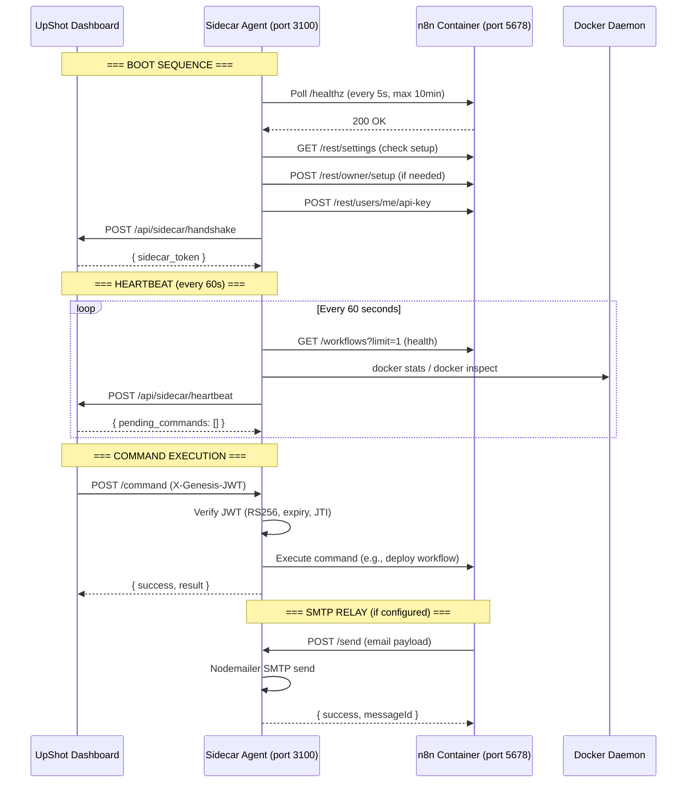
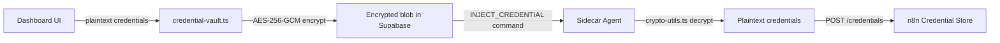

# Sidecar Architecture — Deep-Dive Reference

> **Generated:** 2026-02-12  
> **Status:** Verified via live codebase read (not assumptions)  
> **Scope:** Everything under `sidecar/` — its purpose, components, communication model, security, and gaps.

---

## 1. What The Sidecar Is

The **Genesis Sidecar Agent** is a **standalone Node.js/Express microservice** that runs on every DigitalOcean "Sovereign Droplet" alongside an n8n container. It is the **sole communication bridge** between the central UpShot Dashboard and the remote n8n instance.

**One workspace = one droplet = one Sidecar + one n8n container.**

### Runtime Environment
| Attribute | Value |
|---|---|
| Language | TypeScript, compiled to JS |
| Runtime | Node 18+ (Alpine) |
| Framework | Express 4 |
| Container | Docker (multi-stage build) |
| Ports | `3100` (Command API), `3847` (health / SMTP relay) |
| Resource limits | 0.5 CPU, 256MB RAM |

### Package Dependencies (from `sidecar/package.json`)
| Production | Purpose |
|---|---|
| `axios` | HTTP client (Dashboard heartbeats, Supabase REST, n8n API) |
| `express` | HTTP server for Command API + SMTP relay |
| `imap` | IMAP reply-checking (for SMTP-provider workspaces) |
| `mailparser` | Parse IMAP messages |
| `nodemailer` | SMTP email sending |
| `uuid` | UUID generation |

---

## 2. Component Breakdown

### 2.1 `sidecar-agent.ts` (926 lines) — Main Application

The entry point. Instantiates all sub-components and starts the Express server.

**Boot sequence (in order):**
1. Load config from environment variables
2. Initialize `JWTVerifier`, `N8nManager`, `DockerManager`, `WorkflowDeployer`
3. Optionally initialize `SMTPService` (if SMTP env vars present)
4. Set up Express routes
5. `start()` → Launch HTTP server → Bootstrap n8n → Perform Dashboard handshake → Start 60s health heartbeat

**Express Route Map:**

| Route | Method | Auth | Purpose |
|---|---|---|---|
| `/health` | GET | None | External health check (uptime, workspace_id, smtp_enabled) |
| `/command` | POST | JWT (RS256) | Execute any command from Dashboard |
| `/send` | POST | None* | SMTP email send (called by n8n workflows) |
| `/check-reply` | GET | None* | IMAP reply detection (called by n8n workflows) |

> \* **Security gap identified:** `/send` and `/check-reply` have NO authentication. They are designed to be called by n8n workflows on the same droplet (localhost), but no origin/IP verification enforces this. Any entity that can reach port 3100 can call these endpoints.

**Command Router (`executeCommand` switch):**

| Command | Handler | What It Does |
|---|---|---|
| `HEALTH_CHECK` | `handleHealthCheck` | Returns n8n health + container metrics |
| `DEPLOY_WORKFLOW` | `handleDeployWorkflow` | Deploys a single workflow JSON (with optional credential_map UUID replacement) |
| `DEPLOY_CAMPAIGN_WORKFLOWS` | `handleDeployCampaignWorkflows` | Phase 64.B: Fetches email provider config from Supabase, deploys Gmail OR SMTP workflow templates |
| `UPDATE_WORKFLOW` | `handleUpdateWorkflow` | Patches an existing workflow |
| `ACTIVATE_WORKFLOW` | `handleActivateWorkflow` | Activates a workflow |
| `DEACTIVATE_WORKFLOW` | `handleDeactivateWorkflow` | Deactivates a workflow |
| `DELETE_WORKFLOW` | `handleDeleteWorkflow` | Deletes a workflow |
| `INJECT_CREDENTIAL` | `handleInjectCredential` | Decrypts AES-256-GCM blob → creates n8n credential |
| `ROTATE_CREDENTIAL` | `handleRotateCredential` | Decrypts new blob → updates existing n8n credential |
| `RESTART_N8N` | `handleRestartN8n` | Docker restart the n8n container |
| `PULL_IMAGE` | `handlePullImage` | Docker pull a new n8n image |
| `SWAP_CONTAINER` | `handleSwapContainer` | Blue-green container swap |
| `GET_LOGS` | `handleGetLogs` | Fetch container logs (last N lines) |
| `COLLECT_METRICS` | `handleCollectMetrics` | Get n8n execution metrics |

**Credential Map Application:**
The `applyCredentialMap` method takes a workflow JSON and a `Record<string, string>` mapping placeholder UUIDs to real n8n credential IDs. It does a global string replacement on the serialized JSON. This is how template credential placeholders (e.g. `YOUR_CREDENTIAL_GMAIL_ID`) get replaced with actual IDs created on the target n8n instance.

**Health Reporting Loop:**
Every 60 seconds, Sidecar POSTs to `${DASHBOARD_URL}/api/sidecar/heartbeat` with:
- `workspace_id`, `droplet_id`, `timestamp`
- `n8n_status` (healthy/degraded/down)
- `container_status`, `disk_usage_percent`, `memory_usage_mb`, `cpu_percent`, `uptime_seconds`

The heartbeat response may include `pending_commands` — a command-pull pattern. **However, this is currently a TODO** — the comment says `// TODO: Process pending commands`.

**n8n Bootstrap (`bootstrapN8n`):**
On first boot when n8n has no owner configured:
1. Poll `/healthz` until n8n responds (max 10 minutes, 5s intervals)
2. Check `/rest/settings` for `showSetupOnFirstLoad`
3. If setup needed: POST to `/rest/owner/setup` to create admin account
4. Create API key via POST to `/rest/users/me/api-key`
5. Reinitialize `N8nManager` with the new API key

**Handshake (`performHandshake`):**
If `SIDECAR_TOKEN` is "PENDING" or empty:
1. Get droplet public IP (DigitalOcean metadata service or ipify fallback)
2. POST to `${DASHBOARD_URL}/api/sidecar/handshake` with workspace_id, droplet_id, webhook_url, droplet_ip, n8n_version
3. Receive and store `sidecar_token` for future heartbeats

> **Gap:** The sidecar token is stored in memory only. The code has `// TODO: Persist sidecar token to disk`. On restart, the handshake must re-run.

---

### 2.2 `n8n-manager.ts` (291 lines) — n8n API Client

Wraps the n8n REST API via Axios.

**Capabilities:**
| Category | Methods |
|---|---|
| Health | `getHealth()` → workflow list probe + running executions count |
| Credentials | `createCredential()`, `updateCredential()`, `deleteCredential()`, `listCredentials()` |
| Workflows | `createWorkflow()`, `updateWorkflow()`, `activateWorkflow()`, `deactivateWorkflow()`, `deleteWorkflow()`, `listWorkflows()` |
| Executions | `getMetrics(since)` → success/fail counts, avg duration |

**Authentication:** `X-N8N-API-KEY` header on all requests. Timeout: 30s.

**Webhook URL extraction:** On `createWorkflow()`, if any node has type `n8n-nodes-base.webhook`, extracts the webhook URL as `${baseUrl}/webhook/${webhookId || workflowId}`.

---

### 2.3 `workflow-deployer.ts` (301 lines) — Template Deployment Engine

The Phase 64.B Email Provider Abstraction layer.

**Architecture:**
1. Fetches the workspace's email provider config from `genesis.email_provider_config` table via Supabase REST
2. Selects template files:
   - **Gmail:** `Email 1.json`, `Email 2.json`, `Email 3.json`
   - **SMTP:** `Email 1-SMTP.json`, `Email 2-SMTP.json`, `Email 3-SMTP.json`
3. Loads templates from `WORKFLOW_TEMPLATE_DIR` (default: `/app/base-cold-email`)
4. Injects variables via `{{ $env.VAR_NAME }}` replacement:
   - `WORKSPACE_ID`, `CAMPAIGN_NAME`, `DASHBOARD_URL`, `DASHBOARD_API_URL`
   - SMTP-specific: `SMTP_HOST`, `SMTP_PORT`, `SMTP_USER`, `SMTP_FROM_EMAIL`, `SMTP_FROM_NAME`
5. Appends campaign name to workflow name: `"Email 1 - {campaign_name}"`
6. Deploys to n8n via `N8nManager.createWorkflow()` → `activateWorkflow()`

**Key observation:** This deployer only deploys Email 1/2/3 templates. The other 4 templates (Email Preparation, Opt-Out, Reply Tracker, Research Report) are NOT deployed by the Sidecar's WorkflowDeployer. Those are deployed by the Dashboard-side `HttpWorkflowDeployer` in `lib/genesis/ignition-orchestrator.ts`.

**Gap: No credential placeholder replacement.** The sidecar `workflow-deployer.ts` does NOT replace `YOUR_CREDENTIAL_*_ID` placeholders. It only injects `{{ $env.* }}` variables. Credential placeholders are handled either by:
- The Dashboard-side `HttpWorkflowDeployer` (which builds a `variableMap`)
- The sidecar `DEPLOY_WORKFLOW` command handler (which accepts `credential_map`)

This means `DEPLOY_CAMPAIGN_WORKFLOWS` command **will deploy templates with unresolved `YOUR_CREDENTIAL_*_ID` values** unless the templates use `{{ $env.* }}` format exclusively. This is a **deployment bug**.

---

### 2.4 `docker-manager.ts` (319 lines) — Container Lifecycle

Manages the co-located n8n Docker container via `docker` CLI commands.

**Operations:**
| Method | Command |
|---|---|
| `restartContainer()` | `docker restart ${name}` + wait for healthy |
| `stopContainer()` | `docker stop ${name}` |
| `startContainer()` | `docker start ${name}` + wait for healthy |
| `pullImage(name, tag)` | `docker pull ${name}:${tag}` |
| `swapContainer(newTag)` | Blue-green: stop old → rename → create new → start → healthcheck → remove old on success (rollback on failure) |
| `getContainerInfo()` | `docker inspect` → parsed JSON |
| `getContainerMetrics()` | `docker stats --no-stream` → parsed CPU/memory/network |
| `getLogs(lines, since)` | `docker logs --tail ${lines}` |
| `waitForHealthy(timeout)` | Poll `docker inspect` health status |

**Security:** Requires Docker socket mount (`/var/run/docker.sock:ro` in docker-compose). The sidecar user is added to the `docker` group (GID 999).

---

### 2.5 `jwt-verifier.ts` (204 lines) — Zero-Trust Auth

RS256 JWT verification for Dashboard → Sidecar commands.

**JWT Payload Structure:**
```typescript
{
  iss: "genesis-dashboard",     // Issuer
  sub: string,                  // workspace_uuid
  aud: "sidecar",               // Audience
  iat: number,                  // Issued at
  exp: number,                  // Expiry (5 min window)
  jti: string,                  // Unique ID (replay prevention)
  action: string,               // Command action
  droplet_id: string            // Target droplet
}
```

**Verification steps:**
1. Algorithm check (must be RS256)
2. RSA signature verification (Dashboard's public key)
3. Expiration check (5-minute window)
4. Replay prevention (JTI set — caps at 10k entries then clears)
5. Issuer validation (`genesis-dashboard`)
6. Audience validation (`sidecar`)
7. Workspace match (`sub` must match config `workspaceId`)
8. Droplet match (`droplet_id` must match config `dropletId`)
9. Action match (JWT `action` must match request body `action`)

**Gap:** JTI cleanup is rudimentary — just clears the entire set when it exceeds 10k. In production, should use Redis with TTL-based expiry.

---

### 2.6 `crypto-utils.ts` (54 lines) — Credential Decryption

Mirrors `lib/genesis/credential-vault.ts` encryption format.

**Key derivation:** `SHA-256(masterKey + workspaceId)` → 256-bit AES key  
**Cipher:** AES-256-GCM  
**Blob format:** `base64( IV[16] || authTag[16] || ciphertext )`  
**Master key:** `INTERNAL_ENCRYPTION_KEY` env var

This is the decryption-only half. The Dashboard encrypts, the Sidecar decrypts.

---

### 2.7 `smtp-service.ts` (317 lines) — Email Provider Abstraction

For workspaces using SMTP instead of Gmail.

**Capabilities:**
- `sendEmail()`: Nodemailer-based SMTP send with threading support (In-Reply-To, References headers)
- `checkReply()`: IMAP-based reply detection (searches INBOX for emails FROM recipient in last 14 days)

**IMAP host derivation:** Naively replaces `smtp` with `imap` in hostname (`smtp.example.com` → `imap.example.com`). This works for most providers but is fragile.

---

## 3. Communication Flow Diagram



---

## 4. Data Flow: Credential Injection



**Key insight:** Credentials never traverse the network in plaintext. The Dashboard encrypts them with a workspace-scoped derived key, stores the ciphertext in Supabase, then sends the encrypted blob to the Sidecar via a JWT-authenticated command. The Sidecar decrypts using the same master key and injects into n8n.

---

## 5. Data Flow: Workflow Deployment

There are **two deployment paths** — this is an important architectural nuance:

### Path A: Dashboard-Side Deployment (Ignition Orchestrator)
```
Dashboard → HttpWorkflowDeployer → SidecarClient → POST /command
    → DEPLOY_WORKFLOW + credential_map
    → Sidecar receives JSON + UUID map
    → applyCredentialMap() replaces placeholders
    → N8nManager.createWorkflow()
```
**Used for:** All 7 templates during initial Genesis provisioning. The `variableMap` (18 keys including credential IDs) is applied on the Dashboard side before sending.

### Path B: Sidecar-Side Deployment (WorkflowDeployer)
```
Dashboard → POST /command → DEPLOY_CAMPAIGN_WORKFLOWS
    → Sidecar WorkflowDeployer
    → Fetches email_provider_config from Supabase
    → Loads template files from disk
    → Injects {{ $env.* }} variables only
    → N8nManager.createWorkflow() + activateWorkflow()
```
**Used for:** Re-deploying Email 1/2/3 for new campaigns on an existing droplet.

**Critical inconsistency:** Path B does NOT apply credential placeholder replacement. If templates contain `YOUR_CREDENTIAL_*_ID` strings (which they now do after our genericization), Path B will produce broken workflows.

---

## 6. Docker Compose Architecture

```yaml
services:
  sidecar:
    ports: ["3100:3100", "3847:3847"]
    volumes: ["/var/run/docker.sock:/var/run/docker.sock:ro"]
    resources: { limits: { cpus: 0.5, memory: 256M } }
    healthcheck: curl http://localhost:3847/health

  n8n:
    # (not defined in sidecar/docker-compose.yml — managed externally)
```

The `docker-compose.yml` only defines the Sidecar container. The n8n container is provisioned and managed separately (by the Genesis provisioning system via DigitalOcean API or LOCAL_MODE).

---

## 7. Security Model Summary

| Layer | Mechanism | Status |
|---|---|---|
| Dashboard → Sidecar | RS256 JWT (5-min expiry, JTI replay prevention) | ✅ Implemented |
| Sidecar → Dashboard | Long-lived `SIDECAR_TOKEN` header | ✅ Implemented |
| Credential in transit | AES-256-GCM encrypted blobs | ✅ Implemented |
| Credential at rest (Supabase) | AES-256-GCM (workspace-scoped key derivation) | ✅ Implemented |
| Credential at rest (n8n) | n8n internal encryption | ✅ Delegated to n8n |
| SMTP relay endpoints | **No authentication** | ❌ **Gap** |
| JTI replay prevention | In-memory Set (clears at 10k) | ⚠️ Fragile |
| Sidecar token persistence | In-memory only (TODO in code) | ⚠️ Not persisted |

---

## 8. Identified Gaps & Risks

### 8.1 SMTP Relay Endpoints Unauthenticated
**File:** `sidecar-agent.ts` lines 218–225  
**Issue:** `/send` and `/check-reply` routes have no authentication. While designed for localhost n8n calls, the ports are mapped to `0.0.0.0` in docker-compose.  
**Risk:** Any entity with network access to port 3100 can send emails through the SMTP relay.  
**Fix:** Either:
- Bind SMTP port to `127.0.0.1:3847:3847` in docker-compose, OR
- Add a shared secret header check, OR
- Use iptables to restrict access to the n8n container's IP only

### 8.2 Credential Placeholder Gap in DEPLOY_CAMPAIGN_WORKFLOWS
**File:** `workflow-deployer.ts`  
**Issue:** The `loadAndInjectWorkflows` method only replaces `{{ $env.* }}` patterns. It does NOT replace `YOUR_CREDENTIAL_*_ID` strings.  
**Risk:** Workflows deployed via `DEPLOY_CAMPAIGN_WORKFLOWS` will have broken credential references.  
**Fix:** Add credential map support to `WorkflowDeployer.deployWorkflows()` — either:
- Accept credential_map in the request payload, OR
- Fetch existing n8n credentials via `N8nManager.listCredentials()` and build the map automatically

### 8.3 Sidecar Token Not Persisted
**File:** `sidecar-agent.ts` line 842 (`// TODO: Persist sidecar token to disk`)  
**Issue:** On process restart, the sidecar token is lost. Handshake must re-run.  
**Fix:** Write token to a file in a persistent volume.

### 8.4 JTI Cache Unbounded
**File:** `jwt-verifier.ts`  
**Issue:** JTI set grows indefinitely until it hits 10k entries, then clears entirely — briefly allowing replay of recently-seen tokens.  
**Fix:** Use a Map with timestamps and periodic cleanup, or Redis with TTL.

### 8.5 Heartbeat `pending_commands` Not Processed
**File:** `sidecar-agent.ts` line 661 (`// TODO: Process pending commands`)  
**Issue:** The Dashboard can send pending commands in heartbeat responses, but the Sidecar ignores them.  
**Fix:** Implement command processing in the heartbeat response handler.

### 8.6 Dashboard Sidecar Endpoints Don't Exist
**Evidence:** `file_search app/api/sidecar/**/route.ts` returned **no results**.  
**Issue:** The Sidecar calls `POST /api/sidecar/heartbeat` and `POST /api/sidecar/handshake`, but these API routes do not exist in the Next.js app.  
**Risk:** Sidecar boot will fail at the handshake step. Heartbeats will silently fail (caught by try/catch).  
**Fix:** Create `app/api/sidecar/heartbeat/route.ts` and `app/api/sidecar/handshake/route.ts`.

### 8.7 No LLM Dependencies (Confirmed)
The Sidecar operates purely on **algorithmic logic**: string replacement, HTTP API calls, Docker CLI commands, SMTP/IMAP protocols, and cryptographic operations. There are zero LLM API calls, zero AI model invocations, and zero prompt-based processing. This is by design and should remain so.

---

## 9. File Inventory

| File | Lines | Purpose |
|---|---|---|
| `sidecar-agent.ts` | 926 | Main application, routes, command dispatch |
| `n8n-manager.ts` | 291 | n8n REST API client |
| `workflow-deployer.ts` | 301 | Template-based workflow deployment |
| `docker-manager.ts` | 319 | Docker container lifecycle |
| `jwt-verifier.ts` | 204 | RS256 JWT verification |
| `smtp-service.ts` | 317 | SMTP send + IMAP reply check |
| `crypto-utils.ts` | 54 | AES-256-GCM decryption |
| `test-smtp.ts` | ~50 | SMTP test script |
| `docker-compose.yml` | 105 | Sidecar container definition |
| `Dockerfile` | 57 | Multi-stage build |
| `package.json` | 49 | Dependencies and scripts |
| `.env.example` | 47 | Environment variable template |

**Total Sidecar codebase: ~2,720 lines of TypeScript + config.**
